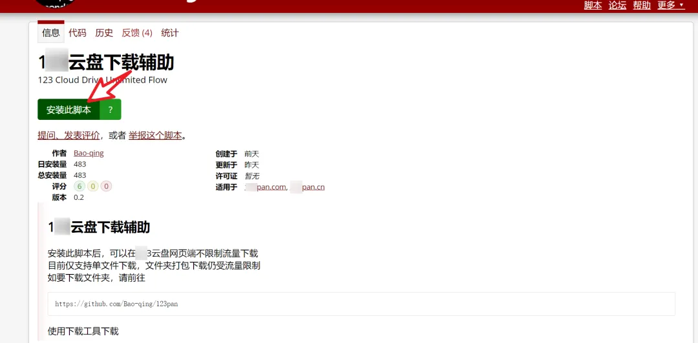
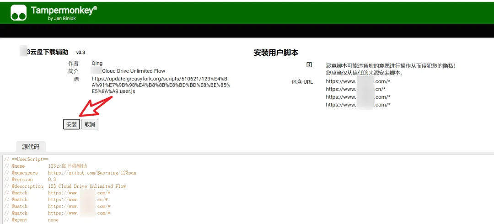
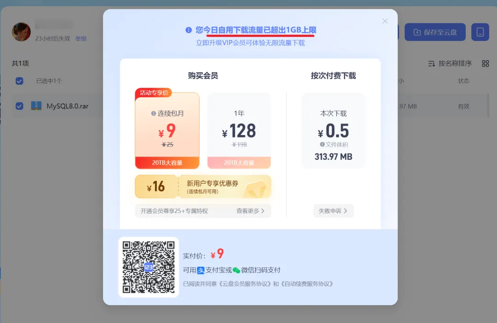
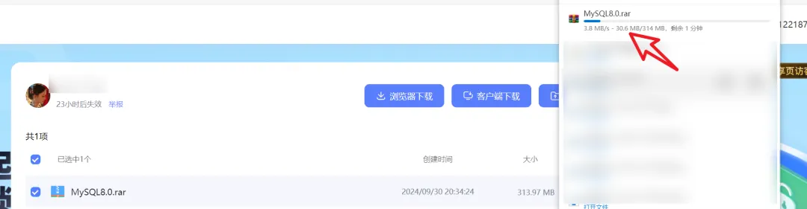

# 方法一

## 123云盘 下载工具

123云盘 下载工具是一个使用 Python 编写的脚本，通过模拟安卓客户端协议来绕过 123Pan 的下载流量限制。该工具可以帮助用户在 Windows 系统上方便地下载 123Pan 上的文件，并提供了多种操作功能，如列出文件、下载文件、上传文件、分享文件等。

## 功能特点

- **登录**：使用用户名和密码登录 123Pan 账号。
- **列出文件**：显示当前目录下的所有文件和文件夹。
- **下载文件**：通过模拟安卓客户端协议下载文件，绕过流量限制。
- **上传文件**：将本地文件上传到 123Pan。
- **分享文件**：生成文件分享链接。
- **删除文件**：删除指定的文件或文件夹。
- **创建文件夹**：在当前目录下创建新文件夹。

## 使用方法

### 环境准备

1. 确保已安装 Python 3.x。

2. 安装所需的 Python 库：

   ```
   pip install -r requirements.txt
   ```

### 配置文件

在首次运行脚本时，会自动生成一个 `123pan.txt` 文件，用于保存用户的登录信息。请确保该文件与脚本在同一目录下。

### 运行脚本

可以直接下载 release 的可执行文件运行或运行 python 脚本。

1. 克隆或下载本项目代码到本地。

2. 打开终端或命令提示符，进入项目目录。

3. 运行脚本：

   使用安卓客户端协议

   ```
   python android.py
   ```

   使用 web 协议

   ```
   python web.py
   ```

## 123云盘 下载工具 GitHub 地址

地址：[Bao-qing/123pan - GitHub](https://github.com/Bao-qing/123pan)

# 方法二

今天推荐的是一个**数字网盘**脚本，可以解除限制，完全免费使用。

该作者在 GitHub 上有开源的软件，但是软件我今天测试不好使，只有脚本可用。想用脚本一定要**先安装 Tampermonkey 插件**，Tampermonkey 插件可以在文本关键字获取。

安装完油猴插件后，**再安装脚本**，方法是打开 Greasy Fork 中的脚本地址，这个脚本地址在文本也同样有给大家提供。打开以后点【安装此脚本】。



再点【安装】即可完成脚本安装。



**脚本使用测试：**

安装完脚本，你再打开数字网盘的下载链接，看看我自己分享的地址，登录后**没用脚本时**，其提示今日自用下载流量已超出 4GB 上限，需要付费才可下载。



下面是我使用了脚本以后，点击【浏览器下载】后，浏览器可以高速下载，如果用 DM 接管速度可达 15M/S，跑满你的带宽！



这个脚本绕过了限制，可直接浏览器下载，非常方便，有需要的小伙伴及时收藏！
