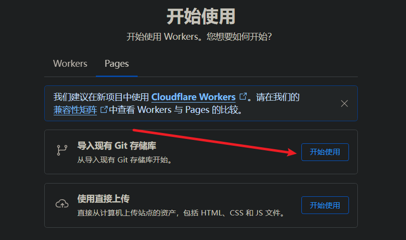
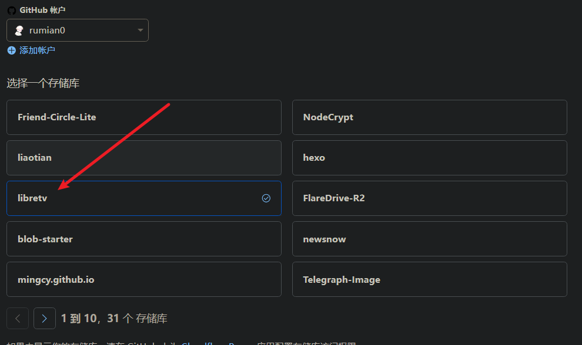
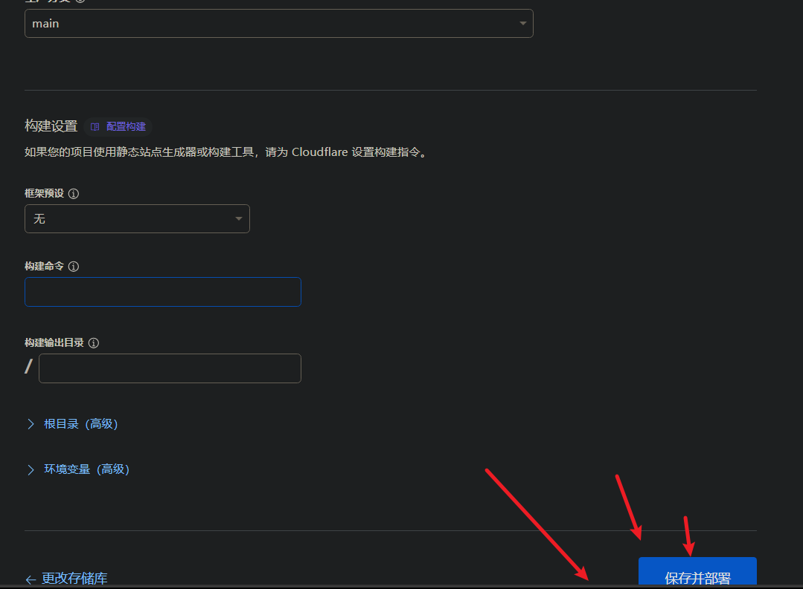
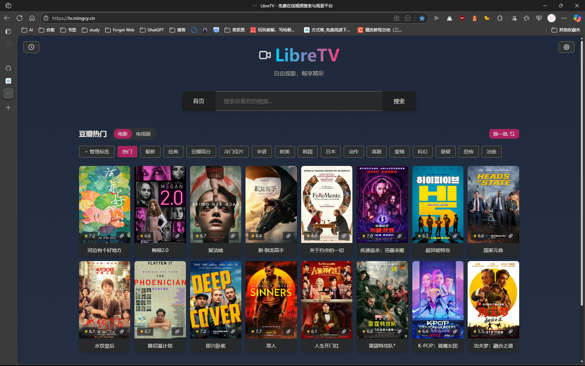

# 茗叙

这段时间消失了快一个月了,简直要命!

放假之后就报考了驾校就开始 练车,前几天天天刷题,最终也是合格,现在科目二练习,倒车入库时练习的最快的!坡位定点也是轻轻松松,每天练车两个小时,这大太阳!我真的服了! 每天出门就两个小时,这都能把我晒黑了,哎怎么办呢,又得一个冬天熬白了,呜呜呜!

这几月就是在赚钱,也不是去打工,就是自己搞一点网赚,也是有了一点点收益还不错,我自己平时就自己做菜用而已,也没什么花钱的地方,主要我的`女性朋友`,她在米东区实习,在医院,谁能想实习竟然没有工资,每天都不知道能不能吃饱,每天就吃点泡面,真的挺担心她的,可惜我们相隔挺远的.前天她还说她变了,我还以为她说我们关系疏远了,谁知她说她`有点消瘦`了,也确实又回到了高压的环境工作,谁都有一点疲劳吧,再加上又没有休息好,确实有一点! 请求各位能否资助她一点点用来吃饭,我自己挣的钱她是不想收,说这是我的钱要收好,每次都劝了好久才收下,但我这钱也不够她吃一周的,她还要工作八个月,到时候我上学就确实没人资助她,也挺可怜的.(**最下方点击赞助就行!**) 感谢各位了!

好了我们聊正事!

这是一期影视资源的网站搭建,内置了api接口可以直接收看影视!

# 茗述

## 1.首先我们要准备账号

一个[Github](https://github.com)账号

一个[Cloudflare](https://cloudflare.com)账号

首先fork下面的项目

LibreTV:**https://github.com/LibreSpark/LibreTV **

或者这里有一键式部署:

选择以下任一平台，点击一键部署按钮，即可快速创建自己的 LibreTV 实例：

[Deploy with Vercel](https://vercel.com/new/clone?repository-url=https%3A%2F%2Fgithub.com%2FLibreSpark%2FLibreTV)
[Deploy to Netlify](https://app.netlify.com/start/deploy?repository=https://github.com/LibreSpark/LibreTV)
[Deploy to Render](https://render.com/deploy?repo=https://github.com/LibreSpark/LibreTV)
[使用 EdgeOne Pages 部署](https://edgeone.ai/pages/new?repository-url=https://github.com/LibreSpark/LibreTV)

下面是官方配的教程,这里只放我的图,只用cloudflare演示

## 详细部署指南

### Cloudflare Pages

1. Fork 或克隆本仓库到您的 GitHub 账户
2. 登录 [Cloudflare Dashboard](https://dash.cloudflare.com/)，进入 Pages 服务
3. 点击"创建项目"，连接您的 GitHub 仓库
4. 使用以下设置：
   - 构建命令：留空（无需构建）
   - 输出目录：留空（默认为根目录）
   - 
5. **⚠️ 重要：在"设置" > "环境变量"中添加 `PASSWORD` 变量**
6. **可选：在"Settings" > "Environment Variables"中添加 `ADMINPASSWORD` 变量**
7. 点击"保存并部署"

如下展示: tv.mingcy.cn



### Vercel

1. Fork 或克隆本仓库到您的 GitHub/GitLab 账户
2. 登录 [Vercel](https://vercel.com/)，点击"New Project"
3. 导入您的仓库，使用默认设置
4. **⚠️ 重要：在"Settings" > "Environment Variables"中添加 `PASSWORD` 变量**
5. **可选：在"Settings" > "Environment Variables"中添加 `ADMINPASSWORD` 变量**
6. 点击"Deploy"
7. 可选：在"Settings" > "Environment Variables"中配置密码保护和设置按钮密码保护

### Render

1. Fork 或克隆本仓库到您的 GitHub 账户
2. 登录 [Render](https://render.com/)，点击 "New Web Service"
3. 选择您的仓库，Render 会自动检测到 `render.yaml` 配置文件
4. 保持默认设置（无需设置环境变量，默认不启用密码保护）
5. 点击 "Create Web Service"，等待部署完成
6. 部署成功后即可访问您的 LibreTV 实例

> 如需启用密码保护，可在 Render 控制台的环境变量中手动添加 `PASSWORD` 和/或 `ADMINPASSWORD`。

### Docker

```
docker run -d \
  --name libretv \
  --restart unless-stopped \
  -p 8899:8080 \
  -e PASSWORD=your_password \
  -e ADMINPASSWORD=your_adminpassword \
  bestzwei/libretv:latest
```

### Docker Compose

`docker-compose.yml` 文件：

```
services:
  libretv:
    image: bestzwei/libretv:latest
    container_name: libretv
    ports:
      - "8899:8080" # 将内部 8080 端口映射到主机的 8899 端口
    environment:
      - PASSWORD=${PASSWORD:-your_password} # 可将 your_password 修改为你想要的密码，默认为 your_password
      - ADMINPASSWORD=${PASSWORD:-your_adminpassword} # 可将 your_adminpassword 修改为你想要的密码，默认为 your_adminpassword
    restart: unless-stopped
```

启动 LibreTV：

```
docker compose up -d
```

访问 `http://localhost:8899` 即可使用。

### 本地开发环境

项目包含后端代理功能，需要支持服务器端功能的环境：

```
# 首先，通过复制示例来设置 .env 文件（可选）
cp .env.example .env

# 安装依赖
npm install

# 启动开发服务器
npm run dev
```

访问 `http://localhost:8080` 即可使用（端口可在.env文件中通过PORT变量修改）。

> ⚠️ 注意：使用简单静态服务器（如 `python -m http.server` 或 `npx http-server`）时，视频代理功能将不可用，视频无法正常播放。完整功能测试请使用 Node.js 开发服务器。

## 🔧 自定义配置

### 密码保护

要为您的 LibreTV 实例添加密码保护，可以在部署平台上设置环境变量：

**环境变量名**: `PASSWORD` **值**: 您想设置的密码

**环境变量名**: `ADMINPASSWORD` **值**: 您想设置的密码

各平台设置方法：

- **Cloudflare Pages**: Dashboard > 您的项目 > 设置 > 环境变量
- **Vercel**: Dashboard > 您的项目 > Settings > Environment Variables
- **Netlify**: Dashboard > 您的项目 > Site settings > Build & deploy > Environment
- **Docker**: 修改 `docker run` 中 `your_password` 为你的密码
- **Docker Compose**: 修改 `docker-compose.yml` 中的 `your_password` 为你的密码
- **本地开发**: SET PASSWORD=your_password

### API兼容性

LibreTV 支持标准的苹果 CMS V10 API 格式。添加自定义 API 时需遵循以下格式：

- 搜索接口: `https://example.com/api.php/provide/vod/?ac=videolist&wd=关键词`
- 详情接口: `https://example.com/api.php/provide/vod/?ac=detail&ids=视频ID`

**添加 CMS 源**:

1. 在设置面板中选择"自定义接口"
2. 接口地址: `https://example.com/api.php/provide/vod`
