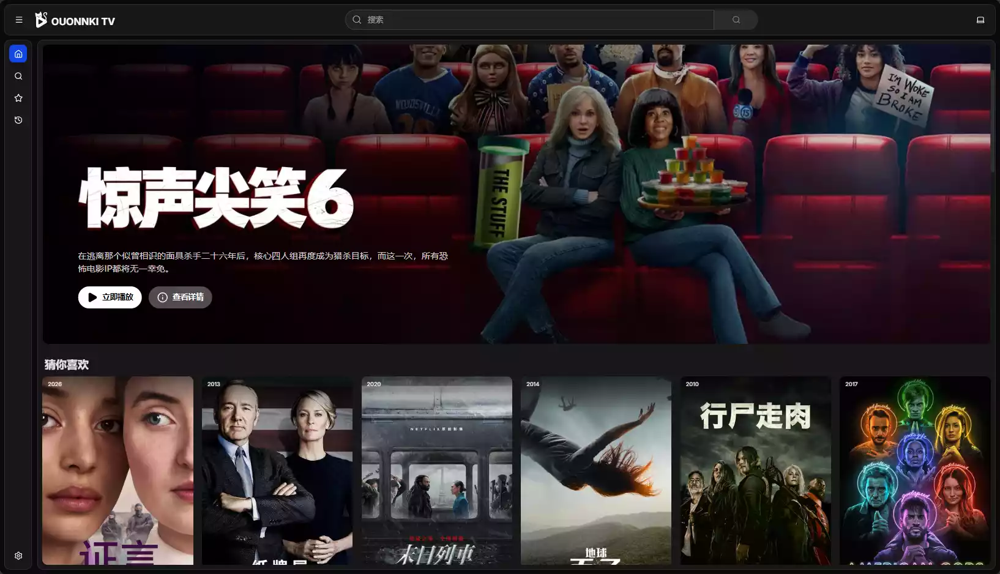
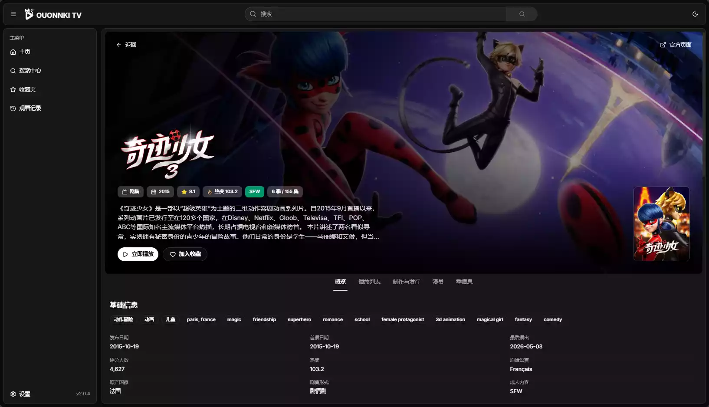
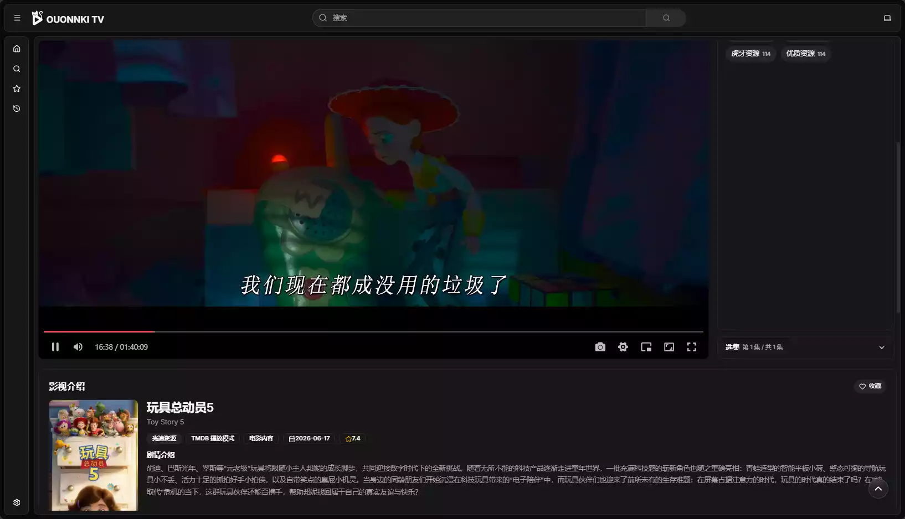
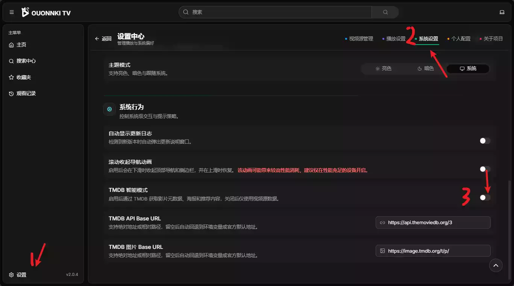
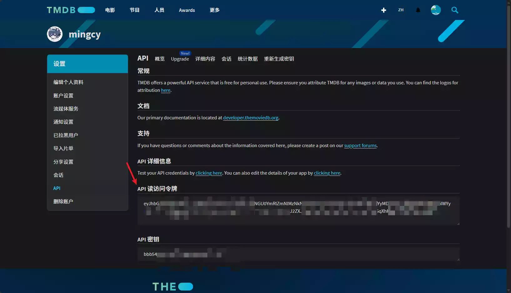

# 茗述

不知道大家有没有 跟我一样很喜欢看动漫或者电影的,但是市面上的影视资源,要么就是付费,要么就是不稳定,要么就卡顿,那么可不可以自己搭建一个影视库呢?

我之前也部署了一个类似的LibreTV,但是现在已经封库了,并且该项目违反了Vercel所以已经无法部署了....

## Github项目Ouonnki

地址: https://github.com/ouonnki/OuonnkiTV

展示效果:

参观地址: https://t.mingcy.cn

不想自己手动搭建的可以直接使用上面的地址观看,首页使用的++tmdb的展示源++,在国内访问速度`较慢`,如果没有科学上网工具,请在`设置中-->系统设置-->TMDB智能模式`,将其关闭即可

## 部署教程

如果介意可以访问官方的文档:

https://github.com/Ouonnki/OuonnkiTV/blob/main/docs/deployment.md

### 一键部署到Vercel

点击下方按钮，一键部署到 Vercel：

https://vercel.com/new/clone?repository-url=https://github.com/Ouonnki/OuonnkiTV&build-command=pnpm%20build&install-command=pnpm%20install&output-

### **部署步骤：**

1. Fork 本仓库到您的 GitHub 账户
2. 登录 Vercel，点击 "New Project"
3. 导入您的 GitHub 仓库
4. 配置构建选项（通常自动识别）：
   - Install Command: `pnpm install`
   - Build Command: `pnpm build`
   - Output Directory: `dist`

### **环境变量**

| OKI_INITIAL_VIDEO_SOURCES | 否  | 初始视频源（JSON 字符串或远程 URL）                                                                                                         |
| ------------------------- | --- | ------------------------------------------------------------------------------------------------------------------------------------------- |
| OKI_TMDB_API_TOKEN        | 否  | TMDB API Token，启用 [TMDB 智能模式](https://github.com/Ouonnki/OuonnkiTV/blob/main/docs/configuration.md#-tmdb-配置建议启用)获取影片元数据 |
| OKI_TMDB_API_BASE_URL     | 否  | 默认 `https://api.themoviedb.org/3`                                                                                                         |
| OKI_TMDB_IMAGE_BASE_URL   | 否  | 默认 `https://image.tmdb.org/t/p/`                                                                                                          |
| OKI_ACCESS_PASSWORD       | 否  | 访问密码（留空则公开访问）                                                                                                                  |
| OKI_INITIAL_CONFIG        | 否  | 完整 JSON 配置（包含所有设置和视频源）                                                                                                      |

#### 首先配置环境变量: OKI_INITIAL_VIDEO_SOURCES

该变量为视频的播放源,可以通过环境变量来添加,或者通关在设置中导入视频源也可以添加,由于该项目没有内置的视频源,所以这里推荐项目: https://github.com/rumian0/OuonnkiTV-Source

该项目是自动将视频源转化为Ouonnkitv适配的JSON文件,里面可以自适配视频源,如果你有更好的视频源可以选择fork该项目添加自己的视频源,

如果你懒得再去做配置,可以使用我配置好的链接:

| 文件名称          | 描述                                                             | 原始链接                                                                                                          | 加速链接 1                                                                                                                               | 加速链接 2                                                                                                                               |
| ----------------- | ---------------------------------------------------------------- | ----------------------------------------------------------------------------------------------------------------- | ---------------------------------------------------------------------------------------------------------------------------------------- | ---------------------------------------------------------------------------------------------------------------------------------------- |
| lite.json         | 轻量版：筛选后的视频源（不含成人内容，按响应速度排序取前 15 个） | [原始链接](https://raw.githubusercontent.com/rumian0/OuonnkiTV-Source/main/tv_source/OuonnkiTV/lite.json)         | [加速链接 1](https://gh-proxy.org/https://raw.githubusercontent.com/rumian0/OuonnkiTV-Source/main/tv_source/OuonnkiTV/lite.json)         | [加速链接 2](https://git.yylx.win/https://raw.githubusercontent.com/rumian0/OuonnkiTV-Source/main/tv_source/OuonnkiTV/lite.json)         |
| full-noadult.json | 完整纯净版：筛选后的视频源（不含成人内容）                       | [原始链接](https://raw.githubusercontent.com/rumian0/OuonnkiTV-Source/main/tv_source/OuonnkiTV/full-noadult.json) | [加速链接 1](https://gh-proxy.org/https://raw.githubusercontent.com/rumian0/OuonnkiTV-Source/main/tv_source/OuonnkiTV/full-noadult.json) | [加速链接 2](https://git.yylx.win/https://raw.githubusercontent.com/rumian0/OuonnkiTV-Source/main/tv_source/OuonnkiTV/full-noadult.json) |
| full.json         | 完整版：筛选后的视频源（包含成人内容）                           | [原始链接](https://raw.githubusercontent.com/rumian0/OuonnkiTV-Source/main/tv_source/OuonnkiTV/full.json)         | [加速链接 1](https://gh-proxy.org/https://raw.githubusercontent.com/rumian0/OuonnkiTV-Source/main/tv_source/OuonnkiTV/full.json)         | [加速链接 2](https://git.yylx.win/https://raw.githubusercontent.com/rumian0/OuonnkiTV-Source/main/tv_source/OuonnkiTV/full.json)         |
| adult.json        | 成人版：仅成人内容视频源                                         | [原始链接](https://raw.githubusercontent.com/rumian0/OuonnkiTV-Source/main/tv_source/OuonnkiTV/adult.json)        | [加速链接 1](https://gh-proxy.org/https://raw.githubusercontent.com/rumian0/OuonnkiTV-Source/main/tv_source/OuonnkiTV/adult.json)        | [加速链接 2](https://git.yylx.win/https://raw.githubusercontent.com/rumian0/OuonnkiTV-Source/main/tv_source/OuonnkiTV/adult.json)        |

#### 配置OKI_TMDB_API_TOKEN

该配置关乎首页的智能模式的影视元索引

OuonnkiTV 支持通过 [TMDB](https://www.themoviedb.org/)（The Movie Database）获取影片元数据、海报和推荐内容。启用后可显著提升浏览体验，建议所有用户配置。

> 官网文档: Token 申请方法请参考 [TMDB API Key 申请指南](https://github.com/Ouonnki/OuonnkiTV/blob/main/docs/tmdb-key.md)

### 两种运行模式

| 模式              | 说明                                                             |
| ----------------- | ---------------------------------------------------------------- |
| **TMDB 智能模式** | 启用 TMDB 集成，搜索结果自动匹配影片元数据、显示海报、评分和推荐 |
| **兼容模式**      | 关闭 TMDB，仅使用视频源自身数据，适合无 TMDB Token 的场景        |

### 1. 注册 TMDB 账户

访问 [themoviedb.org](https://www.themoviedb.org/) 并注册账户。

### 2. 进入 API 设置页

登录后访问 [API 设置页面](https://www.themoviedb.org/settings/api)。

如果是首次申请，需要先同意使用条款并填写基本信息：

- **应用类型**：选择 Personal
- **应用名称**：填写任意名称（如 OuonnkiTV）
- **应用网址**：填写你的部署地址或 `https://localhost`
- **应用简介**：简要描述用途即可(需要纯英文,不少于50字符左右)

### 3. 获取 API Read Access Token

申请通过后，在 API 设置页面可以看到两个值：

| 类型                            | 说明                                  |
| ------------------------------- | ------------------------------------- |
| API Key (v3 auth)               | 32 位字符串，**不是我们需要的**       |
| API Read Access Token (v4 auth) | 以 `eyJ` 开头的长字符串，**使用这个** |

复制 **API Read Access Token**（v4 auth），这就是 OuonnkiTV 需要的 Token

> 剩余配置按照上方的环境变量配置即可!

随机图:

