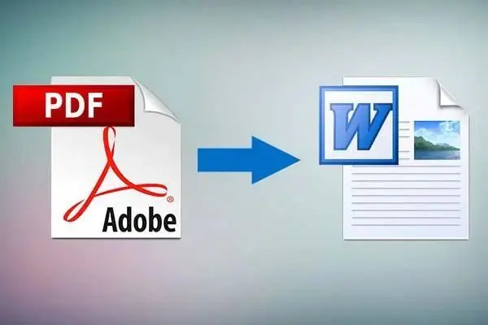
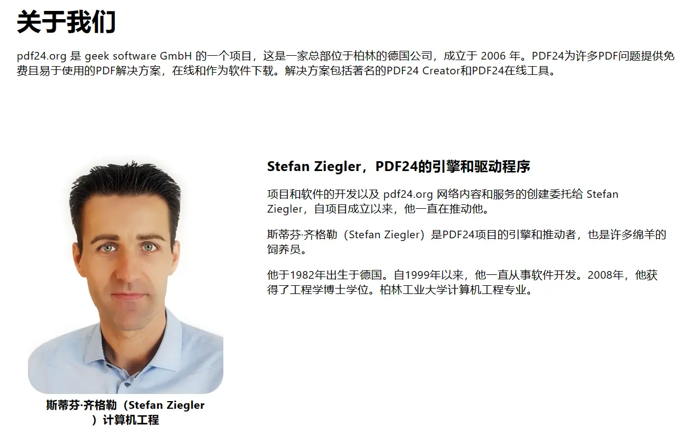
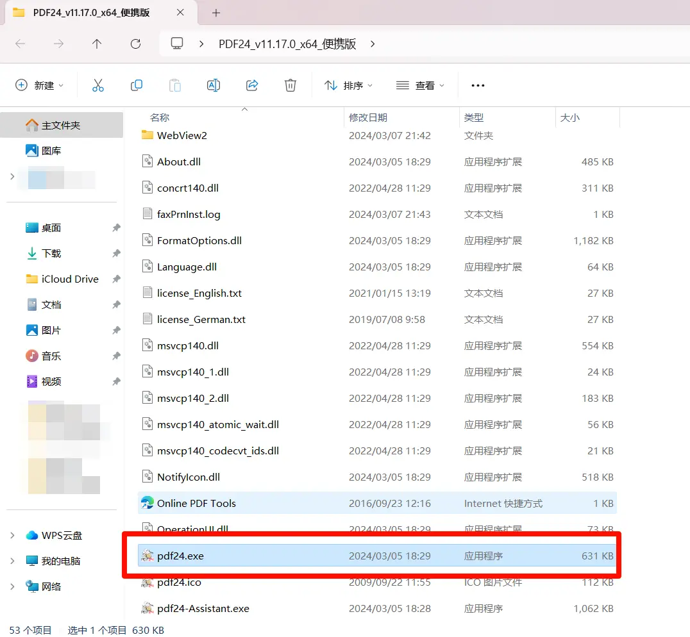
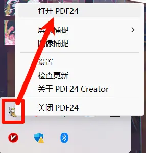
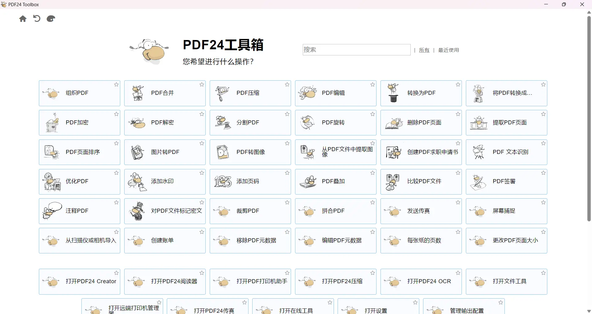
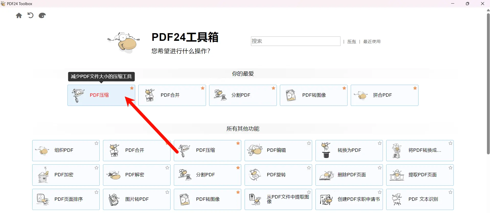
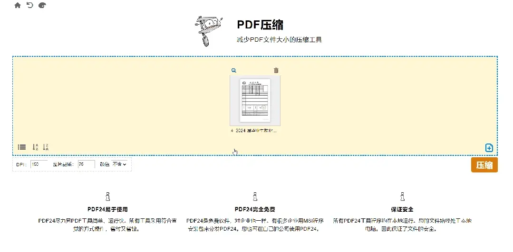

AI概括

> PDF全称为Portable Document Format，是一种常用的文档格式。对于合并、拆分或转换PDF等基本需求，不必下载复杂工具或付费。开源爱好者阿云推荐了PDF24，这是一个由德国开发者制作的免费、多功能PDF处理软件，拥有47个PDF处理功能。PDF24的操作简便，支持星标常用功能，并且是本地离线应用，更安全可靠。软件还提供了网页版，方便在线使用。对于处理敏感文件，建议使用软件的离线版本。

# 介绍

众所周知，PDF全称为 Portable Document Format，意思是便携式文档格式，以后若有人问起来，你可别说 I don't know。

同时 PDF 也是我们日常办公、科研学习中最常见的文件格式之一，相信大家在处理这种文件的过程中都会遇到各种各样的问题吧？

比如我们只是简单的合并、拆分或转换格式，也不希望因为这些小需求而去下载很复杂的工具，或者为它付费吧。

作为一名开源爱好者，阿云找来了一款免费全能且易用的 PDF神级处理工具-PDF24，一位德国老哥开发的工具包。

你能想到的和PDF有关的需求，基本上都有。

# PDF24 Creator（电脑）

PDF 24是一款PDF编辑工具，软件由德国牧羊人齐格勒开发，距今有18年的历史了，而且一直免费，这就很是难得了！

这款工具老早前就介绍了它的网页版，网页版是免费的，网址文末获取关键词可一键获取！而今天阿云给大家带来的是绿色便携版。

软件使用非常简单，双击"pdf24.exe"即可运行软件。

一般情况下可能不会弹出界面，但在电脑右下角能够看到图标，从而打开PDF24 工具箱。

打开PDF24工具箱，里面包含了PDF合并、压缩、编辑、转换为PDF等共计47个功能，可以说是应有尽有。

如果遇到常用的功能，还可以直接星标收藏变成“我的最爱”，以便下次直接找到。

可以毫不谦虚地说，市面上没有哪一款免费的PDF工具能与之抗衡，如果有，请当我没说过这句话。

而且PDF24工具箱包含的所有工具均为本地离线运行操作的，方便快捷，无需担心安全问题。

以PDF压缩为例，只需要把文件拖拽至窗口或者直接添加，鼠标放到文件上还可以直接预览、查看文件大小和页数。

接着只需要在左下角设置需要压缩后的DPI分辨率、图片品质和文件颜色，最后点击“压缩”即可。

别的不说，压缩率和压缩后的清晰度还是非常可以的。

好了，由于篇幅有限关于软件功能的介绍就到这里了，当然网页版也是同样的功能，浏览器能联网就能用。

如果经常处理一些涉密文件，阿云还是建议你下载到本地使用，毕竟离线处理，安全可靠。

# 下载链接

①[Windows] 多功能免费实用的 PDF24工具箱 v11.17.0 版本：

官网所有版本：[https://creator.pdf24.org/listVersions.php](https://creator.pdf24.org/listVersions.php)

123云盘分流：[https://www.123pan.com/s/OgT7Vv-hPFc.html](https://www.123pan.com/s/OgT7Vv-hPFc.html)

在线中文版：[https://tools.pdf24.org/zh/](https://tools.pdf24.org/zh/)
