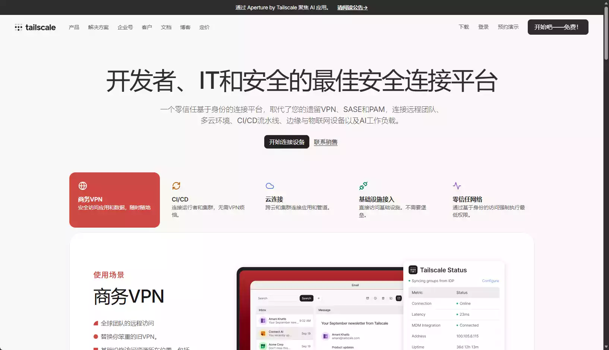
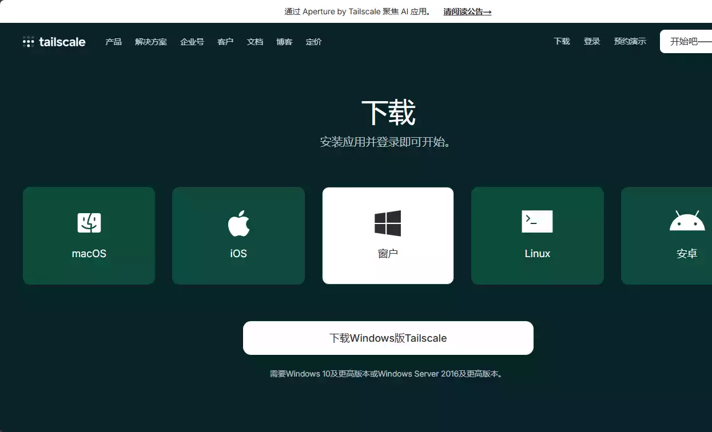
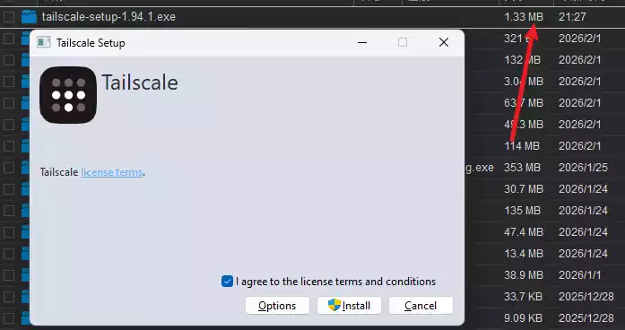

# 碎碎念

> 怎么说呢,也是一模完了,今天是开始补课,又是10天体验卡,不过还是走读,因为宿舍要装修,具体安排是每天早上10点上学,下午6.30放学,我就说白了,这更小学有什么区别,也很不错,哈哈哈!

# 茗述

## 介绍

软件名称:**TailScale** + 内网穿透

用于P2P点对点的远程控制,无提示,只需要++安装,登录++{.wavy},并且无需公网IP,完全免费,多设备互联,无限速.....

> 🙌提示:只使用该软件建立公网环境,需要登录统一账号,如果需要实现远程控制,请自备SSH

网站官网:https://tailscale.com/

## 安装

链接:https://tailscale.com/download/

PC的安装包也仅仅只有`1.33MB`

## 登录

选择一个不需要魔法的账号登录即可,这里使用**GItHub**

## 展示

效果吗....就是这个效果,由于我不常用SSH,我才发现我没这个软件,咳咳后面补上!
