<aside>
😀 这里写文章的前言：
接下分享皆为自学。

</aside>

# 首先使用软件LibChecher

打开`LibChecher`；让后扫描要去除的软件。

查看有那种`类型的广告`。

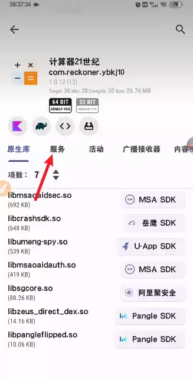

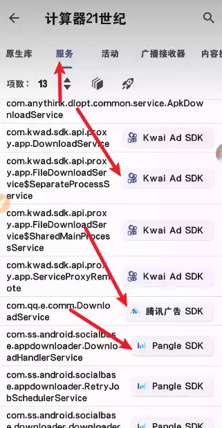

这里发现，有快手，有腾讯，有穿山甲的广告。如此

# 其次

打开MT管理器

还是一样先取出签名，让后打开查看。

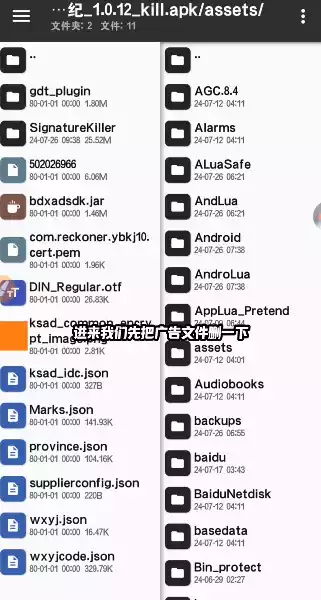

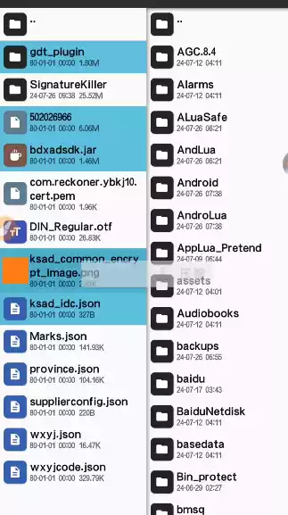

这里，去除广告的文件，相信你们能看懂那些是广告文件。

打开`dex`，查看dex++

打开`常量`

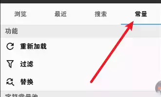

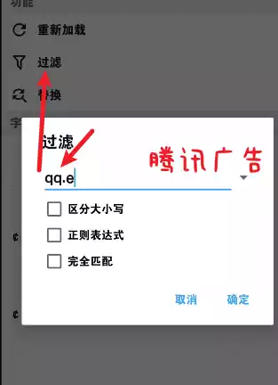

搜索`关键词`，这里举`腾讯广告`位例子，搜索`qq.e`

让后点击搜索，

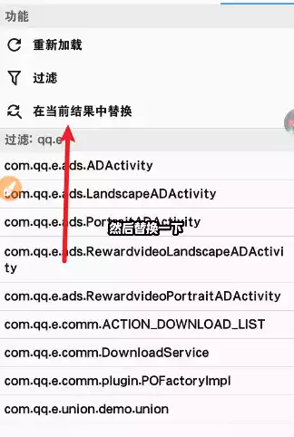

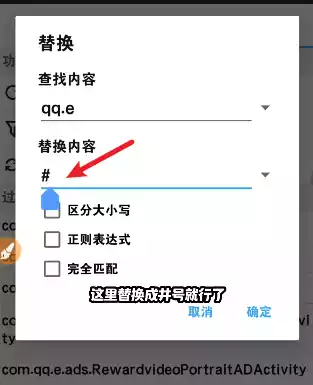

将搜索到的结果全部替换成`#`

就OK了，让后点击应用更改。

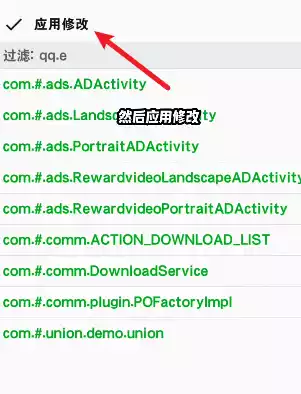

如此，我们再试一次，这里取出快手广告，搜索`com.kwad`

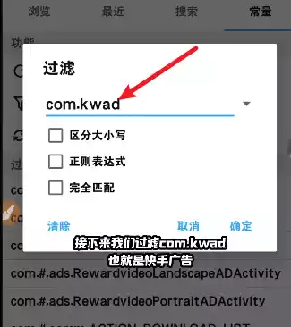

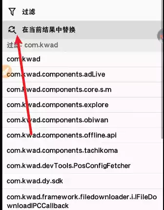

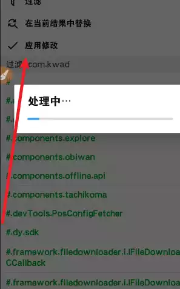

同样的，这里就不说明了。

# 代码总结

以下是代码:

```jsx
腾讯:qq.e
快手:com.kwad
穿山甲:com.bytedance.pangle.Zeus.hasinit
头条:toutiao
百度:com.bytedance.sdk.
sigmob:搜索sigmob类名加完全匹配const/4 vO, Ox0零换1，xml文件搜sigmob，带activity标签的全删了
```
