# 茗叙

最近也是在等我的录取通知，估计还得一段时间。。

新疆是真的热啊！每天在家里都能出汗，也是够可以的，最近没有什么要紧的任务 要做，唯一的任务就是活好每一天，最近也是资金不富裕，但是不太像为人家打功，一天天起早贪黑还更累！

---

#　茗述

##　**开源仓库**

### **1、Frok 仓库**

浏览器输入：<ins class="dot">https://github.com/Liu8Can/Quark_Auot_Check_In </ins>

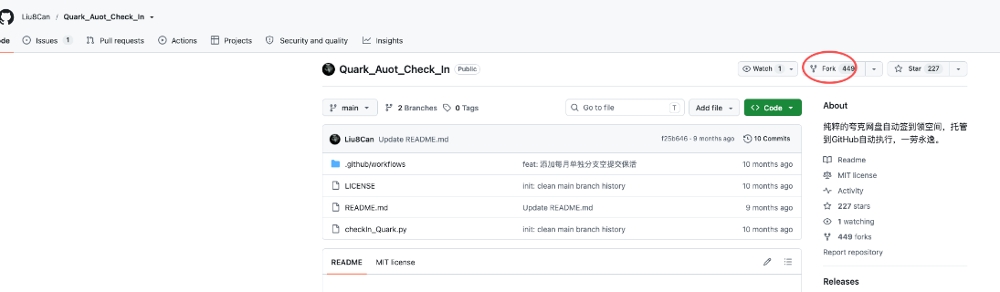

上面为本次要用到的开源自动项目

### **2、安装抓包工具**

浏览器输入：<ins class="dot">https://github.com/wanghongenpin/proxypin</ins>

按照如下操作下载最新版本<ins class="wavy">Releases</ins>

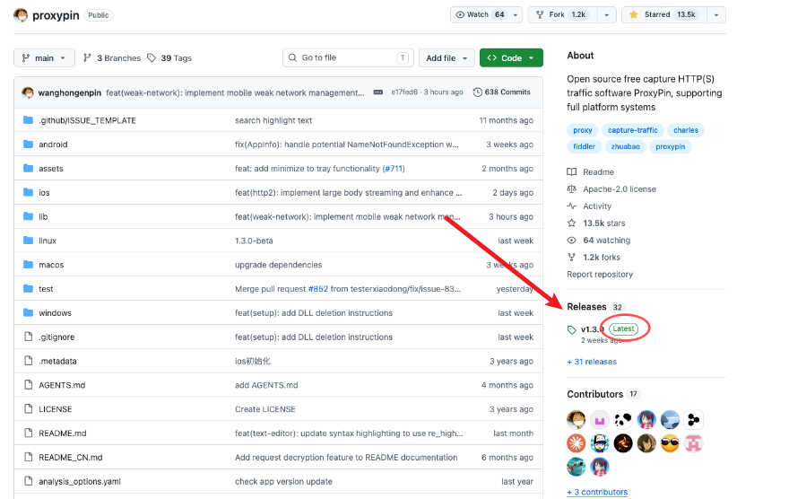

注意：这里提供了==ios== 和==android==版本，用户根据自己的手机系统自行选择

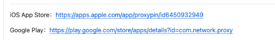

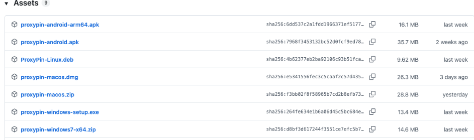

当然如果你有黄鸟也是可以的，同样的操作

## **软件配置**

### **1、抓包工具配置**

1. 打开手机抓包工具，开启抓包工具https，按下图操作。

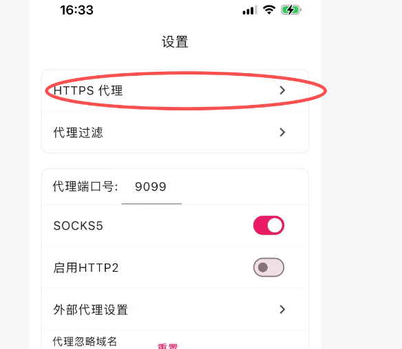

### 2、安装证书

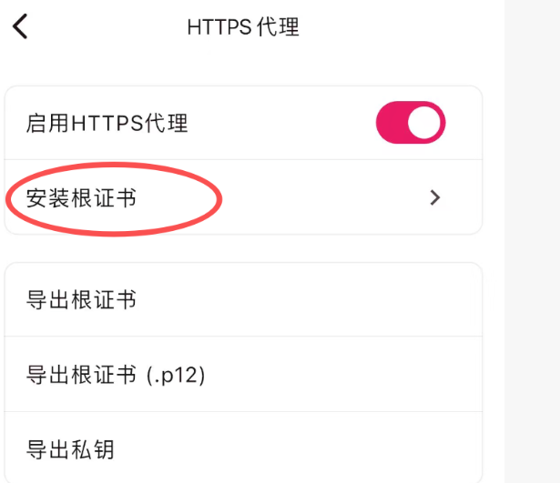

这里不详细说明。。。

### 3、开启抓包工具

（可选）这也选择应用程序为夸夸

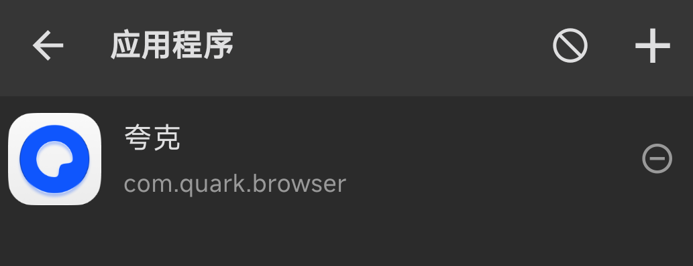

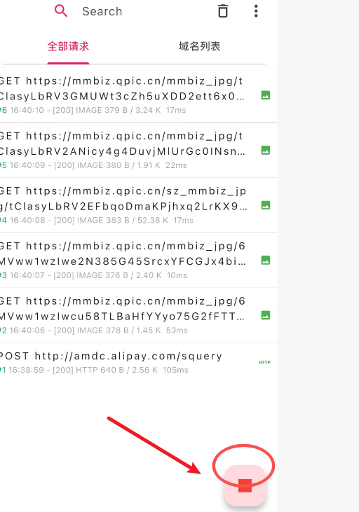4、手

### 4、打开夸克网盘,点击下面的小云朵

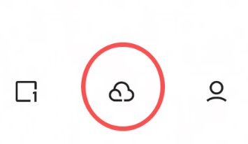

### 5、手机打开抓包工具搜`growth`

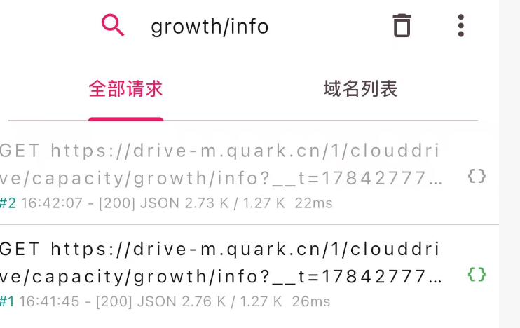

### 6、复制请求中的参数：`kps`、`sign` 和 `vcode`

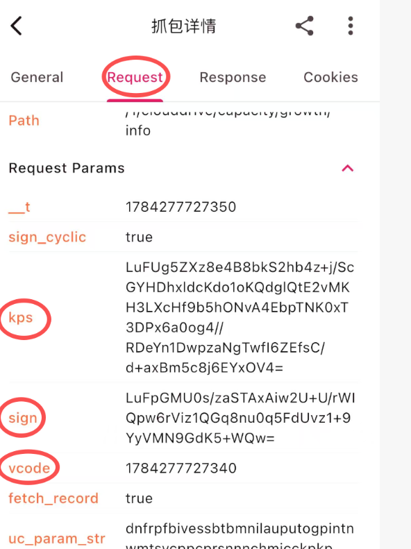

## **Token整理**

### 1、将抓包工具中的参数整理为以下格式：

```
user=张三; kps=abcdefg; sign=hijklmn; vcode=111111111;
```

### 2、回到你上面fork的仓库，进入 **Settings -> Secrets and variables -> Actions**。

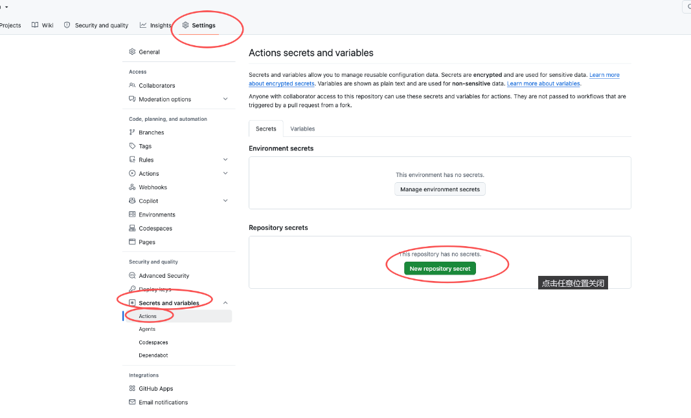

### 3、点击 **Repository secrets** 分区下的 **New repository secret** 按钮，

创建名为 `COOKIE_QUARK` 的 Secret。

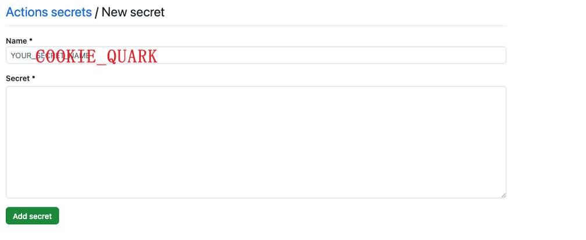

### 4、进入 **Actions** 选项卡。如果看到黄色的提示条 "Workflows aren't right ....... enable them"，点击 **"I understand my workflows, go ahead and enable them"** 按钮启用 <ins class="dot">Actions</ins>。

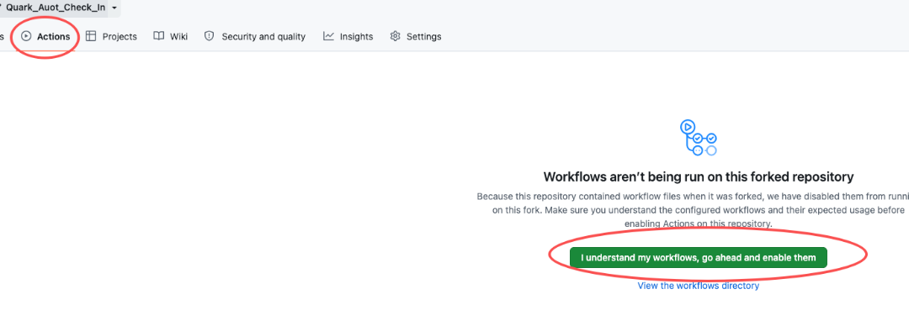

### 5、进入仓库的 **Settings -> Actions -> General** 页面，在 "Workflow permissions" 部分，选择 "Read and write permissions"，点击 "Save" 保存。

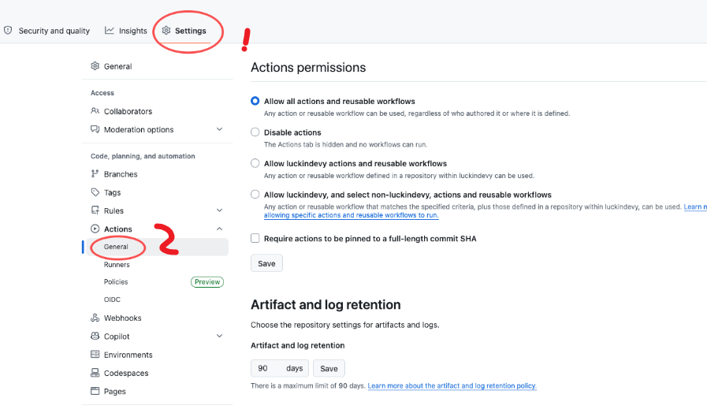

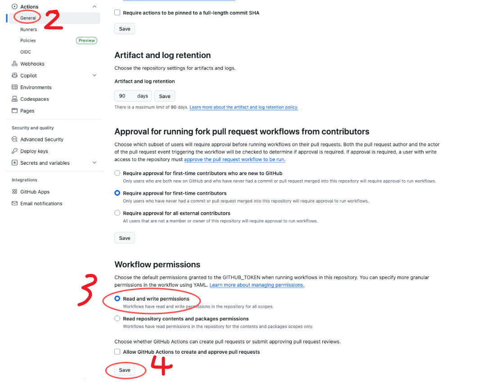

### 6、回到Action 你会看到名为 `Quark签到,点击启用`

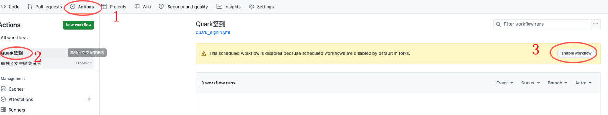

### 7、手动触发

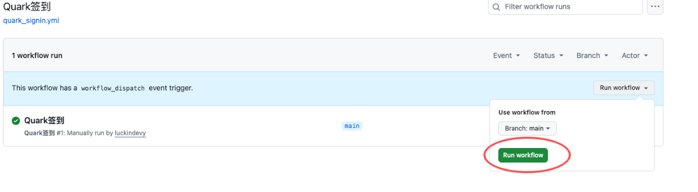

### 8、查看结果

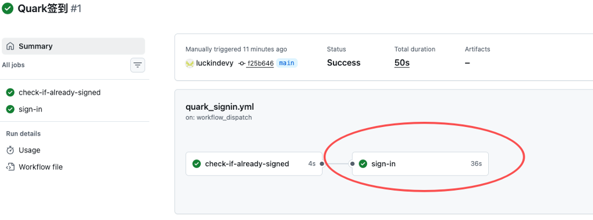

### 9、看是否签到成功

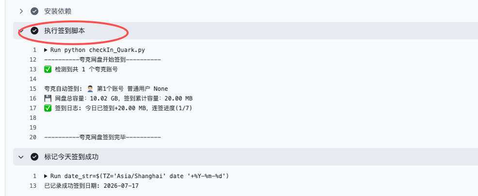

> **补充**
>
> 签到任务会在每天的9点和下午的1点自动执行。
