# 茗叙

> 关于这次成人礼我有很多感悟与有很多话想说,想分享,18年来经历了太多太多,如今已是成人 ,做出的事情也要自己负责,以后就是自己做决定.
>
> 本博文是为了分享在学校4-30号举办成人礼活动,我的所见所感

# 茗述

## 准备

学校为我们通知,家长要准备花还有孩子准备给家长的一份信,学校会为我们准备成人徽章和小夜灯,并且每个人会唱<倔强>这首歌.

我的妈妈为我准备了她亲手制作的花束,向日葵很好看,但是后面分支做的不太好所以又去定制了一些鲜花,真的蛮感动的,母亲为我准备了这么多!

> 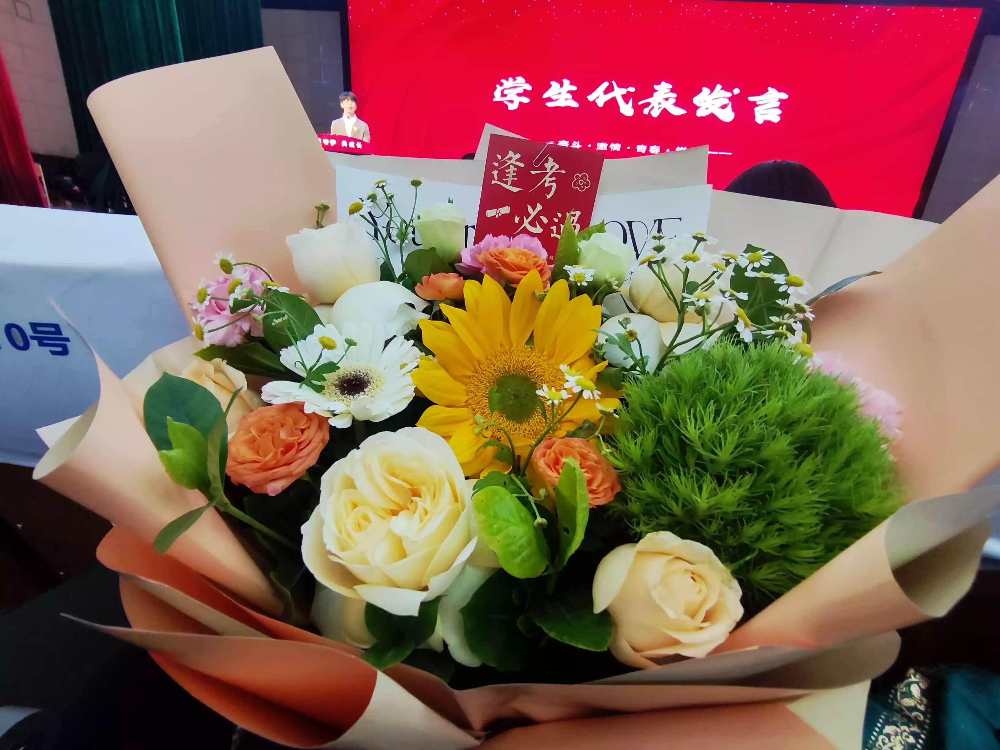

我也为母亲写了一封信,上面我讲述了我小时候的调皮与现在成人应该有的沉稳,写出了我会在成年之后对自己行为负责和孝顺他们,记得他们对我的呵护与他们的好,我一定会好好照顾他们!

> 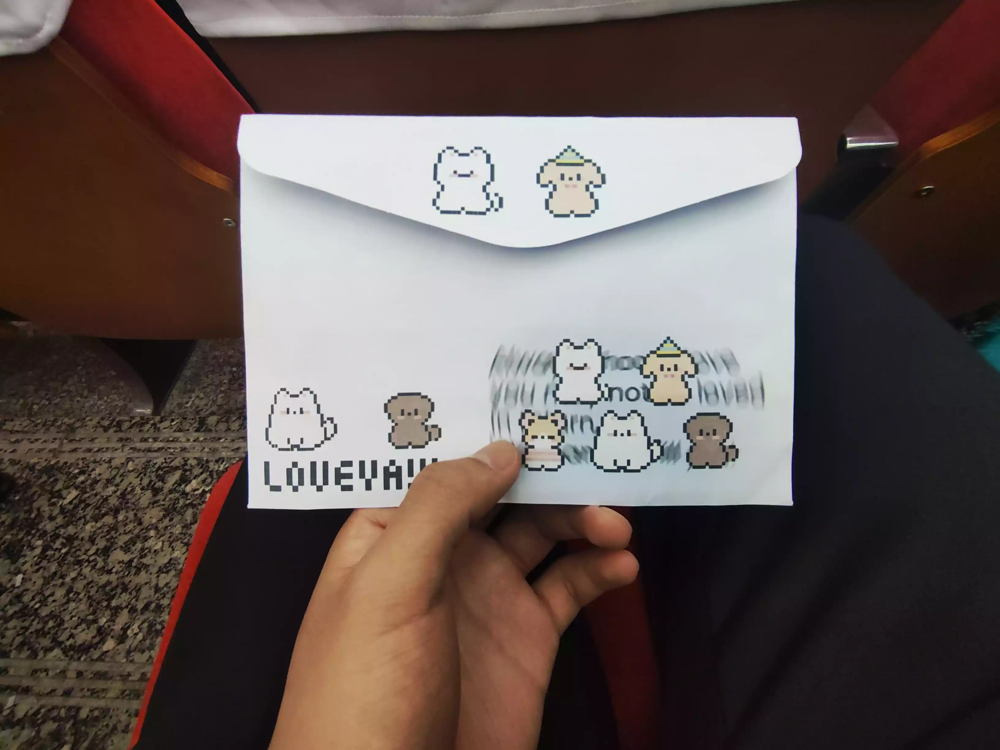

## 开始成人礼

### 老师代表的致辞

这位老师虽然不是我的语文老师,但我很仰慕她,她的知识储备很好,文采也很好,给了我们三个关键词,`感恩`,`责任`,和`担当`,我真的听进去了,我们出生就要感恩父母,学校为我们提供学习的场所,感恩学校和老师,其次就是感谢自己,感谢自己以来坚持这么久,最后37天,我是否拼尽全力,迎接最后的战场!身为成年人的自己,以后也要为自己的所做所为承担后果,进入这个社会主动承担自己的责任,而不是一味地依赖他人或父母,为自己闯出一片天地.. 我们12年寒窗苦读就是为了这最后一战,我们铆足了劲向前冲,**不负韶华,只争朝夕**!

### 家长代表致辞

这位家长是我们班第一的家长,这位爸爸很厉害,很慷慨的话语,文笔也很不错,他说学校这是第一年办高中,不知道怎么样,全靠我们这一届考出名声,他也在赌,但在看到孩子们为老师送上鲜花,那一刻很感动,他也看到过老师扯着 沙哑的嗓子还在上课,见到老师拖着病的身体,为学生讲解,这一切都很不容易,最应该感谢的就是老师. 看到同学眼神有光,这位家长说**他赌对了**! 全场掌声轰鸣

其次,家长为我们最后战场送上祝福,希望我们梦想成真,最后一场放下笔的瞬间说,这都值得!

### 家长与孩子互送花和信

那时候我满心接过母亲的花,香气扑鼻而来,但我想这并不仅**花香**,更有深深的**母爱**,我双手送出我写的信,母亲眼中打着泪,小心翼翼的拆开信封,我的第一句话是:`那年在您怀里长大的原子弹,现在高出一个头的您儿子,我长大了......`

## 自由活动

由于我本人不太想露脸,所以均动漫化处理

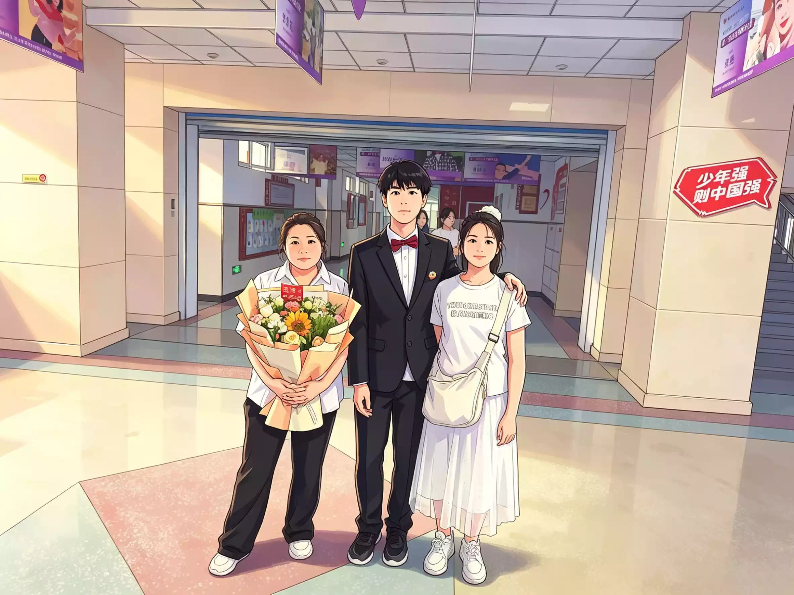

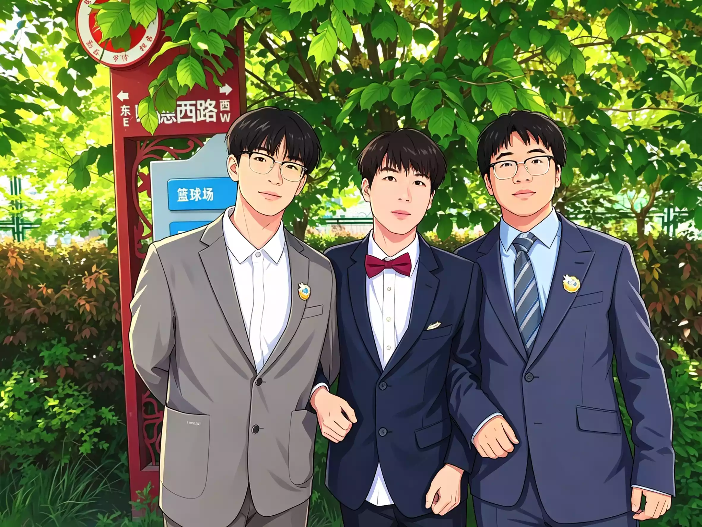

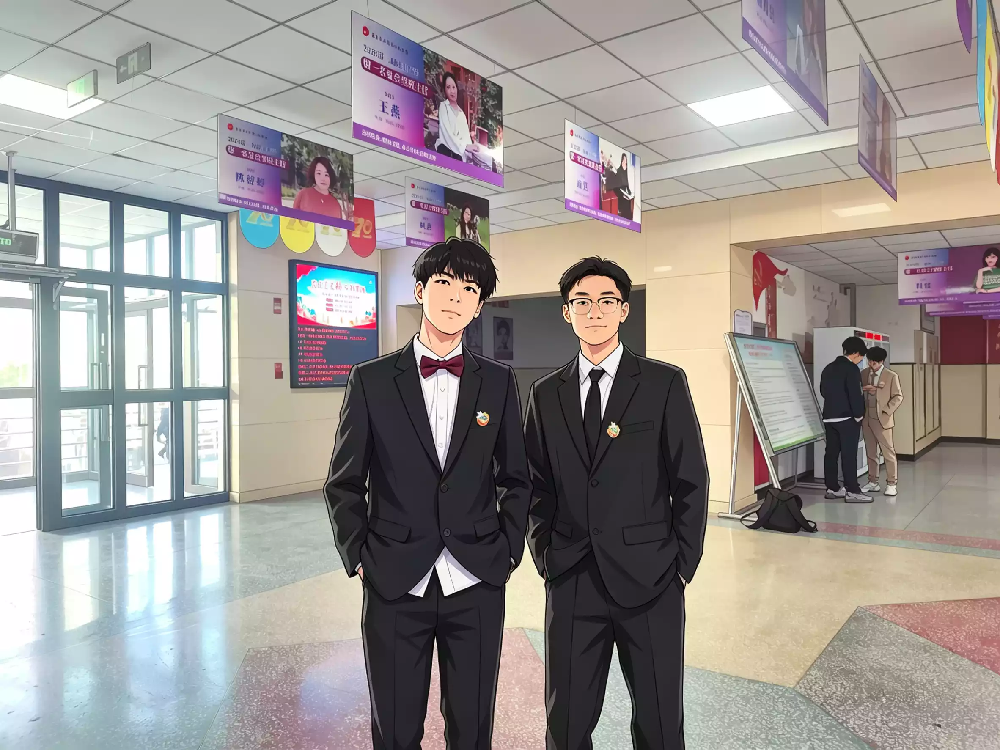

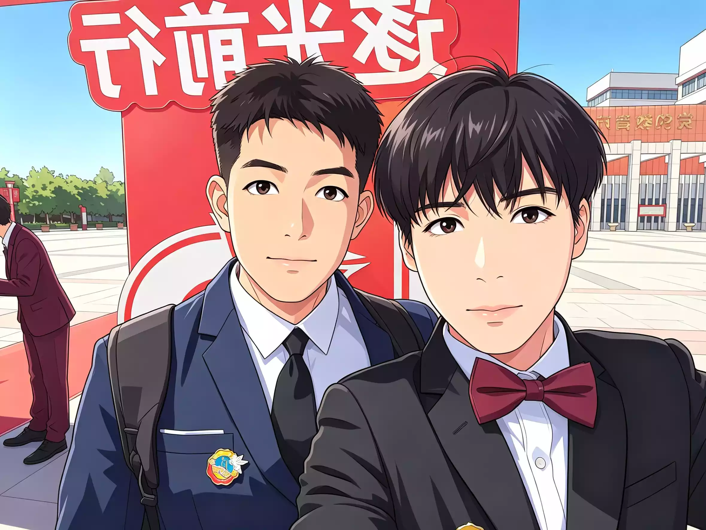

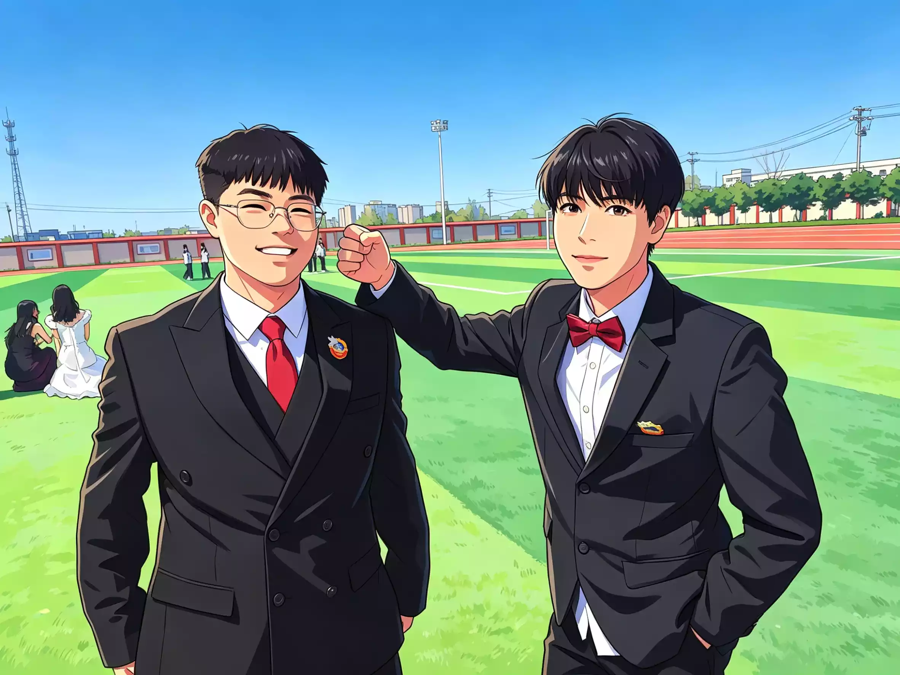

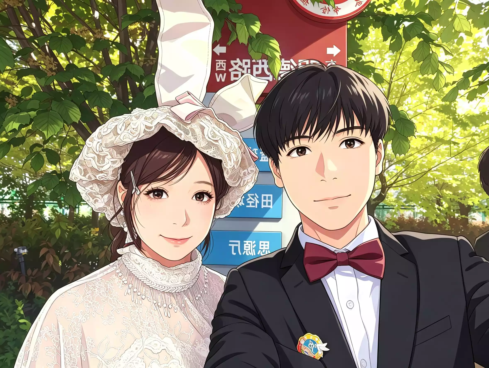

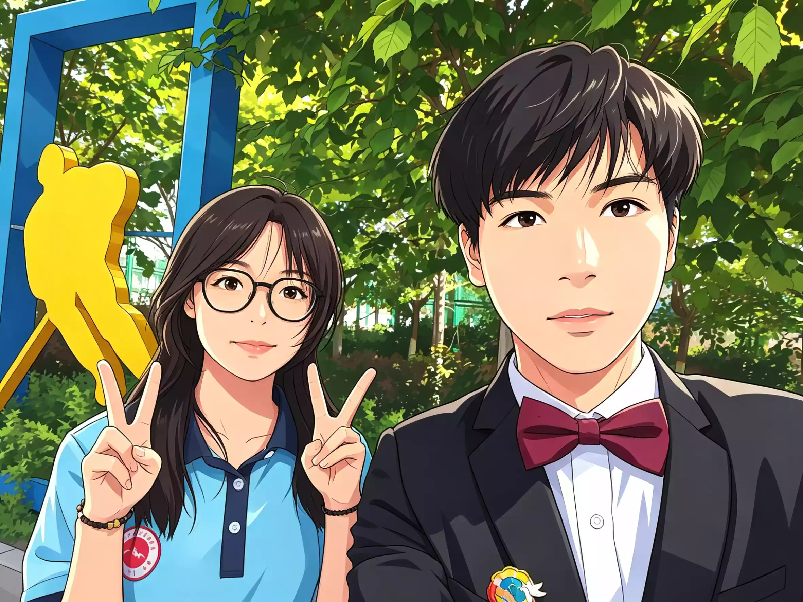

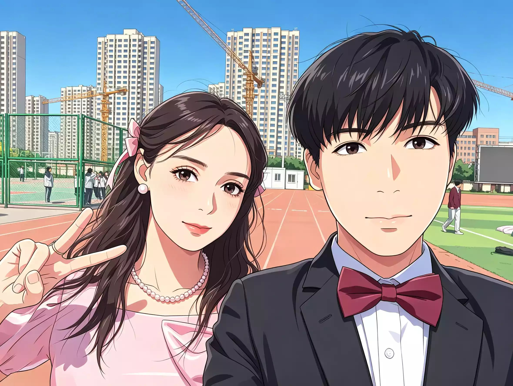

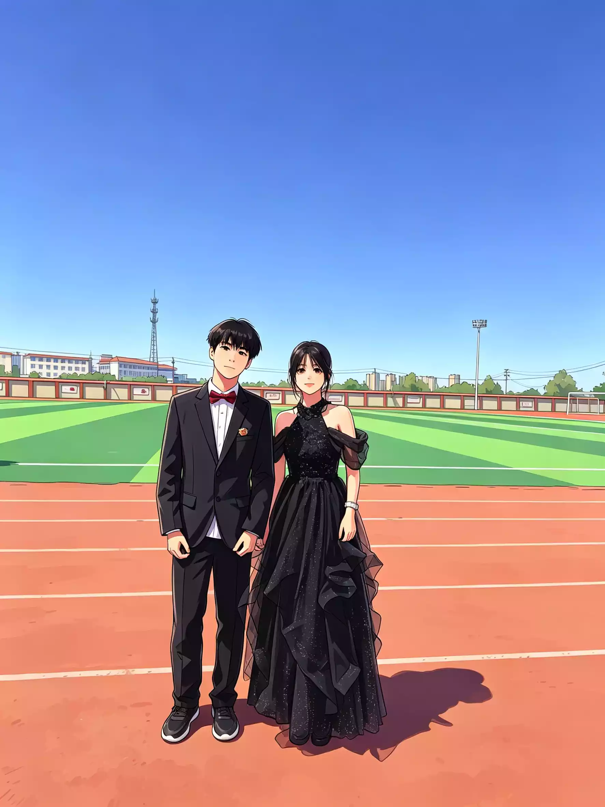

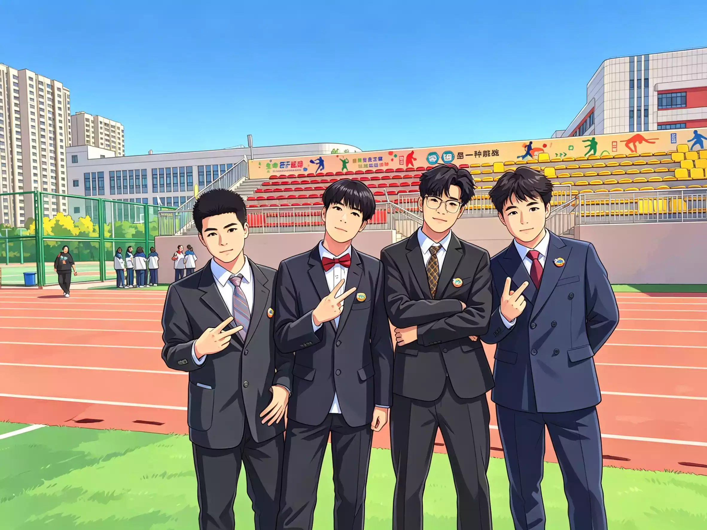

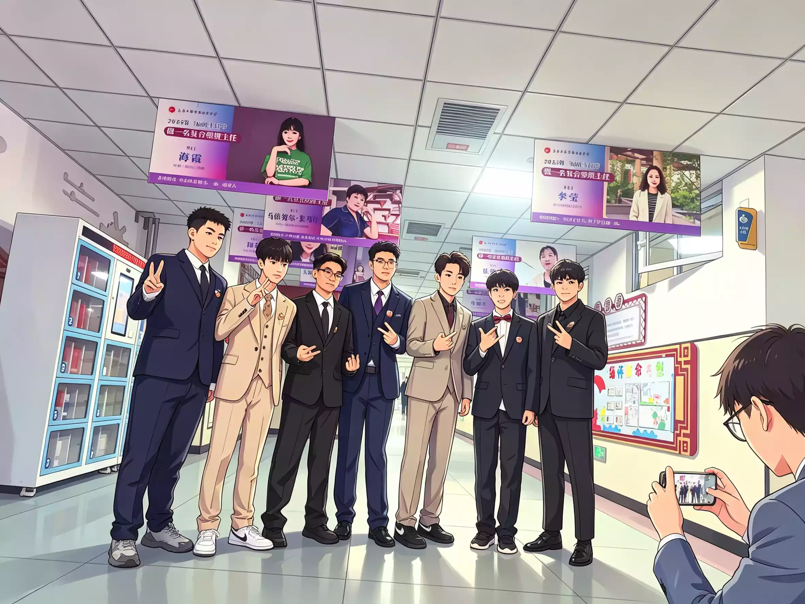

End....

~~这是最后一张~~ 照片已经删除

请使用相对路径查看图片: ++.../xxx(姓名).jpg++{.wavy .success}

> 我本将心向明月，奈何明月照沟渠。明知没有结果的两个人，却偏要在平行线上寻找交点。我曾喜欢一束花，欣赏她的美，却从未想过将她摘下，捧在手心。可花终究还是被折下了，我试着将她放在手心，奈何风一吹，花落入土壤，深深扎下了根。或许人生的意义，本就藏在沿途的风景里，只需看看，便已知足。此后，我仍能感受风的温柔、雨的诗意，感受每一步成长的力量。我才是那个很好的人，而不是她；该说遗憾的，不该是我。
> 相逢已是上上签，何必相思煮余年。
