# 碎碎念

最近也是开学了,抽时间更新一下

下面这篇文章转载于公众号:运维躬行录

# 茗述

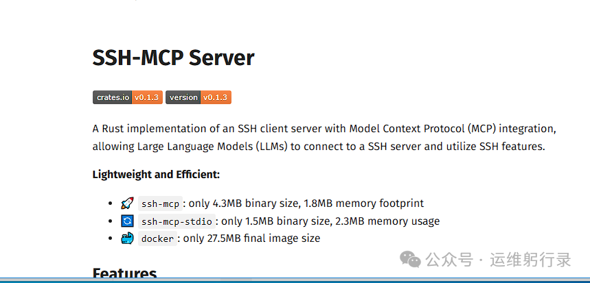

最近我遇到了一个特别有意思的场景，让我对AI运维有了全新的认识。事情是这样的：我有一台Rocky Linux服务器需要部署WordPress，但我不想手动敲那些繁琐的命令。于是我就想，能不能让AI直接帮我操作服务器？结果发现，现在真的有工具能做到这一点——通过sshmcp协议。

## 什么是sshmcp？这玩意儿到底有多神奇

说实话，第一次听说sshmcp的时候我还以为是什么新的加密协议。后来才知道，这是基于MCP（Model Context Protocol）协议的一个SSH工具，专门为了让AI能够安全地远程操作服务器而设计的。

简单来说，sshmcp就像是给AI配了一个"数字手"，让它能够通过SSH连接到你的服务器，执行命令、传输文件，甚至帮你排查问题。但最关键的是，它不会把你的SSH密码直接暴露给AI模型，所有的凭据都在本地管理，从根源上保证了安全性[5]。

## 如何开始使用sshmcp

项目地址：https://github.com/classfang/ssh-mcp-server/blob/main/README_CN.md

我使用的ai工具是：Cherry Studio

项目地址：https://www.cherry-ai.com/

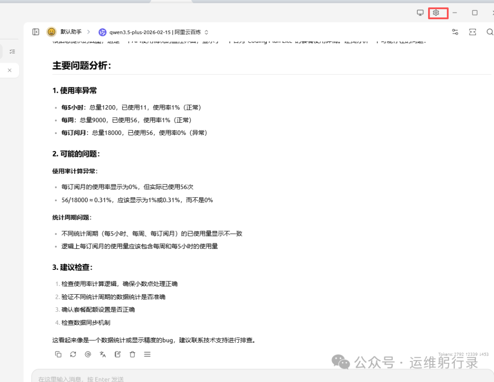

安装完成后配置大模型

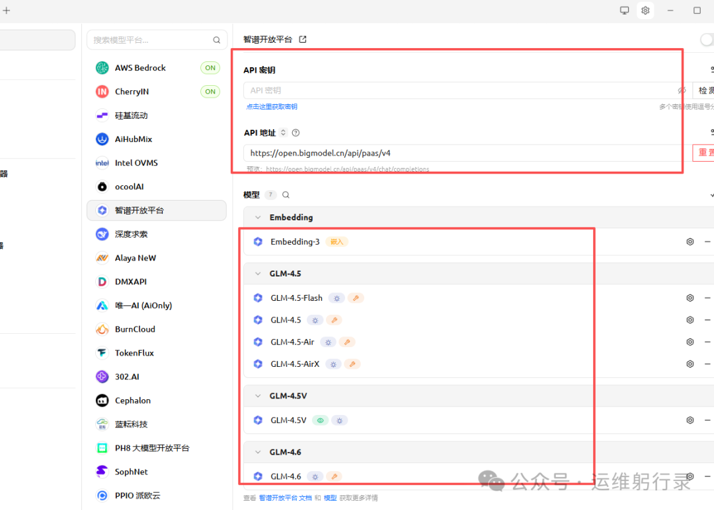

大模型配置好后安装mcp

如果你也想体验这种AI运维的感觉，其实并不复杂。根据官方文档，你可以通过NPX直接运行ssh-mcp-server：

```
npm i @fangjunjie/ssh-mcp-server
```

或者如果你更喜欢Python版本，也可以使用：

```
pip install ssh-mcp-server
ssh-mcp-server --config your-config.json
```

添加mcp服务器

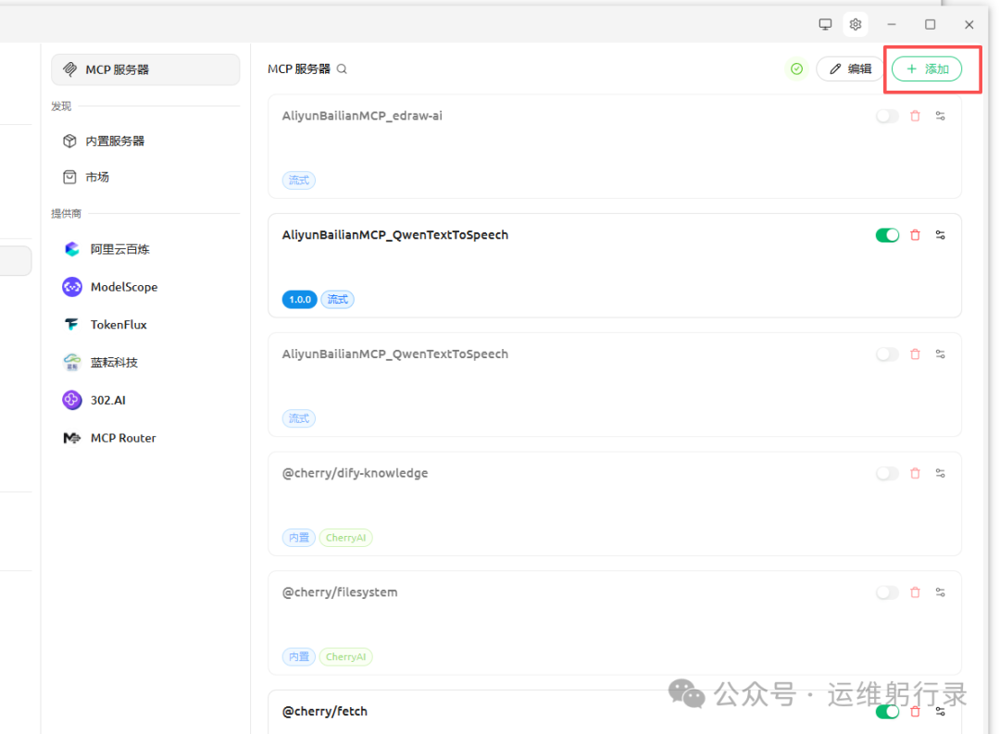

配置文件通常包含你的SSH连接信息：

```txt
{
  "mcpServers": {
    "ssh-mcp-server": {
      "command": "npx",
      "args": [
        "-y",
        "@fangjunjie/ssh-mcp-server",
        "--host", "192.168.198.133",
        "--port", "22",
        "--username", "root",
        "--password", "pwd123456"
      ]
    }
  }
}
```

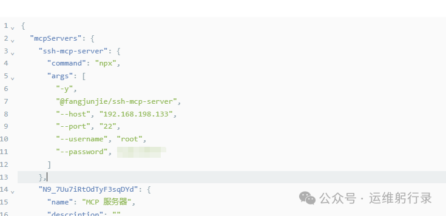

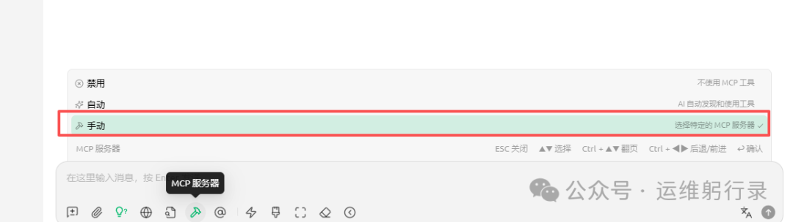

一旦配置完成，任何支持MCP协议的AI助手（比如Cursor、Trae等）就可以通过这个服务器来操作你的远程机器了[3]。

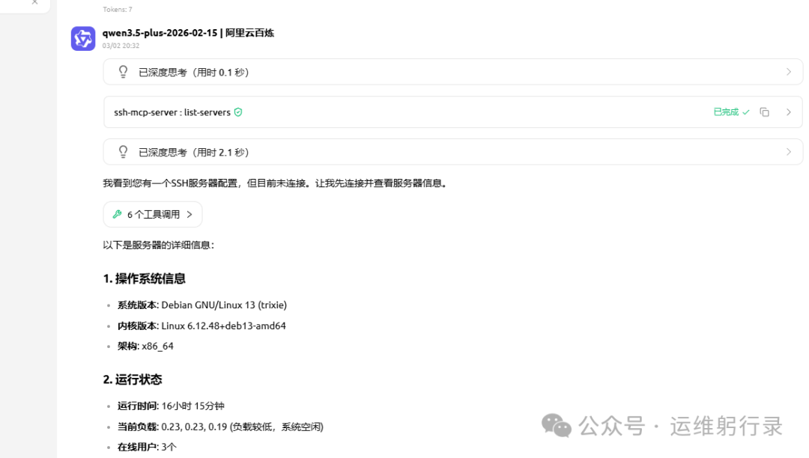

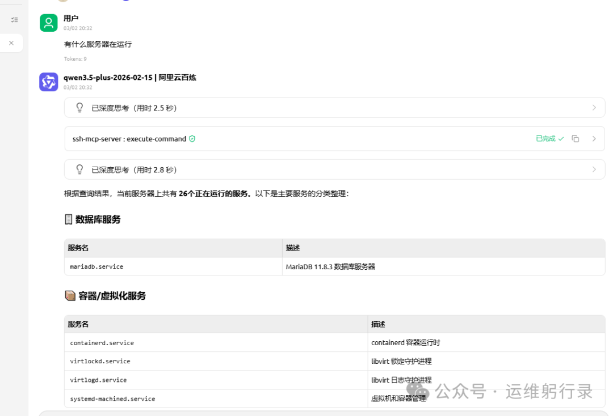

## sshmcp的核心优势：安全与效率的完美平衡

说到sshmcp，我觉得它最厉害的地方在于解决了AI运维的最大痛点——安全性。传统的做法要么是把SSH密钥直接给AI（极其危险），要么就是完全手动操作（效率低下）。而sshmcp通过以下机制保证了安全：

- • **凭据隔离**：SSH凭据完全在本地管理，永远不会暴露给AI模型
- • **命令控制**：可以通过黑白名单机制精确控制允许执行的命令范围
- • **标准化接口**：遵循MCP协议规范，可与所有支持该协议的AI助手无缝集成
- • **双向文件传输**：不仅支持命令执行，还支持安全的文件上传下载

这意味着你可以放心地让AI帮你处理日常运维任务，而不必担心服务器被黑或者数据泄露。

## 操作演示-让ai安装lnmp环境，部署wordpress

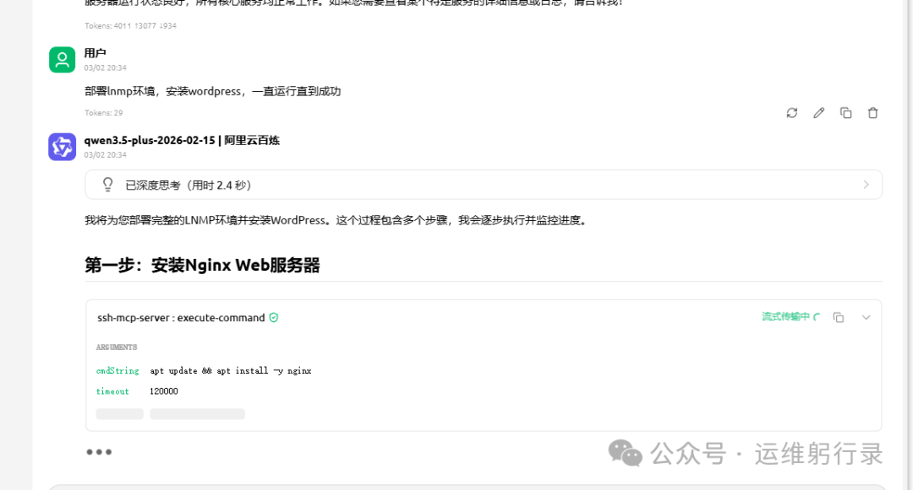

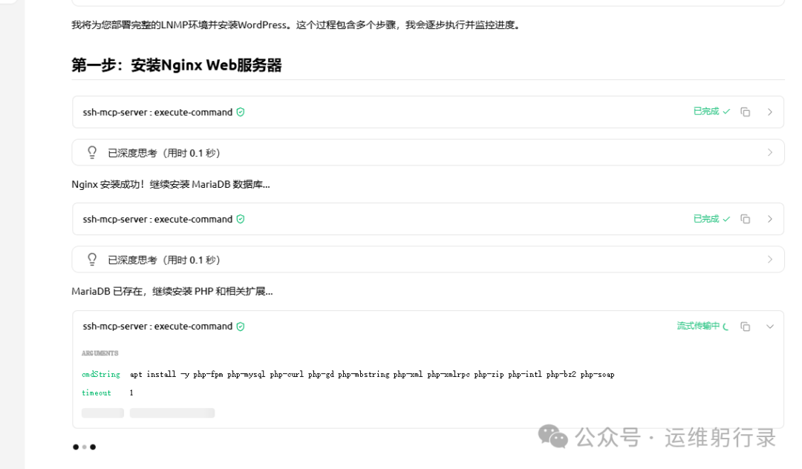

发现端口占用处理

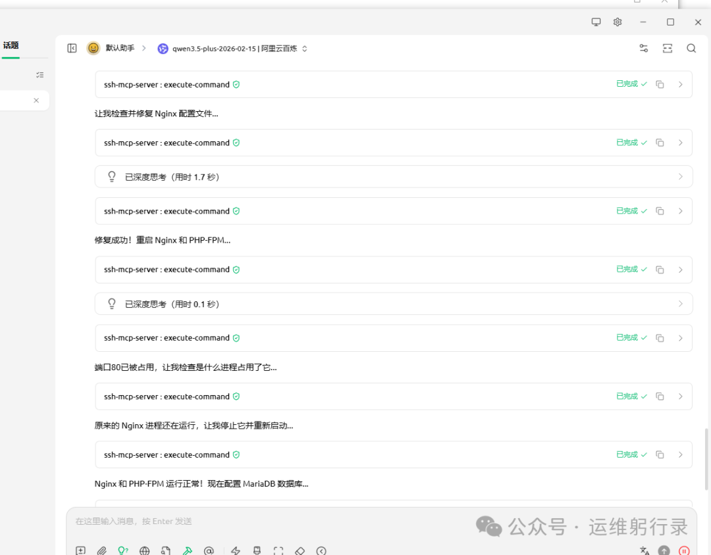

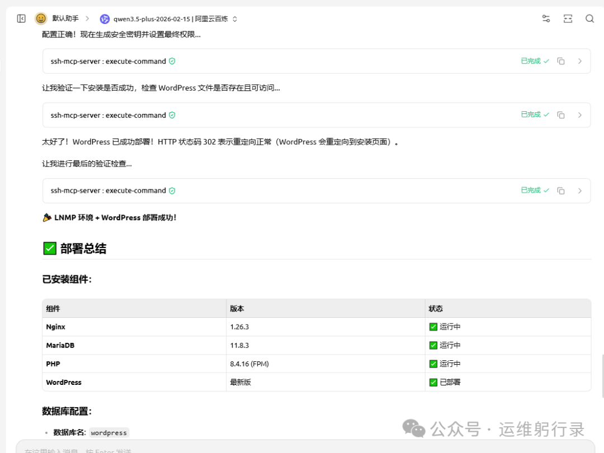

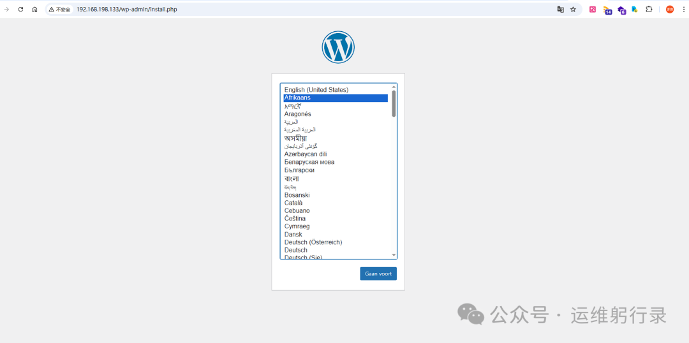

## 实际应用场景：不止是部署WordPress

虽然我用WordPress部署作为例子，但sshmcp的应用场景远不止于此：

**应急响应**：当服务器出现故障时，AI可以立即连接并执行诊断命令，快速定位问题所在[2]。

**批量操作**：如果你管理着多台服务器，AI可以同时连接所有服务器并执行相同的维护任务。

**配置管理**：AI可以帮助你标准化服务器配置，确保所有服务器都遵循相同的安全策略。

**日志分析**：AI可以直接读取服务器日志，分析异常模式并提供优化建议。

**安全审计**：定期检查服务器的安全配置，发现潜在的风险点。

## 安全考虑：别让便利成为隐患

虽然sshmcp看起来很美好，但我们还是要保持谨慎。毕竟让AI直接操作生产服务器是有风险的。以下几点建议供参考：

1. . **最小权限原则**：为AI创建专用的SSH用户，只授予必要的权限
2. . **命令限制**：使用黑白名单严格控制AI可以执行的命令
3. . **审计日志**：记录AI执行的所有操作，便于事后审查
4. . **测试环境先行**：先在测试环境中验证AI的操作逻辑
5. . **人工审核关键操作**：对于删除、重启等高危操作，要求人工确认

## 未来展望：AI运维的新时代

说实话，体验过这种AI辅助的运维方式后，我真的觉得传统手动运维有点过时了。想象一下，以后我们可能只需要告诉AI："帮我优化这台服务器的性能"，它就能自动分析瓶颈、调整配置、应用最佳实践。

当然，这并不意味着运维工程师会被取代。相反，我们的角色会从"操作工"转变为"策略制定者"和"质量监督员"。我们需要设计更好的自动化流程，制定更智能的运维策略，同时确保AI的行为符合我们的预期和安全要求。
