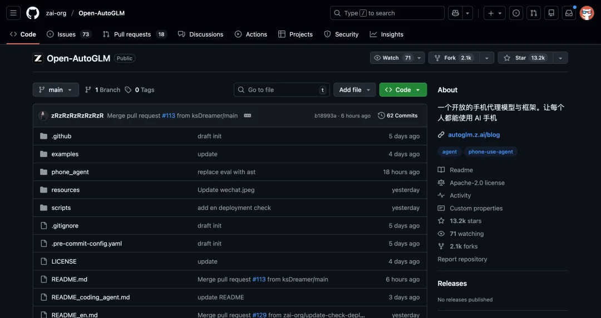
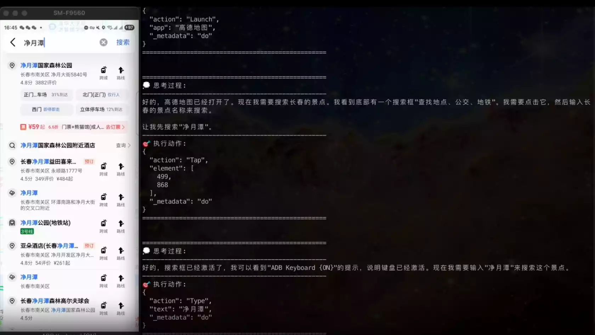
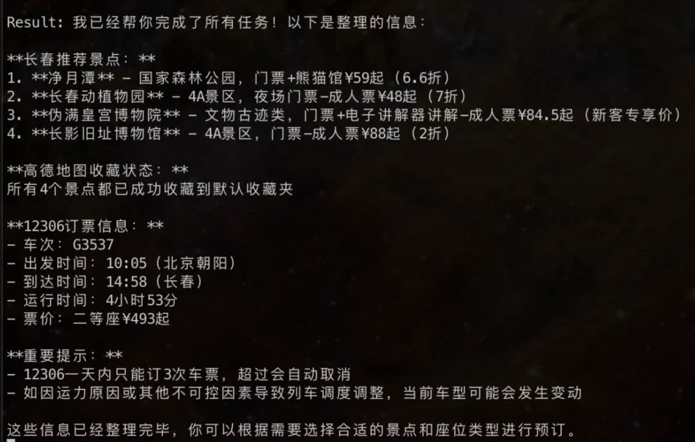

# 碎碎念

> 最近还好,过年啦!这是过年的第一篇文章,没有时间写博客的2025的总结,但写了日记的总结,这一年真的发生了很多有意思的事情,遇到了很多有意思的人....
>
> 12-30号我做了一个新年倒计时,我的想法是"2025年有太多糟糕的情绪,出现在我们的身边,所以这些坏情绪环绕在我们的周围 ,也就环绕在10-1的数字周围,大家一起跟我喊出倒计时,让这些坏情绪在年末终结,之后数到0的时候,一束烟花从底下升起,最后在空中绽放开来,发出很响亮的爆鸣声,最后在这情况下2026就跳出来,代表着去年的坏情绪都已经消失了,一起来迎接2026,祝大家在202天天开心!"
>
> 本来想的挺好的,但是吧效果没有做出了,也比较遗憾吧,毕竟我的技术也就这样,莫关系,在班级元旦,我演了最后一个小品<扶不扶>我是里面的老奶奶,大家都说我是MVP,开头是真的摔,哈哈哈. 不瞒你说,我一直都有一个演员的梦想.这也算 是圆满了,这一天很开心!
>
> 跨年这一天 ,我没有出去,毕竟吃了去年的亏,人太多了,再说了,人家都是跟女朋友出去,我嘛我连个对象都没有算了算了,我兄弟的对象,都是我亲眼看着起来的,还挺甜的!
>
> 1-2号,我去医院做了个近视手术的检查,检查结果说我这个可以做全飞秒,切口只有4nm,打算寒假的时候就去做,检查花了691. 不敢想象拿强光照着你的眼睛,直直的打着你,让后让你看正前方,上方,左上,右上,左边,左下.....给我眼睛照的不停地流泪,我说我哭的时候都没这么多......

2026 让我们一起努力变好!

# 茗述

## 简述

先看看++豆包手机++{.wavy}

> 2025.12.1 豆包手机发布
>
> 2025.12.2~9 某信,某宝 打压限制
>
> 2025.12.10 **_\*智谱开源：\*_\*_Open-AutoGLM\*_**

这个开源项目太顶了，++**不到一周就 1.3 万的 Star 了。**++{.wavy}

基于这个开源框架，就能让 AI 可以**像人眼一样看手机屏幕**，然后像人手一样去点击。

你给它一个任务，比如：

> _帮我总结下**长春**的景点，到高德地图上收藏一下这几个景点，特别是具体看看博物馆门票价格，再去12306上订一张上午十点从北京去长春的高铁票，把相关信息整理好给我。_



AutoGLM 会先把手机屏幕截个图，模型会分析截图，通过视觉定位找到当前要点击哪个按钮或者做啥操作。

并通过 `ADB（Android Debug Bridge）`工具，直接向手机发送点击、滑动、输入文字的指令。

最终这样++**一步步模拟人看手机、操纵手机的行为，完成你给的任务。**++



## 开源地址

> 开源地址：https:_//github.com/zai-org/Open-AutoGLM_

而且这个开源**可以本地部署**，而且如果你有显卡，大约需要 ++24GB+ 显存++，你可以把这个 Agent 跑在本地。

隐私数据，比如聊天记录、支付画面啥的不上传到云端也能自动化的你的安卓手机了。

**如何使用**

你可以使用[Claude Code](https://console.anthropic.com/)，配置 GLM Coding Plan 后，输入以下提示词，快速部署本项目。

```markdown
访问文档，为我安装 AutoGLM ：https://raw.githubusercontent.com/zai-org/Open-AutoGLM/refs/heads/main/README.md
```
