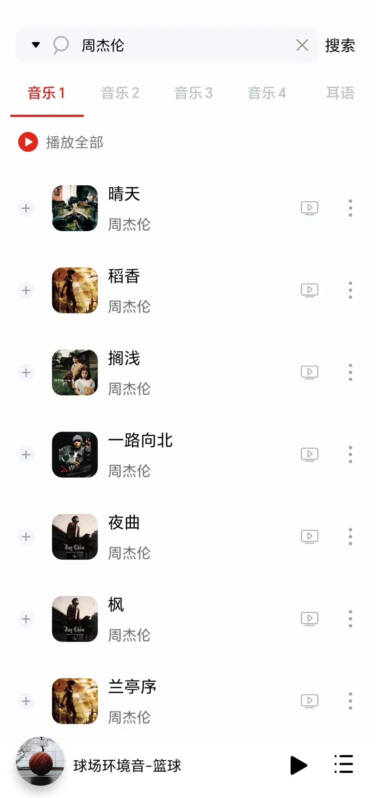
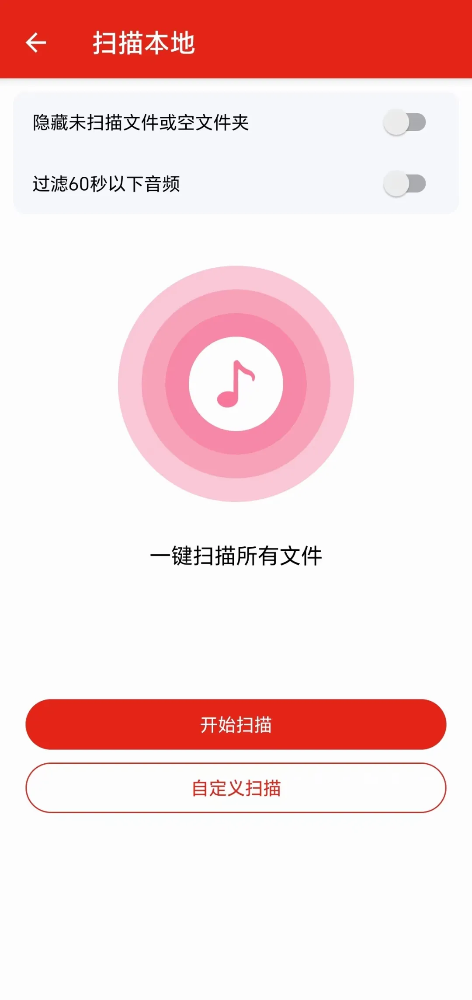

# 聆听音乐

#### 首页推荐

作为一款成熟的音乐软件，首页通常最普遍的内容就是音乐推荐，包括热门音乐推荐和每日推荐。

推荐内容都是当前网络上用户播放量比较高的一些知名歌曲。

#### 音乐搜索

如果需要查找一部分自己需要的歌曲，在首页最上方有一个搜索框，搜索框输入歌曲名或者歌手名，能从多个搜索源下搜索内容。

APP 包含 4 个搜索引擎源，分别来自不同平台，在资源方面不完全相同，同一搜索词也会搜到不同内容。

相当一部分歌曲除了音频之外，还能播放 MV，点击歌曲名最左侧的+，将需要播放的音乐添加至播放列表。

#### 歌单分类

除了搜索关键词，还能根据类型查找不同类别的歌单，歌单分类有很多，根据语种、流派、主题、心情、场景，又能分成更多类型。

歌单是一连串歌曲的合集，至少包含十几首歌曲。

#### 音乐下载

大多数的音乐 APP 并不支持歌曲下载到本地，但是这款聆听音乐却能完美支持。

下载的格式有多种选择，包括无损和标准，无损格式文件体积会更大，下载的本地文件就是普通的常见音频格式，可以放到其他播放器上正常播放。

已经下载的歌曲会显示在“下载”导航栏处，不过下载功能并不完全不受限制，每个人每天只能下载 19 次。

#### 歌单导入

针对其他 APP 上的用户，聆听音乐也支持将 QQ 音乐歌单导入其中，只需要在 QQ 音乐上分享歌单之后复制链接。

粘贴进聆听音乐就可以很容易地导入 QQ 音乐上的歌单，其他平台歌单暂不支持导入。

#### 本地音乐

聆听音乐既是一款在线音乐播放器，也是一款再普通不过的本地音乐播放器，一键扫描手机上的本地音乐文件，按照规则过滤掉不需要的文件，只选取有用的歌曲进行播放。

#### 评价：

聆听音乐本身是一款免费的APP，不需要付费，也没有烦人的弹窗广告，但仍然有少量推广内容，还好不影响使用体验。

## 下载地址：

[点我点我](https://www.123pan.com/s/6zVRVv-8TBmd.html)
