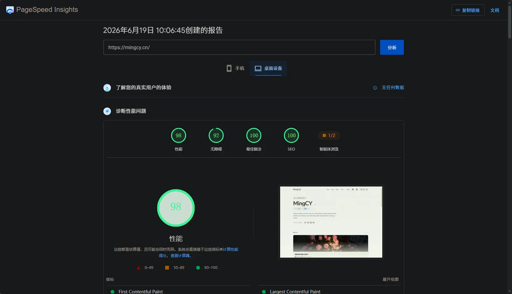
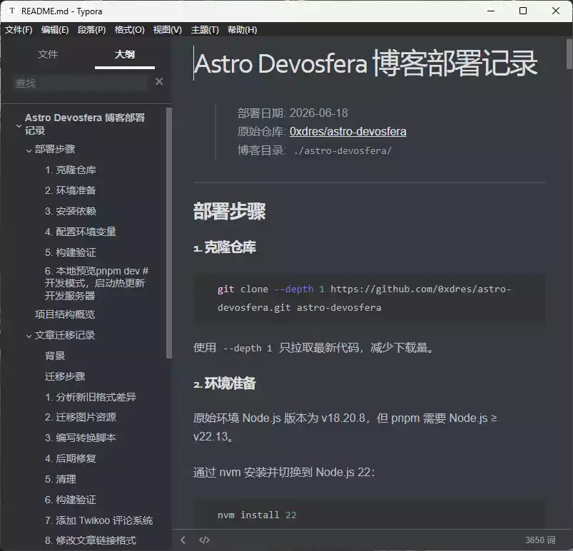
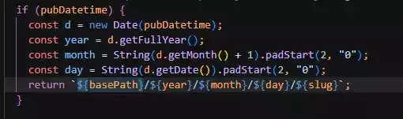
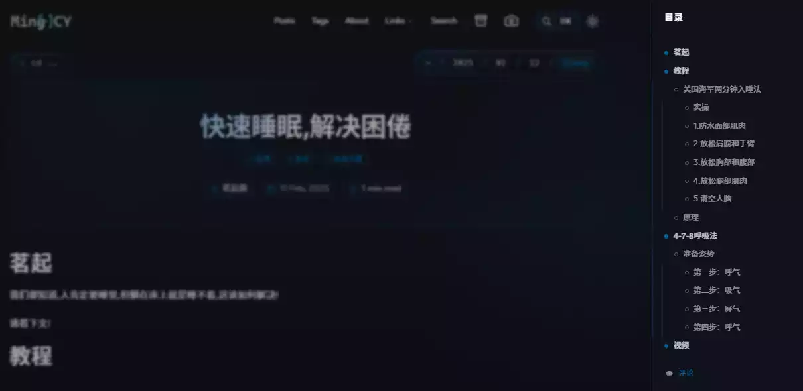

import LinkCard from '@/components/LinkCard.astro'

# 茗叙

最近也是刚忙完警检，也是做等着高考出分就行了，我是昨天下午去警检的，不得不说新疆的天气是真的晒，就那一天我都快烤熟了，首先我们先去做了**体检**，体检是要全部脱光的，但留个内裤，他会在你的身上疯狂的扫视扫视，检查有没有伤口之类的，随后就要去测视力，血压，身高，不出意料，昨晚手术的我视力都是（5.1）非常的nice！身高这东西，他使用旧的测量身高的工具，将板子移到你的头皮，是的就是头皮（不算头发长度），测出来的比我在医院测出来的，整整少了5cm，看到体重单的那一刻，差点落泪。随后就是去**面试**，面试也是非常的轻松，没有任何的压力，面试的姐姐也是非常好卡的，说话也是非常温柔的，超级有礼貌的。到了最后一个**体测**环节，体测的内容有50米，立定跳远，引体向上，1000米，身为体考全班第二的成绩，放到这里就手拿把掐！50米，立定跳远，引体向上都是第一（没有炫耀的意思），体测成绩只有合格和不合格，而且四过三即可，最后一项1000米，我有个习惯就是最后100米必须冲一下，将自己的全部爆发力集中于此，刚开始发力，旁边教官就说，可以了可以了，不用加速，我就这样慢悠悠的跑下来了。

我们当天是12点去的，最后3点才出来，真的花的时间挺长的，刚开始我们组有18个人，在经历过体检之后，有的人发现自己的视力和BMI不合格就直接弃赛了，最后就只剩下7个人，你说这，真的把我逗笑了，整个考场都知道我们人数最少了。全程是不可以带手机等电子产品的，如果响了直接作废成绩，所以在进去之后教官就会把你的手机收走，等到所有都结束之后再发给你，教官也都是很认真，在你进入考点之前就检查你的资料有没有填写完成，户口本之类的有没有携带，等等，进入之后还有一个检查，全程都是很严谨的。

等到都整理完之后，有个确认成绩并且签字确认的环节，发现有个人在体检的时候医生没有签字，是忘记签了，按理来说不想耽误大家时间就应该自己签上，但是教官得知之后，直接将它带到体检区域，亲自找医生确认，这保障了公平性，让我们大家都很放心。随后就没有什么要说的了，祝我能被提前批志愿录取！

------

# 茗述

## 起因

我一直在使用Hexo的项目进行搭建我的博客，但是随着文章越来越多，其次Hexo的主题停更，产生了想换框架的念头，但是不知道想换哪个，就打开了之前主题的文档，发现新的主题迁移到了Astro，之后我尝试部署，发现文章不对，目录不对，图片不对，反反复复尝试了3次没有解决问题，随后我看到了LiuShen的文章，发现他的主题很不错，于是我从页脚发现了第三方主题的GitHub，于是我开启了我的Astro之旅，下面附上LiuShen的文章：

<LinkCard title="清羽飞扬" url="https://blog.liushen.fun/posts/acf06c11/" image="https://blog.liushen.fun/info/avatar.ico" desc="建站四年，从Hexo换到Astro" />

## 成品展示

电脑端


手机端


测速



## 利用AI为我迁移博客

我有一个喜欢，每次使用提示词的时候，都会让他把修改的文件与操作记录到README.md便于我出错之后调整，于是它完整的记录了我从零到壹的全部过程。



部署的过程就不看了，都有文档，其次看看都要解决那些问题

### 遇到的问题

> - 文章格式不匹配
> - 图片存放位置不对
> - 评论系统问题
> - 友链的自适配
> - 配置 文件的修改
> - 添加运行时间
> - 文章目录

#### 文章迁移

将旧博客 `_posts/` 中的 78 篇 Hexo 格式文章迁移到 Devosfera（Astro）框架。

1. 分析新旧格式差异

| 项目               | 旧格式 (Hexo)                  | 新格式 (Astro Devosfera)                 |
| ------------------ | ------------------------------ | ---------------------------------------- |
| Frontmatter 分隔符 | `---` 或无分隔符               | `---`                                    |
| 日期字段           | `date: YYYY-MM-DD`             | `pubDatetime: YYYY-MM-DDTHH:mm:ss+08:00` |
| 描述字段           | `description:` 或 `descr:`     | `description:`                           |
| 封面图             | `cover:`（URL）                | `ogImage:`（URL）                        |
| 标签格式           | YAML 列表 或 `[a, b]` 内联数组 | YAML 列表                                |
| 分类字段           | `categories:` / `category:`    | 合并到 tags                              |
| 草稿字段           | 无                             | `draft: false`                           |

2. 迁移图片资源

```bash
# 将 _posts/ 下每个文章的图片目录复制到 public/images/
cp -r _posts/*/ astro-devosfera/public/images/
```

共复制了 71 个图片文件夹到 `astro-devosfera/public/images/`。

> 利用提示词很简单的让他，帮我迁移文章与图片

#### **Hexo 标签转换**：

- `` → `[text](url)`
- `...` → 移除包裹
- `...` → 转为 Markdown 列表
- `++text++{.class}` → `**text**`

甚至顺便将文章当中一些外挂标签帮我修改成markdown适合的格式，这一要求我没有告诉他，自动帮我完成，至于外挂标签后面再说吧！

#### 加 Twikoo 评论系统

- 新建 `src/components/Twikoo.astro` 组件，加载 CDN 版 Twikoo
- 在 `PostDetails.astro` 文章底部插入评论区域
- 兼容 Astro View Transitions，通过 `astro:page-load` 事件动态加载
- 评论系统地址：`https://twikoo.mingcy.cn/`

为我添加了Twikoo的组件，

```html
<div id="tcomment"></div>

<script>
  document.addEventListener("astro:page-load", () => {
    const container = document.getElementById("tcomment");
    if (!container) return;

const id = "twikoo-script";
const existing = document.getElementById(id);
if (existing) {
  container.innerHTML = "";
  (window as any).twikoo.init({
    envId: "https://twikoo.mingcy.cn/",
    el: "#tcomment",
    lang: "zh-CN",
  });
  return;
}

const script = document.createElement("script");
script.id = id;
script.src =
  "https://cdn.jsdelivr.net/npm/twikoo@1.7.19/dist/twikoo.all.min.js";
script.async = true;
script.onload = () => {
  (window as any).twikoo.init({
    envId: "https://twikoo.mingcy.cn/",
    el: "#tcomment",
    lang: "zh-CN",
  });
};
document.body.appendChild(script);
  });
</script>
```

#### 文章链接格式

由于我的访客量全靠前面的文章提供，不要想丢弃他们，但是Astro默认使用、posts/xxxx 数字的形式来实现，实在很烦恼，于是更改了文章链接的格式，改成/years/month/day/slug 的格式

> src\utils\getPath.ts
>
> 

成功与Hexo的文章适配，也是相当不错

#### 添加运行时间

- **修改** `src/components/Footer.astro` — 在页脚中间区域添加实时运行时间，从 2024-01-20 起计算，格式为 `🚀 本站已飞行：XX天XX小时XX分钟`

`随后就是最难的功能`

我调整了很久，也是很长时间最终产生的效果，我本来是想在文章的右边中间搭建一个目录，便于用户快速跳转，谁可知，更改了无数的提示词，但是没什么用，H1~H5标签在同一层，不能够分层，而且做出来的效果实在是太丑了，我都打算这个功能不做了，但最后我讲诉求告诉**豆包**，让豆包给我提示词，最后有了这样的效果简直不要太完美：

> 提示词如下：
>
> ```plaintext
>
> 基于Astro框架封装可弹窗打开的文章目录组件TableOfContents.astro，纯CSS样式实现，不依赖任何图片素材，全部色彩使用站点全局主题CSS变量，自动适配亮色/暗黑模式亮度，禁止硬编码固定色值。
>
> ##### 一、布局结构（弹窗形式，非侧边常驻）
>
> 1. 触发后弹出独立弹窗面板，弹窗顶部左侧文字「目录」，右上角圆形关闭按钮；
> 2. 弹窗内部内容分为两块：自动解析文章标题生成的树形层级列表 + 列表底部固定独立条目「评论」；
> 3. 树形列表每条条目统一结构：左侧层级竖线装饰 + 层级标记圆点 + 标题文字，层级越深整体向左缩进越多。
>
> ##### 二、标题树形层级数据规则
>
> 1. 自动提取Markdown文章内全部`<h1>`~`<h5>`标题，h1为一级顶层父节点，h2-h5依次为子节点，按深度递进缩进；
> 2. 弹窗列表最底部强制追加固定导航项「评论」，锚点指向Twikoo评论容器，点击平滑滚动到评论区。
>
> ##### 三、树形层级视觉强制规范（解决无层次核心）
>
> 1. 圆点层级区分（必须严格执行）：
>    - h1一级顶层条目：左侧实心圆形标记；
>    - h2~h5所有子层级条目：左侧空心描边圆形标记；
> 2. 层级连接线（关键分层视觉）：
>    深度≥2的子条目左侧增加垂直细竖线，竖线纵向贯穿当前层级所有子项，圆点紧贴竖线右侧，每向下一级标题整体再向内偏移固定距离；
> 3. 缩进规则：h1无缩进，h2统一左缩进16px，h3缩进32px，h4缩进48px，h5缩进64px，层级差距直观；
> 4. 激活态：页面滚动到对应标题时，当前目录条目整行背景高亮、文字加粗，区分普通条目；
> 5. 配色限制：弹窗背景、文字、分割线、圆点、竖线、高亮底色全部使用全局主题变量，不写死rgb/十六进制色。
>
> ##### 四、交互功能
>
> 1. 点击目录条目，页面平滑滚动至对应标题锚点；
> 2. 页面滚动实时监听视口，自动更新当前激活高亮条目；
> 3. 点击弹窗右上角圆形按钮，关闭目录弹窗；
> 4. 点击底部「评论」条目，平滑滚动跳转到Twikoo评论框。
>
> ##### 五、技术硬性约束（Astro专属，禁止通用前端代码）
>
> 1. Astro原生单文件组件，适配Astro content集合Markdown文章，页面引入组件自动解析h1-h5标题生成树形目录；
> 2. 使用Tailwind CSS编写全部样式，色彩全部绑定全局theme变量；
> 3. 使用astro:content内置getHeadings解析标题层级，仅少量客户端JS实现弹窗、滚动高亮、平滑滚动交互；
> 4. 输出完整可直接运行的TableOfContents.astro组件代码 + 文章页面引入示例，代码附带详细注释。
>
> ```

效果也是杠杠的，出乎我的意料：



非常的美观，也是超级棒！

### 尚未解决的问题

目前遇到一个很棘手的问题，由于我不知道我乱改了什么css，导致在移动端微信与QQ浏览的时候，点不进去文章和页面，但我的手机Via浏览器可以正常打开，我也是让AI参考了原作者的github的库，以及成品，最后也是成功解决这个问题，但是当我生产静态页面的时候，无论如何提示我格式错误，有很多的语法错误，导致也解决不了，我爸问题交给AI来处理，结果完善之后又出现点不开的问题，这个问题先这样放着，后面再解决，其实想不到怎么解决了，就上面两个问题整了我一天的时间......
