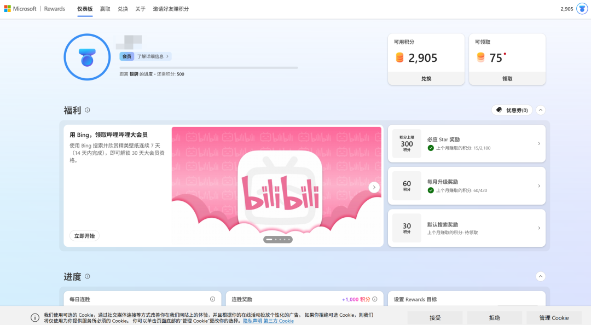
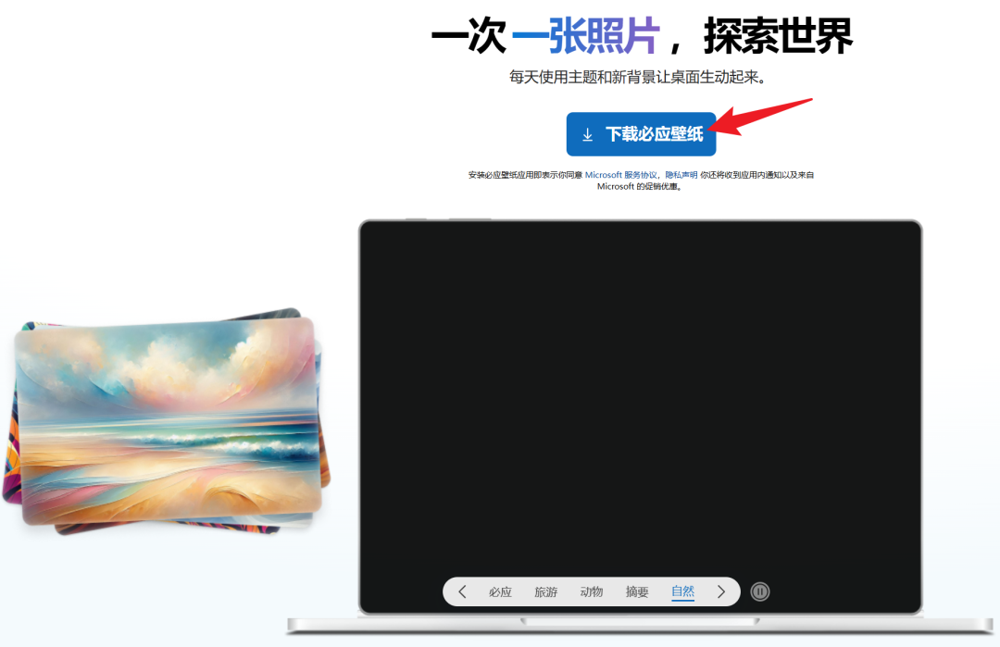
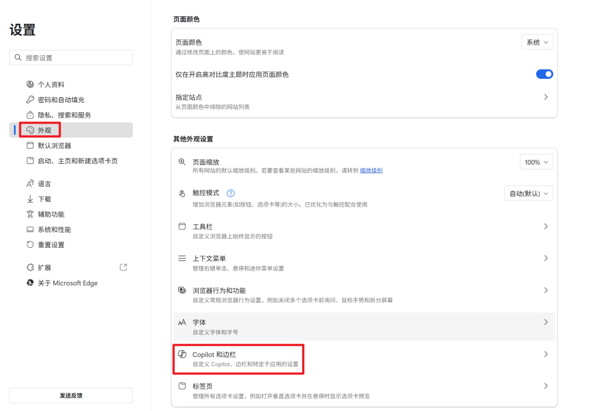
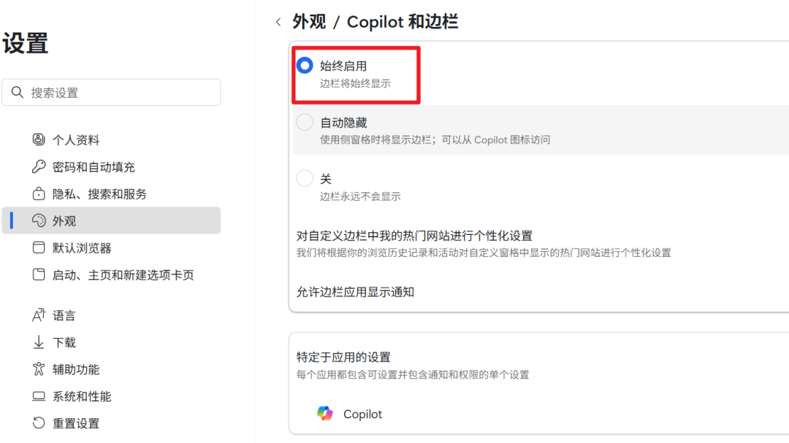
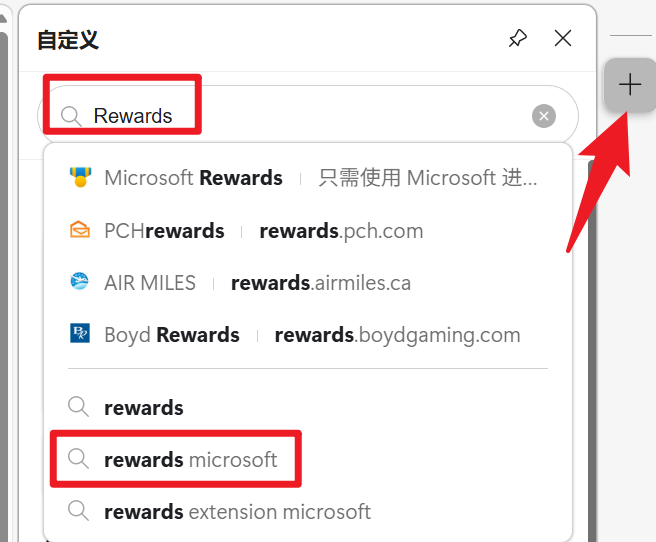
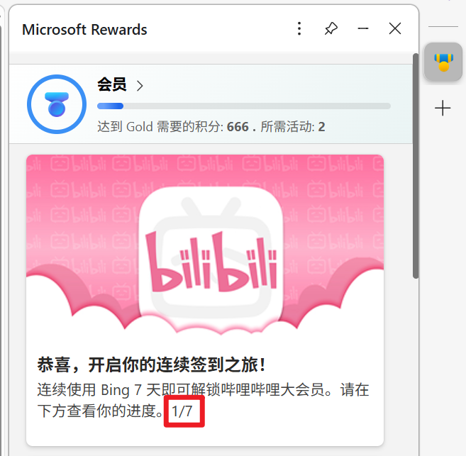
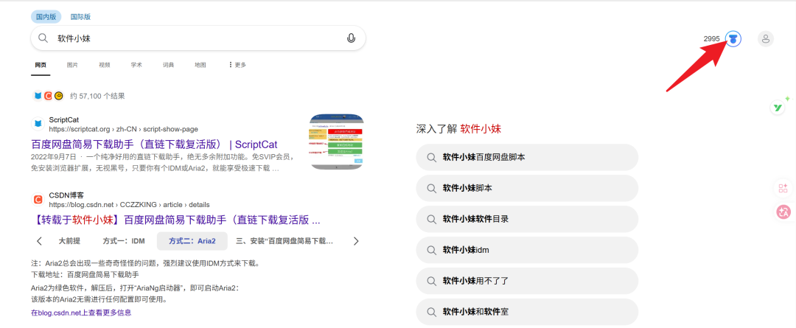
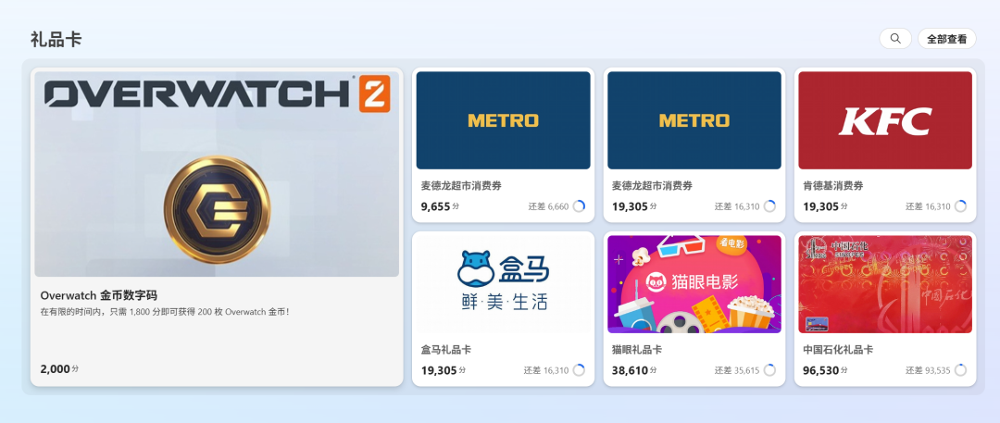
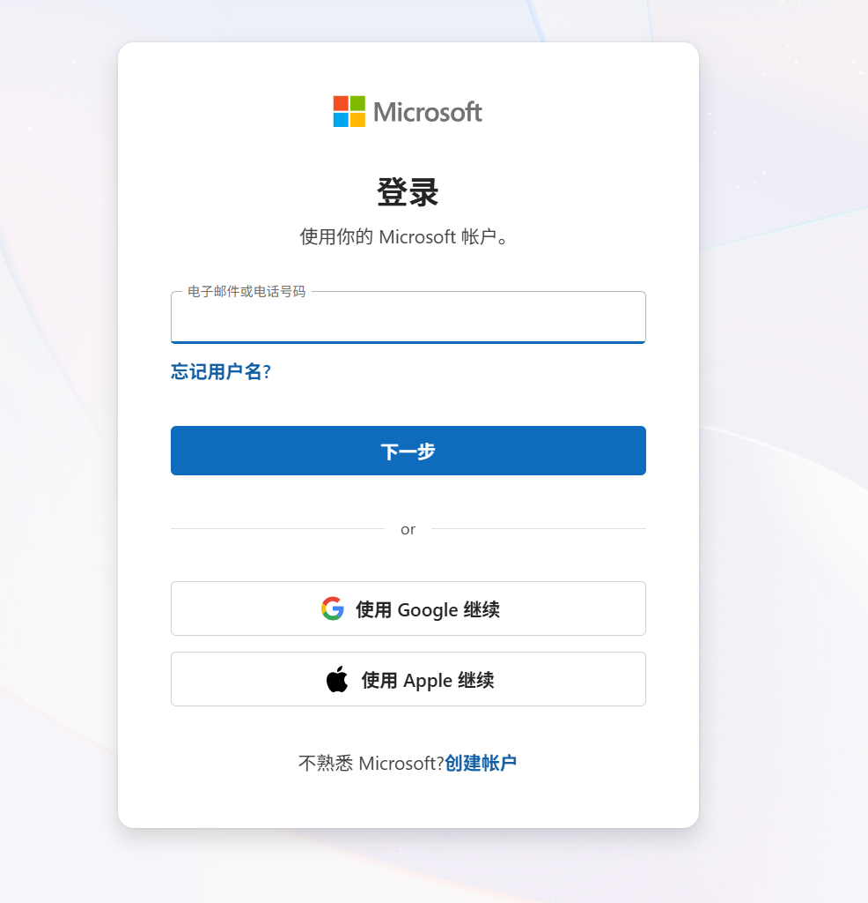

> AI总结
>
> 这篇文章介绍了一个能免费领取B站大会员的活动。简单来说，只要你用微软的Bing连续搜索7天，就能获得一个月的B站大会员。活动在手机和电脑上都能参加，方法很简单。文章还顺便提到了，用微软账户积分还能兑换其他像KFC、盒马之类的实惠礼品卡。

# 碎碎念

最近也是马上二模了,自我感觉良好,每天老师安排的内容都能跟得上去,但是自己安排的任务总是没有时间去好好完成,最近班里面到时都挺浮躁的,我得沉住心,可不能乱了阵子,高考大捷,加油!

---

# 茗述

### 第一步：使用Edge打开活动链接

活动地址：**https://aka.ms/bilrw2ruanjian**

打开以后我们可以看到有“福利”字样的B站大会员领取横幅，点横幅左下角的【**立即开始**】即进入参与界面。

值得注意的是，大家在参与活动前需要登录你的微软账号。

### 第二步：签到领取

这里分为两种签到方法，一种是桌面端，一种是手机端。
**桌面端**签到的话一定要安装Bing壁纸，这是参与任务的必要条件，大家直接下载安装即可。

安装以后，我们保持在活动期间**连接7天使用Bing搜索**，即可获得B站一个月的大会员了。

**移动端**的话只要每天打开APP签到即可，无须安装Bing壁纸，操作比桌面端要简单方便。

**如何查看签到**

有小伙伴担心自己签到是否成功了，要怎么才能查看？在这里软妹也告诉大家查看的方法，只要在Edge中打开“设置”——“外观”——“Copilot和边栏”

然后选择“始终启用”，这样再Edge的右侧就有一个“+”号，点开它，然后搜索“Rewards”，选择“rewards microsoft”这一项。

然后我们就可以看到签到的进度啦！

我们也可以直接在搜索界面里点击右边的图标查看进度，非常方便。

**积分换福利**

好多小伙伴已经注意到了微软积分商城，这个到底有什么用呢？其实积分商城可以兑换麦德龙超市的50元、500元消费券，也可以兑换KFC 100元消费券，盒马礼品卡，还可以兑换中石化500元礼品卡.....

能兑换的东西还是很实用的，而且积分的获取其实也挺简单的，只要每个月登录、每天搜索，而且轻轻松松的做一下任务即可获取，只要点击5积分就立刻到账。

不过这些活动都要注册，微软的账号注册非常简单，只要有个邮箱即可注册成功。

**小声总结：**其实就搜索引擎来说，我觉得微软Bing搜索相比某些国内厂家广告弹窗满天飞的搜索引擎来说，它还是挺良心的。
