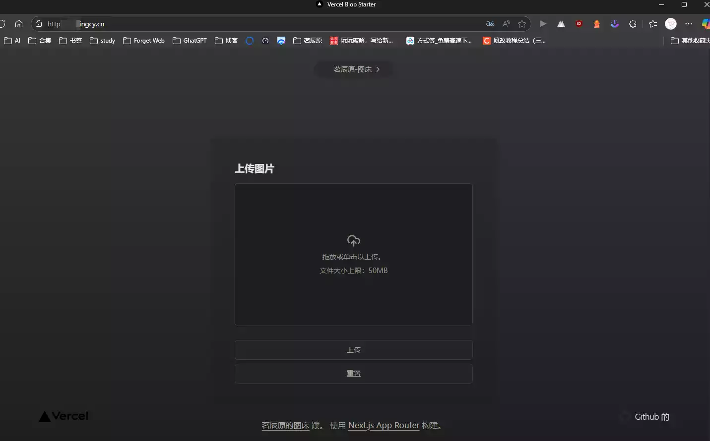
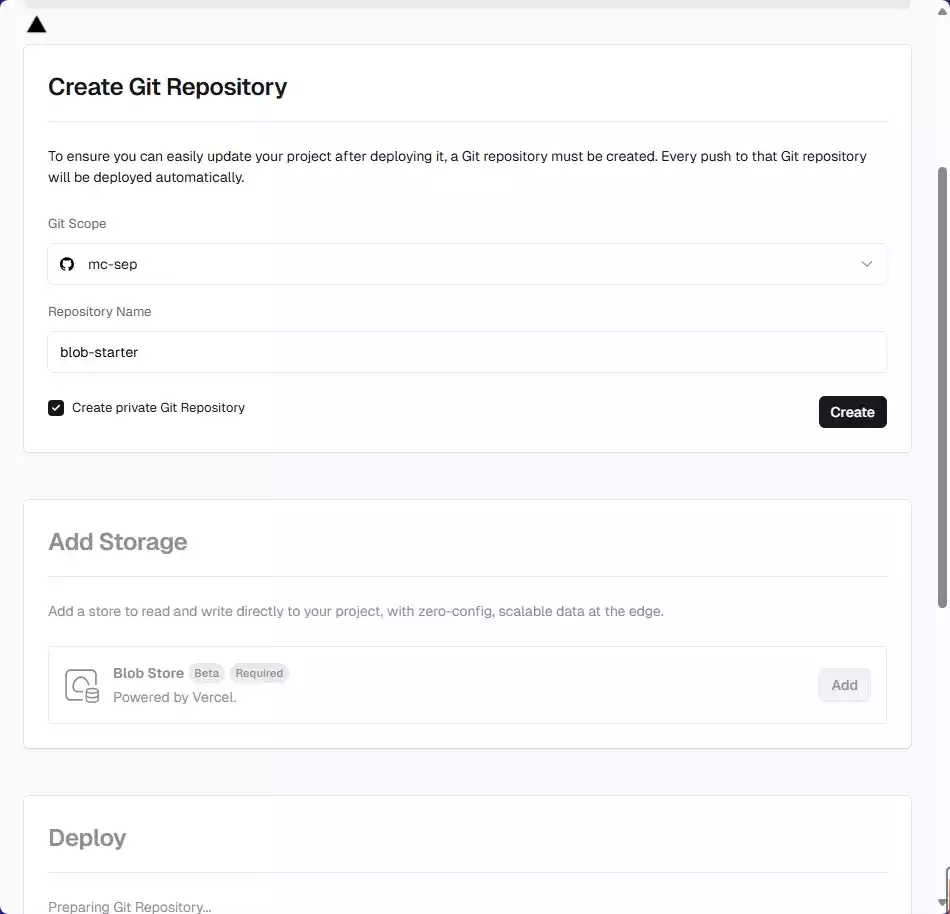
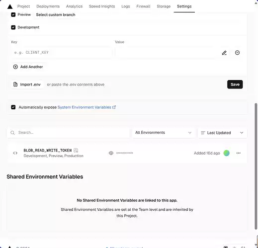
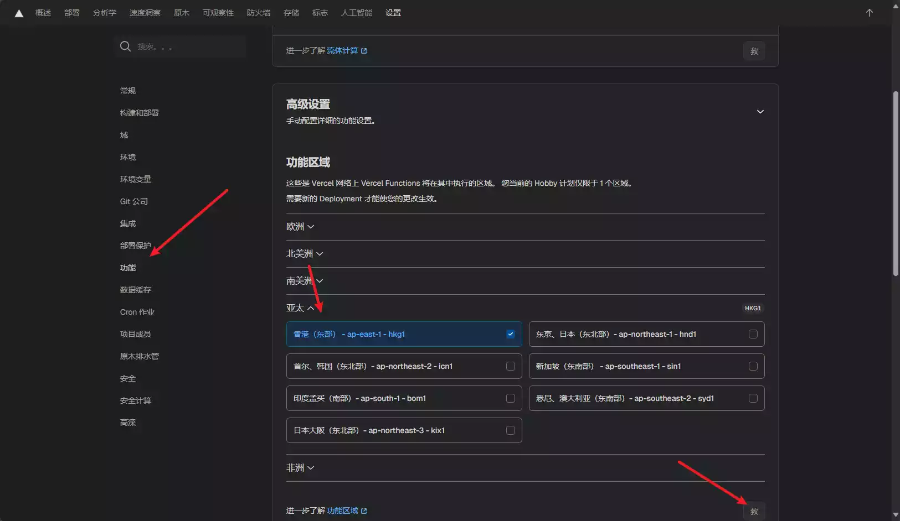
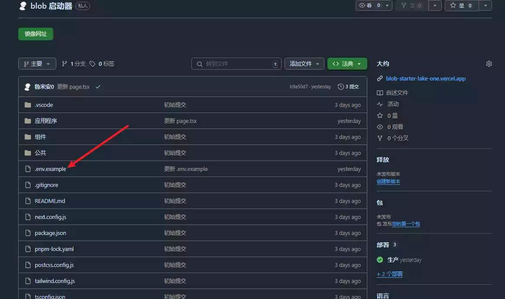
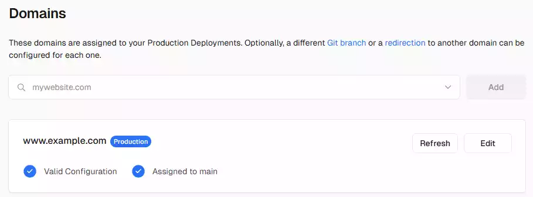
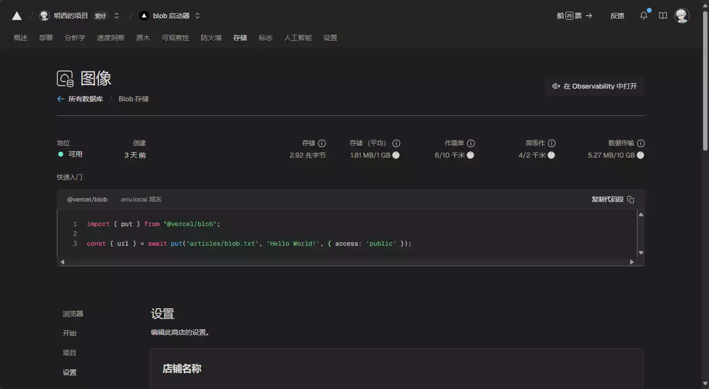
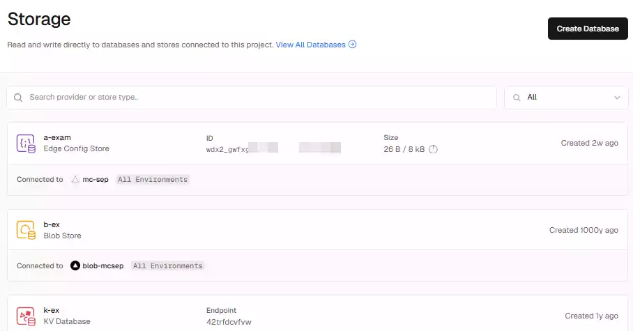

# 茗起

确实没更新了,半个月多了都,因为最近要期末考,涉及分班和数学学考,压力很大!

有没有跟我一样的,喜欢把图片放在图床,但是又担心他会泄露!担心跑路,担心访问速度,担心过期等等什么..

总的来说,就是不安全,那我能不能自我搭建一个呢,并且不要服务器!

答案是显而易见的,今天为你带来Vercel搭建超快轻量的BLOB

# 茗述

## 简单介绍一下这个项目

| 项目  | 数据库大小 | 读     | 写     | 请求数 | 请求时长 | 是否需要 Projects                                |
| :---- | :--------- | :----- | :----- | :----- | :------- | :----------------------------------------------- |
| Hobby | 250MB/月   | 1亿/月 | 1亿/月 | 1亿/月 | 1小时/月 |  |

> 是不是很简单,哈哈哈😂😂
>
> 看一下我的成品:
>
> ** 因为只有10GB,故不开放我的图床了,大家自己搭建咯**

## 做法

1. 准备一个 Vercel 账号，可以直接使用 Github 登录

2. 创建存储库（点击快速创建）：[Create](https://vercel.com/new/clone?demo-description=SimpleNext.js%20template%20that%20uses%20Vercel%20Blob%20for%20image%20uploads&demo-image=%2F%2Fimages.ctfassets.net%2Fe5382hct74si%2FW7szxXAHpF3eZ4RFT33Cb%2F4d8a64904b67980e449b487089dd7b2b%2Fopengraph-image.webp&demo-title=Vercel%20Blob%20Next.js%20Starter&demo-url=https%3A%2F%2Fblob-starter.vercel.app%2F&project-name=blob-starter&repository-name=blob-starter&repository-url=https%3A%2F%2Fgithub.com%2Fvercel%2Fexamples%2Ftree%2Fmain%2Fstorage%2Fblob-starter&stores=%5B%7B%22type%22%3A%22blob%22%7D%5D&teamSlug=mc-sep-vercel-team)

3. 在接下来的页面中，名称自己填写，然后添加一个 Blob Store，确定即可

   

```
注意：每个用户只允许创建一个 Vercel Blob Storage！
```

4. 直到出现庆祝动画，点击 **Continue to Dashboard**。
5. 点击 **Settings → Environment Variables**，在最下方找到名为 `BLOB_READ_WRITE_TOKEN` 的环境变量，点击复制，格式如下：

```plaintext
vercel_blob_rw_*************************************
```



6. 返回 **Settings → Functions**，将区域更改为 Hong Kong (East) – hkg1 或 Tokyo, Japan (Northeast) – hnd1

   > 主要就是为了加速,还会香港快一点,日本,朝鲜的也能选.

7. 打开你的Github

8. 打开文件 **.env.example**，将复制的内容粘贴到末尾，格式如下：

```plaintext
BLOB_READ_WRITE_TOKEN=vercel_blob_rw_*******************************
```

9. 打开 **[Main Blob Storage] / app / page.tsx**，修改里面的内容为中文（建议保留原站链接），可参考我的配置

   ```tsx
   import Image from 'next/image'
   import Link from 'next/link'
   import ExpandingArrow from '@/components/expanding-arrow'
   import Uploader from '@/components/uploader'
   import { Toaster } from '@/components/toaster'

   export default function Home() {
     return (
       <main className="relative flex min-h-screen flex-col items-center justify-center">
         <Toaster />
         <Link
           href="https://vercel.com/templates/next.js/blob-starter"
           className="group mt-20 sm:mt-0 rounded-full flex space-x-1 bg-white/30 shadow-sm ring-1 ring-gray-900/5 text-gray-600 text-sm font-medium px-10 py-2 hover:shadow-lg active:shadow-sm transition-all"
         >
           <p>可自改内容这是一个横幅</p>
           <ExpandingArrow />
         </Link>
         <h1 className="pt-4 pb-8 bg-gradient-to-br from-black via-[#171717] to-[#575757] bg-clip-text text-center text-4xl font-medium tracking-tight text-transparent md:text-7xl">
           可自改这是大标题
         </h1>
         <div className="bg-white/30 p-12 shadow-xl ring-1 ring-gray-900/5 rounded-lg backdrop-blur-lg max-w-xl mx-auto w-full">
           <Uploader />
         </div>
         <p className="font-light text-gray-600 w-full max-w-lg text-center mt-6">
           <Link
             href="https://vercel.com/blob"
             className="font-medium underline underline-offset-4 hover:text-black transition-colors"
           >
             可自改这是标题
           </Link>{' '}
           Web. Built with{' '}
           <Link
             href="https://nextjs.org/docs"
             className="font-medium underline underline-offset-4 hover:text-black transition-colors"
           >
             Next.js App Router
           </Link>
           .
         </p>
         <div className="sm:absolute sm:bottom-0 w-full px-20 py-10 flex justify-between">
           <Link href="https://vercel.com">
             <Image src="/vercel.svg" alt="Vercel Logo" width={100} height={24} priority />
           </Link>
           <Link
             href="https://github.com/vercel/examples/tree/main/storage/blob-starter"
             className="flex items-center space-x-2"
           >
             <Image src="/github.svg" alt="GitHub Logo" width={24} height={24} priority />
             <p className="font-light">Github</p>
           </Link>
         </div>
       </main>
     )
   }
   ```

10. 保存后，系统会重新部署一次，返回 Settings → Domains，添加你的域名（确保你的域名托管商已添加记录为 A: 76.76.21.98 的记录，添加即可）。

11. 完成！

    ```
    提示：可以在 Storage 页面查看存储库状态，例如大小、读写次数统计等。
    ```





# 茗尾

分享到这里就结束了,另附上我的壁纸!


