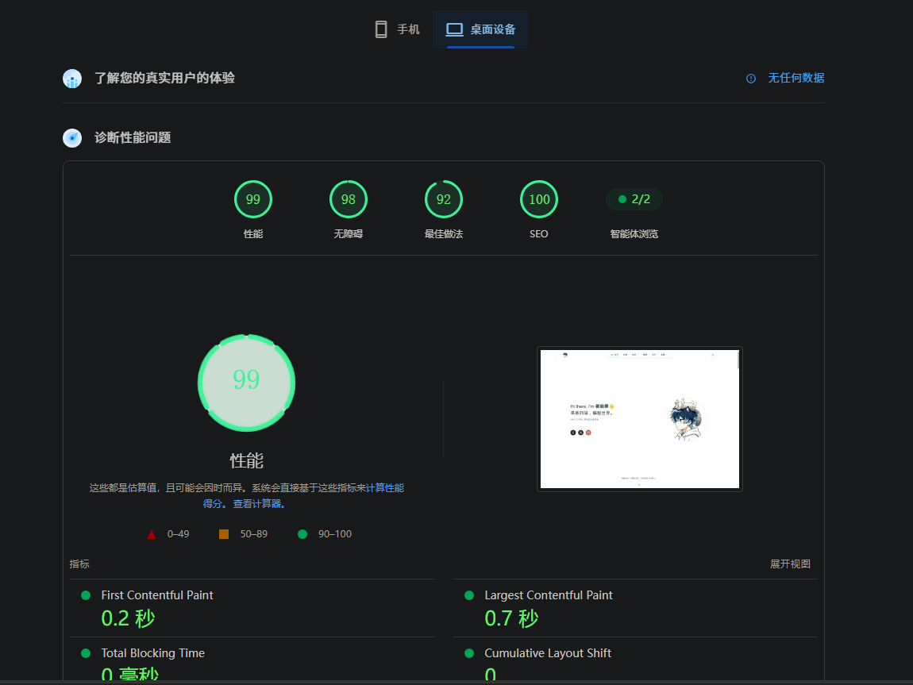
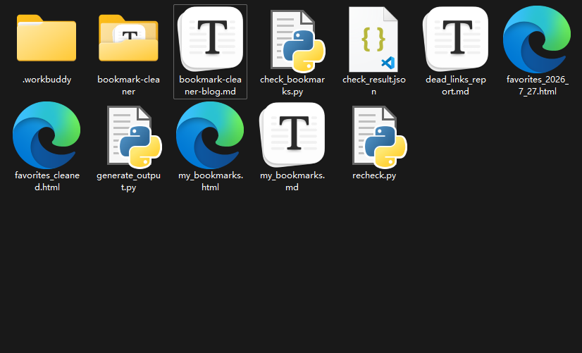

# 茗叙

今天也是把我的文章页面改成了透明玻璃的样式,白天和黑夜都很好看,还有放大的特效,这个博客也是被我改的很可以的,我现在到时没有很好的法子该改了,就暂且先这样吧,使用的skills: naplesblue/apple-design-skill

# 茗述

不知道你有没有这种感觉：浏览器书签栏用得越久，越像一个被遗忘的储藏室。平时随手一存，攒着攒着就没人管了。

前阵子我把自己攒了好几年的收藏夹导出来一看——好家伙，**880 条**。

于是我用ai做了个工具,帮我检测死链,并且清理死链,并一键导出!

顺手跑了下死链检测，脸有点绿：**49 条已经打不开了**。有倒闭的资源站、有 404 的旧博客、有几个失效的小工具。

书签这东西，攒的时候爽，整理的时候要命。所以我把整套整理流程直接做成了个工具，今天开源分享出来：

> 👉 **一键整理收藏夹**：https://bc.mingcy.cn
>
> 

## 它能干啥

一句话：把你浏览器导出的书签文件拖进去，剩下的交给它。

- 📂 **全浏览器兼容**——Chrome / Edge / Firefox / Safari / 360 / QQ 导出的 Netscape 格式通吃，不用管你平时用啥。

- 🔍 **死链检测**——并发探测每个链接，把打不开的挑出来。我那 880 条就是这么筛出 49 条"坟头"的（第一轮高并发有误判，复检时又救回了 141 个，所以别轻易信一次结果）。

- ♻️ **智能去重**——同一个网址收藏了三遍？一键合并。

- ✏️ **在线编辑**——描述列直接点一下就能改，不用去 HTML 里抠标签。

- 📤 **五种导出**：书签 HTML（能直接导回浏览器替换旧的）/ Markdown 表格 / CSV / JSON / 还有个带搜索的独立展示页，能直接发给别人看。

最关键的其实不是功能多，而是这条：**纯前端，数据不过服务器**。你拖进来的文件只在自己浏览器里跑，关掉页面啥都不剩。整理收藏夹这种事儿，里面啥都有，隐私这件事不能含糊。技术上是怎么做的

没用框架，没搞构建，一个 `index.html` 走天下。

选纯静态不是偷懒，是刻意的。收藏夹工具的本质是"在你自己机器上处理你自己的数据"，一旦要后端、要上传，信任成本就上来了。纯静态 + 浏览器本地解析，零依赖、零运维，推到 Vercel 上自动就是一个所有人都能访问的站点。

死链检测这块得说句实话：浏览器有同源策略（CORS），前端读不到跨域响应的具体内容。所以工具走的是 `no-cors` 网络层探测 + favicon 兜底的双保险——**网络层通了就算活，多次探测都没响应才算死**。准确率够用，但个别有严格防火墙的站可能误判，批量删之前建议瞄一眼。

本地也是为我整理了一堆的文件,这个ai倒是有点聪明过头了!

## 你自己也能部署

这工具我已经整理成开源仓库，整个目录零配置：

1. 把 `rumian0/bookmark-cleaner/` frok你自己的 GitHub
2. Vercel 里 **Add New Project** 导入仓库，Framework 选 **Other**，直接 Deploy
3. 完事。Vercel 给你一个 `*.vercel.app`，想绑自己的域名也行

GitHub Pages / Cloudflare Pages / EdgeOne Pages 同样能跑，本质都是静态托管，丢上去就行。

## 一个小题外话

写这篇的时候顺手用 WorkBuddy 的 MCP 把草稿同步到了我的私人笔记里——前阵子刚把笔记系统接上 MCP，文字记录这条链路就通了。工具是死的，把工具接进自己的工作流里才是活的。

👉 工具地址再放一遍：https://bc.mingcy.cn
👉 代码整理完会发出来，想自己改着玩的随意。

---

随机图:

