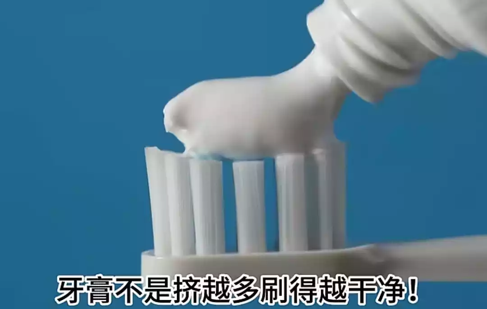
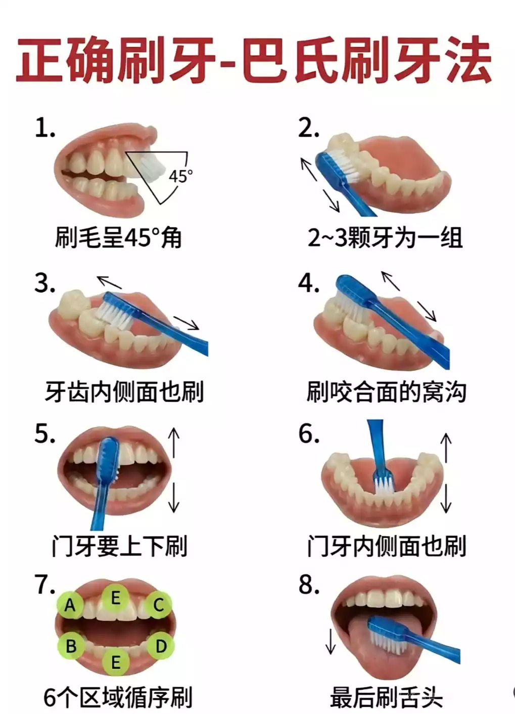
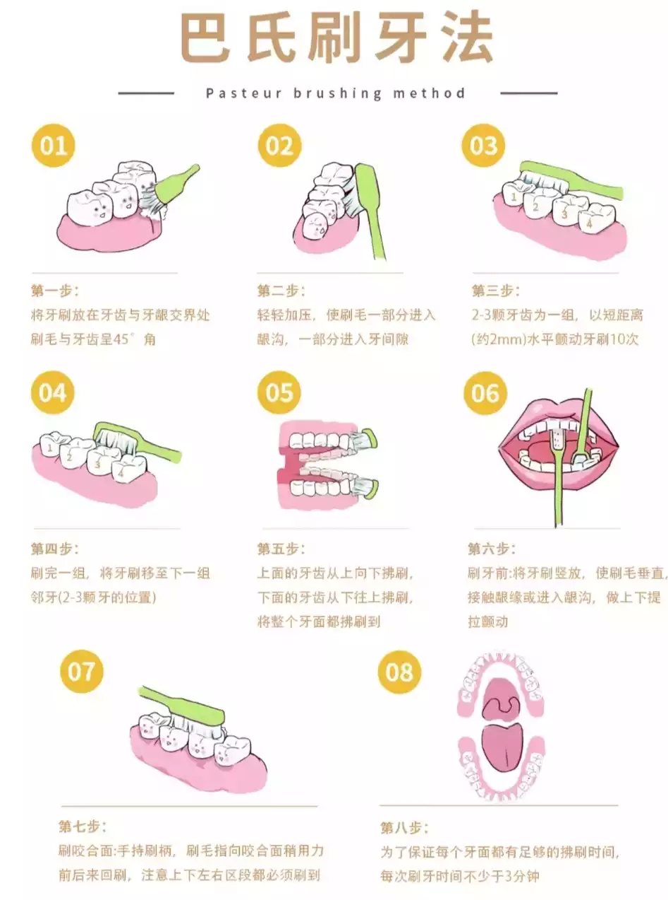

# 碎碎念

朋友们,我终于放假了!也是盼望着放假,终于到了这一天,已经连续补课10天了,每个人都累得很,都想着回家过年,但是每当这种念头产生的时候,老师都说坚持下去,到后面老师都有点坚持不住了,每天老师要连续上4-5节课,这确实很累很累. 就在今天我们的班主任,打算让我们放松一下,让我们唱了两节课的歌,后两节物理课看了一部电影,随后我们就在这种愉快轻松地环境下放学啦! 下次开学就是要决战高考了,时间过得太快了,还来不及记录就快到了终点,也许这就是青春的意义吧!~

# 茗叙

## 前言

> 📌有好多人都问我牙齿怎么这么白?问我是不是做牙齿美白?我说不是,只要每天早晚好好刷牙就行,不需要太久,因为会越刷越白的. 我也是之前看到一个视频,教我们如何刷牙,因此我就学会了刷牙!
>
> 今天我把这个方法教给你们,愿你们也能天天被人羡慕!

📌首先,我要问一个问题,如实回答,你有没有一下情况:

++牙膏挤特别多++{.dot .warning}

++凉水刷牙++{.dot .warning}

++很在意牙刷和牙膏品质++{.dot .warning}

++刷牙时长短++{.dot .warning}

++刷完牙还是黄色++{.dot .warning}

......

那么如今我告诉你如何正确刷牙!

## 🔎牙刷和牙膏

> 有同学说,我刷牙就买自动的,我牙膏就买云南白药...
>
> 可是这确实有效果,但我能用20就能解决,并且坚持很长时间,你告诉我你有钱坏了就买,用完了我要换,我只能说反正花的也不是我的钱,因为根本问题你就没解决!

### 🔎牙膏

其实我家买过很多牙膏,都是PDD上囤积的,我一般拿到什么用 什么,因为++牙膏不是关键++{.wavy},很多人听过**刷牙用的是牙膏的摩擦剂不是泡沫**,很多人知道,但不理解!

所以每次挤牙膏的时候我++一般挤黄豆大小++{.dot},不要担心是不是太少了,不不不!刚好够,并且我刷完牙,牙刷的凹槽里++没有任何污垢与牙膏++{.dot},而且牙刷头还不刺毛乱炸!

💡`小技巧`:我一般++挤完牙膏会放在牙齿后面,用舌头抵住,慢慢往外吐(因为小时候瓜子吃多了,牙齿对不齐),这样既不会牙膏堆积在牙刷里,也能够让你记得使用摩擦剂刷牙!++{.wavy}

### 🔎牙刷

牙刷这东西其实也没有讲究,超市里随随便便的牙刷就行了,没有别的,但++我推荐选择毛多,密一些的++{.wavy}比较好,这样可以充分照顾每个牙齿. 上方图片就是错误的牙刷!

刷牙的时间不少于**5分钟**,充分刷每个牙齿,早晚都可以刷,时间久了我晚上一般就不刷了,因为比较贪吃,还有就是:++刷完牙吃东西,不会弄脏牙齿++{.wavy},只要不是带色素的,都可以吃,泡面中的油脂啊也是可以吃的!

## 如何刷牙---巴氏刷牙法

首先,先看图:

> 以上有两个图片,风格不同,按照自己的喜好下载观看,多多学习,就能掌握,预计3次就会自己刷了!
>
> ++📣注意:++{.wavy .success}:
>
> ### 干货图解步骤（图1）
>
> 1. **第一步**：找准角度，将牙刷毛斜放，与牙齿表面呈45度角。 重点是让刷毛尖端对准“牙龈沟”（就是牙齿和粉色牙肉交界的那条线）。
>
> 2. **第二步**：小幅震颤，不要大力横向拉扯!在原位进行小幅度的水平震颤（颤动幅度不超过半颗牙）。 想象刷毛在牙龈沟里轻轻“按摩”和“抖动”，把脏东西抖出来。每组动作颤动5-10次。
>
> 3. **第三步**：拂刷带走，震颤结束后，顺着牙齿生长的方向（上牙往下刷，下牙往上刷），转动刷头“拂刷”一次，把抖出来的牙菌斑带走。
>
> 4. **第四步**：面面俱到 - 外侧面&内侧面：都要重复上面的45度震颤+拂刷动作。 - 前牙内侧：将牙刷竖起来，用刷头前半部分上下提拉刷动。 - 咬合面：刷毛按在咬合面上，正常来回刷干净沟窝即可。
>
> #### 几个关键Tips: - 每次只刷2-3颗牙，慢慢移动，不要急。 - 一定要选软毛牙刷!硬毛配合这个角度容易伤牙龈。 - 刷牙时间至少保证3分钟，别糊弄哦。 - 学会这个方法，坚持一周，你会发现牙齿真的干净很多，牙龈出血的情况也会慢慢改善! - 大家也可以在评论区分享一下，你是属于“大力横刷派”or巴氏刷牙法“技术 （注：原文

# 结尾

那么到这里就结束了,有什么想知道的可以在底下评论哦!
