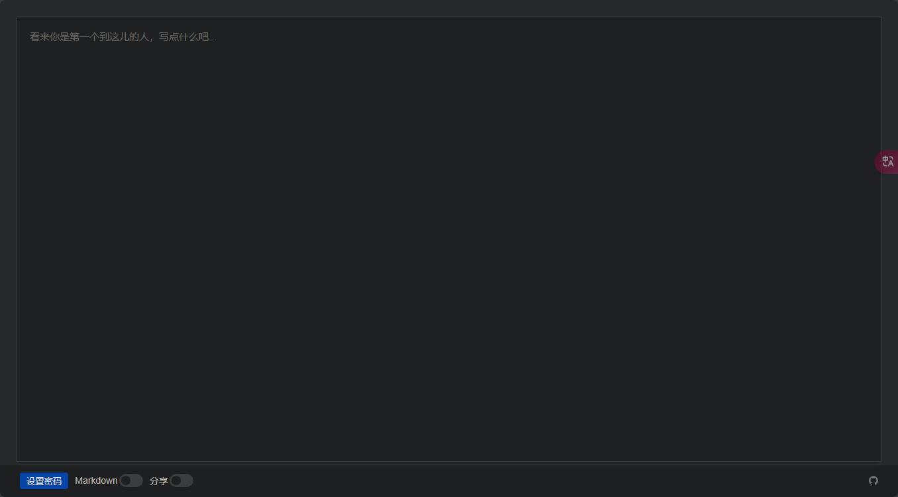
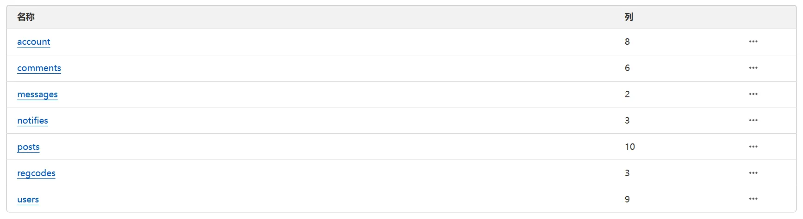
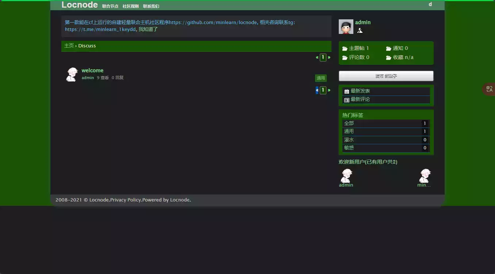
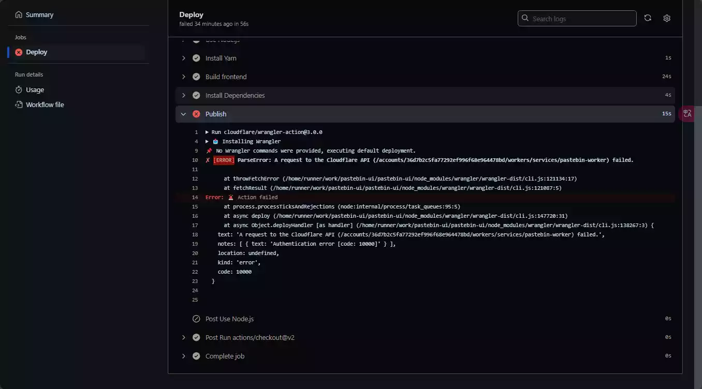
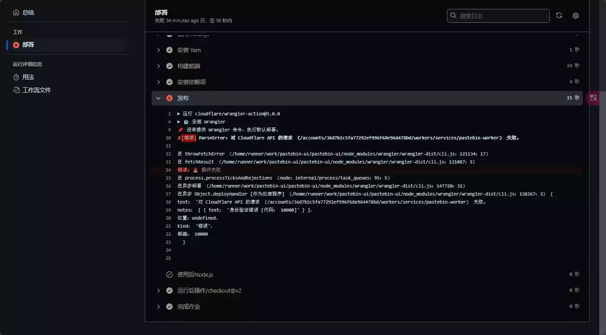

# 开端

我在逛我的朋友圈的时候,发现清羽飞扬的小站发布了他总结的Cloudflare项目,一键部署,看起来真的很不错,就自己动手操作了一下.

[owo](https://blog.liushen.fun)

主要有的项目有: 在线笔记 在线论坛 文件中转站

# 部署

## 在线笔记

这是一个基于 Cloudflare Worker、KV 和 Github Actions 实现，可以一键私有化部署的无成本在线云笔记项目，你可以记录文字，与朋友们分享，或者跨设备同步。下面是项目地址：

[GitHub](https://github.com/s0urcelab/serverless-cloud-notepad)

可以持久化保存笔记，并且支持设置密码，可以用于临时文字传输。

### 部署项目

首先，fork仓库，然后再在变量中设置环境变量，如下三个变量，后面两个随便填写字符串即可。

```yaml
CLOUDFLARE_API_TOKEN # 之前申请到的 Cloudflare API令牌
SCN_SALT # 随便填（安全用途）
SCN_SECRET # 随便填（安全用途）
```

然后在github action中，运行Deploy cloud-notepad，等待运行成功，则项目成功部署，点击进入cloudflare workers界面，查看或另绑定域名，即可正常访问。

**效果如下:**



**链接如下:**

[MingCY](https://n.liyy.us.kg/)

## 在线论坛

项目地址如下:

[Github](https://github.com/minlearn/)

这是想打造一个校园论坛了,只不过,这个配置还需探索,自定义的很少,不知道如何添加分类,和背景主题等

### 部署项目

1. fork仓库到你的账户下

2. 添加环境变量：

- CLOUDFLARE_ACCOUNT_ID
- CLOUDFLARE_API_TOKEN
- CLOUDFLARE_PROJECT_NAME
  前两个不用说，第三个为项目名称，比如我填写的是：locnode，不要带符号。

3. 在你fork到的仓库里面运行action进行部署。

简单使用
项目支持多用户，会自动创建D1数据库存储信息，你可以通过修改数据库来指定管理员等身份：



展示:



## 文件中转站

## 项目部署

项目地址:

[Github](https://github.com/rumian0/pastebin-ui)

其实部署起来非常简单，因为项目是分为前后端的，所以我们需要分别配置前后端：

添加环境变量**CF_API_TOKEN**

修改**wrangler.toml**文件中的内容，主要修改两个KV的ID和账户ID，请提前在cloudflare中创建好对应KV：

```toml
name= "pastebin-worker"
compatibility_date = "2024-08-31"
account_id= "36d7b2c5fa77292ef996f68e964478bd"
main = "src/index.ts"
workers_dev = false

vars = { ENVIRONMENT = "production" }
route = { pattern = "paste.liyy.us.kg", custom_domain = true }

kv_namespaces = [
  { binding = "PB", id = "86bca3e920024adb9e70cd7c5da6ceed" },
  { binding = "PBIMGS", id ="e3f5af1a0c584fcd841081d41a0c014d" }
]

[site]
bucket = "./static/dist"
```

修改**/static/.env**文件，修改为你准备部署的地址，比如本站：

```yaml
VITE_API_URL= https://paste.liyy.us.kg
```

点击**github action**并进行部署，最终，项目即可成功部署。

### 报错

目前部署失败,不知道哪一步出错,看下有没有大佬可以指点一下




