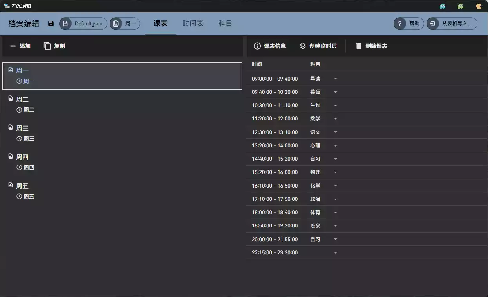
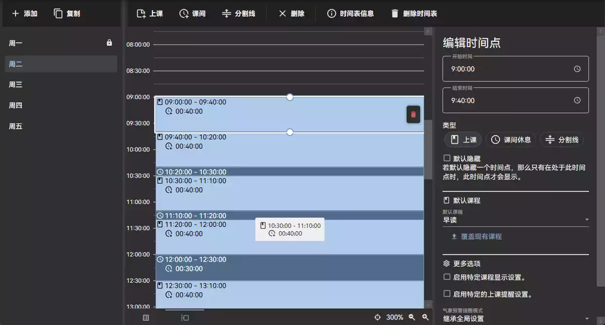
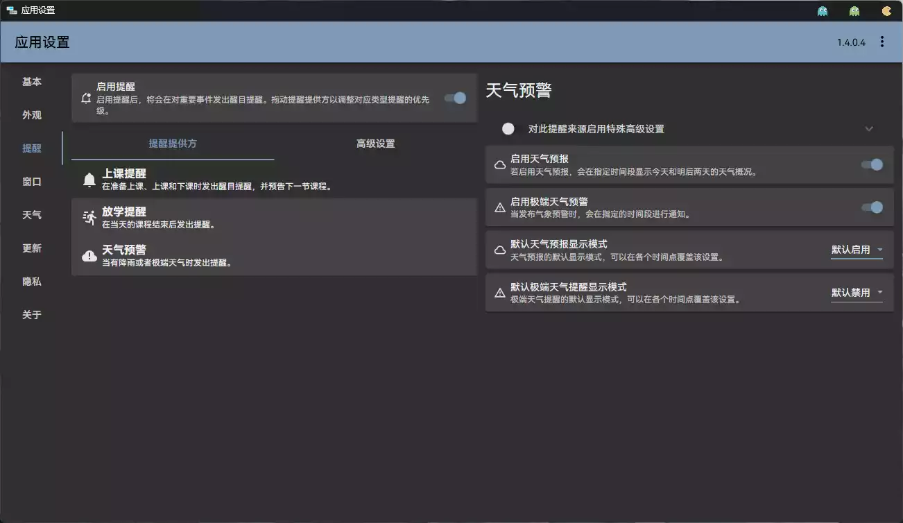
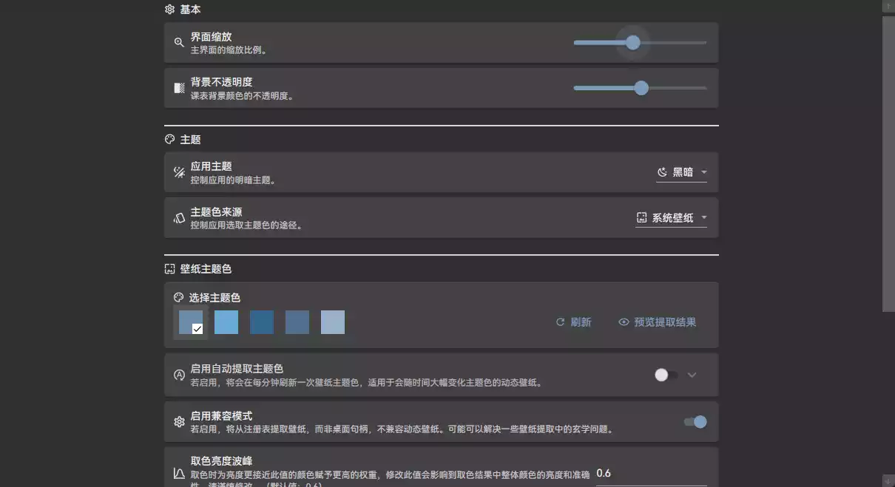
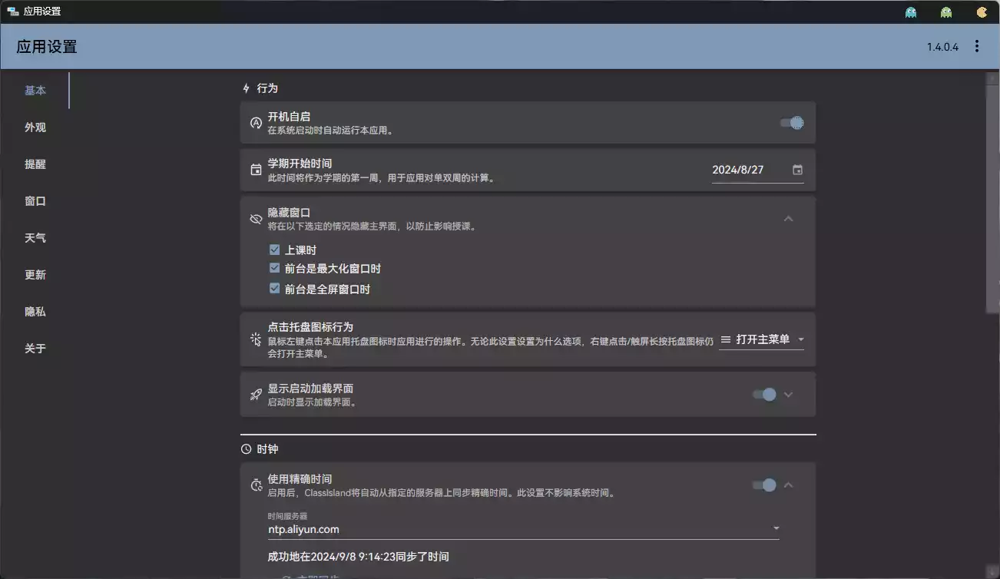

# 碎碎念

最近总是在想,有没有一款软件,可以提醒**是否下课**,让后**下节课是什么**!

我看见每天**学习委员**都经常要**写课表**在黑板上,而且有时候**还会忘记**,哎!

每次只能**写右边的黑板,**可能导致**左边**靠窗户的同学看不到黑板

所以,今天的我带来了这款软件!------`Classlsand`

# Classlsand 简介

ClassIsland 是一款适用于班级多媒体屏幕的课表信息显示工具，可以在 Windows 屏幕上显示各种信息。
本应用的名字灵感源于 iOS 灵动岛（Dynamic Island）功能。

[GitHub](https://github.com/ClassIsland/ClassIsland?tab=readme-ov-file)

## 功能

### 课表显示

- 显示当天的课表、当前进行课程的信息
- 在上下课等重要时间点发出[提醒](https://docs.classisland.tech/zh-cn/latest/app/notifications/)，自选搭配音效、强调特效和语音[增强提醒](https://docs.classisland.tech/zh-cn/latest/app/notifications/#强调提醒)
- 自选课表隐藏条件、临时隐藏与鼠标穿透，不影响授课

### 课表编辑与管理

- 简洁直观的[课表编辑工具](https://docs.classisland.tech/zh-cn/latest/app/classplan/)
- 从 Excel 或其他软件[导入课表](https://docs.classisland.tech/zh-cn/latest/app/profile-settings-page/#从表格导入)
- 多周轮换、快速录入时间表、自定义设置
- 临时换课、临时启用某个课表

### 其它功能

- 自动同步软件时间、手动对齐铃声
- [天气](https://docs.classisland.tech/zh-cn/latest/app/advanced/#天气)、极端天气预警
- 通过[组件](https://docs.classisland.tech/zh-cn/latest/app/basic/#组件)（日期、时间、天气简报、倒计日等）和[插件](https://docs.classisland.tech/zh-cn/latest/app/basic/#组件)高度自定义 ClassIsland
- 丝滑、流畅的过渡动画
- 自动获取与系统配色搭配的主题色
- 自动软件更新
- [集控管理](https://docs.classisland.tech/zh-cn/latest/management/)_（即将发布）_
- ……

## 效果展示

# 下载

可以访问官网Github: [点击直达](https://github.com/ClassIsland/ClassIsland?tab=readme-ov-file)

[oWo](https://www.123pan.com/s/pUVeVv-ZZ6KA)

上方为官方版本,无内置课表

此为我校,我班专属的课表,我都安排好了!

[oWo](https://cloud.06dn.com/s/2nV8HX)
