# 碎碎念

也是明天就开学了,其实感觉开学也挺好的,忙起来就没这么多烦心事了,最近情感上也是受挫了,双方都有错吧,以前听情歌我是没有任何反应的,直到这一次,不争气的眼泪就落下来了.有他的时候也是为自己生活,只是又回到自己生活而已,总觉得差点什么,但我不好说了,破碎的镜子,碎掉了就是碎掉了,想要修复还是会有裂纹的...

# 茗述

**之前分享一个Cloudflare网盘项目，不太稳定,已经删库了**

**EdgeStash** 是一个功能强大、易于部署的私有云盘解决方案，完全构建在 Cloudflare 的全球网络之上。它利用 **Cloudflare Workers**、**R2 存储** 和 **KV 存储**，为您提供一个安全、快速且低成本的个人或团队文件存储与分享平台。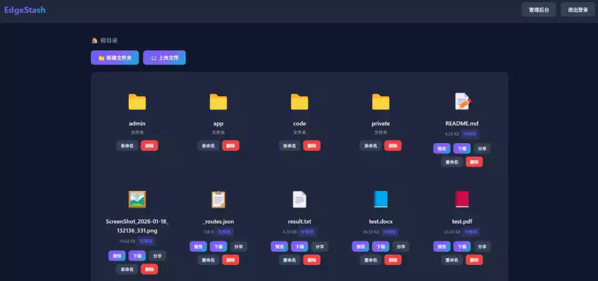EdgeStash**支持带密码分享文件、在线预览docx或pdf文档、后台管理授权用户、查看分享文件浏览/下载量！**

项目地址：https://github.com/hhy-2021/EdgeStash

> 注意：R2的免费额度有10G，且需要绑卡，因此这个云盘我只推荐个人或团体内部使用。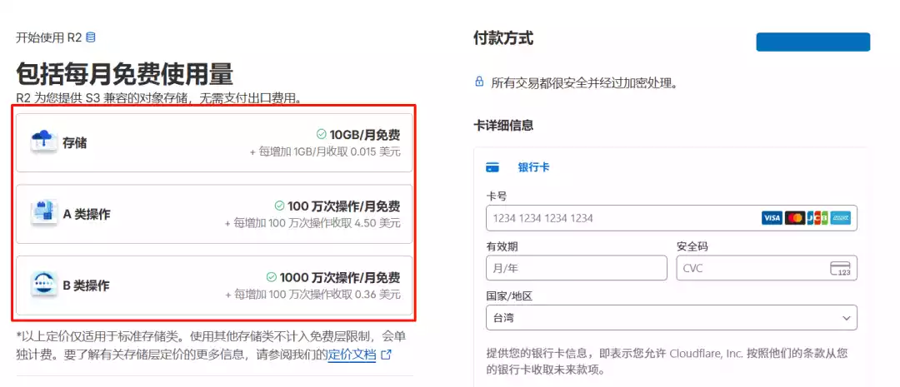

### 部署教程

1. 创建 KV 空间，名字任意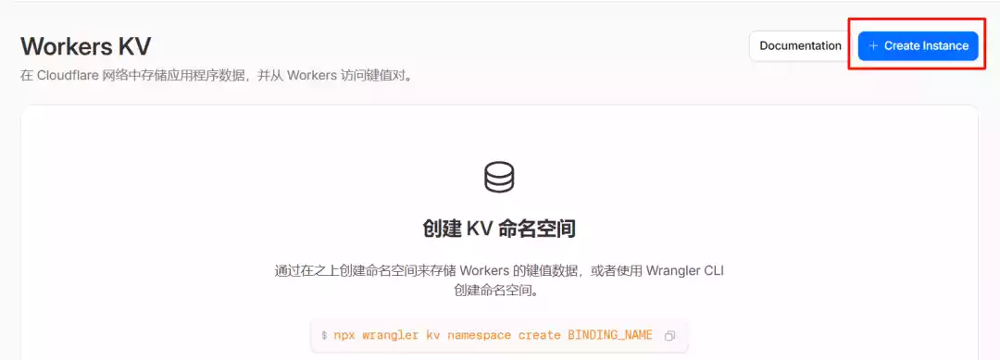

2. 创建 R2 存储，名字任意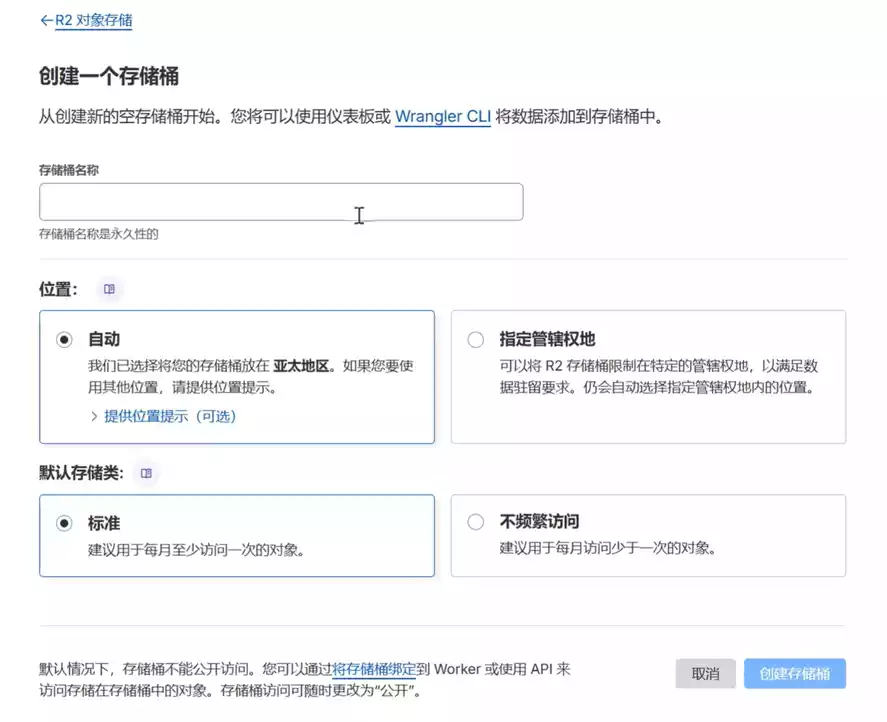

3. 创建 Workers 应用程序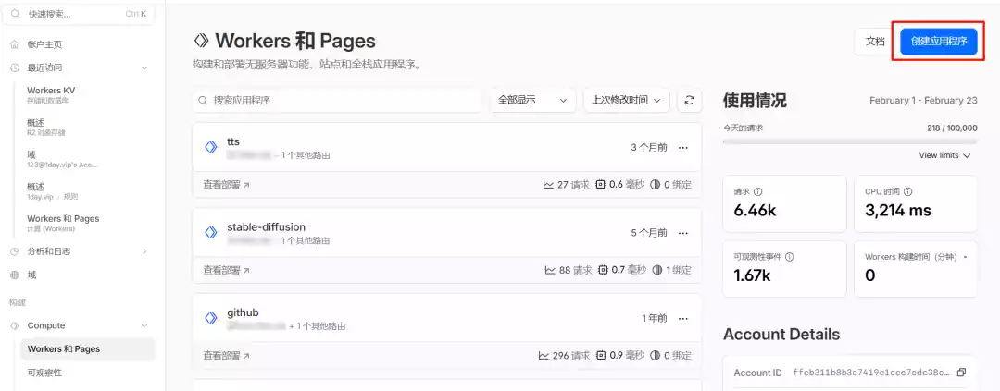

4. 点击从hello world开始，完成创建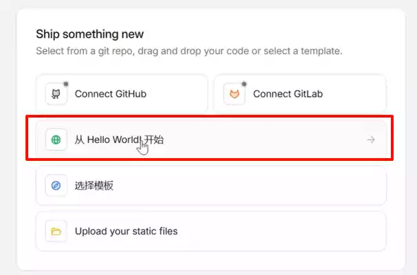

5. 复制GitHub项目中`worker.js`的内容 地址：https://github.com/hhy-2021/EdgeStash/blob/main/worker.js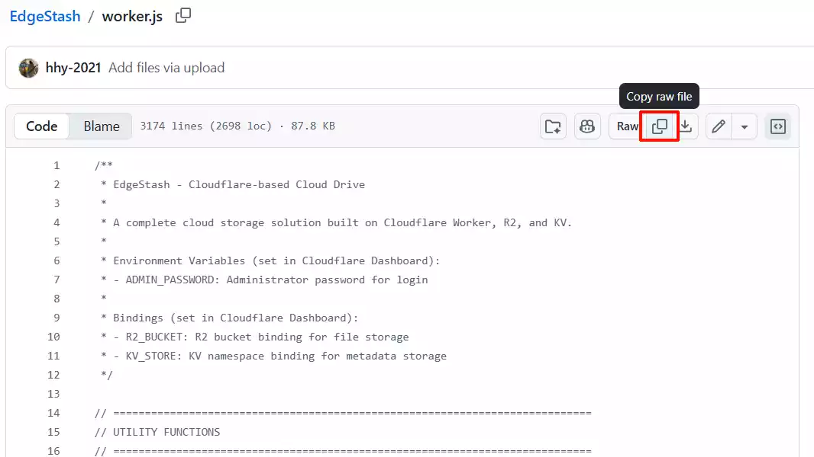

6. 回到workers，点击编辑代码，全部替换，点击部署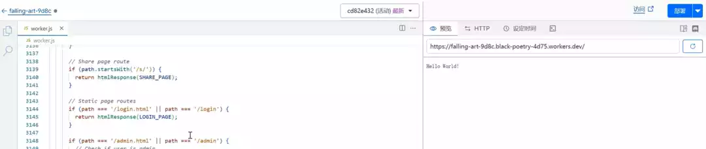

7. 返回 Worker 概览页面，点击 **设置** -> **变量和机密**。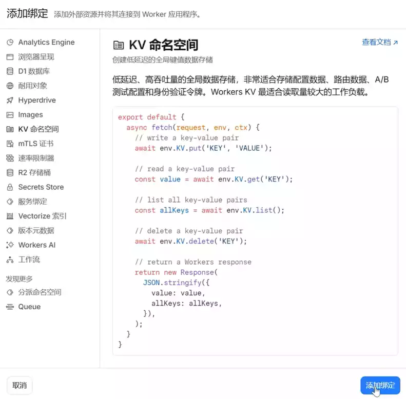

8. - **配置 KV 绑定**：
   - 变量名称：`KV_STORE`
   - KV 命名空间：选择第 1 步创建的命名空间。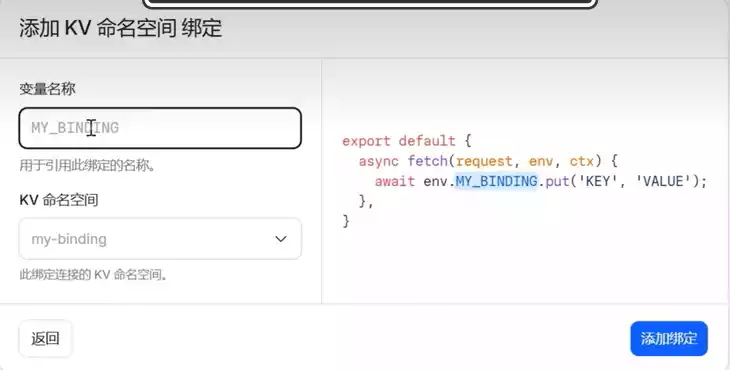
   - **配置 R2 绑定**：
   - 变量名称：`R2_BUCKET`
   - R2 存储桶：选择您在第 2 步创建的存储桶。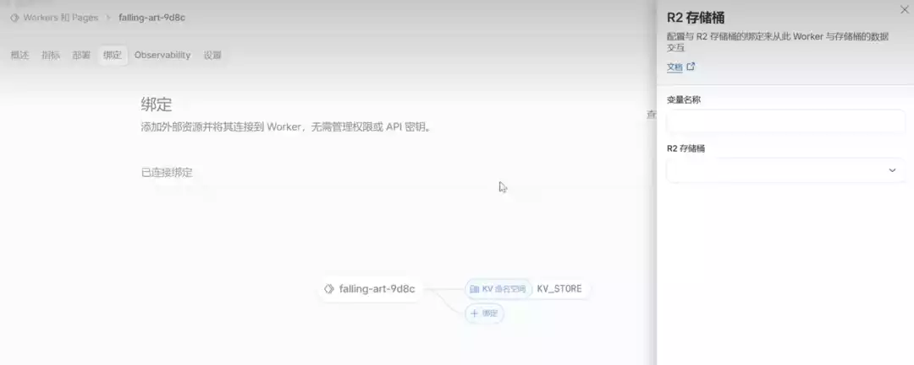
   - **配置环境变量**：
   - `ADMIN_PASSWORD`：设置您的管理员登录密码。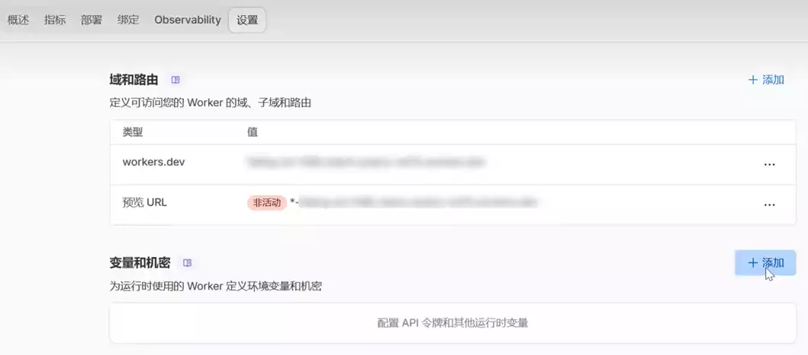

### 访问

1. 此时可以直接访问了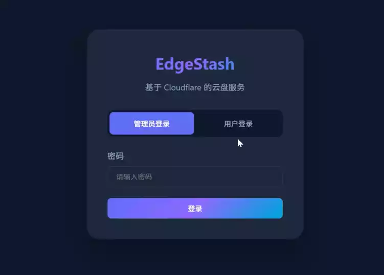

2. 也可绑定自定义域名，更加方便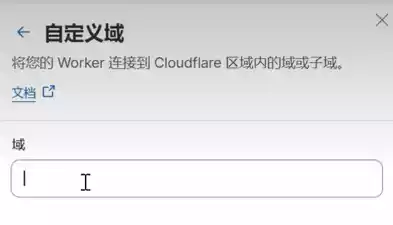

3. 已知的小bug

   > 管理员登录时如果点击`登录`按钮无反应，切换到`用户登录`，把`用户登录`的`邮箱`**输入框内容清空**，然后重新进行管理员登录即可~
