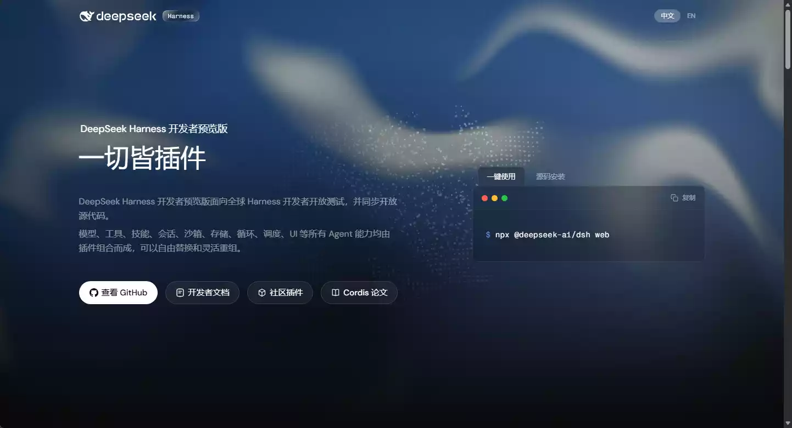
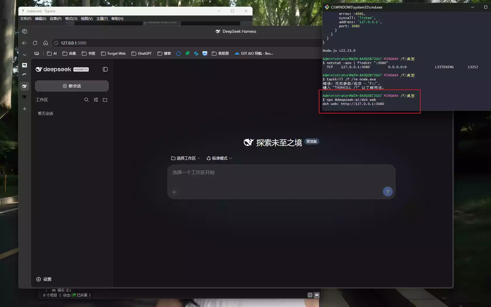
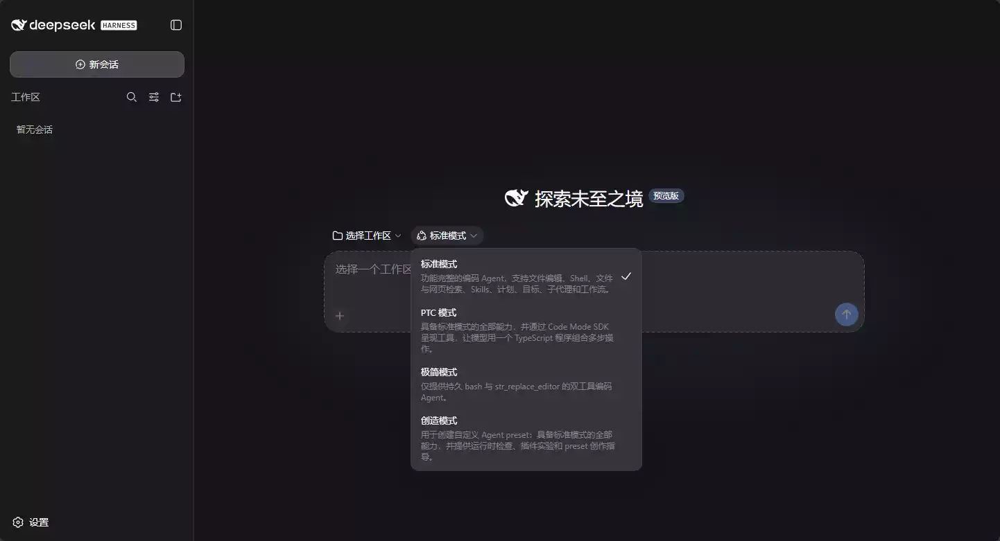
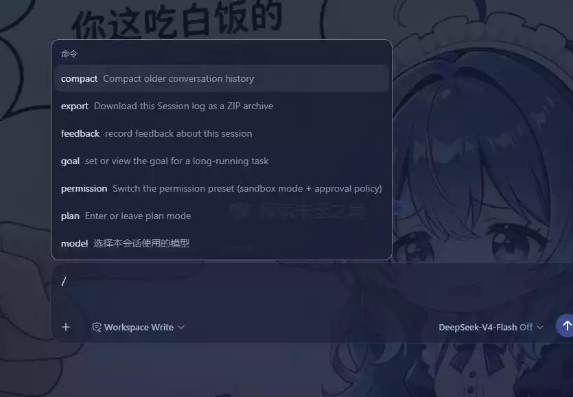
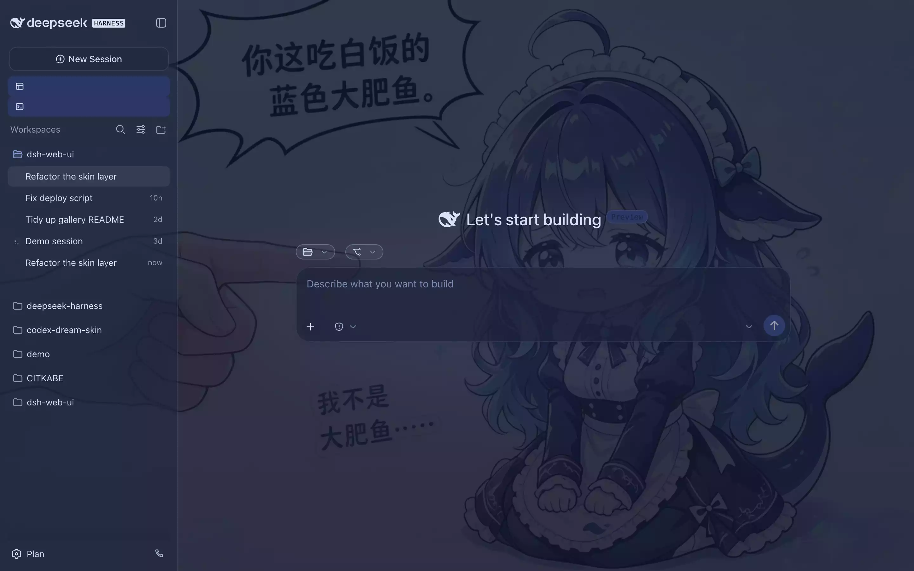
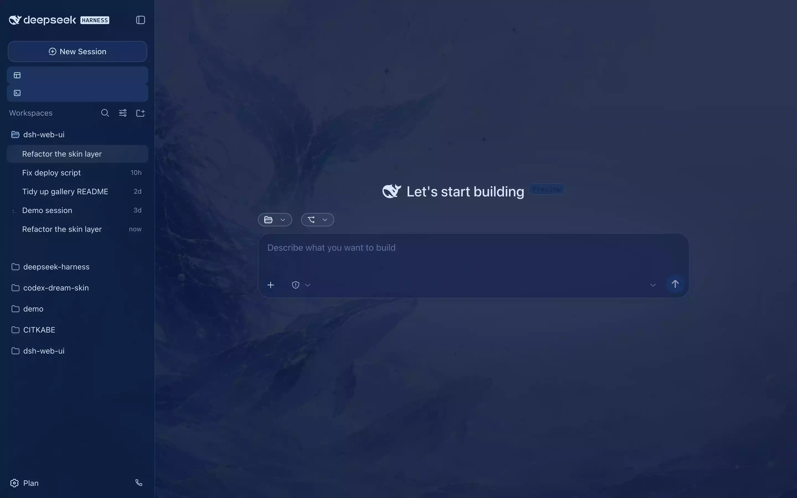
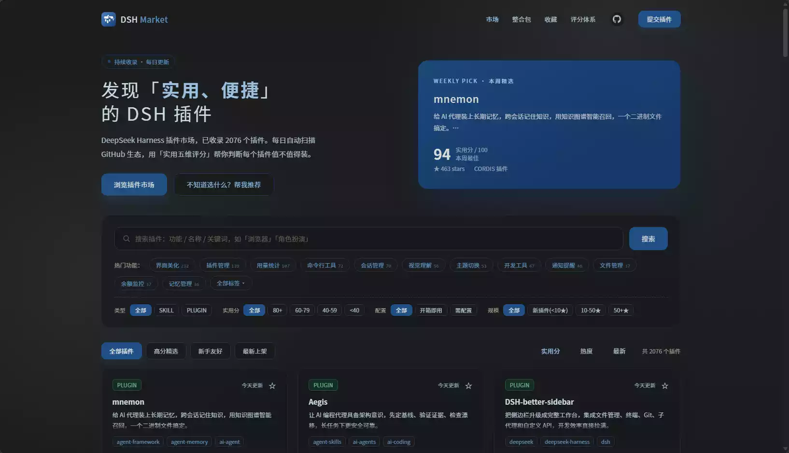
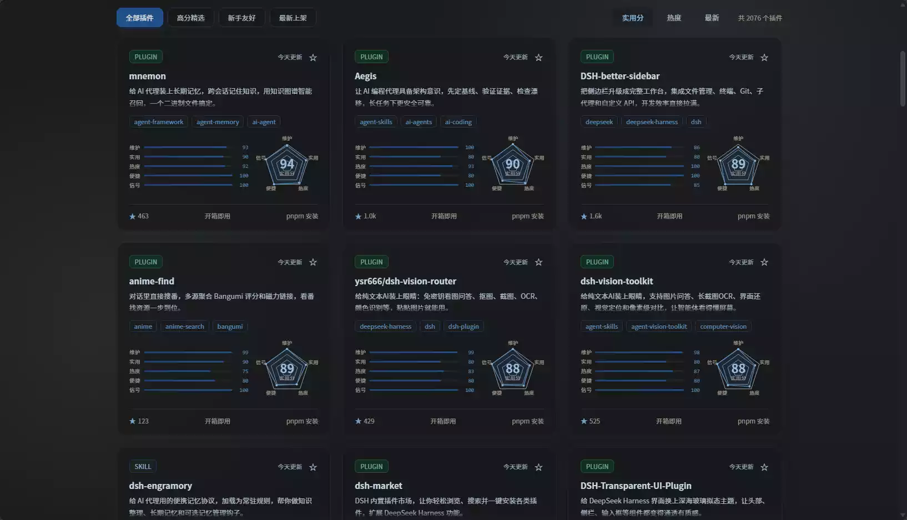

# 茗述

不知道大家有没有跟我一样，最近被各种 AI 编程工具刷屏，Claude Code、WorkBuddy、TRAE 轮番上阵……但是！我八天前才写了一篇WorkBuddy制作工作台的教程,现在又出现了DSH那么它有什么不同?

前两天，DeepSeek 把自家的 Agent 框架 **DeepSeek Harness（简称 DSH）** 直接面向全球开发者开放测试了，还同步把源码甩了出来。我第一时间去撸了一把，确实有点东西，于是打算自己写一篇，给那些也想上手折腾的朋友 😌



## 先科普：这玩意儿到底是啥

简单说，**DeepSeek Harness 是 DeepSeek 出的一个 AI Agent 编排框架**。

它最骚的一点是那句口号——**一切皆插件**。模型、工具、技能、会话、沙箱、存储、循环、调度、UI，所有的 Agent 能力全都是「插件」，可以自由替换、灵活重组。

打个比方：很多 AI 编程工具给你的是一个写死的助手，能吃啥不能吃啥早就定好了；而 DSH 给你的是一套乐高积木，模型这块拼不爽就换一块，UI 看腻了就换一套皮肤，工具链不够用你自己再插一个进去。这种「配置即组合」的思路，对咱们爱折腾的人来说真的挺对胃口的。

> 💡 目前官方把开发者预览版开放了全球测试，GitHub 上 star 数已经冲到 7w+（这个数据来自参考文章，等会发布前你最好再核一眼，别让我给你传错数 😂）。

## 科普：它能干啥

站在普通用户角度，DSH 主要干两件事：

🔎 **当 AI 编程助手用**：选「标准模式」后，Agent 能帮你操作文件、跑命令、做完整的开发任务，本质就是个能动手的 AI 搭子。

🔎 **当纯问答工具用**：选「极简模式」，只做对话问答，不碰你电脑里的文件。

🔎 **为了完成一个确定的任务**：选「PTC模式」已经确定要做的工作,不达成这个任务善不罢休。

🔎 **真正好玩的在「可拼装」**：因为它一切皆插件，你完全可以把默认模型换成别的、把 Web UI 换成社区皮肤、把工具链自己扩展。它是以 **Web UI** 的形态跑的，浏览器打开就能用，不用装一堆客户端。

说白了，它既是「开箱即用的 AI 助手」，也是「给极客自由拼装的 Agent 平台」——这两层都能吃。

## 安装教程

先放官方入口：<https://www.deepseek.com/harness/>

### 方式一：一键使用（推荐，白嫖党狂喜）

我用的就是这套。命令极其简单：

```bash
npx @deepseek-ai/dsh web
```

原理是它会自动从网络下载最新版的 DSH 程帮我序包，直接在内存里跑起来。优点很直白：**不用懂代码、不在电脑里留一堆项目文件、关掉终端窗口就完事**，纯体验党的福音。

### 方式二：源码安装（不推荐新手）

```bash
git clone https://github.com/deepseek-ai/deepseek-harness
```

它是把整个项目的源代码下载到硬盘里，适合想读底层代码、改功能、或者给项目贡献代码的开发者。**缺点**是步骤繁琐，下完源码通常还要手动装依赖、编译构建才能跑起来。

> 📌 给普通用户一句忠告：直接用「一键使用」就行。源码安装那套新手很容易卡在依赖和编译上，没必要跟自己过不去。

### 首次运行 & 配置（以 Windows 为例）

1. 在搜索框输入 `cmd` 或 `powershell` 回车，打开命令行窗口，粘贴上面那条一键命令。
2. **首次运行会自动下载依赖包**，启动成功后终端会打印出访问地址。
3. 浏览器打开 `http://127.0.0.1:3080` 即可进入 Web UI。
4. **配置模型**：点右上角「设置（Settings）」→「模型（Models）」，在 DeepSeek 提供方卡片里填你的 API Key 并保存。保存后无需重启，模型路由立即生效。
5. **选择工作区**：点「选择工作区（Choose workspace）」添加你想让 Agent 操作的项目目录。**注意：没选工作区之前，会话输入框是禁用的**，别慌，这不是坏了。
6. **选择运行模式**：新建会话时可以选「极简模式」（只问答）或「标准模式」（Agent 帮你操作文件、跑命令的完整开发任务）。

到这一步就能开干了。





## DSH的常用命令

当你在对话框输入`/`这个符号的时候,恭喜你触发了DSH的命令,如下图:



具体的用法可以参考这个表格:

| 命令          | 作用详解                                                                                                                                                          |
| ------------- | ----------------------------------------------------------------------------------------------------------------------------------------------------------------- |
| `/compact`    | **压缩历史对话**把早期很长的聊天记录做精简总结，减少上下文 token 占用。对话太久、变慢、报错时用，可以释放上下文窗口空间。                                         |
| `/export`     | **导出会话日志**将当前整个会话的全部记录打包下载为 `.zip` 文件，用于备份、复现问题、提交 bug 日志。                                                               |
| `/feedback`   | **提交反馈**上报本次会话的问题，例如 AI 回答出错、代码 bug、不符合预期等，发送反馈日志给开发团队。                                                                |
| `/goal`       | **设定长期任务目标**给 Agent 指定一个顶层长期目标，AI 会记住这个目标，后续多轮操作都会围绕该任务推进，适合大型多步骤工程。                                        |
| `/permission` | **权限模式切换**切换沙箱模式、审批策略。・sandbox：沙箱安全环境・approval policy：设置是否执行高危命令前需要你的手动批准，防止自动运行危险代码。                  |
| `/plan`       | **计划模式开关**进入 / 退出计划模式。开启后 Agent 会**先列出完整执行方案，等待你审批同意后，才动手执行代码 / 修改文件**，非常适合大型项目，避免 AI 直接乱改代码。 |
| `/model`      | **切换会话模型**选择当前对话所使用的大模型，例如切换 deepseek‑chat /deepseek‑coder 等不同模型。                                                                   |

## 扩展软件：dsh-web-ui





默认界面功能够用，但看久了难免审美疲劳，更实际的问题是——想在外面用手机查一下 Agent 执行进度，做不到；想看着 token 消耗做成本控制，也缺直观数据。

最近看到一个开源项目 **dsh-web-ui**，专门给 DSH 的 Web UI 做插件和皮肤扩展。它不是改 DSH 本身，而是在 DSH 的插件体系上叠了一层能力，装完之后整个工作体验会有明显提升。最关键的是：**所有插件既可以独立安装，也可以通过一个聚合包一次装齐，按需取舍，不强制捆绑**。

几个我觉得很香的插件：

> 🔎 **任务看板**：把 DSH 的智能体会话变成可管理的任务卡片，分待规划、待办、进行中、已完成、已失败五列。点卡片上的「执行」，任务直接由 DSH 智能体跑，完成状态自动回写，还能配 **cron 定时执行**——比如每天自动升级 DSH、每周生成周报，到点就跑，不用人盯着。
>
> 🔎 **Git 图谱**：在输入框上方加了分支选择器和可视化图谱，分支泳道和提交历史一清二楚，仓库再大也能顺着时间线快速定位变更。
>
> 🔎 **右侧面板**：聊天区右侧多出文件树、预览和 git 变更三块面板，支持 markdown、代码、diff、PDF、Office 等多格式预览，还能直接做 stage、unstage 操作，不用切到终端，边聊边看变更，效率拉满。
>
> 🔎 **实时令牌统计**：在输入框下方显示 TPS、LLM 耗时、上下文占用、缓存命中率和输入/输出 token 数，**每次生成用了多少资源一目了然**，对控制成本挺有帮助。
>
> 🔎 **鲸鱼娘宠物**：比较有意思，一只常驻界面的鲸鱼娘会跟着智能体状态切换动画（思考、等待、工作、庆祝），还能互动投喂，亲密度从幼鲸一路成长到「深海羁绊」，算是给枯燥的编码加点趣味。
>
> 另外还有移动端远程控制、远程 SSH 连接、图像理解工具等，出门在外用手机看 Agent 进度这件事终于能实现了。

### 怎么装

**前端**通过 DSH 的 `dsh plugin` 命令安装进 web profile，装完重启 `dsh web` 即可生效。推荐装聚合包，一条命令搞定：

```bash
dsh plugin --profile web add @linxin666/dsh-web-ui-all
```

只想用皮肤的话，装 `@linxin666/dsh-skins` 就行；也可以单独安装任意一个插件，按需选择。

> 💡 **后端零配置**：插件直接运行在 DSH 的 Web 进程里，不需要额外部署后端服务，这点我挺喜欢的，省心。

> 📌 项目遵循 **Apache-2.0** 协议开源，对商用比较友好，允许自由使用、修改和分发，只需保留版权声明和许可证副本，个人学习和商业项目都能放心用。

几个有用的地址：

- 项目地址：<https://github.com/zhu1090093659/dsh-web-ui>
- 皮肤预览：<https://gallery.dsh-market.com/>
- DSH 教程：<https://deepseekharness.online/>

## 扩展插件社区

网址: https://dsh.market/





里面包含了超过2000+的插件,如果你是在不会怎么安装,可以将网址复制上去,直接告诉他,帮我安装这个插件即可。既然有这么多的插件还不够你折腾的吗!快去试试吧!

# 结尾

那么到这里就结束了！DSH 这套「一切皆插件」的思路我是真觉得香，尤其是对咱们这种爱折腾的人——手机看进度、token 统计控成本、还能把界面整成 XP / QQ2006 怀旧风，乐趣直接拉满。

我感觉这就是开源的力量啊，以前大厂研发啥咱就用啥，自己的一些小需求还不一定能满足到，现在极客们可以放开玩了。

有想知道的或者已经在用的，可以在底下评论跟我聊聊哦！有什么坑也欢迎一起交流避坑 😌

随机图：
