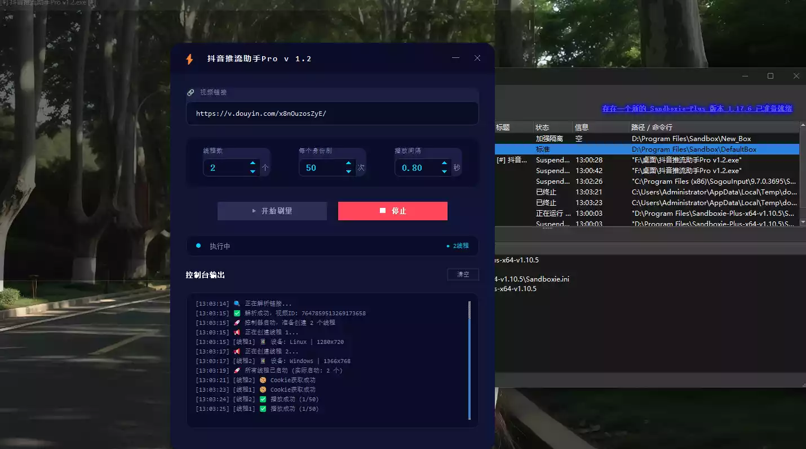
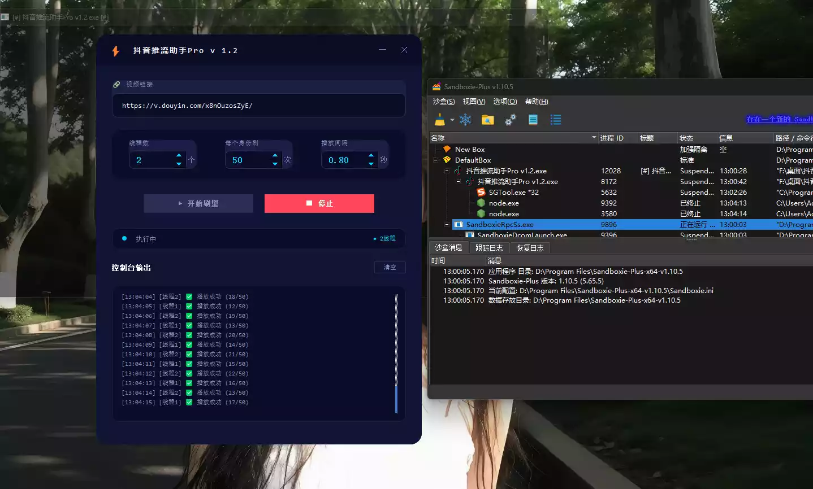
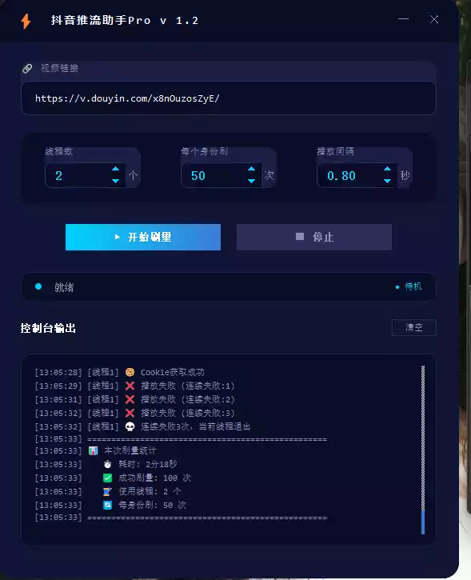
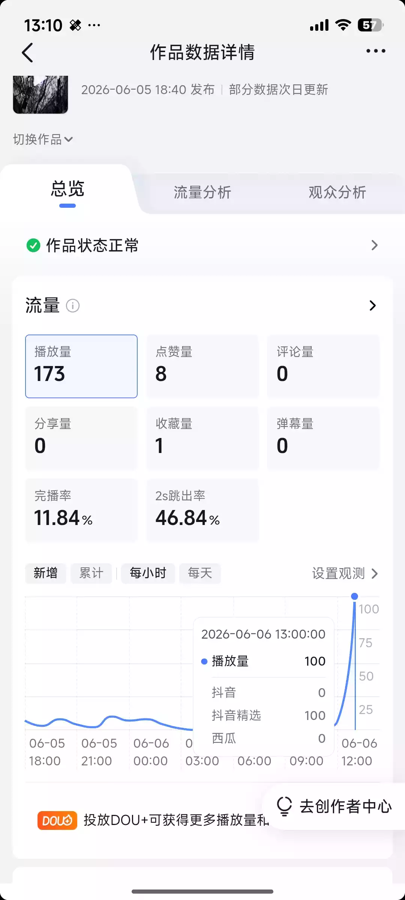
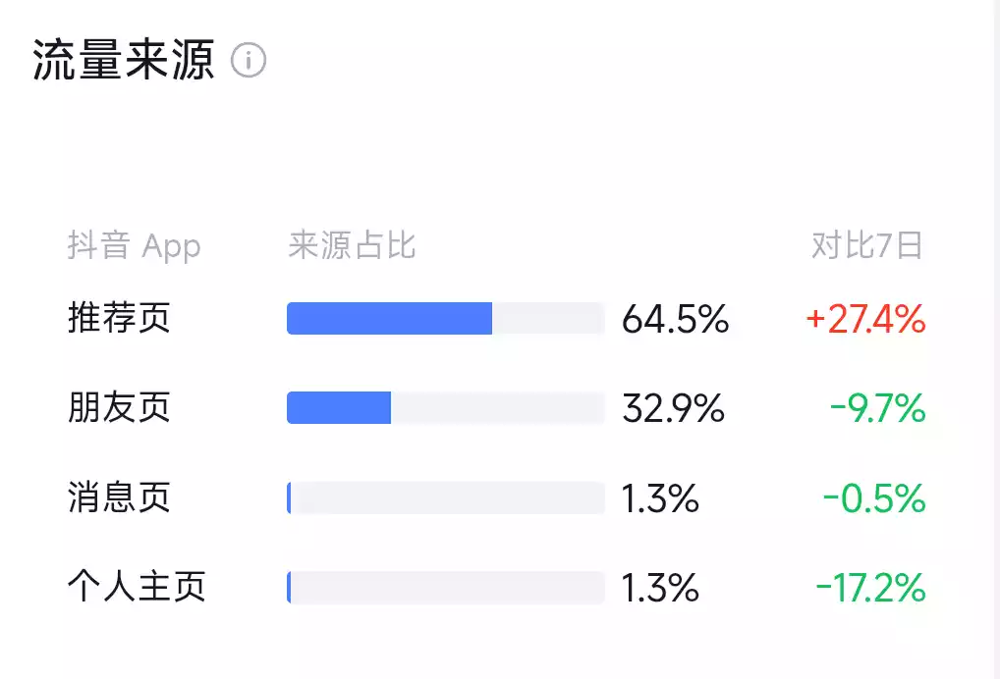
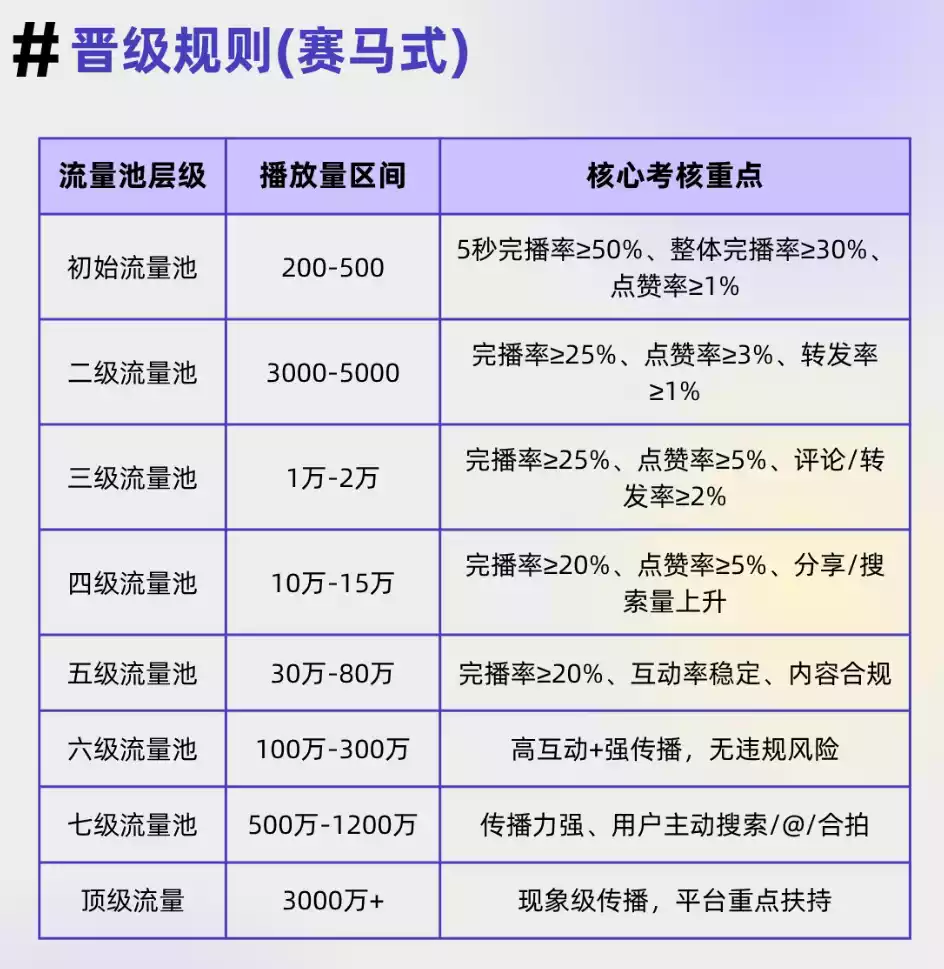

# 茗叙

如今终于考完试了,那么属于我的青春也将结束了,这几天先好好玩玩吧!

# 茗述

## 软件介绍

本软件是我刷公众号发现的,感觉还不错,可以免费刷去流量,原作者为: ++孤狼网络科技{.wavy .succsee}++

详细的配置教程,与逆向的为链接:https://www.ls79.com/js-nixiang/602.html

## 使用感受

### ⚙️ 技术要点

- **弄清链路**：`__ac_nonce` → `__ac_signature` → `ttwid`，三步搞懂抖音临时身份cookie的获取流程
- **插件准备**：Cookie-Editor管cookie，油猴管拦截，两个插件搞定调试环境
- **抓包观察**：Network面板看两次请求，第一次拿`__ac_nonce`，第二次带签名换`ttwid`
- **油猴拦截**：劫持cookie设置，签名被写入时自动断下，精准定位入口
- **堆栈追溯**：沿着调用链找到`_f3`函数，发现签名来自`window.byted_acrawler.sign`
- **扣取代码**：把加密逻辑全部扒下来，加一段导出代码，挂到全局变量
- **补环境**：写个env.js，把window、document、navigator等浏览器环境补上
- **本地跑通**：Node.js环境执行，成功生成47位签名，和浏览器一模一样
- **打包工具**：推出“抖音推流助手Pro_v1.2”，解压即用，一键刷播放量
- **避坑提示**：遇到报错按文章步骤处理，反调试代码直接注释掉

### 感受

> 自我感觉,这个刷去浏览量很不错的,效果也是真实的,这个模拟设备做的蛮不错的,都是高端旗舰机型,之后里面自带的cookie,也是很真是的,我的抖音数据如下:
>
> 

在我看来都是从推荐页面来的,这个还能调节完播率,最多支持3s

## 我的总结

其实,这个刷流量也蛮好的,可以用于前期的冷启动的数据推流阶段,这个倒是蛮不错的,倒是如果是到了后面,这个数据就不是这么重要而,前期就是看你的浏览量和用户的前三秒的完播率,但如果你的账号一般三天就可以达到500-1000,那么这个软件对你而言就是没有效果的,你的权重是比较高的

其次就是这个推流机制也是,现在重点不是推这个作品如何,而是在乎的是这个作者,如果这个值得他去推流,那么他的流量就是很多,得到官方的扶持,不论你的作品质量如何,而且,前期你的作品刚发布,他是会首先++推给同赛道的人群,让他们来帮你辨别,这个作品的质量如何++{.dot .warning},所以如果他们的浏览量和完播率很高,那么说明你的作品也不错

以下是抖音最新的推流机制

## 下载

该软件的获取方式为UC网盘,文件为根目录:

https://drive.uc.cn/s/aae215a8032b4
