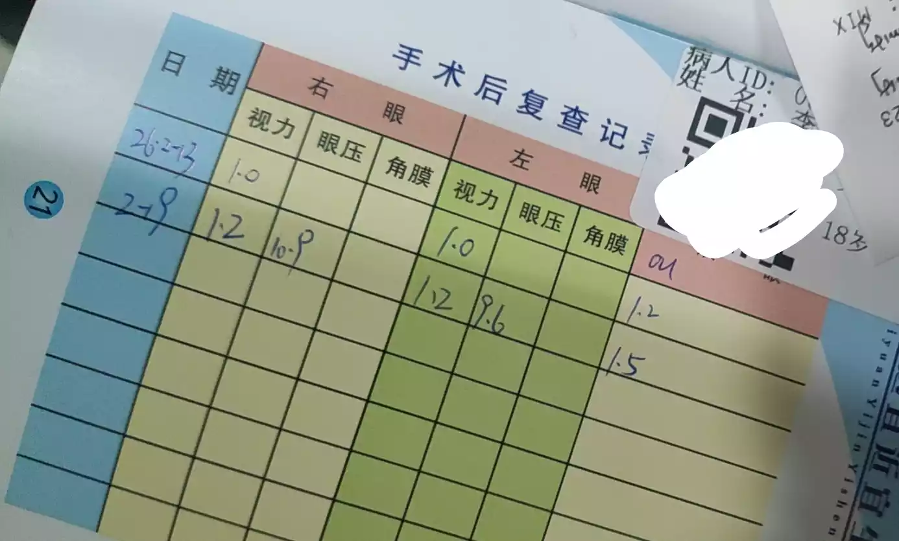

-

# 碎碎念

由于博主的梦想是想当一名网警,所以高考打算考入警校,让后参加公务员考试,进入网警这一行业.
但是要求警校视力裸眼不低于4.8,我这个近视眼明显是不符合标准的,所以我打算去做一个近视手术,但有很多人担心手术问题,所以我用我的亲身经历做了这篇文章!

# 茗述

## 手术前

首先呢,在手术前会让你登记一个小本本,上面有你近一个月的心情报告,是自己填的,之后他会问你一些问题,类似于有没有过敏原,家庭近视史,与戴眼镜的时间,总是也不算太多,写的都很详细,之后就要进行一系列的检测

> 检查(不便宜)
> 包含21项检测,这里放张图,有些我看不太懂,检测项非常的多,非常的精确,还会让你做散瞳,让你自行滴眼药水
>
> 
>
> 排队的人非常多,以至于我第一次去排了一个小时,到我了,他就跟我说去做检测,之后屁颠屁颠做完了,又回来排了一个小时的队,真的特别拥挤,毕竟是手术,大家都有 监护人在身边陪着,蛮重视这次手术的

检测之后就自行预约时间,等待做手术前过来一次,取眼药水,手术前三天需要每天滴入四次(没想到我已经练得炉火纯青了),还给眼睛做了个B超

随后,手术前,还有个眼部训练,他说的每天至少三遍,就是盯着绿点,眼睛保持不动(吐槽一下,这个跟手术的根本不是一个难度啊!)

## 手术中

我做的是++全飞秒++{.way},因为我的检查还算可以,做的时候会进行一个眼睛的深度清理,之后你就会被拉去做手术去了,手术室全程无尘,做的还是挺好的,每个眼睛会单独做,而不是一起做,做之前会详细确认是否做全飞秒,你只需要躺在手术台上,调整绿光在正中间就行了,这时候开始手术了

手术过程中,医护人员会全程跟你说,加油哦,现在正在激光扫描,扫描完了,有一层白雾是很正常的,再坚持一下,不要动,之后手术就算完成了,会让你捏住球,如果感到紧张了你可以捏他,反正我记得当天,这个球被我捏变形了,感觉是这样,哈哈哈

之后他会给你眼部贴一个类似于保护装置的物品,回家之后休息一个晚上,基本上就能痊愈了,但需要注意防止感染,一周不能洗头,洗澡

## 手术后

手术之后呢,需要每隔1,2,3周,1,2,3月,半年,一年,去做一次复查,主要有`检测视力`,`检测眼压`,`眼角膜恢复情况`

刚做完整个眼睛不算很疼,但有种异物感,不是很舒服,但一天过去很好很多了.有时候看东西会眩晕,会雾蒙蒙的,是正常的,过段时间就很好了

今天刚好是我做的一周 ,今天去复查,如下,是我的视力检测

> 先到这吧,连续用太多眼睛,眼睛容易感到疲劳,所以需要经常休息!
