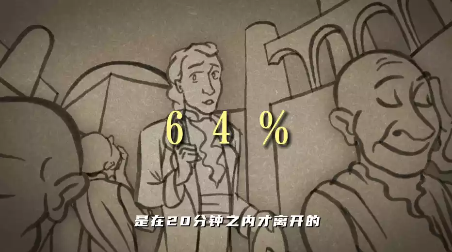

# 简介

本次要要介绍五个有名的心理实验,在日常生活中,或许对你有很大的帮助.

他们分别是: **领域意识** **皮格马利翁效应**

你觉得人的心理可以被操控吗? 那么一个坏人学了心理学,那么他是不是很可怕?

如果你有的想法,请在最下评论区留言,感谢!

# 个人空间实验

## 起源

上世纪60年代,有两个科学家,他们尝试和陌生人坐的更近一些,来探测死不是有自己的领地意识.

他们找来了64个病人,拉来做这个实验.

## 实验

如果自己与病人做的非常近,他们就会**立即走**

但如果自己插着腰与病人坐,有个一**胳膊肘的距离**,那么据观测`两分钟`只有`36%` 的人**离开**,那么剩下`64%`的人会在`20分钟`内**离开**

也就是说人与人之间是有一定的安全距离的,当你的身份不满足时,你的靠近就会让他感到恐慌,不安全.

## 总结

### 亲密关系

就像男女朋友,直血亲属,等,可以保持`15-45cm`之间的距离

### 朋友关系

你们是朋友关系的话,不论好朋友还是正常朋友,你们之间的距离为`45cm-1.2m`之间

### 社交关系

就例如刚认识朋友之类的,你们之间的距离为**1.5m-3.3m**之间,这是一个比较安全的社交距离,双方都会感到轻松

## 应用

如果你跟一个异性去约会,并且你和他的距离控制在了45cm之内,并且对方没有离开,这说明什么,对方已经答应你了,可以去表白.种程度上说,你要判断你与他的关系是不是好,你不用问他,看他的身体反应,就知道你是他的什么关系!

就例如班里突然来了一个陌生人,我是不会刻意跟他靠的很近,但如果我身边有我的好朋友,我就会下意识的**勾肩搭背**,而这并不是我有意而为之,是我下意识的领域行为,我对我自己个人空间的一种把握,当你掌握这个技能之后,你就很轻易判断出来,对方与你是什么关系.表白也会知道啊会不会被拒绝.

# 皮格马利翁效应

## 背景

皮格马利翁效应，亦称为“罗森塔尔效应”或“**期待效应**”，源自古希腊神话中的一个故事。塞浦路斯国王皮格马利翁因对凡间女子失望，雕刻了一座象牙少女像，并深深爱上了它。他祈求爱神赋予雕像生命，最终愿望成真。这个故事传达了一个信息：`期望能够创造出现实`。

## 实验

1968年，心理学家罗森塔尔和雅格布森在《课堂中的皮格马利翁》一书中，通过实验验证了这一效应。他们随机挑选了一些学生，告诉老师这些学生**具有高发展潜力**，但实际上这些学生是**随机**选出的。八个月后，这些学生的**学习成绩显著提高**，性格变得更**外向**，**自信心**和**求知欲**也更强了。

## 结论

皮格马利翁效应表明，`当我们怀着对某件事情非常强烈的期望时，我们所期望的事物就会出现`。这种现象在教育、管理、个人成长等领域都有广泛的应用。它揭示了期望的力量，以及期望如何影响人们的行为和成就。

## 实际应用

在教育领域，教师对学生的期望可以显著影响学生的学习成绩和行为表现。在企业管理中，领导者对员工的期望同样能够激发员工的潜力，提高团队的整体表现。个人也可以通过积极的自我期望来实现自我提升和目标达成。

## 结语

皮格马利翁效应让我们相信，**积极的期望和信念能够激发潜能，创造奇迹**。它提醒我们，**无论是对自己还是对他人，都应该持有积极的态度和期待**。这样，我们就能够更好地发挥自己的潜力，实现自己的目标。
