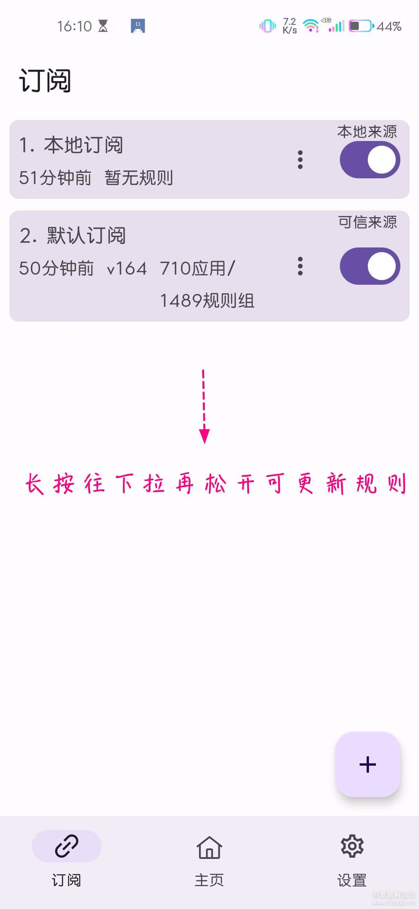
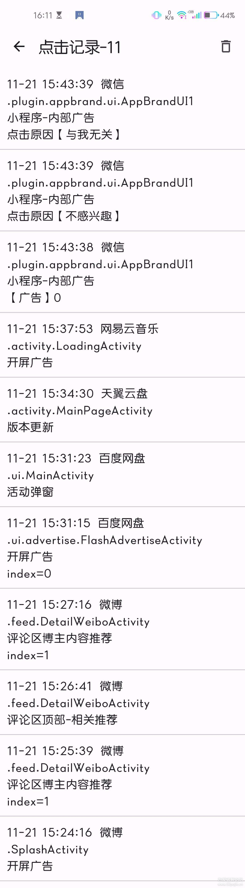

<aside>
📣 这里写文章的前言：
相信大家的手机里面有各种各样的软件，许多软件为了恰饭，添加了开屏广告，这让我们很不爽，不仅影响时间，还大大消减了使用这个软件的兴趣，常见的开屏软件：快手，抖音，小红书等
</aside>

# 引言

相信大家的手机里面有各种各样的软件，许多软件为了恰饭，添加了开屏广告，这让我们很不爽，不仅影响时间，还大大消减了使用这个软件的兴趣，常见的开屏软件：某手，某音，某红书等

# 介绍

GKD（又称搞快点，详情请戳 [作者G项目地址](https://github.com/gkd-kit/gkd)）是一款免费开源简洁多规则的自动跳过广告的软件。简而言之，基于预设的定时更新订阅规则/快照功能，实现识别并自动点击跳过任何开屏广告及点击关闭应用内部任何弹窗广告，如关闭某些APP开屏和内含推荐广告位（主流的基本上已支持）。比起寻找无广告还不保证长期有效的APP来说，此屏蔽跳过的方法要更直接。
毕竟第三方又闭源的软件因众所皆知的原因纷纷停更了，国外付费的那款贵得劝退，太简单的又无法满足，所以爬了个而非单单是个开关的软件，当然配合已绝版的某足某足自定义规则使用更佳。

## 软件特性：

1. 支持在线规则实时更新订阅
2. 目前git仓库已经收录支持至少九百多个app（国产居多）以及2000条以上规则（后续还会持续增长），方便掌握动态
3. 兼容android14及Harmony OS 4.0

## 使用说明：

首次使用需要给予无障碍和悬浮窗权限（具体自搜），所提供的默认规则支持在线更新订阅，基本常用主流熟知的APP对应都有不同的规则开关可自主选择。具体请戳：规则更新动态。自动点击记录事件可在软件主页中翻查。
若想不被频繁误杀、说无效的又或者是得到更准确的跳过识别，可在高级模式中开启shi授权（具体请自搜）。
另外，源码本身开源，比闭源的开明多了，可自行抓包软件行为为查看更具体的动作权限便知（本世不展开赘述，具体自搜），担心就勿下勿用，其余功能请自行体验。

## 截图展示

> **点击记录：（可自动跳过小程序、评论区推荐等广告或活动更新弹窗）**
>
> 

---

# 下载链接

不多说，直接上链接
下载地址：

> 蓝奏云：[提取码 hm0w](https://wwzr.lanzout.com/b048pqdsf)

自行复制，技术有限不会点击复制

# 更新内容

> v1.6.4更新内容：（2024-01-04）
> 修复quickFind标识文字错误导致查询变慢
> 优化某些场景下的查询规则
>
> v1.6.2更新内容：（2023-12-28）
> 修复无障碍获取无障碍属性为空导致的崩溃
> 修复获取无障碍节点错误导致的崩溃
> 新增全局规则
> 新增规则分类/批量开启关闭
> 新增常驻通知栏开关
> 允许匹配不在安装列表的应用
> 新增截图快照，可以在用户截图时保存快照
> 优化规则触发逻辑及速度。优化快照文件生成的速度
> 优化连接到审查工具的方式
> 优化申请权限流程
> 优化界面布局
> 每次打开界面时自动清除缓存
> 优化 shizuku 错误提示
> 修复某些设备出现通知提示音
> 修复点击记录名称显示错误
> 修复订阅自动检测更新不生效
>
> v1.5.4更新内容：（2023-11-24）订阅界面搜索优化/id搜索 ActivityId 概率复用错误
> 优化activityId更新逻辑
>
> v1.5.3更新内容：（2023-11-23）优化和修复： 某些机型上规则不执行 通知栏快照丢失 activityId
>
> v1.5.2更新内容：（2023-11-22）降低一半 apk 文件大小 规则 group actionMaximum/actionCd
> 失败 主线程阻塞导致界面卡顿
> 修复某些机型上规则概率执行缓慢的问题
>
> v1.5.1更新内容：（2023-11-18）路径动画卡顿 上一版更新内容： 优化和修复 状态栏显示优化(沉浸式状态栏)
> 点击记录显示优化（没有名称的规则将标识索引和密钥）
> 订阅列表显示优化（订阅菜单项可以查看订阅详情）
> 删除无用资源、删除 32 位支持、减小 apk 大小
> 内存占用优化，减少内存占用
> 性能/耗电优化，优化规则执行逻辑，同时提升规则触发速度
> 优化activityId识别逻辑
> 规则支持长按、共享cd/次数
> 优化创建文件夹逻辑
> 优化存储数据逻辑
> 其它修复和优化
