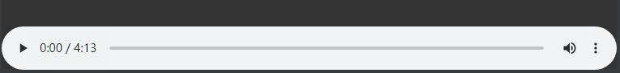
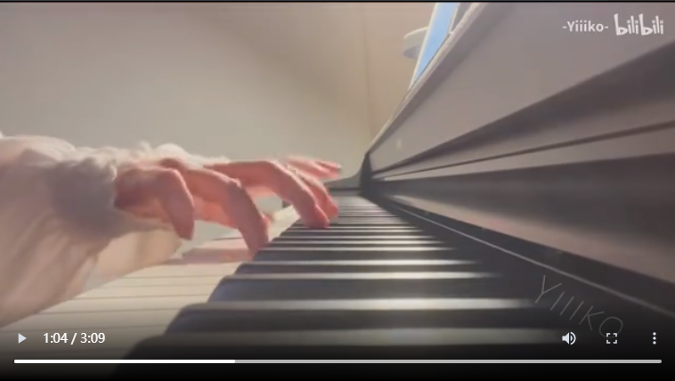

# 简述

我们在实用hexo中,没有任何的添加视频与音频的按钮.

这让我很头脑,所以,这次我来分享一个方法.

# 教程

## 首先插入**音频**

**aplayer**

在cmd页面内，使用npm安装：
`npm install hexo-tag-aplayer`

在markdown内添加以下代码：

```bash
{% aplayer "她的睫毛" "周杰伦" "http://home.ustc.edu.cn/~mmmwhy/%d6%dc%bd%dc%c2%d7%20-%20%cb%fd%b5%c4%bd%de%c3%ab.mp3"  "http://home.ustc.edu.cn/~mmmwhy/jay.jpg" "autoplay=false" %}
```

效果如下:



或者使用下方代码:

```html
<video
  src="https://music.163.com/song/media/outer/url?id=1490104654.mp3"
  position="absolute"
  width="100%"
  height="100%"
  controls="controls"
></video>
```

<video src="https://music.163.com/song/media/outer/url?id=1490104654.mp3" position= "absolute" width="100%" height="10%" controls="controls"></video>

## 视频

**dplayer**

在cmd页面内，使用npm安装：
`npm install hexo-tag-dplayer`

在markdown内添加以下代码：

```bash

```

效果如下:



或者使用下方代码:

```html
<video
  src="https://bili.api.scc.lol/?bv=BV1xw4m1k7er&qn=80"
  position="absolute"
  width="100%"
  height="100%"
  controls="controls"
></video>
```

<video src="https://bili.api.scc.lol/?bv=BV1xw4m1k7er&qn=80" position= "absolute" width="100%" height="100%" controls="controls"></video>
