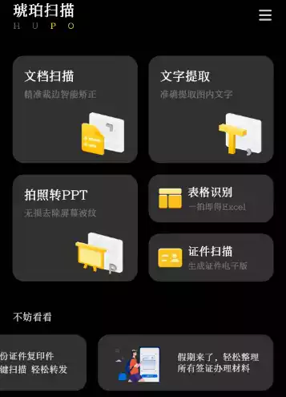
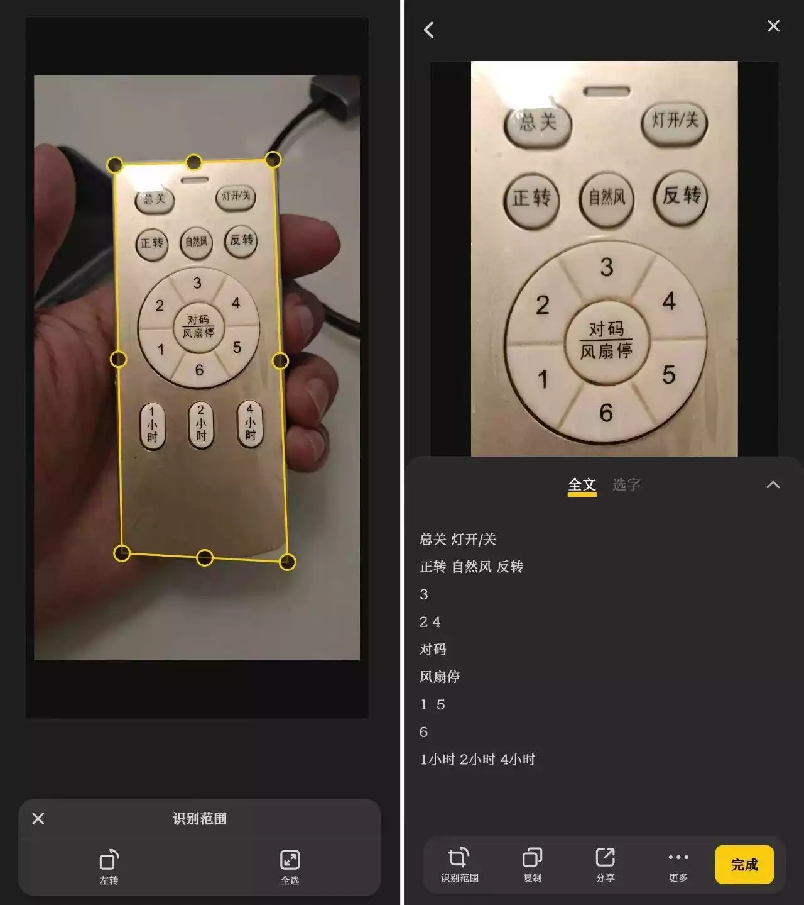
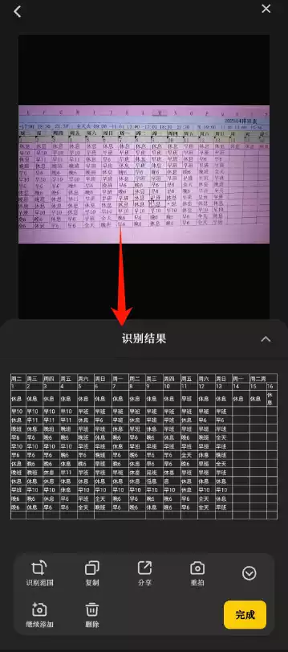

# 茗起

好久都没更新软件了,这次来了,是个扫描神器

之前一直用的白描,但是他需要开通会员,一天只能用五次,一直在找替代品,这次他来了!

# 茗述

## 一、全能扫描：随手拍就是高清电子档

### ✨ 文档扫描：手机秒变扫描仪

在教室拍黑板笔记、会议室拍 PPT 投影，光线不好也不怕！APP 自带**智能边缘矫正**功能，随手拍的歪歪扭扭文档，自动裁成平整的 A4 尺寸，连背景里的杂音（比如桌面的水杯、纸上的折痕）都能一键去除，扫出来的文字比原图还清晰。
实测加了「增强滤镜」后，连课本上浅灰色的小字都能扫得明明白白，学生党期末复习扫笔记、打工人扫合同文件，存手机里随时翻，再也不用带厚重的纸质资料了！

### ✨ 证件扫描：安全又省心

身份证、护照、驾驶证这些重要证件，再也不用跑打印店！APP 会自动识别证件边界，连身份证正反面都能智能拼合排版，导出时还能加**防盗水印**（比如「仅用于 XX 用途」），发给别人不用担心泄露。亲测扫驾驶证，连照片上的字体都没变形，去办事儿直接拿手机里的电子档就行～

## 二、OCR 黑科技：扫图 = 编辑 + 翻译 + 导出

### ✨ 文字提取：批量处理效率翻倍

最惊艳的是它的 OCR 识别！拍一张布满文字的图片，1 秒就能提取成可编辑的文本，**连手写体都能认**（虽然正确率 90%+，但手写太潦草的话建议核对一下）。
试过批量扫 10 张英文资料，不仅能一键翻译成中文，还能直接导出 Word 文档，打工人处理外文合同、学生党翻译英文文献，再也不用手动打字到崩溃！

### ✨ 表格识别：Excel 党狂喜

拍张纸质表格（比如考勤表、成绩单），APP 能精准识别行列结构，直接导出 Excel 文件，连合并单元格都能还原！上周帮老师扫班级成绩单，扫完直接生成 Excel 表格，省去了手动录入的半小时，老师都问我要链接哈哈～

# 下载链接

分类实用工具-->扫描:
https://drive.uc.cn/s/860f3a2b670e4?public=1
