# 碎碎念

> 刷视频刷到,久坐会影响身高,啊!
>
> 我看我身边都是180大哥,就我175,这5cm也是蛮重要的!
>
> 正好这还有机会调整,我就分享一下哦! 

好啦好啦~ 也不拖沓了,1号本来有点迷茫的,但突然有个人说,如果你愿意的话,可以给我打电话,我听,当时我的心情,瞬间好了一大半! 有那么一个朋友真好啊~

# 茗述

## 项目开始

### 第一步:注册网站

地址：[https://infini-cloud.net/](https://infini-cloud.net/)

注册蛮简单的,这里就不做演示了......(纯属懒了)

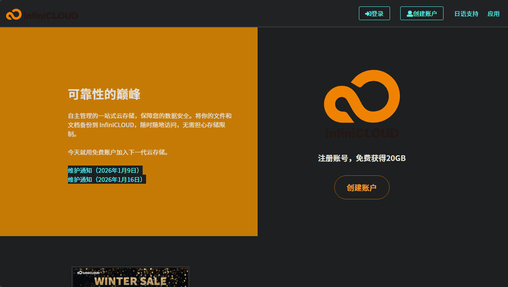

### 第二步:输入邀请码(可多获得5GB)

我的邀请码:++**CUJTZ**++{.wavy}

点击确认之后,你就会发现,多出来5GB

### 开启Apps Connection

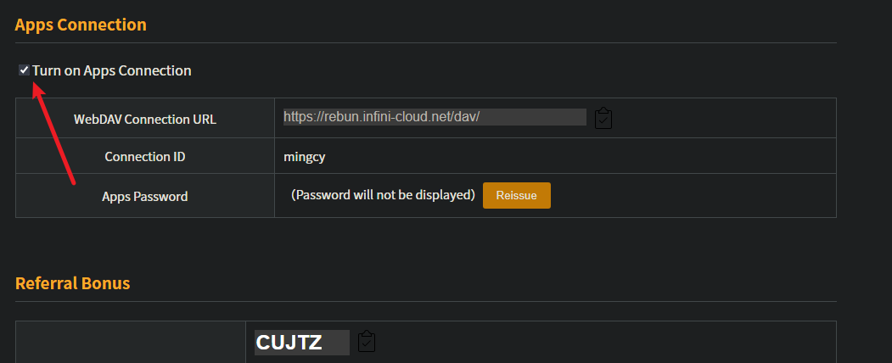

此时你就会得到一个`dav的链接`,账号就是你注册的账号,但密码只出现一次,需要保存好!

> |      URL      | https://rebun.infini-cloud.net/dav/ |
> | :-----------: | ----------------------------------- |
> | Connection ID | mingcy(你自己的账号)                |
> | Apps Password | ***************************         |

### 我使用alist挂载图床

选择**WebDav**

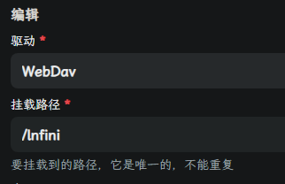

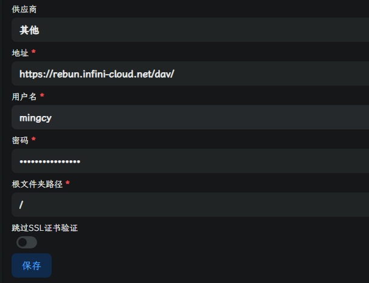

按照上述表格填写即可

### 使用宝塔/1panle 等安装

1.服务器安装好宝塔面板，docker，推荐宝塔面板是方便配置域名，使用其它1panle都可以

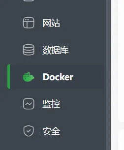

2.宝塔面板搜索filestash

filestash开源地址：https://github.com/mickael-kerjean/filestash

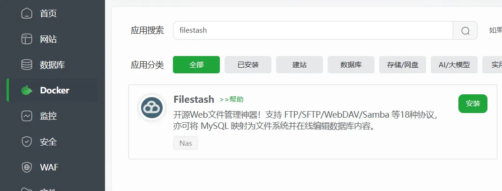

3.安装成功之后浏览器访问ip+8334端口

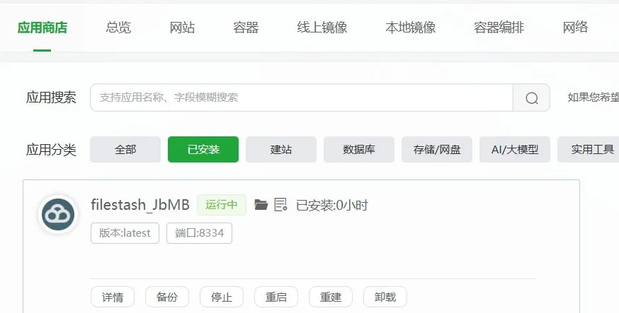

4.会提示设置密码

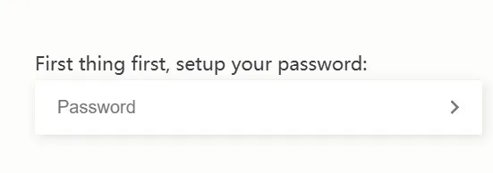

5.进入主页之后退出，添加infinicloud的连接信息

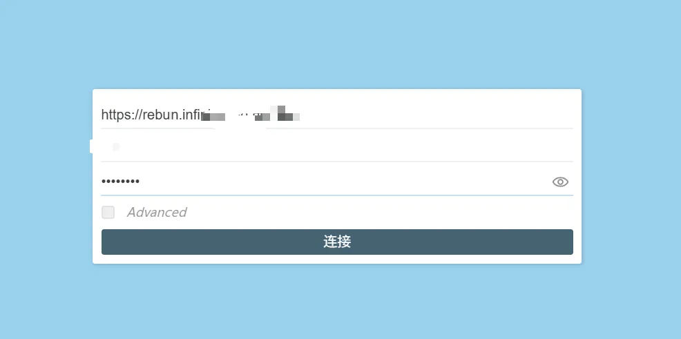

6.可以看到已经同步了infinicloud的文件信息

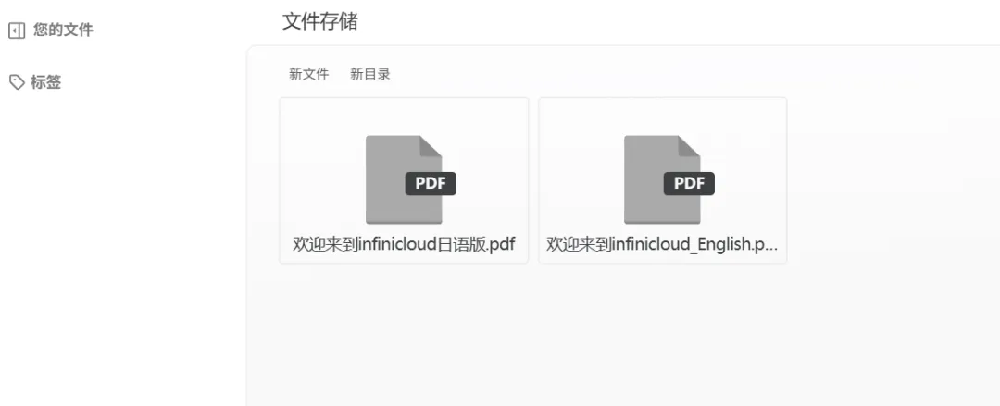

7.右下角上传一张图片

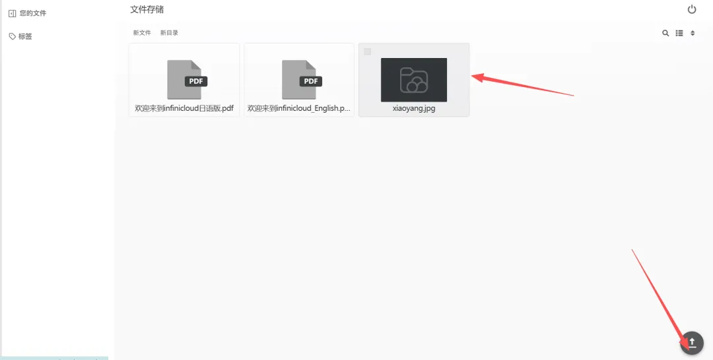

8.选择图片即可分享

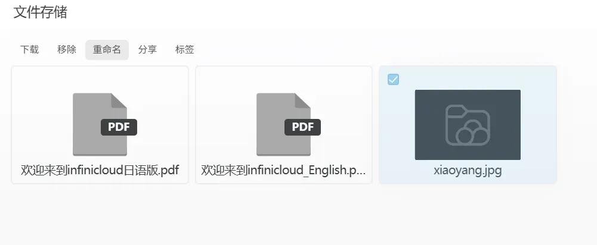

测试图床：http://8.138.123.197:8334/s/qXFIKhp

如果想配置域名可以反向代理，filestash里面图片可以加载出来，只是比较慢

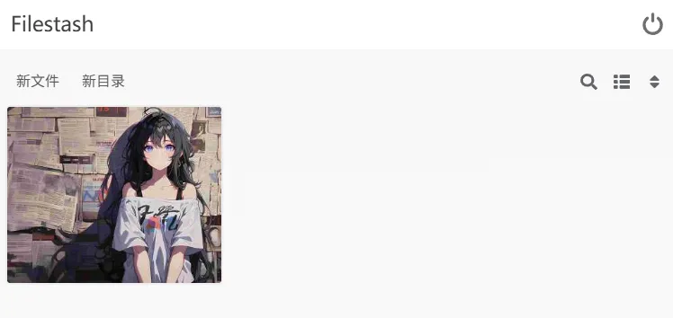

官方说明其传输速度++“最高支持 每个 IP 200 Mbps”++，只能是尽力而为，免费和付费都是200Mbps

做图床，再套 **Cloudflare CDN**，用户的图片访问速度更多会取决于“是否命中 CDN 缓存”，命中后就不再频繁回源到 Infini-cloud

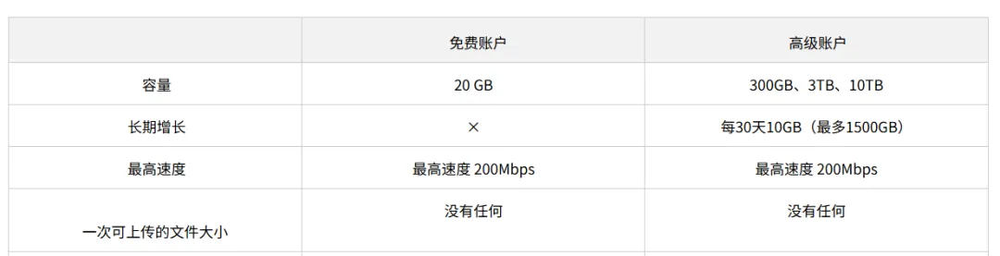
