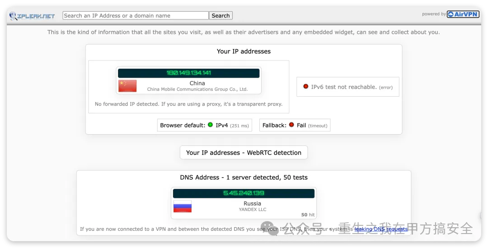
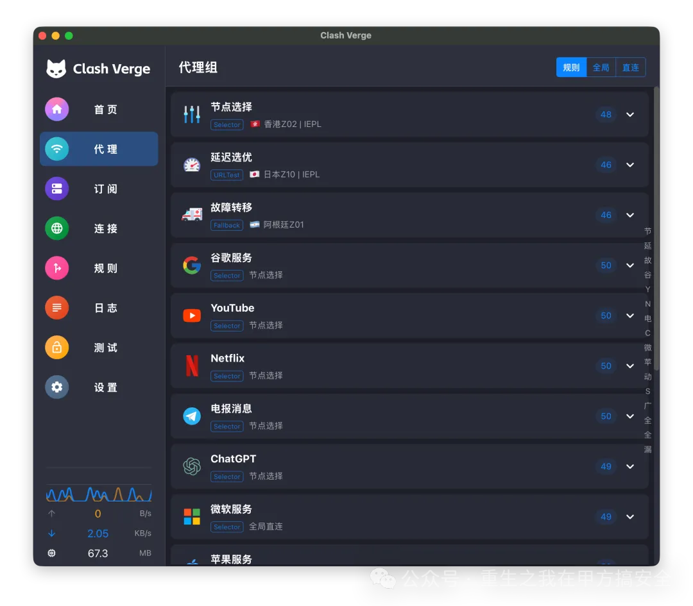
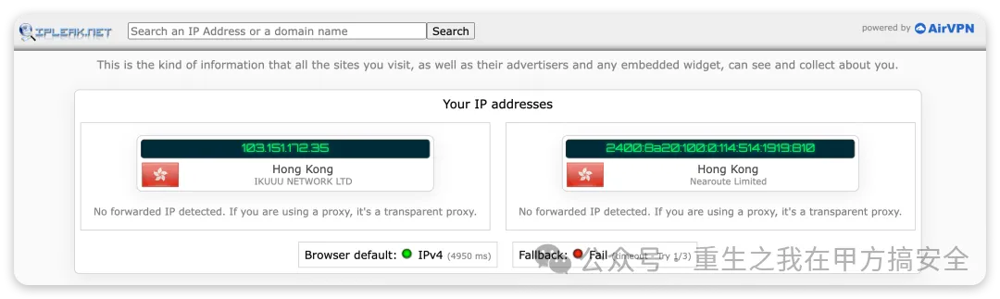
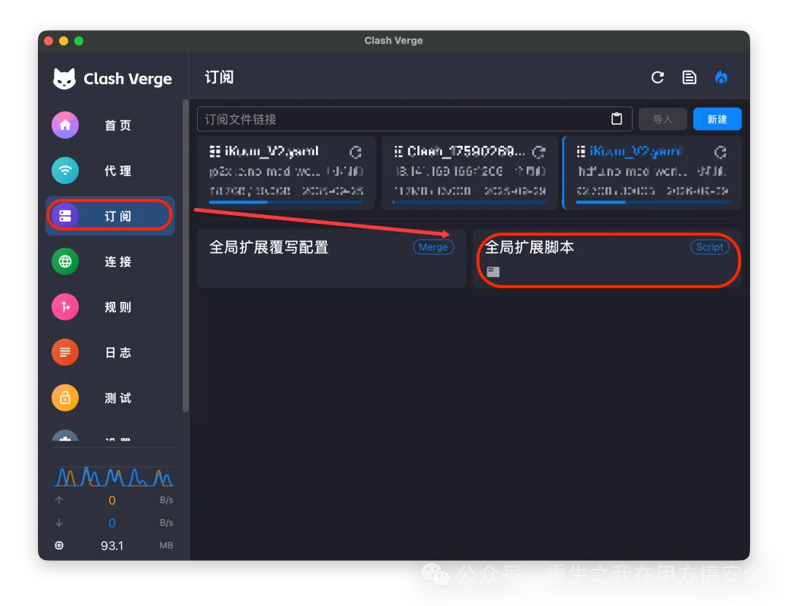
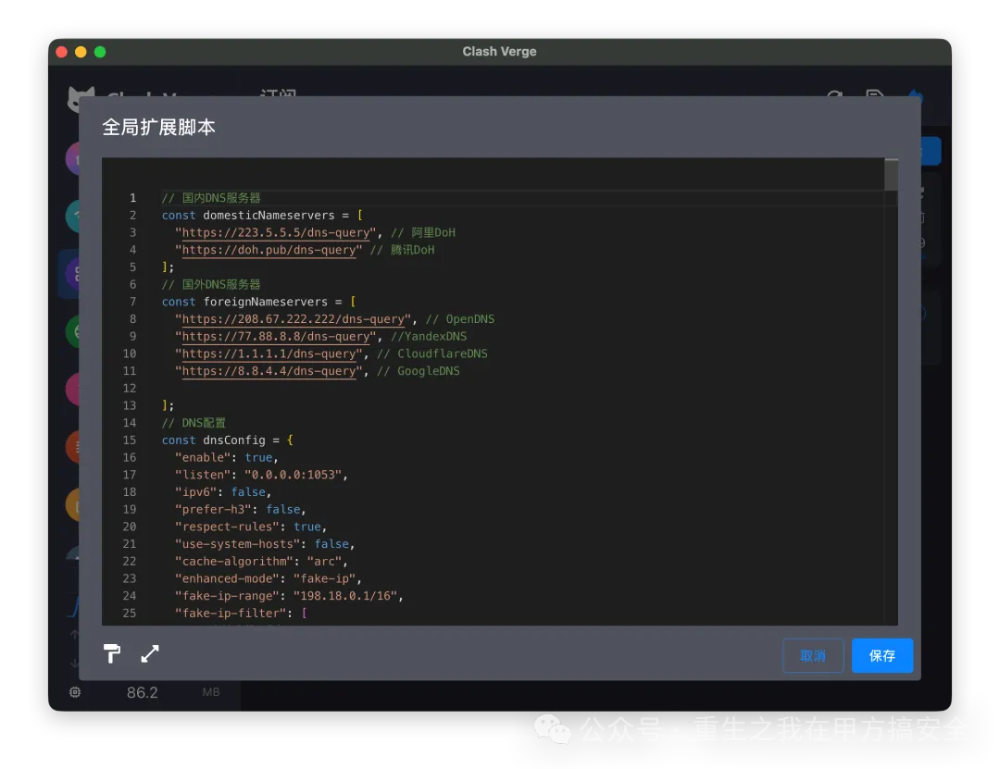

## 碎碎念

最近心情 实在是太不好了,发生了太多的事情,压得我喘不过来,我估计是欺骗了所有人,现在呢这件事也不能一次性说出口,我对每一个人都有不一样的讲述,有时候真的挺累了,想什么也不说,有时候想一拳打碎这个世界,太累太累了,人际关系 一团糟 ,很是迷茫,我不知道怎么解决这件事情了........

## 茗述

在访问外部网站或使用 Cursor、Claude Code 时，常因地域限制导致大陆IP无法访问，需借助科学工具。然而，部分代理存在配置漏洞或协议缺陷，可能泄露真实IP，引发账号封禁或隐私风险。例如，WebRTC 漏洞、DNS 泄露，均可能暴露真实位置。

检测DNS泄露网站：[https://ipleak.net](https://ipleak.net) [https://browserleaks.com/dns](https://browserleaks.com/dns)

**什么是 WebRTC 泄漏？**

WebRTC 内嵌的 STUN 组件为完成 NAT 穿透，会向公网 STUN 服务器发送探测包，从而把主机的公网 IP 直接回传给浏览器，即使已启用代理亦可能暴露真实地址。

**什么是 DNS 泄漏？**

系统**在已建立的 VPN 隧道之外**发送**未经加密**的 DNS 查询，导致解析请求及其源 IP 被隧道外节点（如本地运营商）可见并记录。

**CIash Verge****进阶玩法**

下载地址：https://github.com/clash-verge-rev/clash-verge-rev/releases

基础教程：https://clashverge.net/tutorial/

如果想让不同网站走不同线路（比如油管走漂亮国线路，GPT走考拉国线路），自定义规则功能就能派上用场，这也是CIash Verge的核心优势之一：

1. **创建自定义代理组**：打开“配置”页面，选中当前使用的配置，点击“编辑”进入配置编辑界面，在“代理组”模块点击“添加”，自定义组名称，并选择该组下的某节点；
2. **添加分流规则**：在“规则”模块点击“新增规则”，选择“域名匹配”模式，输入目标网站域名，然后指定该规则对应的代理组；

机场默认配置不够完善，导致真实IP暴露，而CIash Verge的扩展脚本功能就能完美解决这个问题，还能实现更复杂的分流逻辑：

- **导入扩展脚本**：在“配置”编辑界面找到“扩展脚本”模块，点击“导入脚本”，可编写的脚本代码；
- **DNS泄漏修复**：推荐使用经过修改的官方优化脚本，导入后会自动配置DNS转发规则，确保所有流量都通过代理服务器，避免真实IP泄露；
- **脚本效果验证**：可通过DNS泄露检测网站进行测试，显示代理服务器对应的IP即代表修复成功。

**如何配置**

配置全局扩展脚本，改写所有的代理配置，一步解决以上问题：

## 获取脚本

相关脚本如下:

> [https://github.com/xiaolin-007/clash-verge-script/blob/main/扩展脚本-优化版.js](https://github.com/xiaolin-007/clash-verge-script/blob/main/%E6%89%A9%E5%B1%95%E8%84%9A%E6%9C%AC-%E4%BC%98%E5%8C%96%E7%89%88.js)
