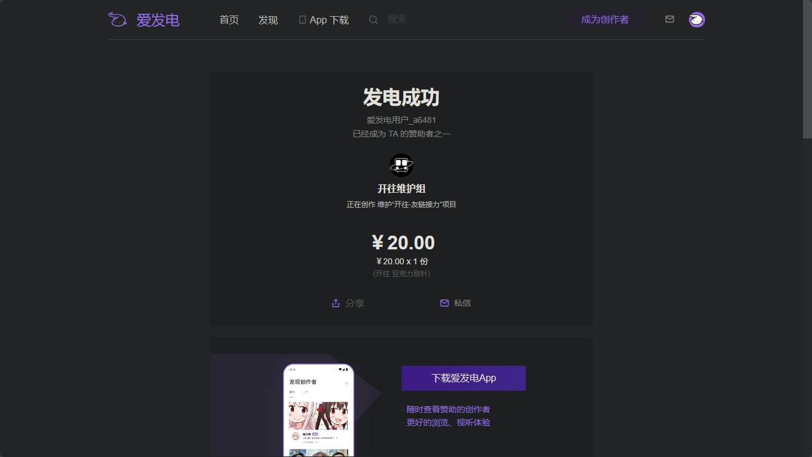
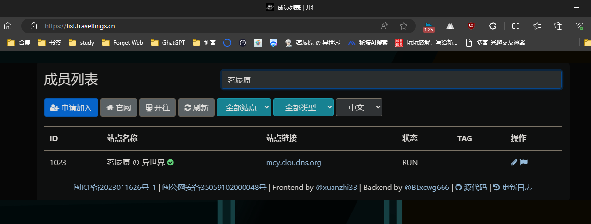
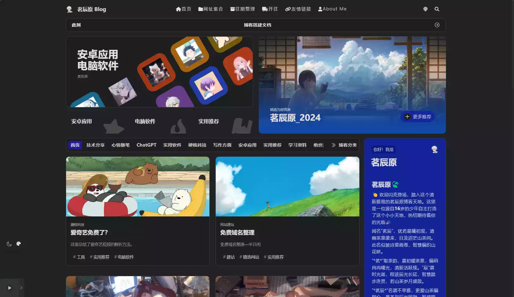

<aside>
😀 这里写文章的前言：
就在昨天购买了开往的周边真的太开心了。

</aside>

# 简介

想必每个玩网络的人都知道开往吧。

**开往**的生日是 **2020 年 3 月 12 日**，取自**开**放的**网**络，是一个友链接力项目。

开往的 logo 是代表“世界”的星环 + 代表“穿梭”的列车 —— 相信你听到“开往”这个词最多的时候一定是在列车上，“由 xx 开往 xx 的列车……”。

每当有人访问加入开往的网页时，点击“开往“会**随机跳转**到另一个加入开往的网页。之后，再次点击网页上的”开往“或**后退网页**，将继续随机跳转到另一个加入开往的网页。

加入开往的网页越多，友链接力的规模越大，分享流量的规模也越大。

目前已有 1k+ 人关注开往， 1k+ 成员加入过开往。

[https://img.shields.io/github/stars/travellings-link/travellings?style=social](https://img.shields.io/github/stars/travellings-link/travellings?style=social)

这个看起来难道不有趣吗？

# 分享

就在上周洛寒兮准备了开往的周边，心想我来到开往也有3个月多之久了，喜欢开往也有3年了，一开始就被他的原理所吸引，与每一次点击之后的未知性，真的超级有趣。

那时的我看到别人网站上挂着开往的标识，太酷了啊。我想什么时候我也才能成为一份子呢？

这不，我现在终于成为了一份子，真的很感激，很激动，文章每次都是很认真写完才会发布，就希望有更多的人看到我，能帮助到别人。

哈哈，来看我的周边！！

这是在爱发电上买的，一挂出，我放学回来就买了，真的很爱开往~

你看这个，谁能不爱呢？

茗辰原 の 异世界，也是你的一世界！在这里可以畅所欲谈，哈哈，期待与你的下一次相遇~

