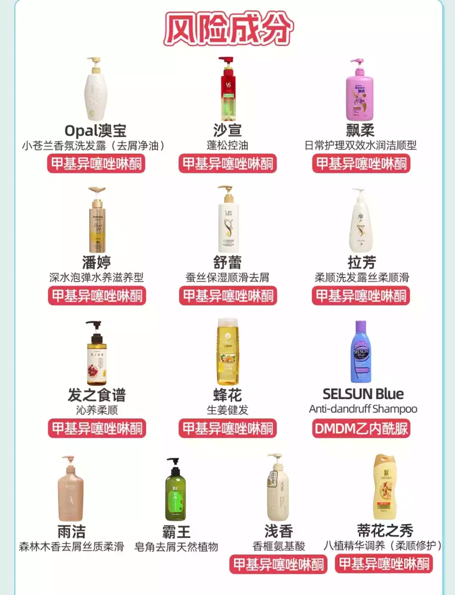
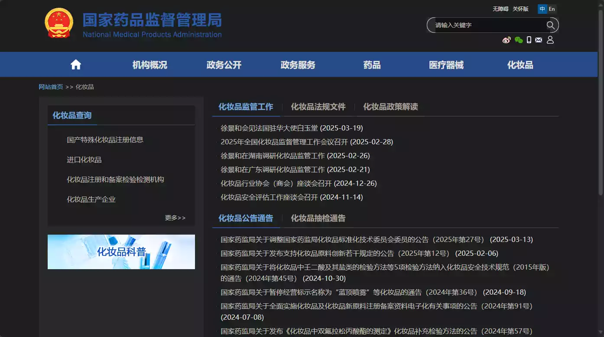
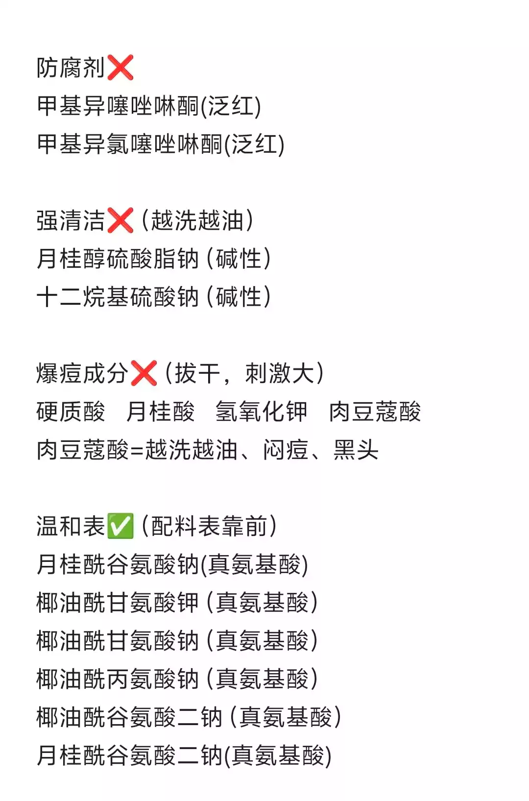
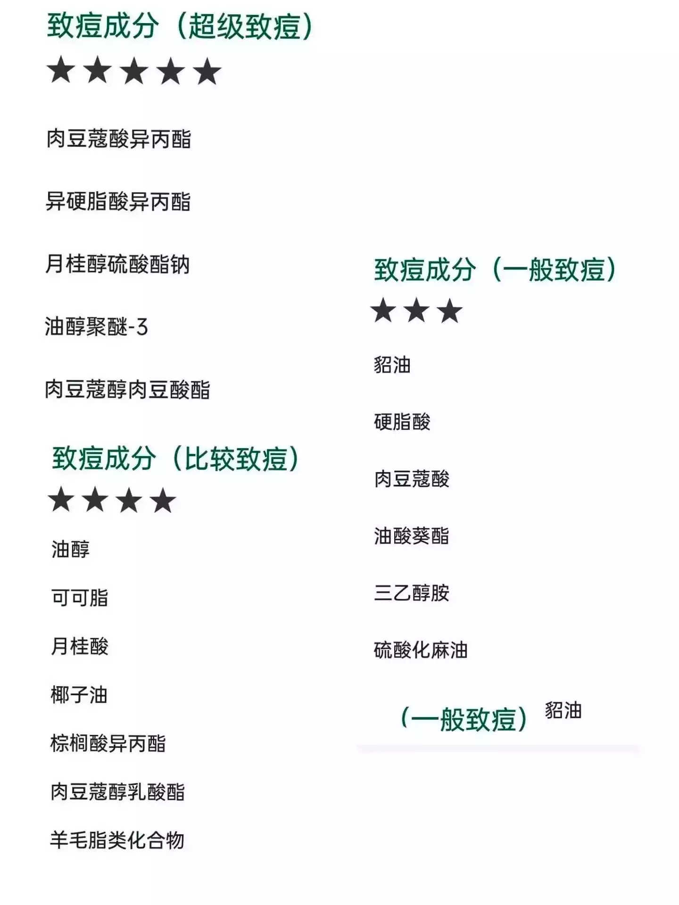

# 茗起

想做这个专题很久了,因为我也被商品的假货所困扰,买个洗面奶发现商标不对,一用,超强的清洁功能,我都不敢用了,用完之后脸起皮子,太可怕了!包括我现在家人买的洗发膏,洗完还算清凉,睡上一觉又不对了,头又痒的很,这太可怕了!
我主要是通过网上格主播的评测,与相关检测等,查看配料表有没有违规的,与用户的实际真实体验为目的进项筛选,在使用AI技术,看看到底符不符合标准.

# 茗述

## 洗发膏

起因因为欧盟的洗发水进入中国市场后,就变得乱乱糟糟的,这有几个成分的属于高危险区,去看看你家洗发水配料表有没有吧 !**甲基异噻**....

我再补充一些:

- 1.月桂基硫酸钠醛（抑制头发生长）
- 2.对羟基苯甲酸酯类（刺激头皮影响油脂平衡，脱发）
- 3.硅油、矿物油（堵塞毛孔）×
- 4.氯化钠（造成头皮干燥头痒）×
- 5.聚乙烯/聚乙二醇（使头皮干燥）
- 6.二乙醇胺/三乙醇胺（易过敏）×
- 7.甲醛（易造成脱发致癌）
- 8.酒精（易使得头发干燥）×
- 9.甲基氯异噻唑啉酮（易过敏头皮屑）×
- 10.苯甲酸钠(易会引起瘙痒,红肿)

清洁成分

- 皂基类：硬脂酸、棕榈酸、月桂酸、肉豆蔻酸
  特点：价格便宜，清洁力强，刺激性大
  容易清洁过度刺激头皮、洗完干涩不舒服
  硫酸盐类：月桂醇聚醚硫酸酯钠（SLES）、月桂醇硫酸酯钠（SLS）、硫酸酯铵类、椰油醇聚醚
- 酸酯钠
  特点：价格便宜，清洁力强，刺激性大，化学品
  清洁力度太强，长期使用或浓度过高，容易越洗越油，容易残留，影响头皮健康

建议使用 - 氨基酸类：月桂酰谷氨酸钠、椰油酰谷氨基丙酸钠、椰油酰谷氨酸钠、甲基椰油酰基牛磺酸、月桂

- 肌氨酸钠
  特点：温和亲肤，泡沫细腻，清洁力好，刺激性小，不伤害头皮植物类：无患子、皂角提取物、茶麸提取物
  特点：清洁力好，温和植物提取，价格贵，亲肤健康，滋养头皮

通过这个网站,可以精确查看刚发布的化妆品违规的调整,下方还有质检报告,非常放心!

## 洗面奶

挑洗面奶、洁面产品必备成分表，避雷指南挑选清洁产品时需要注意的成分有哪些呢？
最常见的有害成分包括：
SLS和SLES强力清洁产品
比如：

- 月桂醇硫酸酯钠
- 十二烷基硫酸酯钠
- 月桂醇聚醚硫酸酯钠皂其类表活：
- 肉豆蔻酸
- 氢氧化钠
- 氢氧化钾
- 椰油酸钾
- 月桂酸
- 月桂酸钾
- 棕榈酸
- 三乙醇胺
- 硬脂酸钾硬脂酸
  人工香料与合成色素，一边清洁一边偷偷添加色

既然知道了,那么我们到底该如何购买呢?

一般来说，肤质可以分为**干性、油性、混合性和敏感性**四种。`干性皮肤`通常皮脂分泌较少，容易干燥、紧绷，因此要选择`温和、保湿性强`的洁面产品，如含有氨基酸、甘油和透明质酸等成分的产品。`油性皮肤`则皮脂分泌旺盛，尤其在T区容易出现油光和粉刺，适合`清洁力强但不刺激`的洁面产品，如泡沫型或凝胶型洁面。`混合性皮肤`则需要根据不同区域选择不同的洁面产品，`T区使用清洁力稍强的，两颊选择温和`的。敏感性皮肤因为容易对外界刺激做出反应，建议选择**低敏、无香料、无酒精的产品**，使用前最好测试耐受性。
