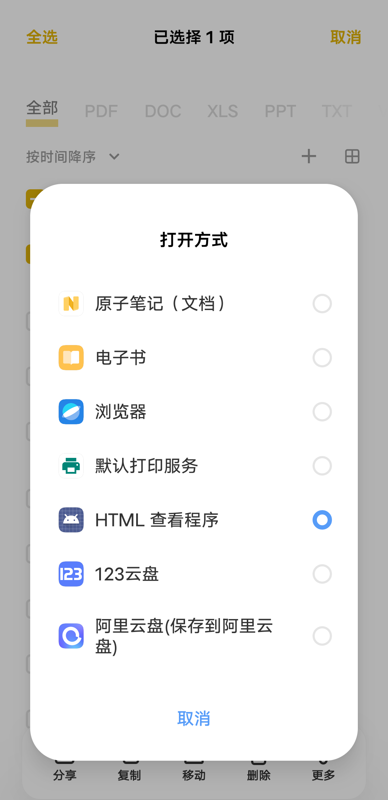
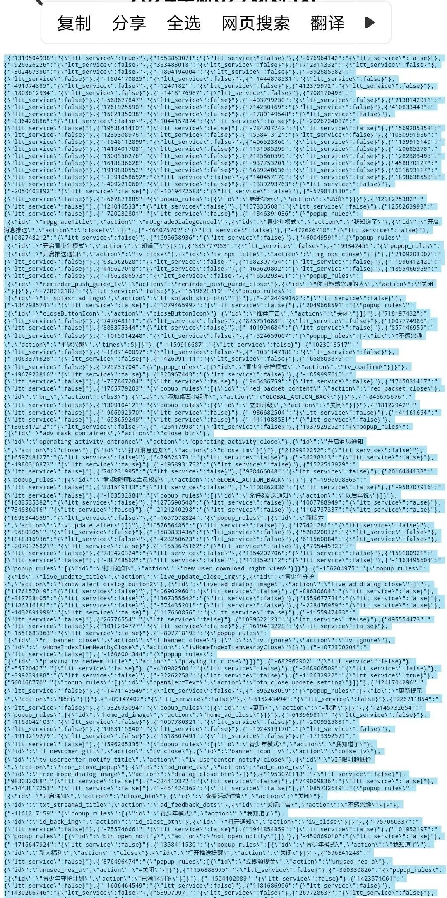

# 李跳跳复活版！

# 简介

说起手机跳过广告，之前也是给大家分享过一些的，其中最受欢迎的当属李跳跳，只是它后面很多规则都失效了，导致它虽然可以打开，但是还是无法使用！

去年，广告跳过界的“明星应用”——李跳跳，因大厂的律师函而一度暂停运营。这让很多依赖它们跳过广告的用户感到惋惜。不过，好消息是，虽然老的应用暂时休息了，但新的去广告力量已经崛起！比如我们之前介绍过的开屏跳过，它的功能和李跳跳如出一辙。

对于这类的软件，大家都是不可缺少的，今天就来给大家分享一个最新的规则导入方法，让它能够再次陪伴大家左右！

**2024全新李跳跳去广告规则合集**

- **涵盖广泛**：这次的规则合集包括了超过3000条规则，几乎涵盖了你日常使用的所有APP。
- **适配多样**：不管是哪种形式的开屏广告，这个合集都能帮你轻松跳过。
- **简单易用**：只需几步操作，就能将这些规则导入到李跳跳中，让你的APP启动更加清爽。

**适用平台：安卓**

# **李跳跳最新规则导入方法**

这里是给大家准备了两份规则，**加起来共3000多条**，基本上大部分APP都适用！使用方法也很简单，大家先将软件和规则一同下载到本地，然后用**HTML查看器或者WPS Office打开**，将所有的规则全选并复制下来！

1. 打开李跳跳应用，点击“更多”。
2. 在右上角找到“···”，点击后选择“导入规则”。

3. 在弹出的输入框里，长按粘贴你复制的规则代码即可。

## 文件下载

[李跳跳325条规则.txt](/2024/03/16/ltt/1.txt)

[李跳跳881条规则.txt](/2024/03/16/ltt/2.txt)

[李跳跳879条规则.txt](/2024/03/16/ltt/3.txt)

# 外番

值得注意的是，现在的李跳跳是一个完全离线的APP，不联网也能使用，有了这个全新的规则合集，你的日常使用绝对没问题！

李跳跳的水果摊

在小镇的一角，靠近熙熙攘攘的市场，有一个小小的水果摊。摊主是一个名叫李跳跳的小女孩，她年纪虽小，却已经懂得了生活的艰辛与美好。她的眼睛像两颗明亮的星星，闪烁着希望的光芒。她的笑容像春天的阳光，温暖而灿烂。

李跳跳的水果摊虽然不大，但摆放得井井有条，各种水果琳琅满目，色彩斑斓。红通通的苹果，黄澄澄的香蕉，绿油油的西瓜，还有紫莹莹的葡萄……每一种水果都像是大自然的馈赠，散发着诱人的香气。

李跳跳对待每一位顾客都热情周到，她总是笑眯眯地询问顾客的需求，然后麻利地挑选出最新鲜、最美味的水果。她的双手在水果摊上飞快地移动，就像是在弹奏一曲美妙的乐章。顾客们都喜欢她，喜欢她的水果，更喜欢她的笑容和热情。

虽然李跳跳每天都很忙碌，但她从不觉得辛苦。她喜欢看着顾客们满意地离开，喜欢听着他们夸赞她的水果。她觉得，这就是她想要的生活，简单而充实。

然而，生活并不总是一帆风顺。有时候，天气不好，水果的销量就会受到影响；有时候，一些挑剔的顾客会让她感到头疼。但李跳跳从不气馁，她总是相信，只要她努力，一切都会好起来。

果然，在她的坚持和努力下，水果摊的生意越来越好。越来越多的人知道了李跳跳和她的水果摊，他们被她的热情和坚持所打动，成为了她的忠实顾客。

李跳跳用她的双手和笑容，创造了一个属于她自己的小世界。在这个世界里，充满了水果的香气和人们的笑声。她感到无比幸福和满足，因为她知道，这就是她想要的生活。
