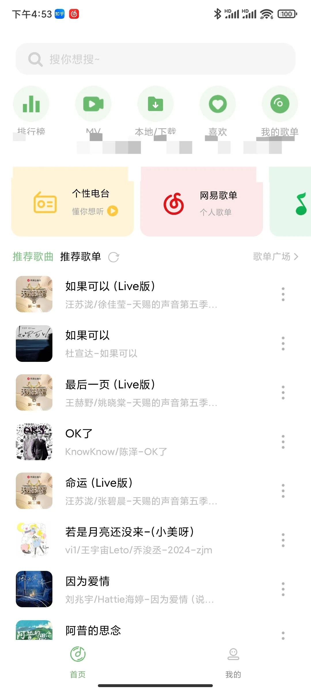
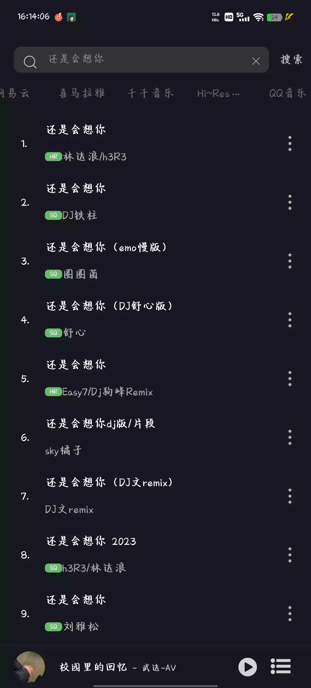
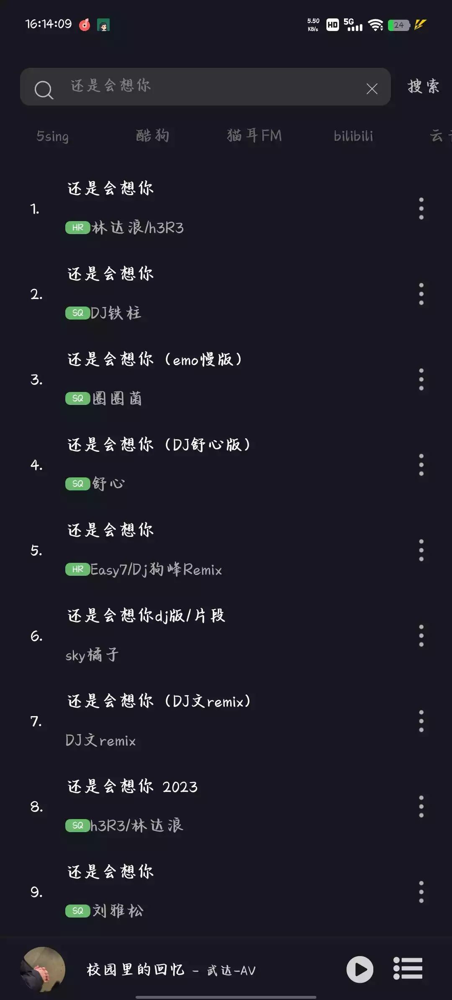
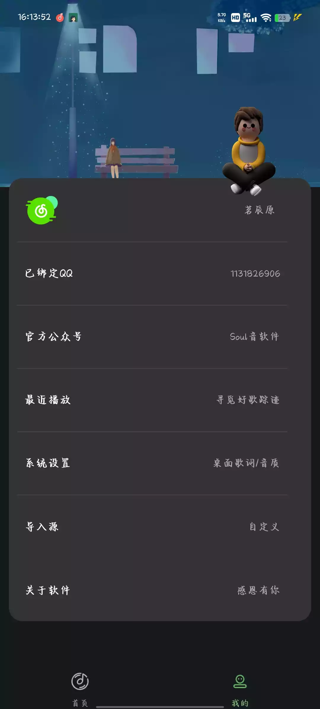

# 前言

免费的音乐工具我遇见过很多款！

任何事物都有正反两面， 在这个被版权垄断的音乐时代，虽然不开通VIP只能试听30秒，但如果你铁了心不想要浪费钱，还是可以找到让你能够免费听歌的工具。

像歌词适配、落雪音乐这些个免费时代的先驱者，都曾受到过无数的好评，虽然现在已经被迫离我们而去，但是新的推动者一直在路上。

# 安利

这是一款不知何时上线的免费音乐工具，目前版本仅为1.0.8。初见这款App的界面UI着实是让我惊讶一番，一点不比某些大厂的App差。

歌曲推荐功能性上十分的丰富，不仅有每日推荐、排行榜、歌单、MV，甚至还有根据你的曲风喜爱专属的个性电台。

界面上虽然有广告，但是也只仅限于阿五打上马赛克的这一小块区域，完全不影响使用。




与以往分享的App不同的是，虽然这款内置的音乐源仅为两个，但我们可以后期增加音乐源的数量。


添加自定义源的话，会有更多的搜索。





如果这两个并不能满足你，我们可以在**个人中心**中点击**导入源**，把阿五提供了两个公开整合源链接粘贴进去添加更多的音乐源。




第一张图倒数第二行

让后导入下面为你准备好的源，直接点击下载就完成！！

```html
https://gitlab.com/acoolbook/musicfree/-/raw/main/music.json
https://gitee.com/maotoumao/MusicFreePlugins/raw/master/plugins.json
复制上面任意一个链接到音悦软件内“我的-导入源”进行导入，推荐第一个。
```

# 下载

音悦及整合源（安卓）
123盘：[https://www.123pan.com/s/Q5O0Vv-Hj4J3.html](https://www.123pan.com/s/Q5O0Vv-Hj4J3.html)
蓝奏云：[https://liuawu.lanzn.com/b009g3wwva](https://liuawu.lanzn.com/b009g3wwva) 密码:6666

注：转载微信公众号：刘阿五，如有侵犯，立马删除
