# 茗叙

由于我的录取通知刚刚下来,也是分到了新疆的一个二批次学校,环境还是非常的不错,不过这个专业我倒是不是很喜欢,听说是人家的王牌专业,也还行吧,我打算之后去当两年的兵,之后转专业. 也是坐等录取通知书啊下来啊! 前几天录取线出来了,我就已经推算出来我在那个大学了,我父母很是担心我没学上,我说不用担心,我报的冲的学校刚好分数超过了最低分,但也是很遗憾,就差1分录取第一志愿的新疆政法大学,不过二志愿倒也是不错的,那我们来日方长,以后再见!

# 茗叙

经常在抖音刷到一些视频,是关于显示自己做的工作台,里面的功能超级丰富,还能自行DIY,我一看非常感兴趣,于是自己手动制作了专属于我的工作台,那么接下来请欣赏我的成果,我会将我第一版的提示词放在后面,后面的提示词没有做整理

## 项目介绍

一个独一无二的高级个人工作站 —— 把学习、生活、健康与成长收进一个清爽的空间。
采用 **Apple Liquid Glass（液态玻璃）** 设计语言，浅蓝 + 奶油白 / 灰黑暗色双主题。

### 前端

| 工具             | 用途                          |
| ---------------- | ----------------------------- |
| React 18         | UI 框架                       |
| Vite 6           | 开发服务器 / 打包             |
| TypeScript       | 类型安全                      |
| react-router-dom | 页面路由 / 导航               |
| lucide-react     | 线性图标（Apple 风格线条）    |
| chinese-lunar    | 农历 / 节日 / 生肖 / 干支换算 |
| recharts         | 记账年度柱状图 / 分类占比饼图 |
| jszip            | 1diary 日记 ZIP 解析与生成    |
| react-markdown   | 博客写作实时 Markdown 预览    |

### 后端

| 工具              | 用途                              |
| ----------------- | --------------------------------- |
| Node.js + Express | 轻量 API 服务器                   |
| tsx               | TS 直接运行 / 热重载              |
| dotenv            | 读取 `server/.env` 密钥与目录配置 |
| cors              | 跨域支持                          |

### 设计系统

Apple Liquid Glass 设计令牌、明暗主题、液态玻璃（backdrop-filter）、发丝线、胶囊分段控件、双层阴影、spring 动效。
交互细节：锚定弹窗（`Modal anchorRef` 自动翻转防溢出）、顶部卡片呼吸点、页面过渡动画、下拉刷新。

## 欣赏成品

1.首页

> 集合了工作台的代办,打卡,运动等工作记录,可以设置代办点击即完成代办

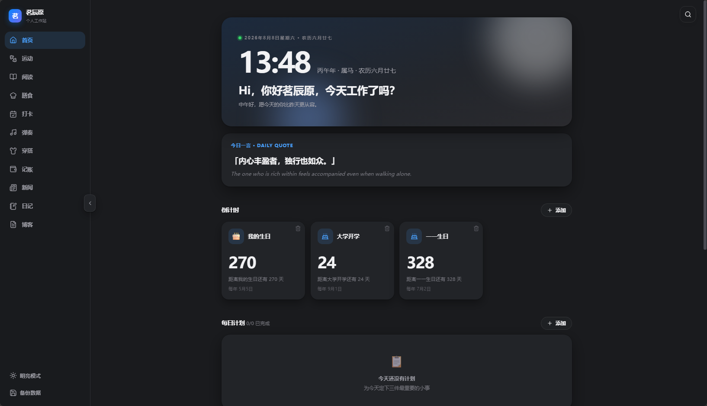

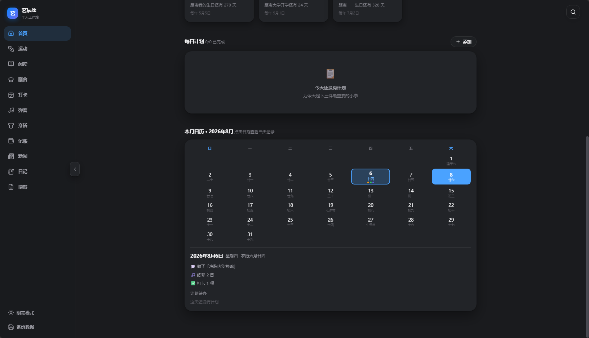

2.运动

> 可以添加想要锻炼的位置,可以自定义添加动作

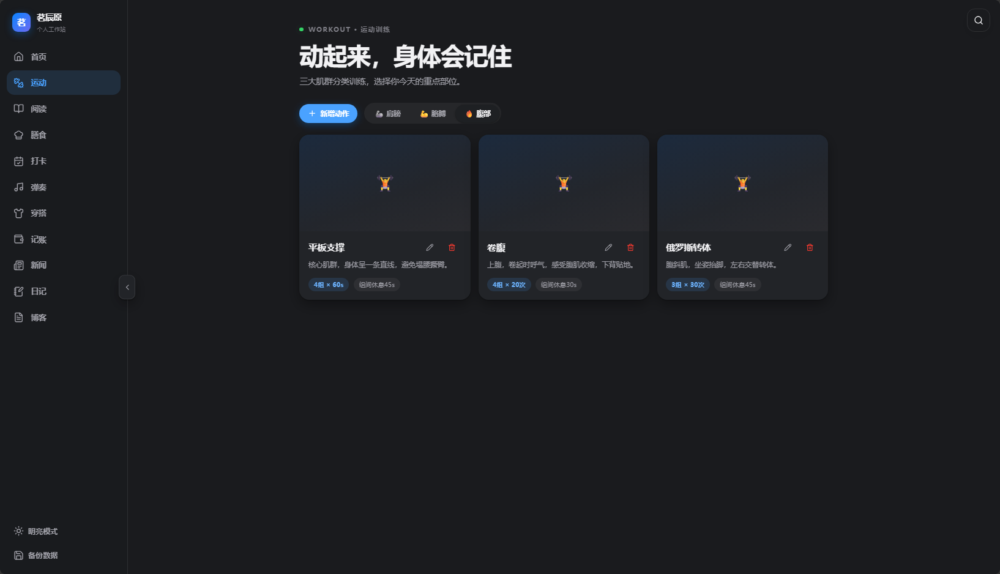

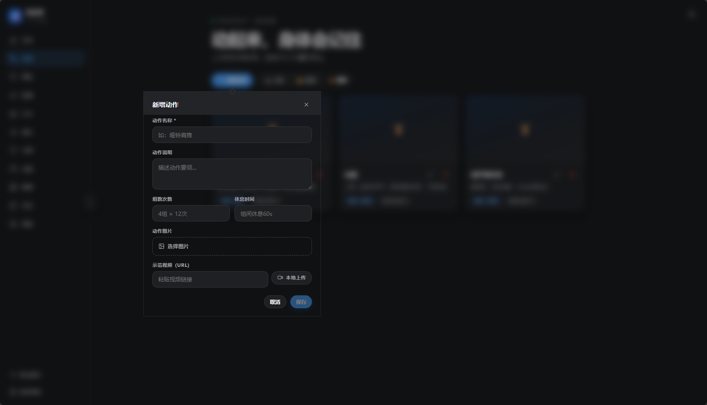

3.阅读

> 上方有推荐的书籍,以及可以搜索并且导入书籍

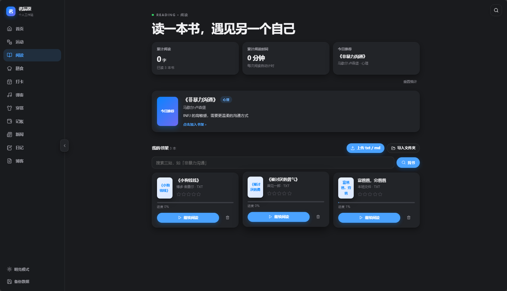

4.膳食

> 每日使用AI为我推荐膳食,以便于我学习做饭

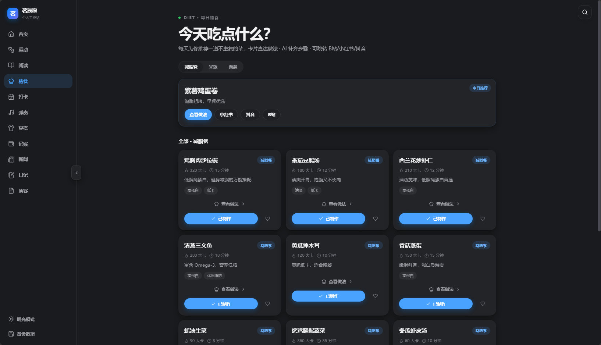

5.打卡

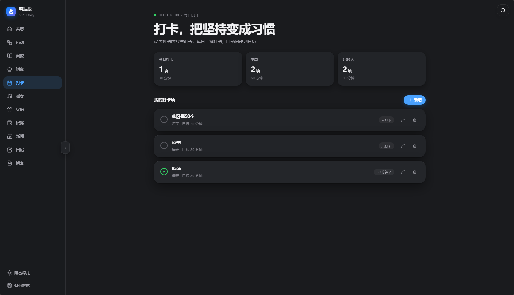

6.穿搭

> 上述自动获取所在城市的天气日期情况,并且下方含有AI生成穿搭方案

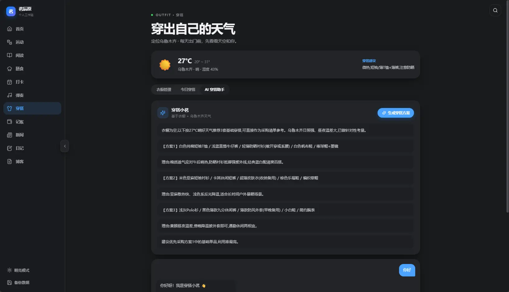

7.新闻

> 　每天获取时政，财经，科技这三个方面的新闻，每天的资料都不相同，包含各各ＲＳＳ源

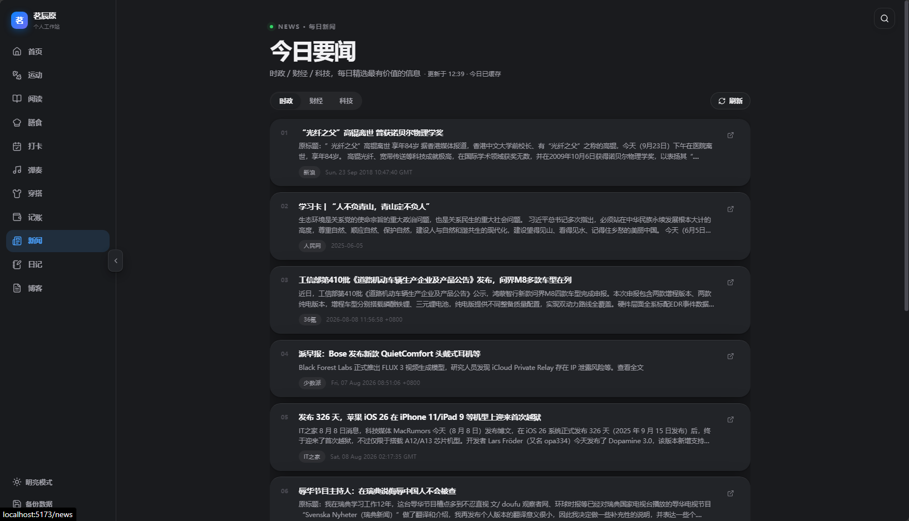

８．博客

＞　对接我的博客，点击新建自动帮我填充头部模板，可以选择归档和标签进行添加

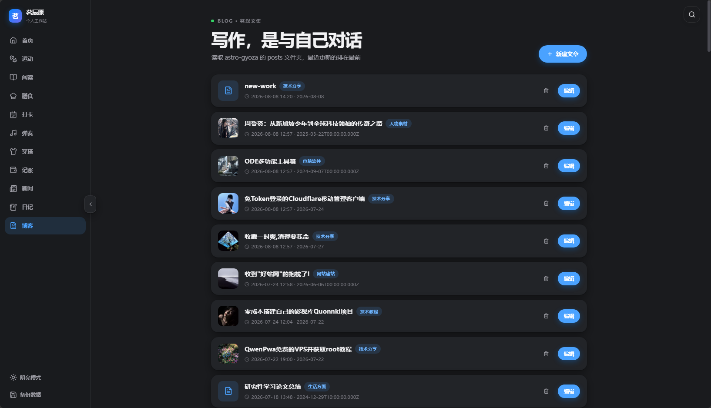

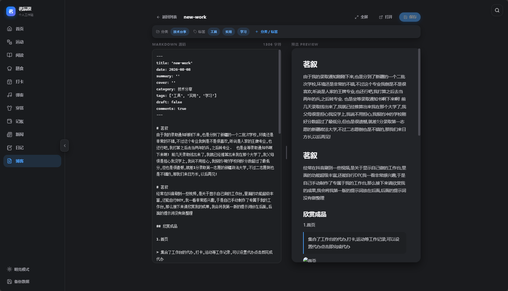

## 制作教程

### AI写的README.md

> ## 页面功能清单
>
> ### 1. 首页(Home)
>
> - 实时时钟 + 阳历 / 农历日历（含生肖、干支、节日）
> - 问候语：`Hi，你好茗辰原，今天工作了吗？`（定时段「早上/下午/晚上好」）
> - 每日一句激励文字 + 英文翻译（31 条循环每日更新）
> - 倒计时：可自定义增删（内置 **生日 2007-05-05**），显示「还有 N 天」
> - 每日计划：增删、勾选完成自动划线变暗，当日进度统计
> - **交互式月度日历**：点击任意日期高亮选中，下方展示该日的进度记录（做饭 / 练琴 / 打卡）与该日的计划待办（可勾选 / 删除）
> - 日历日期点：橙=做了膳食、绿=打卡成功、紫=练完琴，一眼看到今天和历史上的完成情况
>
> ### 2. 运动(Workout)
>
> - 三大分类标签：**肩膀 / 胳膊 / 腹部**
> - 每类默认推荐动作（组数次数 / 休息时间）
> - 后台可增 / 删 / 改动作，上传**图片**与**视频 URL**或本地视频
>
> ### 3. 阅读(Reading)
>
> - 顶部数据：累计阅读字数、累计阅读时长（自动计时）、今日推荐书籍
> - 每日推荐一本书（心理 / 精神成长 / 财富 / 编程，契合 INFJ）
> - 上传 `txt` / `md` 文件入书架；**文件夹导入**：一次性导入整个书目录，自动按文件名自然排序（`01 < 2 < 10`）分册合并、存到本地 `server/data/library`
> - **在线找书**：书架上方搜索框按书名搜三家图书站（经典书库 / 书香中文网 / 爱上阅读），一键下载 TXT 全文入书架（自动匹配今日推荐书名）
> - 阅读台（桌面端）：左侧正文、**右侧「目录 | 标注」双 Tab 面板**
>   - 目录：自动提取 `第N章/第N回/第N段/序章/尾声` 等章节标题，点击跳转，滚动阅读时当前章节自动高亮
>   - 标注：**选中文字右键**添加标注，**点击标注可跳回原文位置**（并把该段文字以淡蓝下划线标记），批注详情弹窗也自动锚定到原文附近
> - 手机端：纯净阅读模式（无右侧面板）
> - 记忆：书籍阅读进度、全部标注、阅读时长/字数累计；**1-5 星评分**，评分高的类别影响后续推荐
>
> ### 4. 穿搭(Outfit)
>
> - 顶部：**乌鲁木齐**实时气温 / 天气 / 湿度 + 自动穿搭建议
> - 三区：衣橱管理 ｜ 今日穿搭 ｜ AI 穿搭小助手
> - **衣橱管理**：拍照 / 相册上传，录入品类·颜色·季节·风格，网格展示，编辑 / 删除 / 标记闲置·常穿
> - **今日穿搭**：上传穿搭照、绑定衣橱单品、**AI 按天气评估**给优化建议 + 鼓励文案、自动存历史
> - **AI 穿搭小助手**：根据衣橱 + 实时天气生成多套方案，并可文字对话任意提问
>
> ### 5. 记账(Ledger)
>
> - 顶部设置：本月消费预算、本月总收入、今日收入录入
> - 记一笔表单：日期 · 平台（抖音/快手/拼多多/淘宝/外卖/线下/其他）· 金额 · 物品 · 备注
> - 今日消费清单：时间排序、当日总消费统计、可删除
> - 年度总览：12 个月收支柱状图、年度收入/支出/结余、消费分类占比饼图，可切换年份
>
> ### 6. 新闻(News)
>
> - 时政 / 财经 / 科技 三类新闻，各取最有用的 **10 条**
> - **来源多元化**：同一分类内按来源轮流收录，避免单一站点霸榜；跨分类相同文章只收录一次
> - **点击直达原文**：点击新闻标题在浏览器新标签打开原网页
> - **每日本地缓存**：每天首次打开自动联网抓取并缓存到本地，当天再进直接读缓存秒开；第二天自动清缓存重新拉取
> - 卡片式列表，下拉或「刷新」按钮可强制当天重拉
>
> ### 7. 膳食(Diet)
>
> - 三个标签：**减脂餐 / 米饭 / 面条**，内置菜谱，**每天按日期自动更换**推荐不重复
> - 每道菜的卡片：热量 / 时长 / 标签 / 简介
> - 点击「查看做法」弹出做法：食材 + 分步做法；可 **AI 补齐步骤**（专业厨师提示词）
> - 一键跳转 **小红书 / 抖音 / B站** 搜索该菜（搭配实操 / 跟做视频）
> - **已制作** 按钮：把菜名写入首页当天日历；**收藏** 保存到本地
>
> ### 8. 打卡(Check-in)
>
> - 自定义打卡项：内容 / 频率（每天·每周·每月·自定义）/ 目标时长 / 备注
> - **打卡** 按钮一键记录当日完成，自动同步到日历
> - 今日 / 本周 / 近30天 打卡次数与总时长统计
>
> ### 9. 弹奏(Music)
>
> - 只内置一把 **尤克里里**（可自定义图片 / 名称 / 描述）
> - **点击乐器后使用瀑布式布局**展示乐谱卡片（两列自适应、移动端单列），浏览更高效
> - **AI 每天推荐 5 首简谱**（简谱数字谱，AI 未配置时用内置曲库拖底）
> - **添加自定义曲目**：手动输入曲名 / 风格 / 简谱，与每日推荐一起出现在瀑布流中，可删除
> - 每首乐谱：**已完成**同步到日历，**收藏** 保留在「我的收藏」横向滚动条
>
> ### 10. 日记(Diary)
>
> - 与「一本日记」1diary 同步（**ZIP 导入 / 导出**，内含 `source.json` + 图片）
> - 列表 + 日历两种浏览方式
> - 新建 / 编辑 / 删除日记
> - 账户管理：记录 1diary 网页版账号密码，快速打开 https://1diary.me/web/
>
> ### 11. 博客(Blog)
>
> - 读入 Astro 博客的文章目录（`BLOG_POSTS_DIR`，每个文件夹一篇文章），按 **最后修改时间倒序** 排
> - **新建文章**：提示输入文件夹名称（校验命名规则 + 重名提示），自动生成 `index.md`（内置 frontmatter 模板）
> - **写作模式**（左源码 / 右预览）：
>   - 左右分栏、**可视化作**（`react-markdown` 实时预览，支持标题/表格/代码/图片等）
>   - 高度**自适应屏幕**，中间的**分栏可拖拽**调节源码/预览宽度（20%–80%）
>   - **全屏写作**按钮，一键铺满屏幕沉浸写作
>   - **脏检**：有未保存内容离开时会确认提示
> - **文章信息条**：写作区顶部实时显示当前 `分类` 与 `标签`
> - **分类 / 标签面板**：点「分类/标签」弹出，直接**选择已有分类与标签**（自动从全部文章聚合，无需翻文件），也支持**自行新增**，改动即时写入 frontmatter
> - **保存**：写入 `index.md`；**打开**：用系统默认程序打开文件（本地专用）；**删除**：删除整篇文章文件夹（点标记对话框）
> - 与主站 Astro 同构：文章正文使用 Markdown，Astro 加载解析 frontmatter 即可展示

### 我的提示词

复制下面我的提示词到WorkBuddy或者ｏｐｅｎｃｏｄｅ（我的工具）

> 我想要做我自己的工,需要液态苹果样式,部署到 微信小程序或者在本地运行,在了解我的所有需求前,不要进行工作,将本项目的相关信息写入README.md
> 适配平台：手机端和电脑端响应式设计，适配手机和电脑宽度导航方式：左侧固定纵向导航栏（可
> 折叠/收起），图标+文字形式，选中态高亮
> 设计风格：清新简约风，液态苹果风格,主色调建议使用淡蓝色再加点奶油白,黑夜模式采用灰黑色+淡蓝色的配色，光影质感模拟阳天空与水，
> 自然清新；拒绝花里胡哨彩色,暗黑风视觉舒适护眼
> 交互体验：页面切换平滑过渡，按钮有点击反馈，支持下拉刷新
> 【页面一：首页】
> 点开后右侧任务栏显示今日时间日历包含农历阳历，和以下文字：Hi，你好茗辰原今天工作了吗？
> 体细一点高级一点）下面每日更新一句激励共勉的文字和英文翻译
> （字
> 增加倒计时选项，比如距离xx生日还有多少天，可自定义删除增加。(我的生日2007年5月5)
> 每日计划放在倒计时下面，可自己增加删除每日计划，做完了打钩，自动划线变暗。
>
> 【页面：运动】
> 分类方式：三大训练分类标签页切换（肩膀/胳膊/腹部)
> 每个标签都要有最新推荐的动作训练,可以在后台添加和更改图片视频,以及自己编辑相关动作
>
> 【页面：阅读】
> 顶部数据展示：累计阅读量、累计阅读时间
> 核心模块：每日推荐我一本书,关于(心理/精神/财富/编程等)(我是infj人格,自行推荐)
> 卡片内容：同步书籍封面+名称,可以自定义上传txt文件或者md文件
> 阅读模式：点击之后是个专业的阅读台,左侧为阅读的文字,右侧可以选择标注,可选中文字右键标注内容,手机端则展示阅读模式,没有标注功能
> 记忆机制：记住所有的标注,以及书籍的阅读进度
> 附加功能：可给书籍打1-5的小星星的评分,后续推荐书籍可以参考推荐评分系列类书籍
> 【页面：穿搭】
> 三大分区：圃衣橱管理|雪今日穿搭|AI穿搭小助手
> 定位天气：自动获取新疆省乌木鲁齐实时气温、天气状况
> 衣橱管理
> 支持相机拍照/相册上传衣物图片；录入品类、颜色、季节、风格
> 网格展示全部衣物，可编辑、删除、标记闲置/常穿
> 今日穿搭
> 上传当日穿搭照片，绑定衣橱单品；AI自动评估穿搭是否适配当日天气，给出优化建议，附带鼓励文案；自动
> 保存穿搭历史记录
> A1 穿搭小助手
> 根据衣橱现有衣物+实时天气，自动生成多套穿搭方案；支持文字对话，自由询问各类搭配问题
>
> 【页面：记账】
> 顶部设置项：本月消费预算、本月总收入、今日收入录入
> 记一笔表单功能:
> 选择日期、购物平台（抖音/快手/拼多多/淘宝/外卖/线下/其他）、填写消费金额、购买物品、备
> 注；底部「记一笔」提交按钮
> 今日消费清单：按时间排序展示所有记录，统计当日总消费，支持删除条目
> 年度总览面板：12个月收支柱状图、年度总收入/总支出/结余、消费分类占比图表；可切换年份查看历史
> 数据
> 【页面：新闻】
> 时政、财经、科技三类新闻，所有新闻每天实时更新(各平台取其对我最有帮助的10条,卡片样式,点开即阅读模式)
> 【页面： 日记】
> 使用一本日记同步,后台可以添加账户和密码,自动登录一本日记的网页版,默认使用默认云来读取日记内容,并且可以添加日记,进行编辑写作

# 随机图

