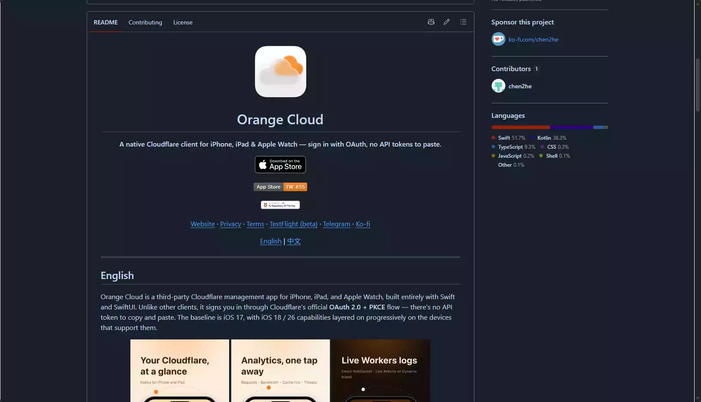
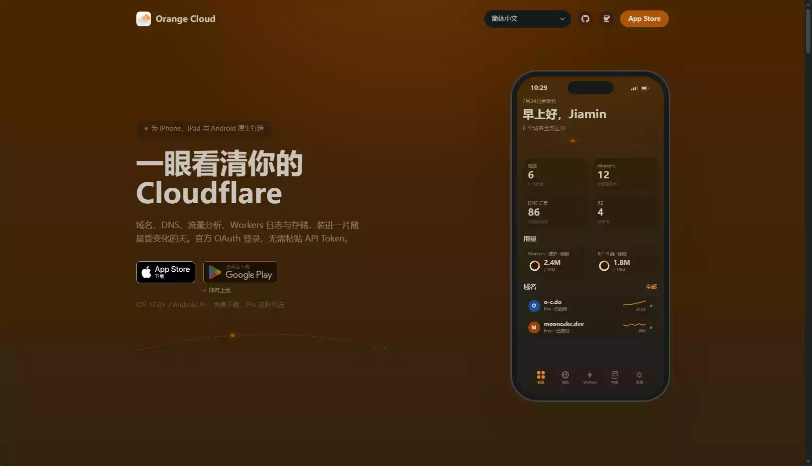

# 茗述

不知道大家有没有跟我一样,平时用 Cloudflare 都是在网页后台或者命令行里操作——改个 DNS、查下 Workers 日志、看看流量、管管 R2 对象。但是!要是半夜躺在床上,突然想用手机临时排查一下,网页那套体验真的有点折磨……

我在网上也搜过不少第三方客户端,但大多都要求你自己创建 API Token 再复制粘贴进 App,又麻烦又不安全,有的还烂尾了。直到我发现 **Orange Cloud** 这个开源项目,一个面向 iPhone、iPad、Apple Watch 的 Cloudflare 原生客户端(Android 版功能已经完整,正在封闭测试中)。最关键的是——它用官方 OAuth 2.0 + PKCE 登录,**不用再手动粘贴 Token 了**!

我觉得这玩意儿挺良心的,于是打算自己写一篇,给那些也想在手机上运维 Cloudflare 的朋友们 😌

## 项目地址

[https://github.com/chen2he/orange-cloud](https://github.com/chen2he/orange-cloud)

作者是 chen2he,目前 248 Stars,采用 **AGPL-3.0 + Commons Clause** 协议,代码开源。

> orange-cloud/
> ├── apps/
> │ ├── ios/ # iOS / iPadOS / watchOS App（Swift / SwiftUI，Xcode 工程）
> │ ├── android/ # Android 客户端（Kotlin / Jetpack Compose）——功能完整，封测中
> │ └── web/ # 落地页 + OAuth 回调中转（Next.js on Cloudflare Workers）
> ├── package.json # pnpm workspaces 根
> └── turbo.json

## 它能干啥

说白了,它就是解决移动端运维的问题。很多 Cloudflare 操作平时都在网页或命令行里做,Orange Cloud 把这些能力搬到了原生 App 里,适合在手机上临时排查和处理。

覆盖的模块还挺全的:

🔎 **DNS**:看 Zone 列表,增删改 DNS 记录,切换代理状态。

🔎 **Analytics**:通过 GraphQL Analytics API 展示流量数据。

🔎 **Workers**:查看脚本列表和详情,还支持类似 `wrangler tail` 的实时日志——这个对排查问题真香。

🔎 **Snippets**:支持查看、编辑、新建 zone 级 Cloudflare 边缘代码及其触发规则。

🔎 **存储**:R2、D1、KV 全覆盖。

🔎 **安全与网络**:还包括 WAF 规则和 Cloudflare Tunnel 状态。

> 💡 如果你也像我一样用 Cloudflare Tunnel 做内网穿透(我之前写 QwenPaw 教程就是这么搞的),能直接在手机上看 Tunnel 状态,还是挺方便的。

## 登录方式才是关键

传统第三方客户端经常要求你自己创建 API Token,再复制到 App 里,又麻烦又不安全。

Orange Cloud 用的是 OAuth 2.0 + PKCE,可以按 scope 授权,支持多账号切换,凭据存在 iOS Keychain 或 Android Keystore 里。省心,这点我挺喜欢的。

## 坚持原生,这点好评

iOS 端用 Swift / SwiftUI,Android 端用 Kotlin / Jetpack Compose,**没有走 Flutter 或 React Native**。仓库里还有 `apps/web/`,用于官方落地页和 OAuth 回调中转。

原生系统集成也做得很深:

- **iOS 侧**:小组件、控制中心控件、Siri 捷径、Spotlight、iPad 双栏布局、Apple Watch 和 Live Activity
- **Android 侧**:Material You、折叠屏 / 平板布局、桌面快捷方式、Quick Settings 磁贴和预测性返回

## 门槛

如果只是用官方版本,从 README 提供的 App Store / TestFlight 入口获取就行,这个没啥门槛,白嫖党狂喜。

但是!如果你想自己编译 iOS 版本,坑就来了:

1. 需要 codex,打开 `apps/ios/Orange Cloud/Orange Cloud.xcodeproj`
2. 配置自己的 Bundle ID、App Group、Signing Team

自编译还有一个**关键点:OAuth 回调**。README 说了,官方的 Client ID 和回调中转不开放给第三方构建使用。所以自己编译时得创建自己的 Cloudflare OAuth Client,并部署自己的 callback relay(可以参考仓库里的 `apps/web/`)。

> 📌 协议也不是普通 MIT。项目采用 **AGPL-3.0 + Commons Clause**,代码开放,但 Commons Clause 会限制你直接拿去商业销售。不过 README 也说了,自行编译时可以通过 `OPENSOURCE_UNLOCKED` 编译条件解锁全部功能。

# 下载

url="https://o-c.do/zh-Hans"

目前只支持IPhone,暂还没商家Google Play

## 结尾

那么到这里就结束了!这个开源客户端我是真觉得不错,尤其对咱们这种爱折腾 Cloudflare 的人,手机上能随时看 Workers 日志、管 DNS,真挺香的。

有想知道的或者已经在用的,可以在底下评论跟我聊聊哦!有什么坑也欢迎一起交流避坑 😌

随机图:

