# 茗述

有人会问我，Agent 为什么不选很火的 Codex，或者之前推荐的 DSH，而偏偏是这个新发布的 Pi？我的理由如下：首先，Codex 安装很复杂，很难配置；其次，你还需要 CC switch 来配管模型，其实占用 CPU 也很大。而 Pi 非常的迅速，而且配置非常的简单。

## 什么是 Pi

Pi 是一个`极简`、`可自我扩展`的终端原生 AI 编程助手。它的核心哲学是：`只用四个基础工具`，其余一切能力都通过插件和 Skill 按需组装。本文基于实际操作流程整理，覆盖从零安装到自制插件的全部环节。

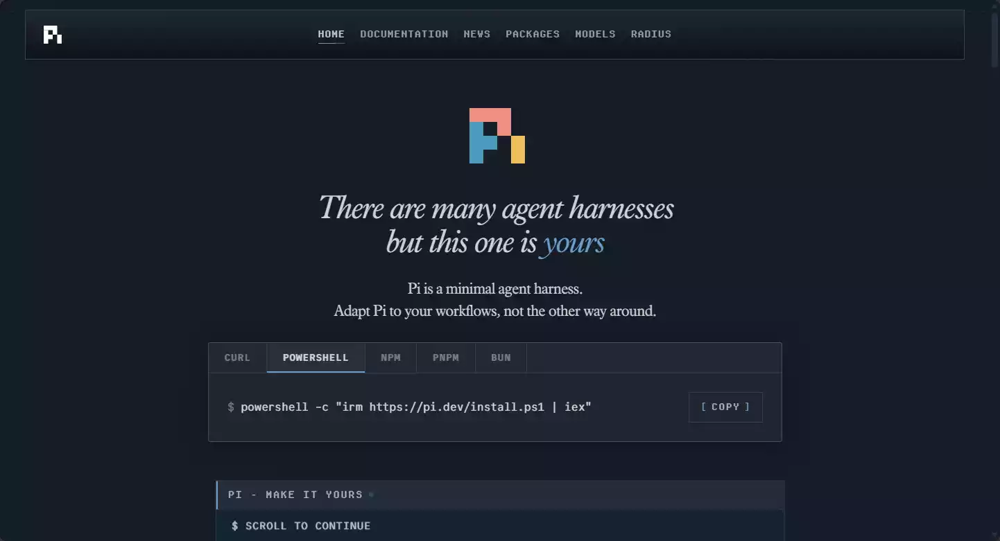

> 本次提到的所有指令，以及所有教程都来自于：抖音 https://v.douyin.com/1lBmehgbwQQ/

## 一、安装与启动

Windows

Pi 官网提供 `PowerShell `一键安装命令，复制后在终端中执行即可：

```powershell
powershell -c "irm https://pi.dev/install.ps1 | iex"
```

安装完成后，关闭并重新打开终端，让环境变量生效，然后输入：

```bash
pi
```

如果安装过程中 Pi 询问是否安装 **Node.js**，选择“是”。Windows 下还会询问是否安装 Git，建议输入 `w`，让 Pi 自动安装 **Git Bash**。

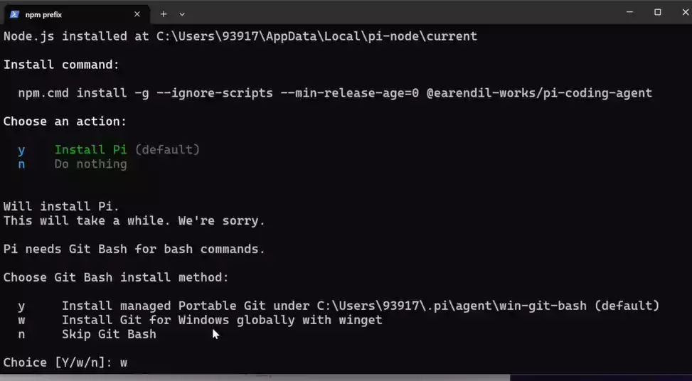

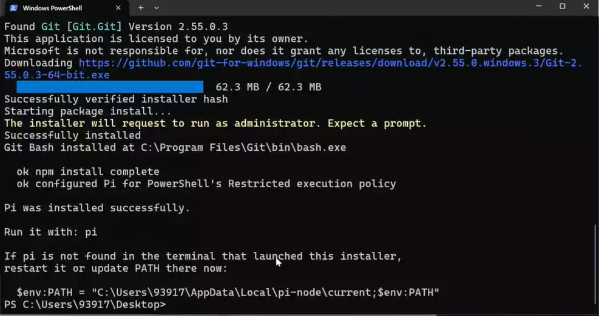

全程全自动：<ins class="wavy">自动检测环境、配置环境、安装 Pi Agent，而且启动只需要 pi 这一个指令就可以直接启动。</ins>

macOS

macOS 使用 curl 一键脚本：

```bash
curl -fsSL https://pi.dev/install.sh | sh
```

安装完成后同样需要重新打开终端，然后输入 pi 启动。

## 二、模型与登录

登录与切换模型

首次使用需要配置模型。在 Pi 交互界面中输入：

```
/login
```

Pi 会引导你选择模型供应商。输入 `/model` 可随时切换当前模型。快捷键方面：

· <kbd>Ctrl</kbd>+<kbd>L</kbd>：快速打开模型选择器
· <kbd>Shift</kbd>+<kbd>Tab</kbd>：切换模型的“思考强度”（thinking level），在需要深入推理时调高，日常编码时调低

两种接入方式

方式一：`API Key` 直连

选择 DeepSeek、OpenAI 等供应商，直接粘贴 API Key 即可。

方式二：模型`订阅`登录

选择 “Sign in with account”，以 OpenAI Codex 为例，浏览器会弹出登录页面，完成登录后即可使用 ChatGPT 订阅内的模型。

我这里使用的 API 方式接入，使用的 https://platform.sensenova.cn/console/keys 这个平台获取 keys。

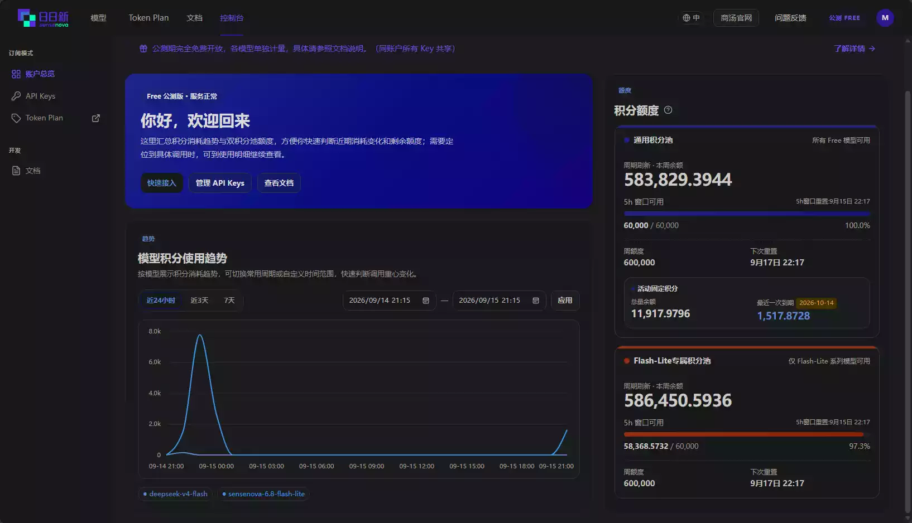

> 基础参数
> baseUrl: https://token.sensenova.cn/v1
> api 协议类型：openai-completions
> 模型列表：
>
> 1. sensenova-6.7-flash-lite
> 2. deepseek-v4-flash
> 3. deepseek-v4-pro

这些模型都可以**免费使用**，这里使用 `sensenova-6.7-flash-lite` 模型。

> /model

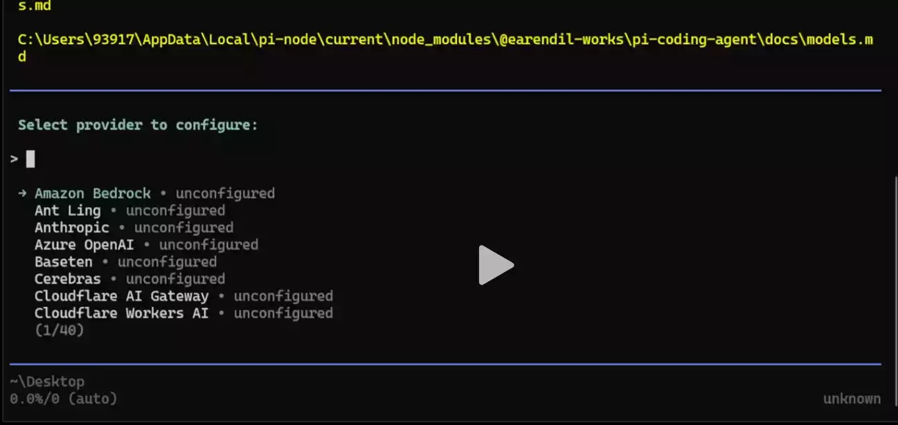

## 三、项目开发与运行命令

进入项目

在项目文件夹中右键打开终端（或在终端中 cd 到项目目录），输入 `pi` 即可启动。Pi 会将后续生成的代码写入当前目录。

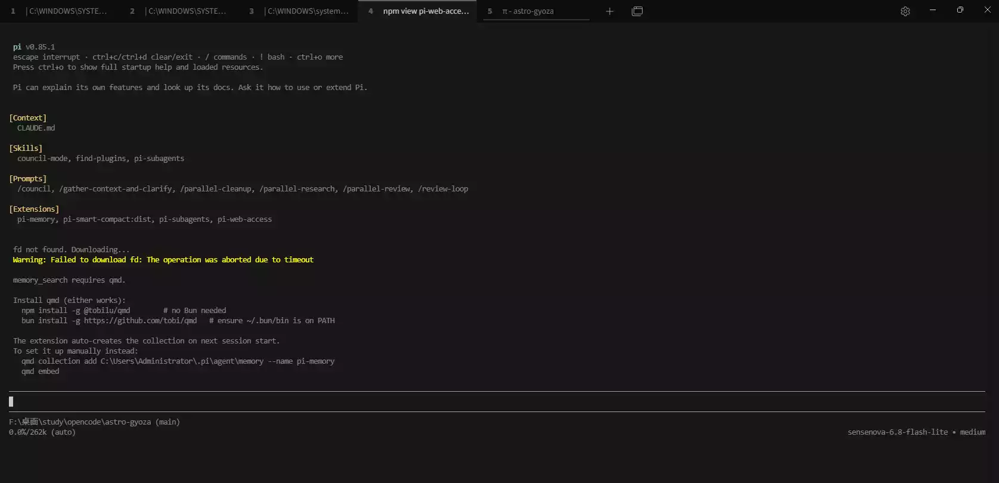

多行提示词

· <kbd>Shift</kbd>+<kbd>Enter</kbd>>：在输入框中换行，不立即发送
· <kbd>Ctrl</kbd>>+<kbd>G</kbd>>：打开系统记事本编辑提示词，保存后内容自动带入 Pi

执行 Shell 命令

Pi 的 `bash 工具`是它执行系统命令的入口，但你也可以在提示词中直接用 `!` 前缀触发：

```
!npm run dev
```

`单个 !` 表示命令在**当前窗口运行**，<ins class="dot">AI 能看到执行结果</ins>>。如果不想让 AI 看到输出，用双感叹号：

```
!!npm run dev
```

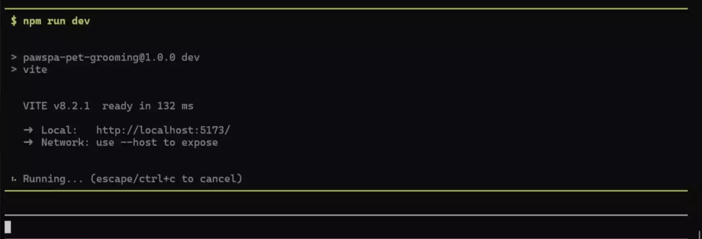

Pi 的 bash 工具非常强悍，也不需要额外的 bash 工具。上方的运行结果 Pi 能直接看到，并帮你修改错误。

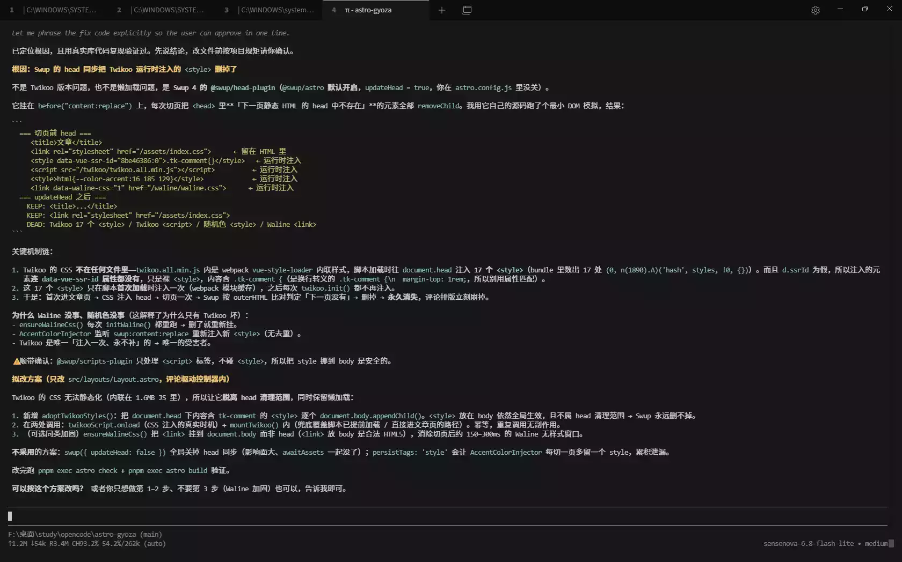

## 四、会话管理（Session）

Pi 的会话管理是其区别于其他工具的核心能力之一，所有历史以树形结构保存。

基础命令

| 命令 | 作用 |
| :----- | :------------ | :------- |
| `/new` | 新开会话，清空上下文 |
| `/clone` | 复制当前会话，保留历史从头开始 |
| `/fork` | 从某个对话节点分叉出新会话 |
| `/tree` | 进入对话树，可视化回退历史、创建分支 |
| `/compact` | 手动压缩上下文，节省 Token |

从命令行恢复会话：

```bash
pi -c          # 从最近一次会话继续
pi -r          # 弹出历史会话列表，选择恢复
```

回退时的三种选项

在 `/tree` 中回退到某个历史节点时，Pi 会提供三个选项：

· no-summary：彻底回退，丢弃后续所有历史，不保留任何痕迹
· summarize：让 AI 总结被丢弃的分支，作为上下文保留
· custom summary：自定义总结方式，你可以指定总结的侧重点

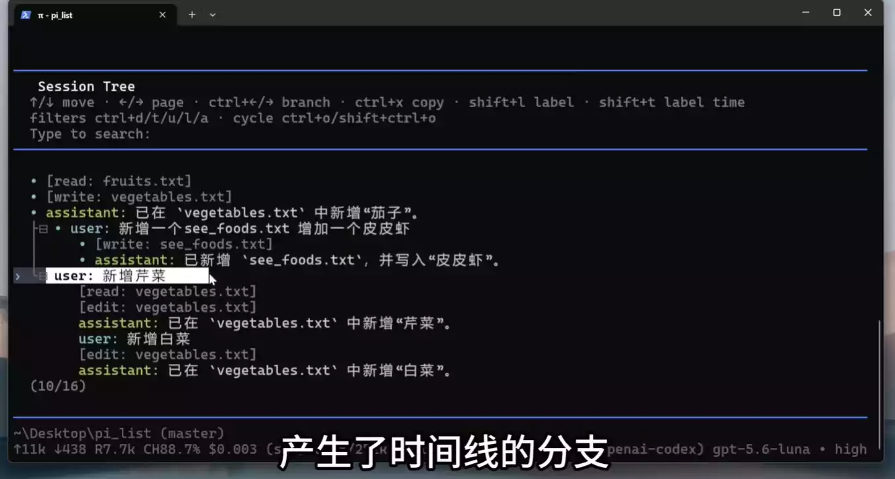

状态栏信息含义

Pi 界面底部会显示一组实时指标：

· ↑：本次会话累计输入 Token
· ↓：累计输出 Token
· R：整个会话的缓存命中率
· ch：最近一次请求的缓存命中率
· %：上下文窗口占用率
· auto：自动上下文压缩是否开启
· sub：当前使用订阅计费（成本仅供参考）

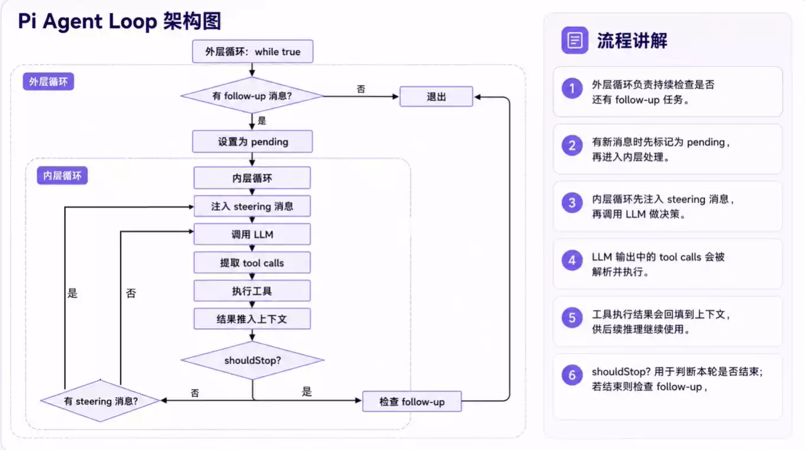

## 五、指令追加模式

Pi 支持两种在任务执行过程中追加指令的方式：

**Steering（默认）**

直接输入指令并回车。含义是“中途打方向盘”——指令会立即注入当前轮上下文，改变 AI 的执行方向。

**Follow Up（排队）**

· Windows：Alt+Enter
· Mac：Option+Enter

指令会排队，等当前任务完成后自动执行。按 Alt+↑ 可以取回排队中的指令重新编辑。

Windows 用户注意：PowerShell 默认将 Alt+Enter 绑定为全屏切换，需要在 PowerShell 设置中删除该快捷键，否则会冲突。

## 六、一次性非交互模式

Pi 可以作为纯 CLI 命令使用，适合脚本和自动化：

```bash
pi -p "查找今天天气，在桌面写 weather.txt"
```

`-p` 模式下 Pi 执行完即退出，不进入交互界面。也支持 JSON 输出（--mode json -p）和 RPC 模式（--mode rpc），便于与 IDE 等外部程序集成。

## 七、插件扩展（Extensions）

Pi 自带四个核心工具：`read`、`write`、`edit`、`bash`。其余所有能力——联网搜索、子代理、MCP 支持、微信接入——都通过扩展系统添加。

通用安装方式

```bash
pi install <插件名>          # 全局安装
pi install <插件名> -l       # 项目级安装（local）
pi uninstall <插件名>        # 卸载
```

安装后如果 Pi 正在运行，输入 /reload 重新加载。

我推荐的一些插件

· `pi-webaccess` — 联网搜索与网页提取，零配置接入 xMCP。
· `pi-sub-agents` — 并行运行多个子代理。作者示例：同时设计 5 种不同风格的个人网页。
· `pi-mcp-adapter` — 让 Pi 具备 MCP（Model Context Protocol）能力，自动读取项目根目录的 .mcp.json。
· `pi-btw` — 旁路对话。用 /btw 问题 提问，不打断主任务，答案单独输出。
· `pi-plan-mode` — 计划模式。先写 plan.md，确认后再执行。命令：/plan-mode。
· `pi-go` — 多轮目标迭代。命令：/go "目标描述"。作者示例：用它迭代开发 HTML 坦克大战。
· `pi-dynamic-workflows` — 动态工作流，调度多个子代理协同工作。命令：/workflows。
· `pi-wechat-assistant` — 微信接入。命令：/wechat-login、/wechat-start。

> 所有插件都可以去：https://pi.dev/packages 官网，进行搜索下载，这里因为时间原因不一一放出来，按需取即可

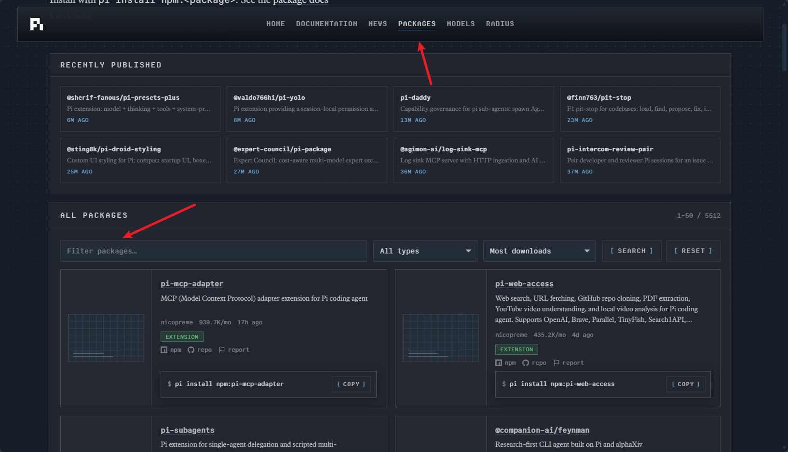

MCP 配置文件

在项目根目录创建 .mcp.json，即可为 pi-mcp-adapter 提供 MCP 服务器配置。作者示例中配置了高德地图 MCP，填入申请到的 Key 后即可使用地图相关能力。

## 八、Agent Skills（技能）

Skill 是比插件更轻量的按需功能包，通过 `/skill:name` 命令调用。

目录位置

```
项目级：.agents/skills/<技能名>/skill.md
全局：  ~/.agents/skills/<技能名>/skill.md          （Mac / Linux）
        C:\Users\<用户名>\.agents\skills\...        （Windows）
```

推荐的一些 Skill

· `playwright-cli` — 浏览器自动化。作者示例：打开 Google 并访问 Pi 官网。
· `markdown-convert` — 文档转 Markdown。作者示例：将 PDF 转为 Markdown。
· `edge-tts` — 文本转语音，免费且无需 API Key。

Skill 来源

· **GitHub 源码**：将仓库中的 skills/xxx 目录复制到 .agents/skills/ 下
· **SkillHub**：下载 zip 包，或让 AI 自动安装
· **依赖提示**：如果技能提示缺少 uvx，直接让 Pi 安装即可

## 九、外部 Web UI

Pi 本身是**纯终端工具**，社区提供了 **Web UI **前端。启动命令以 npx 开头（视频中使用的是社区项目 pi-webui 类工具）。

关闭浏览器标签后，重新运行相同命令即可再次打开。

Web UI 主要功能

· 左上角：切换项目 / 自定义路径
· 左侧文件浏览器：直接浏览和打开项目文件
· 模型按钮：添加 Provider（如 Kimi / Moonshot），填入 API Key
· 技能 / 插件管理：开关式管理，区分 project 和 global 层级
· 添加技能：搜索并安装，可选项目级或全局
· 对话框：支持 / 命令、@ 引用文件、Ctrl+V 粘贴截图
· 状态显示：调整思考强度，显示 Token 用量与预估花费

## 十、长期记忆与全局提示词

项目级记忆

在项目根目录创建 `agent.md`。每次在该项目中启动 Pi，内容会自动带入上下文。作者的做法：让 Pi 通读项目后，将关键知识写入 `agent.md`。

全局提示词

```
Mac/Linux：~/.pi/agent/agent.md
Windows：  C:\Users\<用户名>\.pi\agent\agent.md
```

对所有项目生效。作者示例：在全局提示词中禁止批量删除文件和目录。

追加系统提示词（更高优先级）

```
~/.pi/agent/append_system.md
```

内容会直接追加到 Pi 的系统提示词中，优先级高于 agent.md。一般场景建议先用 agent.md，只有需要覆盖底层行为时才用 append_system.md。

## 十一、安全与权限

Pi 的默认安全边界

Pi 仅在包含插件或 Skill 的陌生目录启动时，询问一次“是否信任”。运行后无沙箱限制，可以读写文件、执行任意命令。

官方推荐方案

在容器或虚拟机中运行：`WSL、Hyper-V、Docker、K8s` 等。Pi 轻量、启动快、内存占用低，适合批量部署。

社区权限插件

`pi-permission-system` 可以在敏感操作前弹出审批窗口。作者在视频中未演示，认为它会拖慢日常效率，更适合对安全性要求极高的场景。

## 十二、源码架构概览

视频最后简要分析了 Pi 的源码结构，核心要点：

· 极简核心：只有 read / write / edit / bash 四个工具
· 扩展系统：所有附加能力以插件形式加载，不污染核心逻辑
· 会话树：历史以树形结构存储，支持分支和回退
· 多模式运行：交互 TUI、打印模式、JSON 模式、RPC 模式共用同一套会话引擎

Pi 的设计哲学是：`核心保持最小，能力按需生长`。你不需要一次配置所有东西，遇到需要时让 Pi 自己帮你构建即可。

# 说到最后

初次体验这个agent感觉很不错，我让他帮我完成twikoo 和waline的评论系统的丝滑切换功能，三次说明就帮我完成了，确实存在一点bug，但是也能修复，它的检测功能很强，确定没有问题之后才为我完成任务，一共消耗了60%上下文（一共256k），但是有个不知道是好是坏的问题，就是它考虑的太多了，直接建议我将twikoo和waline本地化，当然我同意这样做了，所以暂时还没发现什么问题，生成代码的速度确实非常快！但是里面有的语法需要记，所以专门写了篇文章来，记录这些语法，便于我完成后面的任务，DSH实在是我用不惯，生成代码和占用确实有点高，可能是我安转了太多的插件，我也遇到了写到一半突然暂停了，之后就不写了，我也不清楚什么原因，本人还是喜欢用终端anent ，这样可以看到实时任务，以及工作进程，执行也并有很卡，占用也是很少！
