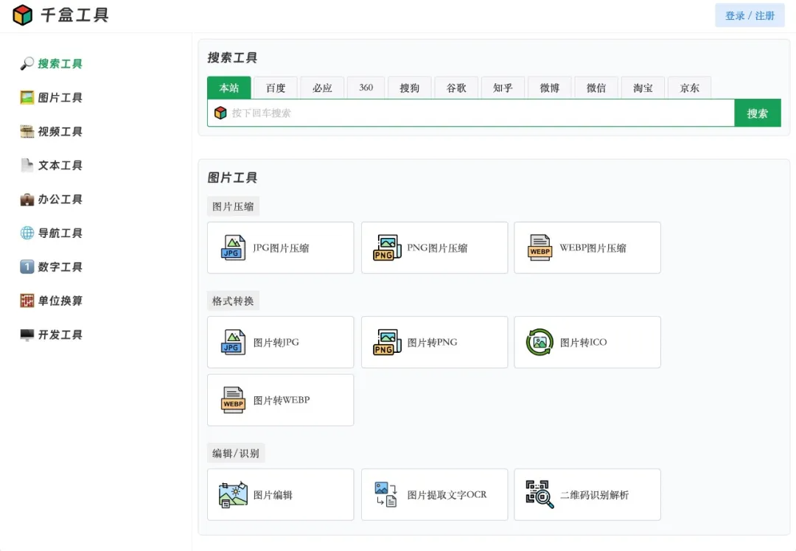

# 前言

给大家搞到了一款非常不错的在线工具箱网站，废话不多说，**直接安排**！！！

也是好久没更新Windows 程序了好吧，这次必须整活！！

# 千盒工具

这是一款非常不错的在线工具箱网站，该网站**不需要注册登录**，打开即可直接使用，网站内包含了非常多实用的在线工具，**全部都是免费的**，没有任何的套路，不论大家从事任何行业，都强烈建议各位小伙伴们**点赞收藏**，后续肯定会用到的哦！

网站主界面**如下图所示**，左侧是工具分类，右侧是工具列表，**目前包含了**搜索工具、图片工具、示拼工具、文本工具、办公工具、导航工具、数字工具、单位换算工具以及开发工具等，覆盖了多个行业，**所有工具统统免费**，非常良心！

所有工具**点击进入**即可打开使用，如下图所示，这里我就**随便打开**一个图片文字识别工具，我们只**需要上传**需要识别的图片，然后**点击立即识别**按钮即可，识别速度快，准确率高，使用非常方便！

由于该网站**包含的工具较多**，在这里就不挨个给大家演示了，很多工具都是非常实用的，比如示拼格式转换、**图片格式转换**、二维码解析、**图片压缩**、单位换算等等，大家可以自行访问使用哦！

以上就是给大家介绍的 **非常不错的网站。**

# 网页

链接：[https://1000tool.com/](https://1000tool.com/)

[https://1000tool.com/](https://1000tool.com/)
