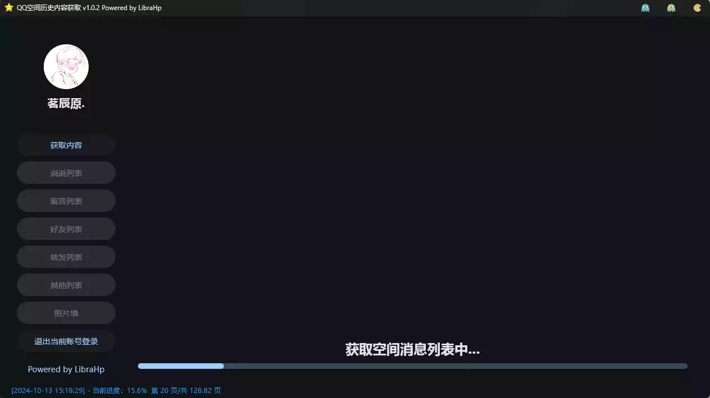
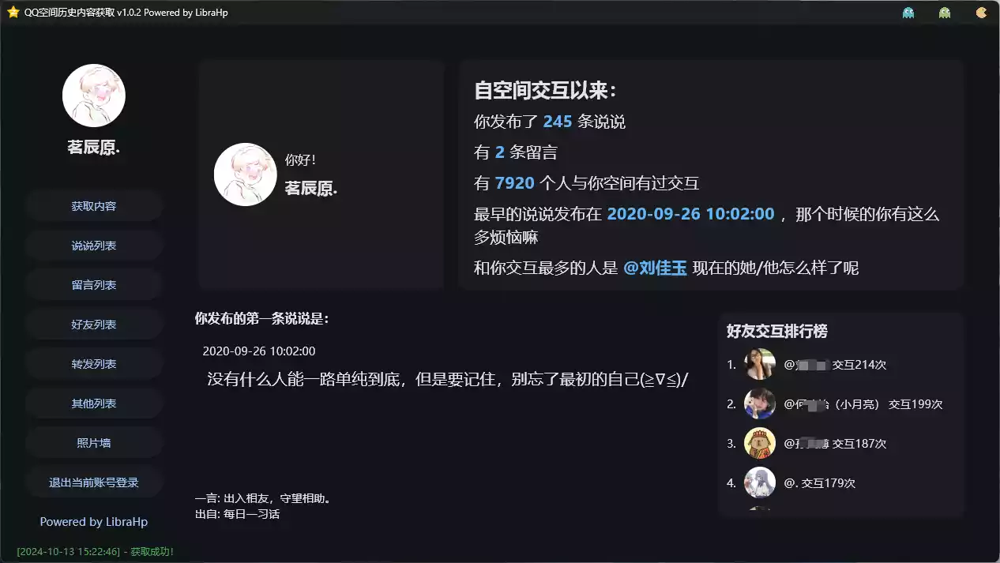

# 简介

一款名为恢复QQ空间内容小具”的软件，可以帮助用户**查看**和**同步QQ空间的留言和相册**。该软件支持Mac和
Windows系统，并提供Python的flag库进行开发。用户可以通过**扫码登录**和**导出功能**来保存和管理自己的空间内容。视频还展示了软件的操作流程和导出后的文件结构。总体而言，该工具为用户提供了方便快捷的QQ空间管理和备份功能

## 开源

[Github](https://github.com/LibraHp/GetQzonehistory?tab=readme-ov-file)

# 功能介绍

✨ 功能亮点
维码登录：只需扫描二维码，即可快速登录你的QQ空间，安全便捷！历史内容查看：轻松浏览你和好友的历史动态，记录那些美好的瞬间。
用户信息展示：显示你的QQ头像、昵称等信息，让你在使用时拥有更好的体验
多种列表选顶：查看说说、留言、好友、转发、图片等多种内容，一应俱全获取内容：提取并查看QQ空间中的所有历史内容，包括发布的说说、图片等
说说列表：查看你从最早到最新发布的所有说说内容及时间。留言列表：查看好友给你QQ空间留下的所有留言。
好友列表：获取并查看QQ空间中的好友信息。转发列表：查看你曾经转发的所有内容。
互动分析：基于好友互动的频率，展示与你互动最多的好友排行榜。
开放源代码：完全免费且开源，欢迎大家参与贡献和讨论！

🚀使用指南
打开程序后，使用手机QQ扫描二维码登录。
登录成功后，你将进入主界面，可以选择查看不同的内容。
在左侧则标签页中选择想要查看的内容列表，享受你的QQ空间回忆之旅！

## 目录结构

```
project/
├── resource/                # 资源目录
│   ├── config/              # 配置目录，文件保存位置配置
│   │   └── config.ini
│   ├── result/              # 导出结果的目录，格式为“你的qq.xlsx”
│   │   ├── ...
│   │   └── ...
│   ├── temp/                # 缓存目录
│   │   ├── ...
│   │   └── ...
│   ├── user/                # 用户信息
│   │   ├── ...
│   │   └── ...
├── util/                    # 单元工具目录
│   ├── ConfigUtil.py        # 读取配置
│   ├── GetAllMomentsUtil.py # 获取未删除的所有说说
│   ├── LoginUtil.py         # 登录相关
│   ├── RequestUtil.py       # 请求数据相关
│   └── ToolsUtil.py         # 工具
├── main.py                  # 主程序入口
├── fetch_all_message.py     # 主程序入口
├── README.md                # 项目说明文件
├── requirements.txt         # 依赖项列表
└── LICENSE                  # 许可证文件
```

# 软件展示






# 软件下载

[download](https://github.com/LibraHp/GetQzonehistory/releases/tag/gui-v1.0.2)

[download](https://pan.quark.cn/s/3a5ddbde14e2)
