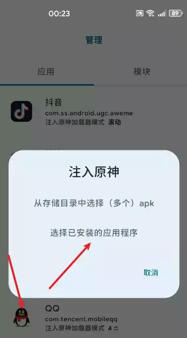
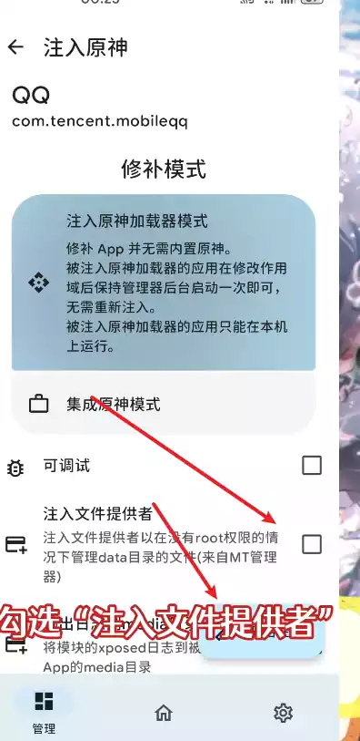
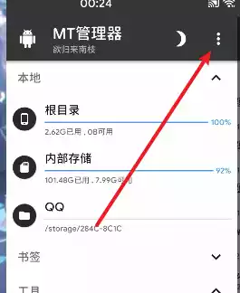
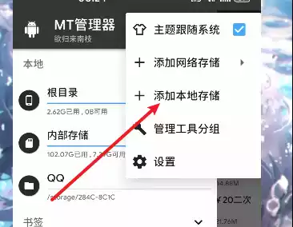
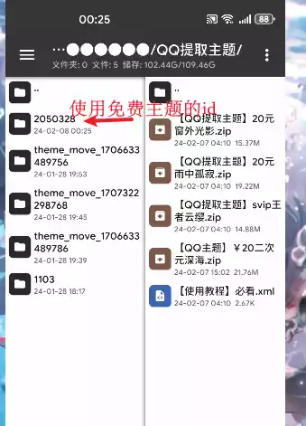
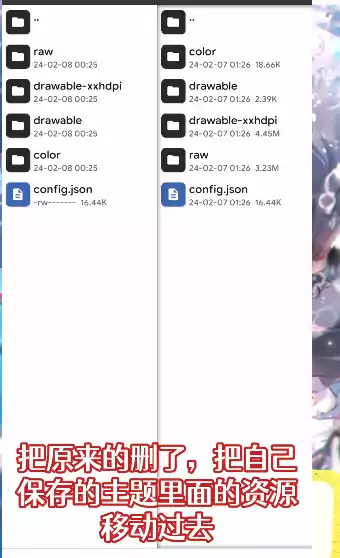
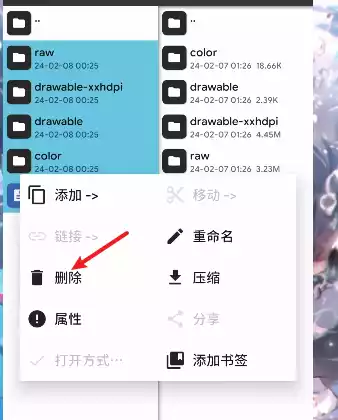
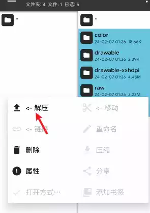
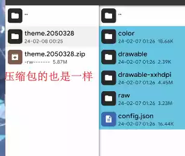
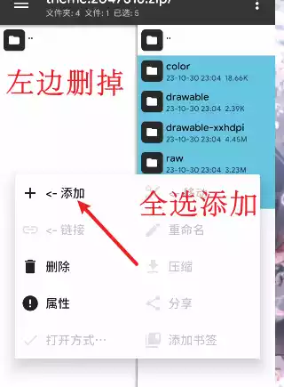

<aside>
😀 这里写文章的前言：
原理只不过是使用免费的主题，之后替换成付费的主题就行，主题而已，其他人有看不到，自己喜欢就行了

</aside>

# 前言

适配最新版QQNT版本，bilibili有教程，这里放置链接，建议一起配合使用

- 看视频请点我

  1.替换教程

  [QQ主题文件替换|QQ非(会员|SVIP)自定义主题教学#手机美化 #数码科技 #南枝QQ主题 #qq主题美化 #QQ主题文件替换 教学_哔哩哔哩_bilibili](https://www.bilibili.com/video/BV1Dp421o7Xp)

  2.锁定教程

  [关于QQ主题文件替换的情况补充_哔哩哔哩_bilibili](https://www.bilibili.com/video/BV1ZC411s7x9)

  3.提取教程

  [[1]QQ免抓包使用付费主题_哔哩哔哩_bilibili](https://www.bilibili.com/video/BV12x421Z76J)

步骤：

找到QQ系统级data数据目录（即Mt管理器提取安装包时的数据目录1）→
找到QQ主题缓存文件夹→
随便应用主题，将此主题作为准备替换的主题→
删除此主题二级/三级文件夹包括压缩包里面的文件，将下载的文件移动过去→
停止运行QQ→应用成功 重新打开即可

# 教程

## 1.OP管理器注入QQ

先用op框架/MT管理器对QQ安装包注入提供文件管理器。并重新安装注入好的QQ

点击开始注入，等待注入完成就可以安装QQ了

## 登录QQ

这里不多说，登陆上就行了~

## Mt管理使用本地储存

打开Mt管理，先点左上角三条杠，再点右边的三个点，添加本地存储，选择QQ添加进去。

<! 如果你有root，可以跳过这一步 -→

你把QQ系统级的data数据目录添加了储存器，这一部可以让你快速找到目录。

找到QQ的文件夹点击使用此文件夹，之后会在本地出现QQ的挂载

## 查找QQ主题路径

根目录和内部储存下面会有你刚刚添加的QQ目录（储存器），点进去，点data，然后找到结尾是810的文件夹，点进去。
root用户在mt管理器→提取安装包→QQ→数据目录1里面找文件夹
这里就是你QQ主题的缓存路径。

> ROOT路径 "/data/user/0/com.tencent.mobileqq/app_theme_810"
> 非ROOT路径 "/storage/你的QQ储存器/data/app_theme_810"

这一步主要是替换的目录，有关键的作用

## 回到QQ使用一个免费的主题

> ⚠️注意：使用前点击分享，之后复制链接，在ID的后面是主题的id名字，方便替换

## 正文—开始修改文件

箭头为免费主题的id，不同主题的id不同，请注意分辨

我们分别在右边准备提取的主题

左右都打开数字文件夹，一边是QQ正在使用的主题，里面是一个数字文件夹和一个压缩包。
我们要做的是，删除原来文件夹子文件夹内的内容和压缩包的内容，在每个文件(夹)名字不变的情况下，把需要的主题资源移动过去。

## 结束QQ，让后重新打开

就会奇迹的发现，自己的主题变成免费的了~

# 展示

