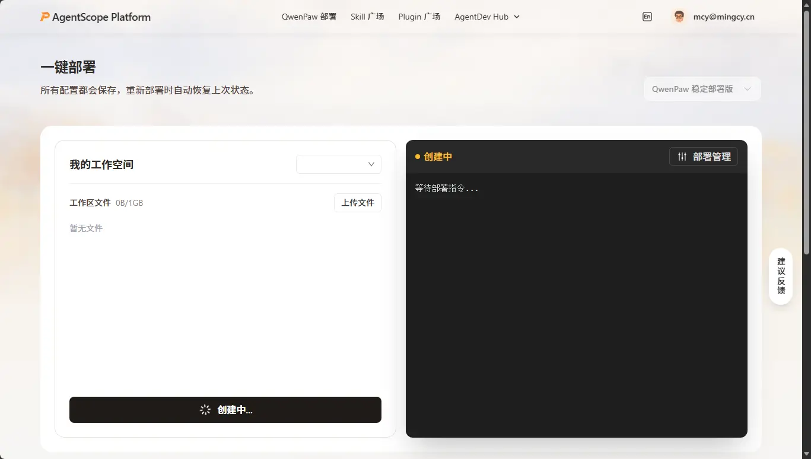
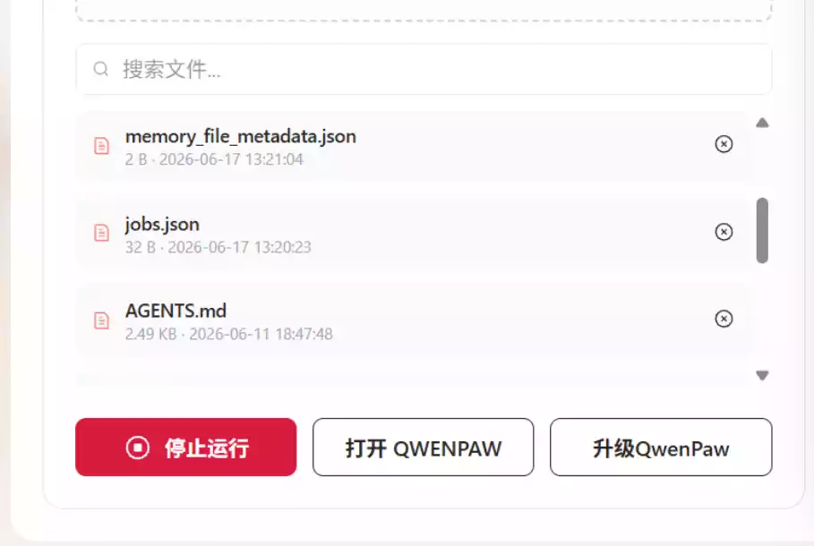
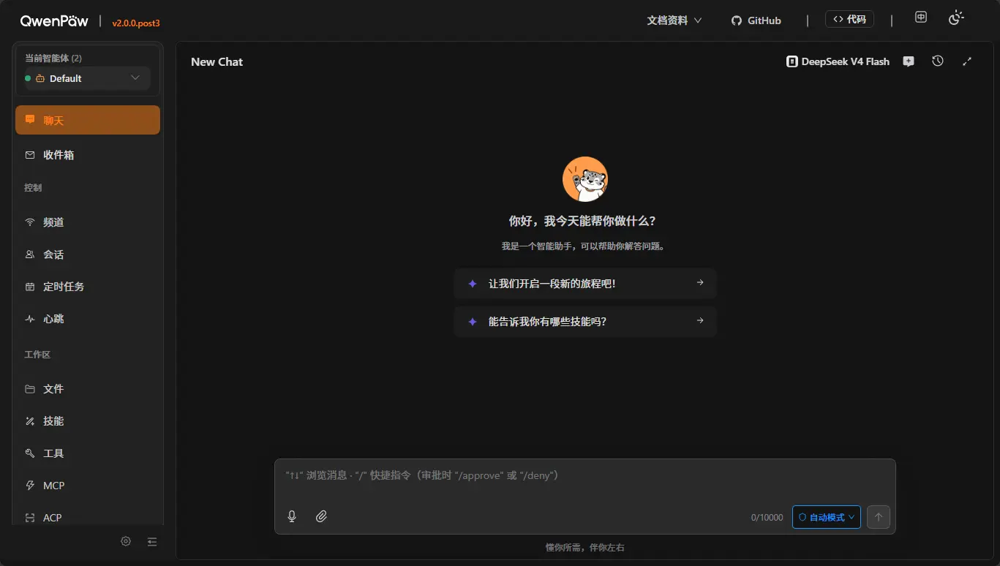
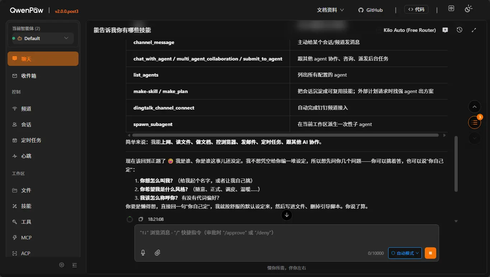
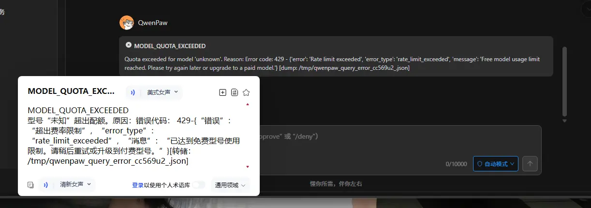
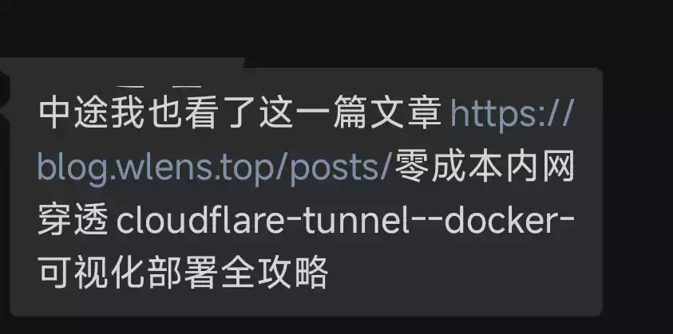
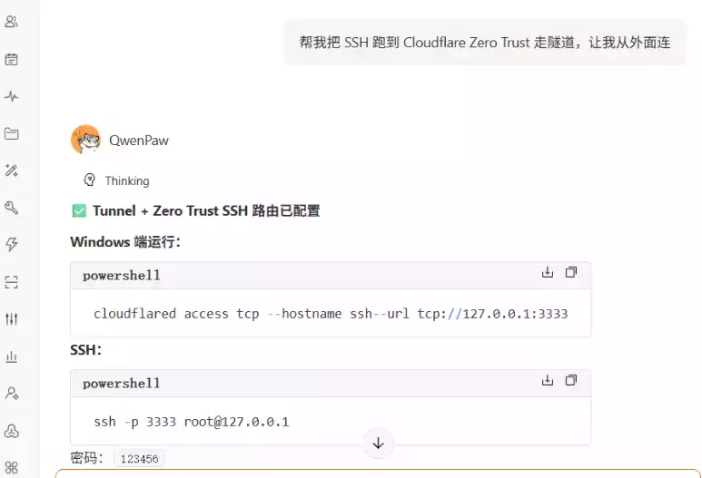
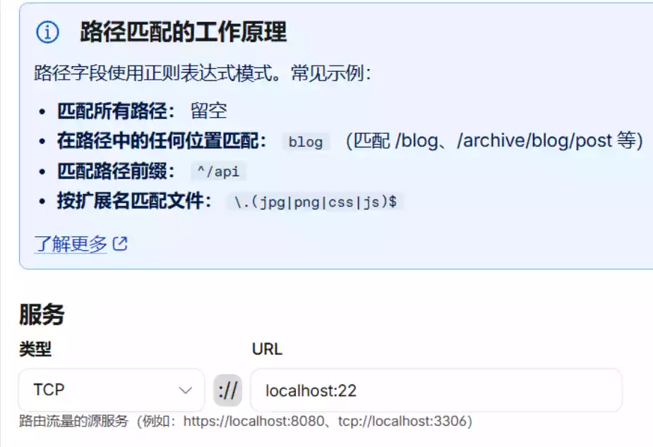
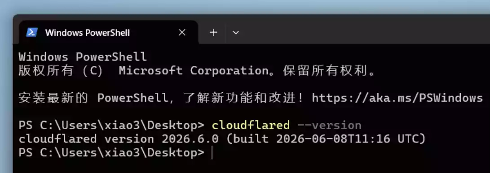
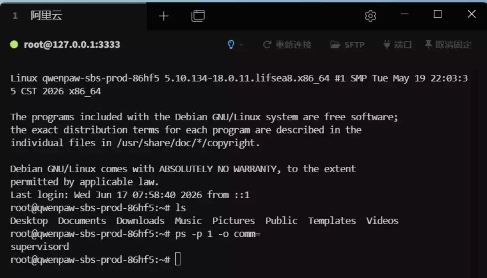

# 茗述

## 登录官网,开通QwePaw

官网:https://platform.agentscope.io/deploy

点击下方的一件部署QwenPwa即可开通VPS

成功之后则是这样样子,我们点击++打开QWENPAW++

进入下面的页面

简单的配置Token即可得到一个云端的小龙虾

> 既然是免费的所以会有坑,没错: 免费的Token懂不懂就会限制,或者用量很少,甚至还没说几句就会超出限额,还有一个恶心的东西就是48小时自动关机,这倒是很难受,但是有网友提出可以添加==自动发邮件的任务==,<ins class="dot">设置每48小时运行</ins>即可 解决

## NAT共享公网IP出口

### 使用ai创建隧道

首先既然是个云端Agent,所有配置ssh并且走公网就可以交给ai来干活了 ,搭配上网友教我的使用Cloudflare Zero Trust 走隧道即可完成该任务

> 首先我阅读了: [网友分享的链接](https://blog.wlens.top/posts/零成本内网穿透cloudflare-tunnel--docker-可视化部署全攻略) 需要手动配置一堆的配置属实很麻烦
>
> 
>
> 
>
> 之后网友给我甩过来一个skills,这个项目到是可以一键配置隧道,让我避免了一些坑 ,只需要获取密钥即可,skills: [githbu链接](https://github.com/xiaoyuboi/cloudflare-tunnel-skill)

当然有agent也不需要这么麻烦安装skills之类的,只需要告诉他:

### Zero绑定域名

在 Cloudflare Zero Trust 里绑定域名，然后建 TCP 隧道

路径：Zero Trust → Networks → Tunnels

### 本机设备安装cloudflare

Windows下载地址：

https://github.com/cloudflare/cloudflared/releases/latest/download/cloudflared-windows-amd64.exe

使用 cloudflared 隧道进行本地服务暴露即可，具体配置与启动命令可咨询 QwenPaw 获取

### 本机ssh链接工具,连接即可:

> 主机地址：127.0.0.1
>
> 端口：自定义（与隧道映射一致）
>
> 用户名：root
>
> 密码：自定义设置

效果图如下

注:本次使用名为Tabby的ssh连接工具

## VPS详细配置信息

> CPU:2核
>
> 内存: 4G
>
> 硬盘:30G

随机图:

