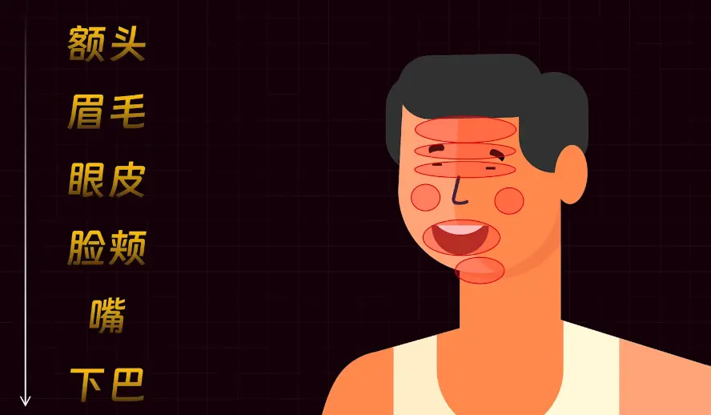
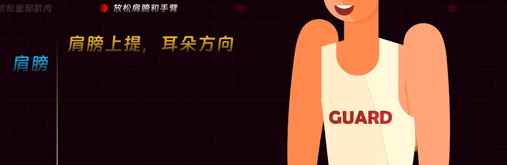
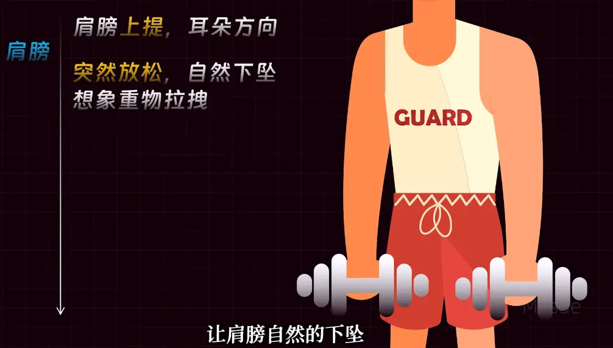
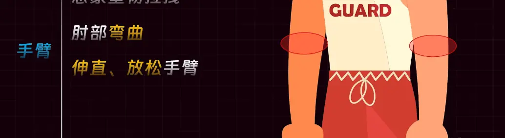
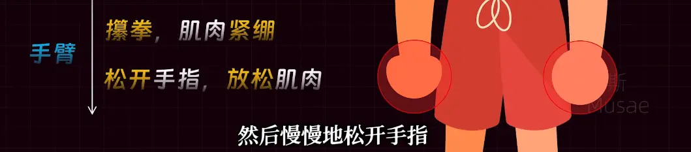
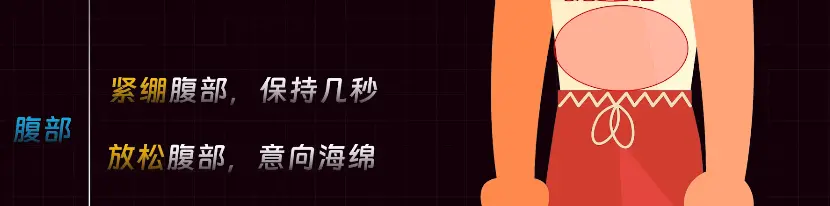
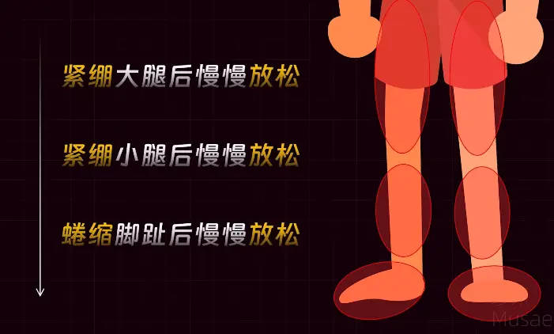
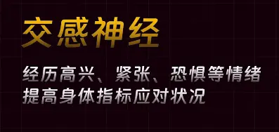

# 茗起

我们都知道,人肯定要睡觉,但躺在床上就是睡不着,这该如何解决!

请看下文!

# 教程

## 美国海军两分钟入睡法

优点:

- 速度快
- 不限姿势
- 无视环境
- 无视咖啡因

### 实操

**共有五个点!**

### 1.防水面部肌肉

先闭上眼睛,有意识的从上到下脸部,依次放松!

如图:

感觉这些部位如同失去力量一样!自然地松弛!

> 下巴放松就好,嘴可以张着,舌头自然放到口腔底部!

### 2.放松肩膀和手臂

如图,肩部自然提起,让后放下

坚持几秒之后肩膀自然下垂,感觉有哑铃在拉着你!

胳膊就像举起哑铃一样,让后再放松,感觉肌肉从紧张到松弛!

让后再是拳头,将它握拳再缓慢放开!

### 3.放松胸部和腹部

如图,先是深呼吸,将气体充入肺部,其次缓慢吐气!

再是腹部,首先发力,感觉有人要打你一拳,之后再放松腹部,如同海绵一样!

### 4.放松腿部肌肉

按照下面顺序,分别放松大腿,小腿,脚

> 要想想自己踩在软绵绵的云上如此!

### 5.清空大脑

此时你各个区域都放松了,这时候

将注意力集中到呼吸上,又慢又有节奏的去呼吸

> 杂念来了不要去驱赶,将注意力拉到呼吸上!

这个时候就可以入睡了

## 原理

人的神经有两个,一个是交感神经,一个副交感神经

你的紧绷可以使其发生交感神经,再放松就可以转到副交感神经

此时身体会感到轻松,副交感神经就会产生困倦,传到大脑皮层,这时候就能产生困觉入睡了!

# 4-7-8呼吸法

## 准备姿势

找一处安静舒适的地方，你可以选择舒服地坐下，保持背部挺直但不僵硬；也可以躺下，确保全身肌肉都能自然放松。轻轻闭上眼睛，让自己的注意力逐渐集中到呼吸上，为接下来的呼吸练习做好准备。

### 第一步：呼气

微微张开嘴巴，缓慢且平稳地呼气，同时发出轻柔的 “呼” 声，尽量将肺部的空气排空，感受腹部逐渐收缩，让身体做好迎接新鲜空气的准备。

### 第二步：吸气

闭上嘴巴用鼻子进行吸气。吸气过程要缓慢而均匀，同时心里默数 4 个数，比如 “1、2、3、4”。在吸气时，要感觉到空气缓缓进入腹部，腹部如同气球一样慢慢膨胀起来，使空气充分填满肺部。

### 第三步：屏气

当吸气完成后，停止吸气，屏住呼吸。在屏气的同时，心里默数 7 个数，即 “1、2、3、4、5、6、7”。此时，要保持身体的放松，不要过于紧张，感受空气在体内的停留。

### 第四步：呼气

再次张开嘴巴，缓慢地呼气，这次呼气的时间要更长，心里默数 8 个数，例如 “1、2、3、4、5、6、7、8” 。尽量将肺部的空气彻底排出，感受腹部再次收缩，让身体完全释放出刚才吸入的空气。

以上就是一个完整的 4-7-8 呼吸循环，建议重复进行 3 到 4 次为一组，每天可进行 1 至 2 组练习。长期坚持，有助于缓解压力、放松身心。

希望大家都能通过 4-7-8 呼吸法，收获内心的平静与安宁。如果在练习过程中有任何疑问，欢迎在评论区交流。

# 视频


<video src="https://mingcy.cn/2025/02/12/sleep/极速入睡.mp4" position= "absolute" width="100%" height="100%" controls="controls"></video>

