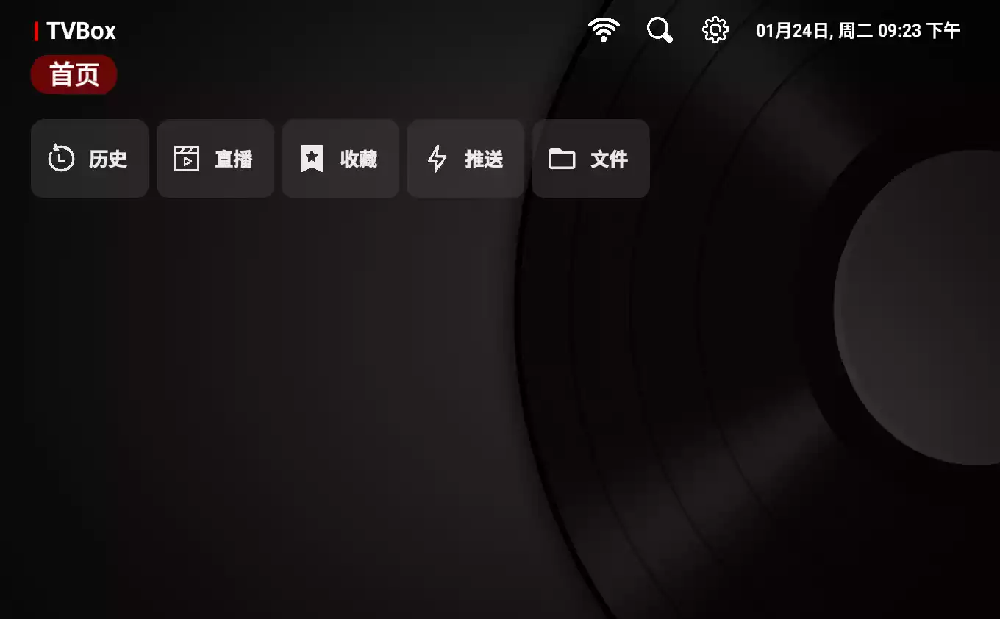
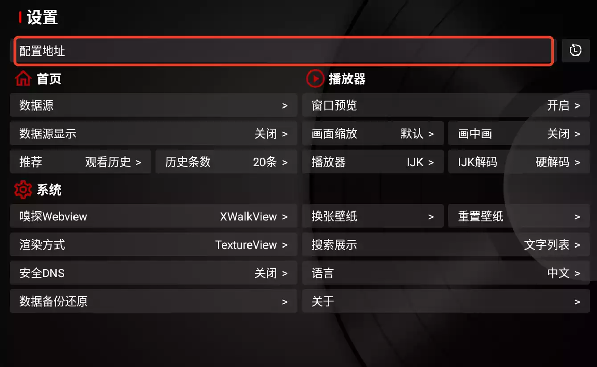
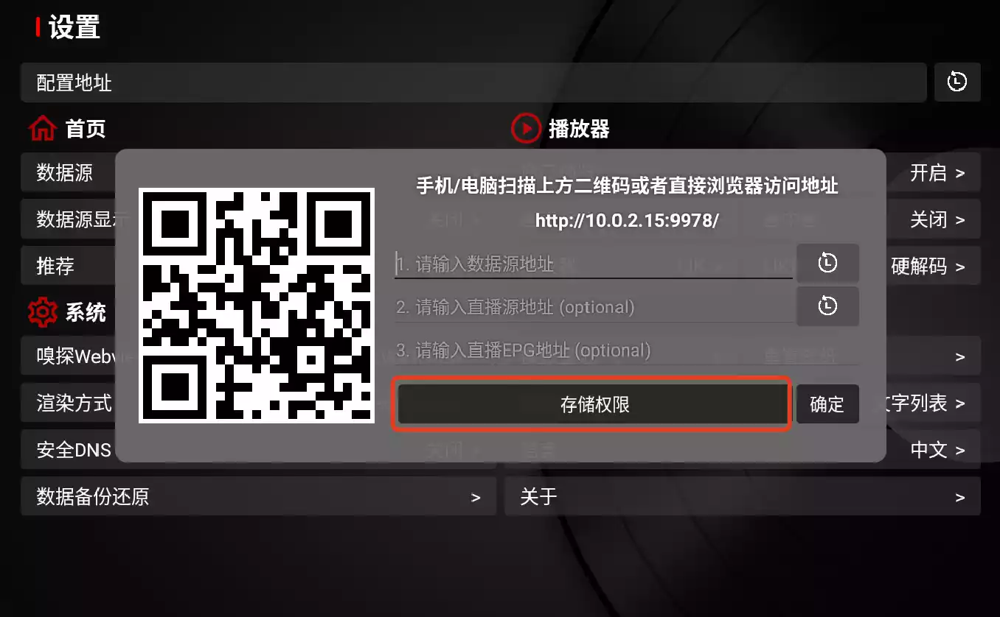
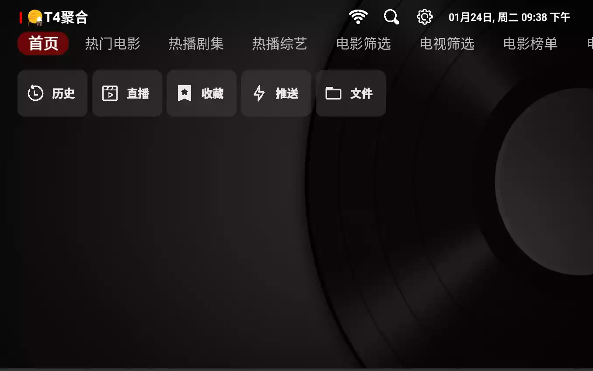

# TV版本

## 安装TVBOX

安装完以后什么都无法观看-需要配置地址

## TVBOX配置地址

首先打开右上角的设置按钮

选中配置地址

获取存储权限-提示获取成功

然后用手机或者电脑扫描二维码或者打开以上地址填入数据源地址即可

## TVBOX使用

如果失效了可以自定义数据源(推荐T4聚合)

也可以配置其他参数-自行摸索

## 接口链接

TVBox各路大佬配置（排名不分先后）：

（1）唐三：https://hutool.ml/tang

（2）Fongmi：https://raw.fastgit.org/FongMi/CatVodSpider/main/json/config.json

（3）俊于：http://home.jundie.top:81/top98.json

（4）饭太硬：http://饭太硬.ga/x/o.json

（5）霜辉月明py：https://ghproxy.com/raw.githubusercontent.com/lm317379829/PyramidStore/pyramid/py.json

（6）小雅dr：http://drpy.site/js1

（7）菜妮丝：https://tvbox.cainisi.cf

（8）神器：https://神器每日推送.tk/pz.json

（9）巧技：http://pandown.pro/tvbox/tvbox.json

（10）刚刚：http://刚刚.live/猫

（11）吾爱有三：http://52bsj.vip:98/0805

（12）潇洒：https://download.kstore.space/download/2863/01.txt

（13）佰欣园：https://ghproxy.com/https://raw.githubusercontent.com/chengxueli818913/maoTV/main/44.txt

（14）胖虎：https://notabug.org/imbig66/tv-spider-man/raw/master/配置/0801.json

（15）云星日记：https://maoyingshi.cc/tiaoshizhushou/1.txt

（16）Yoursmile7：https://agit.ai/Yoursmile7/TVBox/raw/branch/master/XC.json

（17）BOX：http://52bsj.vip:81/api/v3/file/get/29899/box2.json?sign=3cVyKZQr3lFAwdB3HK-A7h33e0MnmG6lLB9oWlvSNnM%3D%3A0

（18）哔哩学习：http://52bsj.vip:81/api/v3/file/get/41063/bili.json?sign=TxuApYZt6bNl9TzI7vObItW34UnATQ4RQxABAEwHst4%3D%3A0

（19）UndCover：https://raw.githubusercontent.com/UndCover/PyramidStore/main/py.json

（20）木极：https://pan.tenire.com/down.php/2664dabf44e1b55919f481903a178cba.txt

（21）Ray：https://dxawi.github.io/0/0.json

（22）甜蜜：https://kebedd69.github.io/TVbox-interface/py甜蜜.json

（23）52bsj：http://52bsj.vip:81/api/v3/file/get/29899/box2.json?sign=3cVyKZQr3lFAwdB3HK-A7h33e0MnmG6lLB9oWlvSNnM%3D%3A0

（24）肥猫：http://我不是.肥猫.love:63

# PC版本

## 软件介绍

ZyPlayer v3.3.1 中文版 免费全网影视播放器

**GitHub原文地址**：

[github](https://github.com/Hiram-Wong/ZyPlayer)

**使用方法：**
安装软件后，依次点开设置 -> 基础配置 -> 其他 -> 数据管理 -> 一键配置 -> 软件接口然后填入**订阅地址**，就能正常使用了。

**专用接口源:**

> 接口分享：http://xiaoguozitv.cn/catys/zyplay.json
>
> 订阅地址：https://jsd.cdn.zzko.cn/gh/ls125781003/dmtg@master/zy.json
>
> 订阅地址：https://raw.kgithub.com/cddehsy/zyjs/main/zy.json

**以上地址选第一个即可，遇到失效了就换！**

**| 软件介绍：**

**ZY Player开源播放神器复活，更强了**

用过 ZY Player 的都知道，这是一个免费开放源的播放器软件，兼容各种资源网接口，支持看视频、直播，而且这款软件已经存在了好几年了，只能说很强。

新版本颜值更高，而且功能都有很大的提升，不仅更强，而且整体界面也改版了。

ZyPlayer跟之前的一样，专注于资源网接口，同样可以选择不同的接口源，点击左上角就可以切换接口源。

而且不同源站，同样支持选择分类，分类也做得非常详细，当然还有很多细节值得体验。

基于 vue 全家桶 + tdesign + electron 开发；主题色：薄荷绿。

**已有功能**

- 全平台支持 Windows、Mac、Linux
- 适配黑暗模式
- 支持资源站 cms（json 接口）
- 支持 IPTV（m3u、genre）及电子节目单
- 支持主流视频平台解析（解析页面有个小彩蛋，可在代码里自行探索）
- 老板键，一键隐藏
- 播放器软解
- …

**|** **部分功能详细截图：**

# 软件下载

夸克:
[网盘](https://pan.quark.cn/s/4e43e04ec7be)
