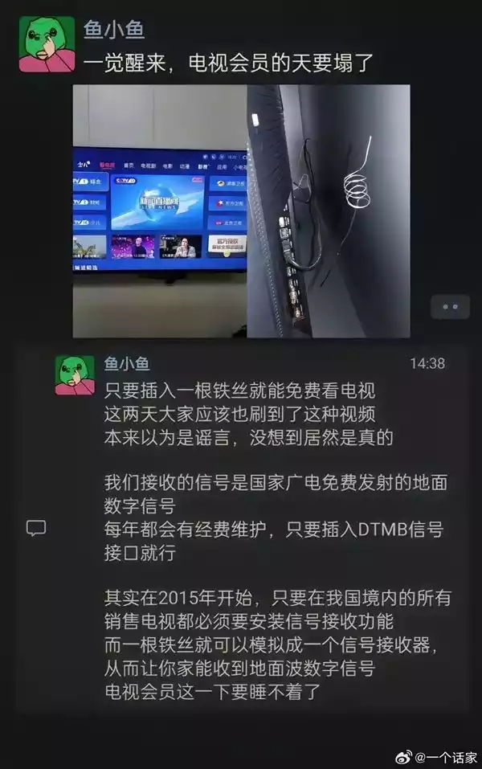
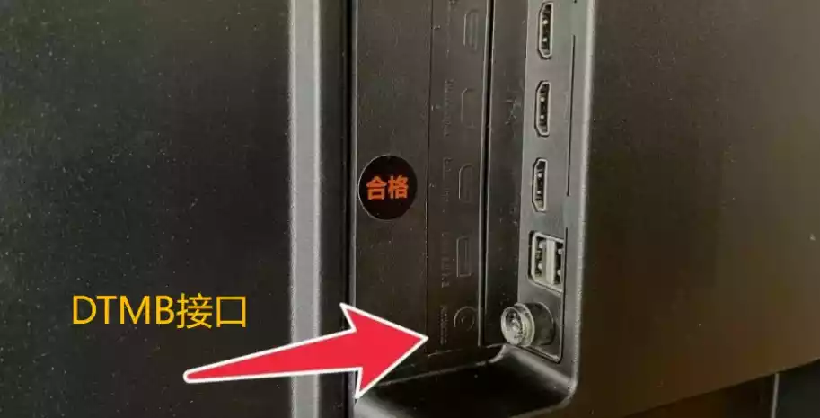
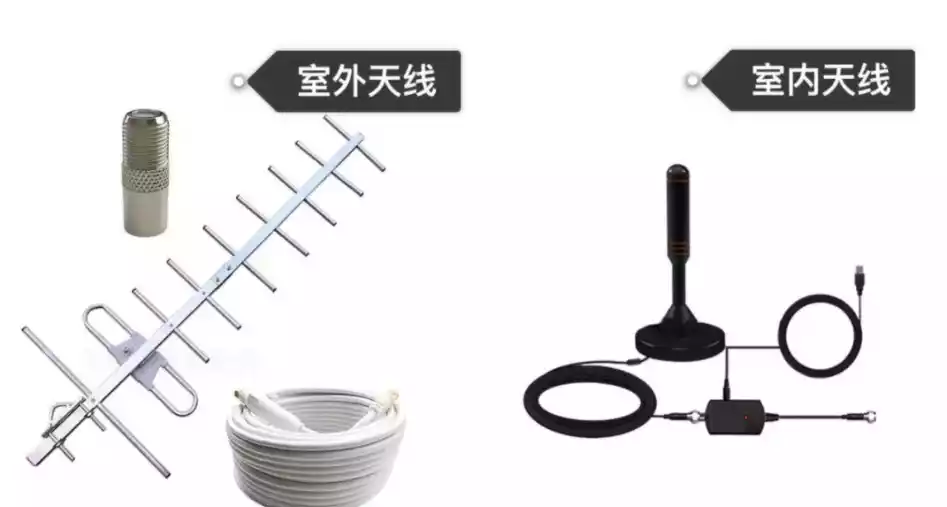
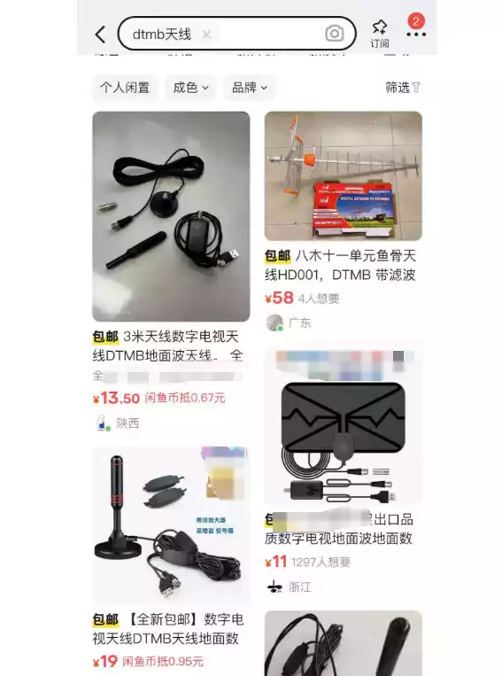
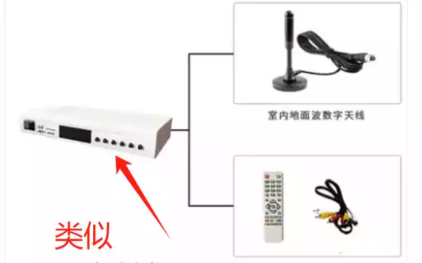
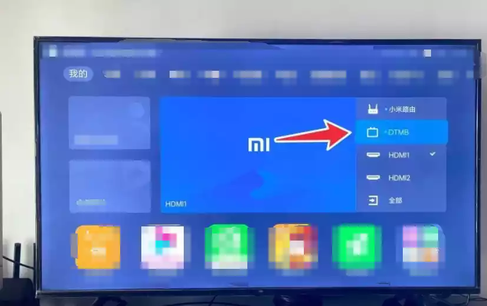

# 茗起：揭秘“铁丝免费看电视”背后的门道

在信息传播迅速的当下，各种新奇的话题总能瞬间抓住网友们的眼球。最近，“只要插入一根铁丝就能免费看电视”这样一则看似神奇的话题，便在网络上引起了广泛的关注与热议。大家纷纷好奇，一根简单的铁丝真的能有如此大的魔力，让我们免费收看电视节目吗？

其实，我们能够通过这种方式接收到电视信号，背后有着科学的原理。我们所接收的信号，乃是国家广电免费发射的地面数字信号。国家对于这些信号的维护极为重视，每年都会投入一定的经费来保障其稳定运行。而我们要做的，仅仅是将设备插入DTMB信号接口即可。自2015年起，我国便出台了相关规定，要求在我国境内销售的所有电视都必须安装信号接收功能。这就为我们利用简单的装置来接收信号提供了基础条件。一根铁丝，看似普通，却能够模拟成一个信号接收器，凭借其独特的物理特性，让我们家中的电视接收到地面波数字信号，从而实现免费看电视的可能。

为了验证这一说法的真实性，许多充满探索精神的网友纷纷展开了实测。其中，有网友别出心裁地使用了一盘铜线来代替天线。他先是小心翼翼地将铜线插入电视背部的DTMB接口，确保连接稳固。而后，考虑到信号接收的效果，他将铜线盘搭在了窗口这个相对开阔的位置，因为窗口能够更好地接收外界的信号。紧接着，这位网友在电视上把信号源调整至数字电视模式，随后开启了电视的自动搜台功能。经过一番耐心的等待，电视屏幕上显示一共搜索到了20多个电视节目，这一结果让网友们兴奋不已。这些节目涵盖了中央和地方卫视的直播内容，丰富多样，满足了不同观众的需求。

看到这一成功的实测案例后，其他网友也纷纷效仿。不少网友在尝试后反映，他们成功地搜到了卫视台，并且能够流畅地观看直播节目。甚至有网友另辟蹊径，使用家中常见的衣架来进行信号搜索，结果也令人惊喜，同样成功地搜到了信号。不过，在大家的实测过程中，也发现了一些差异。有网友表示，在农村地区，由于信号覆盖相对不足，信号强度偏弱，所以只能搜到几个央视节目。而在市区里面，信号质量更好，能够搜到的电视台数量也更多，节目选择更加丰富。

虽然这种用铁丝或其他简易装置免费看电视的方法确实为大家提供了一种新的选择，但官方却明确表示不提倡这种做法。这是因为它存在着一定的局限性和安全隐患。在农村等信号覆盖不足的地区，接收效果往往不尽如人意，无法为观众带来良好的观看体验。更为严重的是，如果安装不当，可能会导致雷击风险，对家庭电器造成损坏，甚至危及人身安全。因此，我们在面对这种新奇的方法时，一定要保持理性，将安全放在首位。

---

当然，如果大家想要更稳定、更优质地接收电视信号，享受更多的节目内容，也并非没有其他办法。我们可以花费几十块钱购买一个DTMB信号天线，这种天线能够大大增强信号的接收能力，让我们搜索到更多的节目。DTMB的天线类型大致可以分为室内天线和室外天线两种。从信号强度方面来看，室外天线由于其安装位置和结构设计的优势，肯定要大于室内天线。然而，室外DTMB天线的价格相对较高，一般需要几百元，而室内天线则相对亲民，几十块钱就能解决问题。

对于那些追求性价比的朋友来说，海鲜市场是一个不错的选择。在那里，我们可以淘到价格从十几块到上百块不等的DTMB天线。这些天线在使用上也没有太大的技术难度，一般来说，主要包括天线、电源线、天线外接智能调节器等设备。我们只需要将这些设备按照正确的方式连接到一起，就算大功告成了。

在这里，有几个特别需要注意的地方。首先，2014年之后生产的很多液晶电视都有内置DTMB模块，对于这类电视，我们只需要购买相应的天线就可以使用了，非常方便。其次，电视端需要有模拟信号DTMB接口，而只要是2014年后出厂的电视，基本都会标配这个接口。但如果是太老的电视，可能就没有这个接口了，此时则需要再有一个独立的机顶盒进行外接，才能实现通过DTMB信号接收电视节目的功能。

接下来，我们还需要在电视端切换信号源，将其转到DTMB模式。对于首次使用DTMB的用户来说，需要先进行搜索操作。具体步骤是进入DTMD>菜单>频道编辑>自动搜索/手动搜索。以小米电视为例，搜索频道需要在52.5MHz~866.0MHz之间选择。

通过这些简单的设置和操作，我们就能够更稳定、更高效地使用DTMB信号来观看电视节目了。

希望通过这篇文章，大家能够对“铁丝免费看电视”以及DTMB信号接收有更全面、更深入的了解，在享受电视带来的乐趣的同时，也能确保自身的安全和设备的正常运行。
