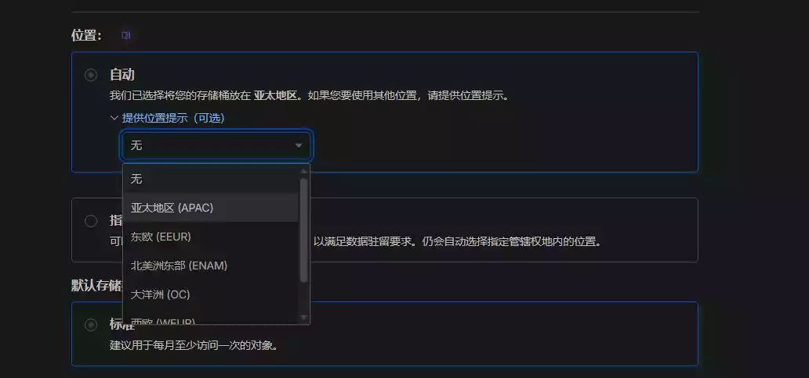
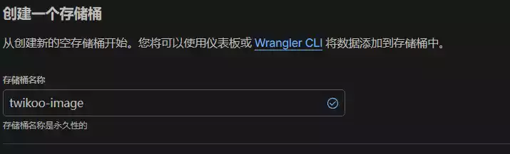
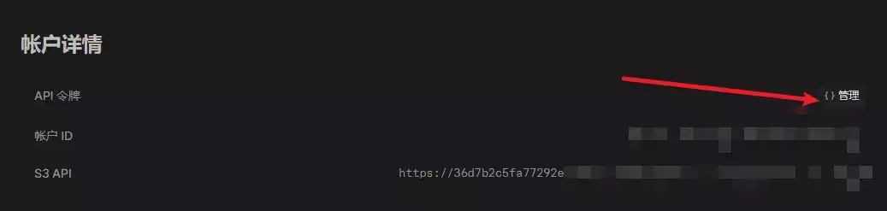
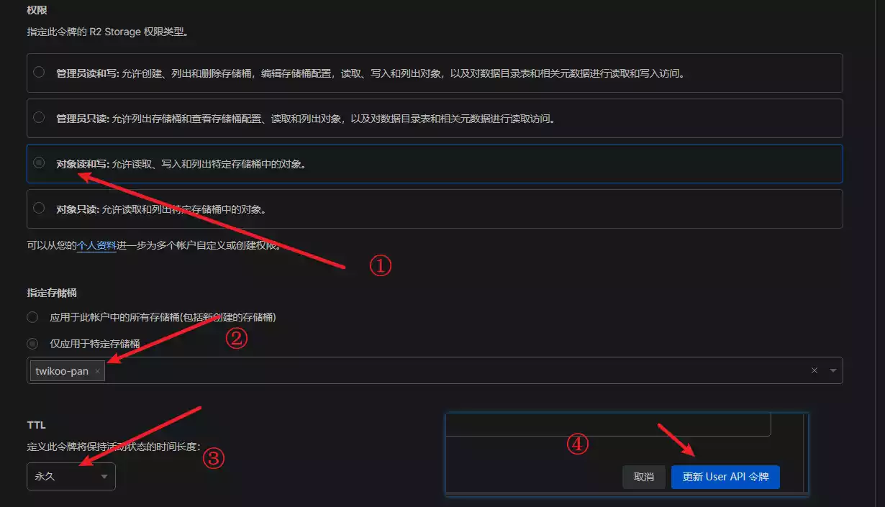
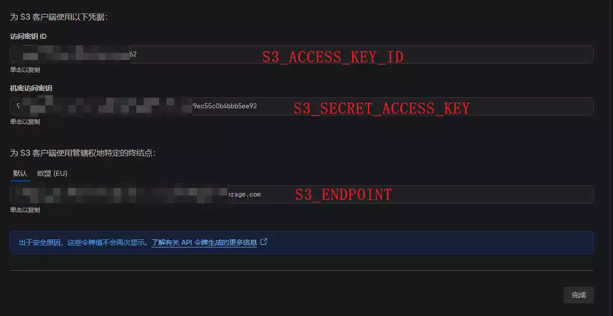
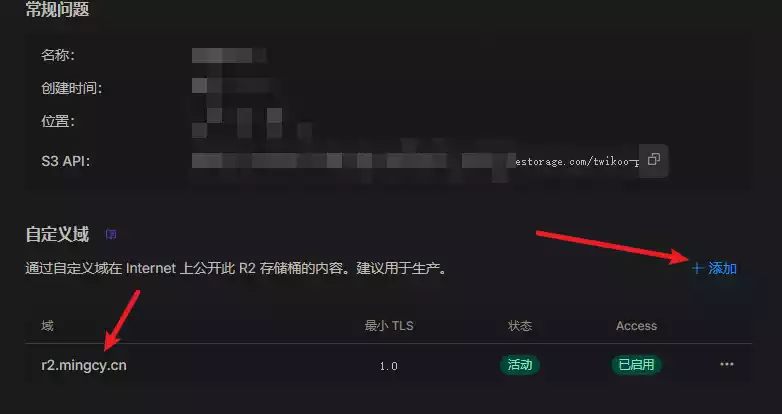
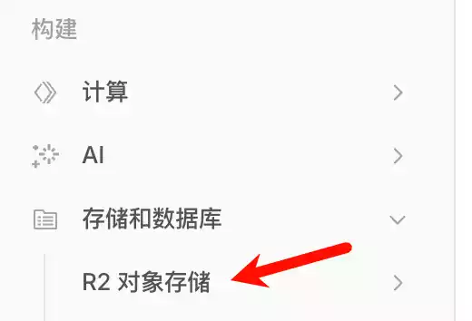
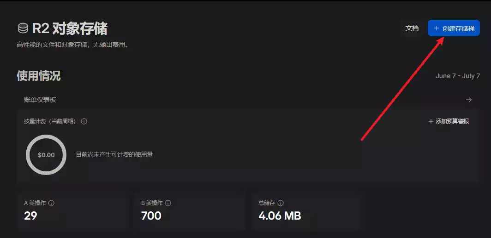
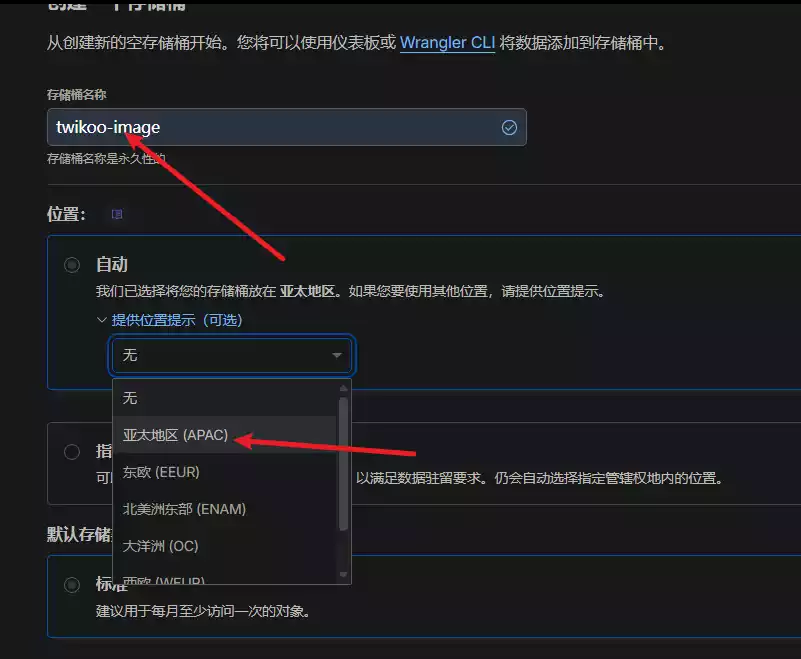

# 茗叙

今天要出去玩,练练我的开车技巧了,哈哈哈,拿到驾照快一年了,开的还不是很熟练,之前总是没时间说要开车,现在有的是时间啦!
高考结束,也是顺利收官啦! 愿我们都有一个好的前景! 都要上岸啊!
终于有时间更新博客了,最近有也是才开始玩codex,不得不说用ai写代码,真的好方便的,好多bug他都给我解决了,我去我自个改动不动就先bug,有可能会让我的shi山代码崩溃!

# 茗述

在我发现s.ee用不了之后,便想着换一个图床,不然twikoo提交不了图片还有什么意义,于是我就去网上搜各种教程,但是我发现没有很详细的,有的教程还不太全,于是我打算自己写一篇文章,给那些困与没有图床的朋友们.
由于我是学生,手上没有很多的money,所以如果有免费就尽量用免费的,能白嫖就喜欢白嫖.

### twikoo S3参数

| Twikoo 后台设置项    | 对应你获取到的内容                            |
| -------------------- | --------------------------------------------- |
| IMAGE_CDN            | 选择 S3 / R2 / MinIO                          |
| S3_REGION            | 可不填                                        |
| S3_BUCKET            | 存储桶名称（比如 twikoo-image）               |
| S3_ACCESS_KEY_ID     | 访问密钥 ID                                   |
| S3_SECRET_ACCESS_KEY | 机密访问密钥                                  |
| S3_ENDPOINT          | 终结点                                        |
| S3_CDN_URL           | 自定义域名（比如 https://img-twikoo.xxx.com） |

接下来我会一个一个教你怎么填写这些信息,首先你需要一个S3的图床搭建完成

如果你没有S3请点击: [https://mingcy.cn/2026/06/09/twikoo-S3/#S3图床](https://mingcy.cn/2026/06/09/twikoo-S3/#S3图床)

如图所示,第一个参数`S3_REGION`,填写的内容为你的**位置** 信息,我这里选择的是亚太地区,所以我的配置填写的:**apac**

`S3_BUCKET` : 对应着名称:twikoo-image

第一步点击管理

第二步设置以上内容

以上三条信息按照 顺序依次填写即可

| S3_ACCESS_KEY_ID     | 访问密钥ID   |
| -------------------- | ------------ |
| S3_SECRET_ACCESS_KEY | 机密访问密钥 |
| S3_ENDPOINT          | ----终结点   |

`S3_CDN_URL`,这个信息就是你添加的域名信息,例如我对应的就是:r2.mingcy.cn

### S3图床

R2的开启需要绑定一张信用卡（银行卡？）因为我本身就绑定了一张，就不介绍了。

来到Cloudflare控制台的R2对象存储，一路开通即可。

> 这里我推荐小型的博客,使用免费的套餐就行了,每个月10万次的操作,应该够了,总之我是够了!

记住你填写的**名称**和**位置**,后续这些内容都要被用到

顺便 **创建自定义域** ，来到存储桶的设置界面，点击 自定义域 右侧的 添加 按钮，添加绑定在Cloudflare的子域名：

记得你的绑定的域名,之后就可以回到上方,配置你的twikoo了!
