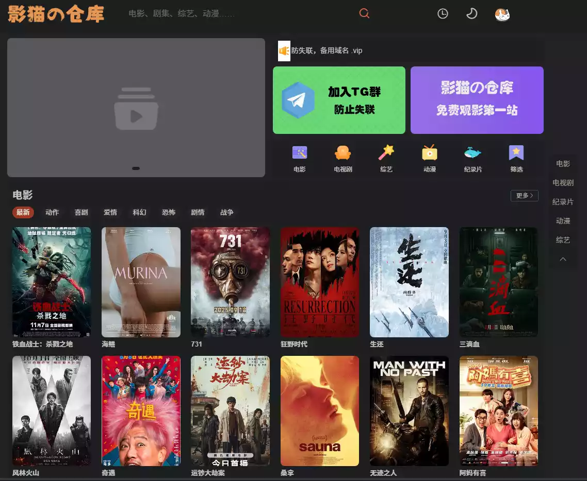
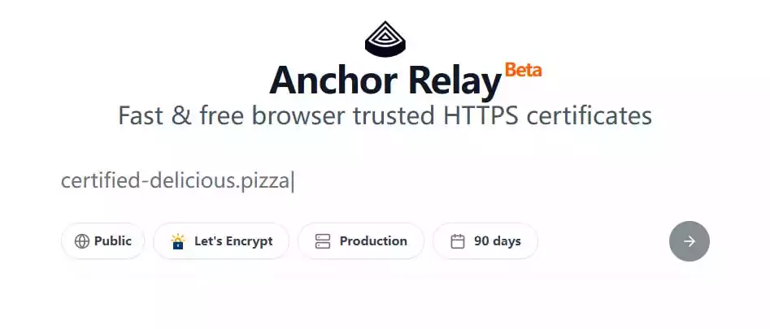
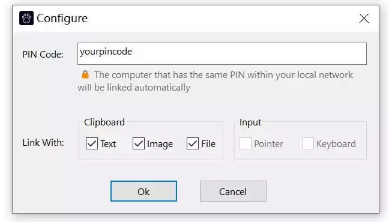
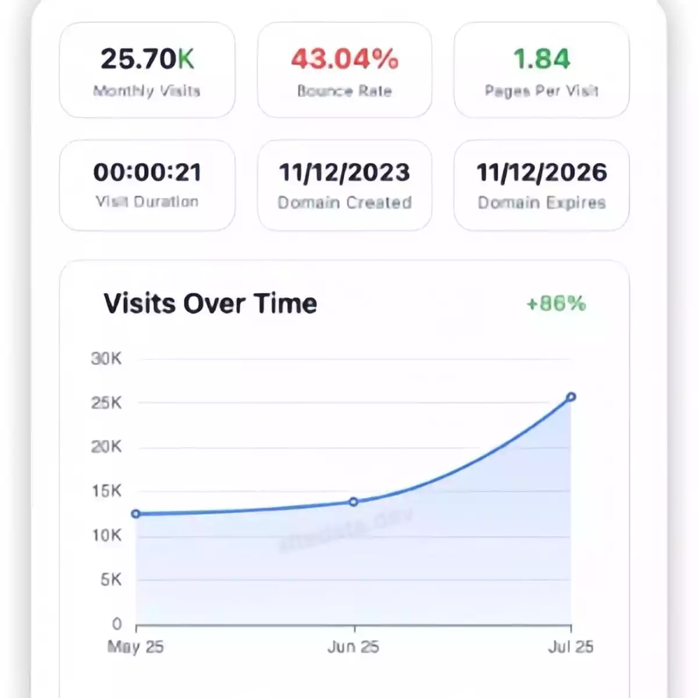
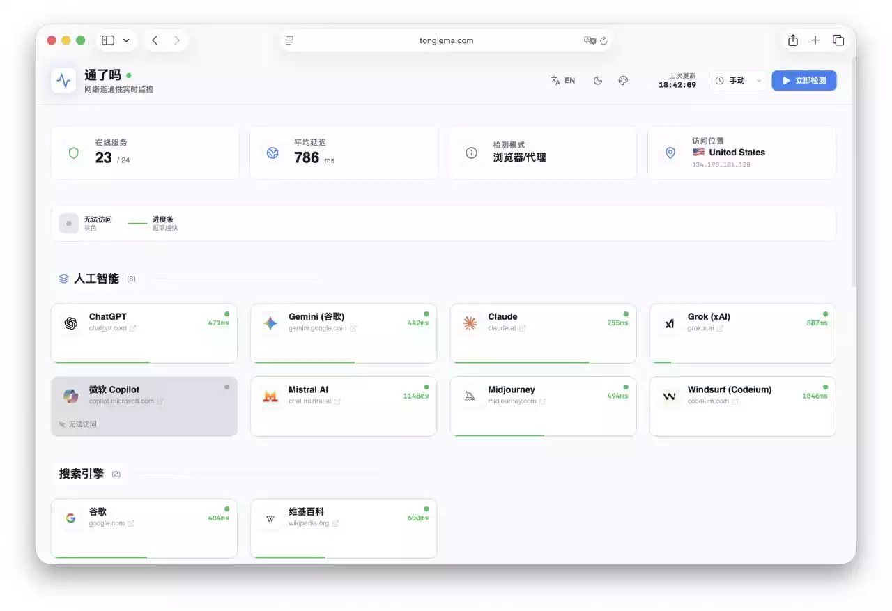
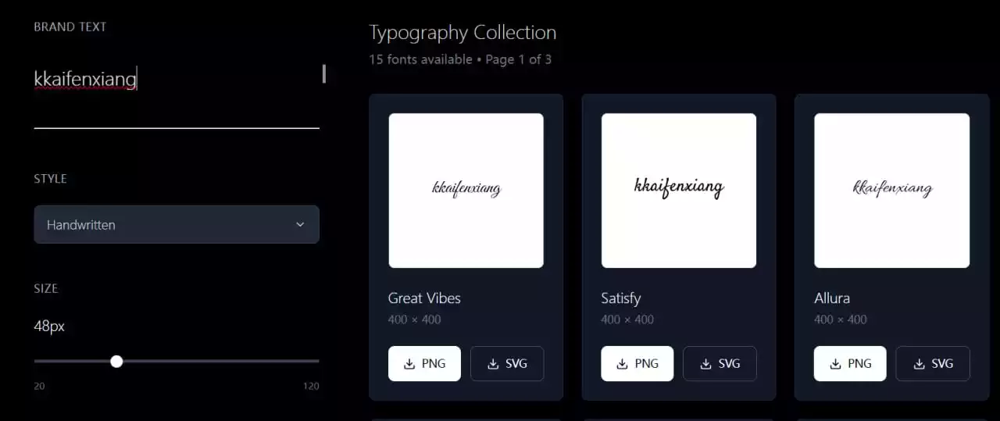
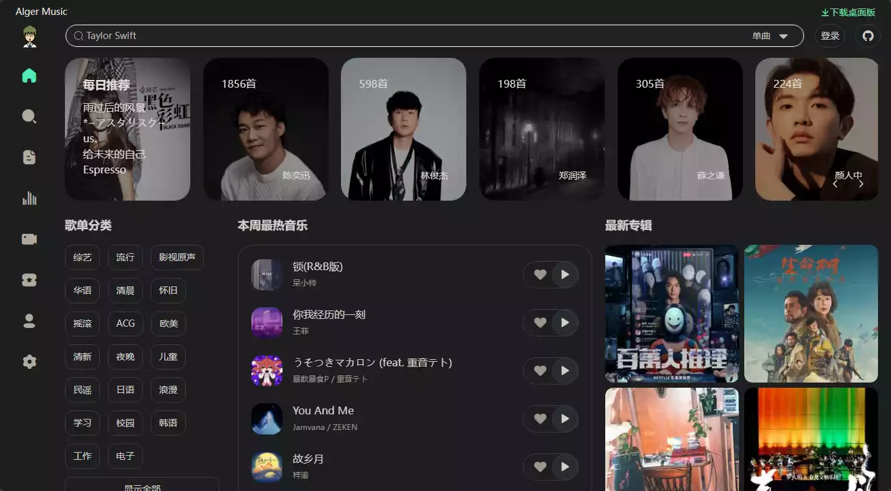

# 碎碎念

经过上次的文章之后,我的情感关系处理的还行了,我起初是既然解决问题太麻烦,倒不如我直接解决人比较方便,之后我也是想了很久,做了蛮多的考虑,想出了这个道理**不与无关的人讲麻烦的事,不与有关的人讲无关的事**,也是好了很多. 最近刚考完试,这张卷子是真的难,比我平时还降低了10分,我英语成绩越来越自信了,但是之前的原先的科目有点迷茫了,分数就是上不去.遇到了点瓶颈.

还有一个月就是一模了,时间过得太快了,好多东西我还没背会,有的公式我还不是很熟练,有点着急,一切都要有计划的进行,每天都有每天的任务,也挺好的,感觉坚持不下去的时候,我翻翻我的日记本,我才发现上面全是激励我继续下去的话,这个时候我便会有所感悟,我再次将这记录下来,等到我功成的时候,回头再看看这个激励我的精神寄托.

谁能想到`学科网`出的试卷被泄露了,以至于某红书,某宝都能找到原卷,甚至还可以买到答案,一科60? 对于那些抄的人,我就不做评价了....

# 茗述

## 简介

之前就喜欢看这个大佬总结的github好玩的项目,写的很详细很认真,但是吧github我只探索了一小部分,还是太少了,所以我就不分享github相关项目,这里分享一些很好玩的++网站++{.wavy}

++由于确实没时间一个一个详细分享网站,这里就简述一下,嘻嘻!++{.dot}



- site: 清羽飞扬
  owner: 清羽飞扬
  url: https://blog.liushen.fun/
  desc: 柳影曳曳，清酒孤灯，扬笔撒墨，心境如霜
  image: https://blog.liushen.fun/info/siteshot.jpg
  

## 影猫

🆔 网站名称：影猫的仓库

⭐ 网站功能：超全的影视集合网站

📁 网站简介：一个可以搜索到任意影视网站的爬虫,爬取到收录到里面的影视,自带无广,蓝光

🔗 网站网址：[点击打开](https://www.ymck.pro/)

## Anchor Relay

🆔 网站名称：Anchor Relay

⭐ 网站功能：SSL证书生成

📁 网站简介：一个提供快速且免费的 HTTPS 证书服务的网站，通过自动化证书管理，可以在自托管环境和不受信任的网络中轻松获取和管理 SSL/TLS 证书。

🔗 网站网址：[点击打开](https://anchor.dev/relay)

## Coord

🆔 软件名称：Coord

⭐️ 软件功能：局域网电脑控制

➡️ 支持平台：#Windows

📁 软件简介：一款轻量级的连接和控制局域网中的多台电脑的工具，能够像使用一台电脑一样高效地操作。首次使用时，用户只需设置一个PIN码，之后便可轻松使用。

支持在多台电脑之间共享剪贴板，包括文本、图片和文件，极大地提升了跨设备操作的便利性。

⬇️ 软件下载：[点击下载](https://xeno.software/zh/coord/)

## SiteData

🆔 网站名称：SiteData

⭐ 网站功能：网站流量分析

📁 网站简介：一个免费的综合网站流量分析工具，提供即时的网站流量洞察、关键词数据和AdSense网络分析。无需创建账户或设置API密钥，即可快速开始分析网站。

主要功能包括流量智能、反向AdSense查询、SEO关键词洞察和域名智能，所有数据处理均在用户设备本地进行，确保隐私安全。

🔗 网站网址：[点击打开](https://sitedata.dev/zh-cn)

## OuonnkiTV

🆔 项目名称：OuonnkiTV

⭐️ 项目功能：个人影视站搭建

📁 项目简介：一个可以快速搭建个人影视网站的开源项目。主要功能包括视频资源的聚合搜索、播放、观看历史记录管理以及可配置的视频源管理。

还支持多种方式导入视频源，方便根据个人需求进行配置。

🌐 项目地址：[点击直达](https://github.com/Ouonnki/OuonnkiTV)

## TongLeMa

🆔 网站名称：TongLeMa

⭐ 网站功能：网络连接监测

📁 网站简介：一个实时网络连接监测工具，可以通过该网站监测包括ChatGPT、Google、YouTube等在内的多个平台的网络性能。

🔗 网站链接：[点击打开](https://tonglema.com/)

🔗 项目地址：[点击访问](https://github.com/simonxmau/tonglema)

## Logo Font

🆔 网站名称：Logo Font

⭐ 网站功能：字体标志生成器

📁 网站简介：一个免费的字体标志生成器，只需输入品牌文本，选择字体样式、大小、颜色和背景类型，即可生成高质量的标志。

🔗 网站链接：[点击打开](https://fontlogo.site/)

## AlgerMusic

🆔 网站名称：alger

⭐ 网站功能：免费听音乐

🔗 网站链接：[点击打开](http://music.alger.fun/#/)

## 哈吉米TV

🆔 网站名称：哈吉米TV

⭐ 网站功能：免费看视频(需要注册登录)也能搜到AV

🔗 网站链接：[点击打开](https://tv.xxk.ch/)
