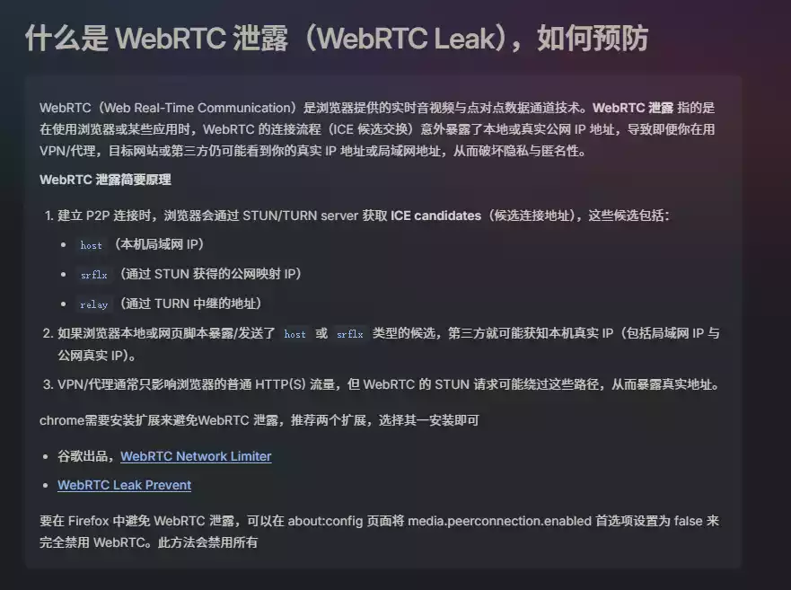
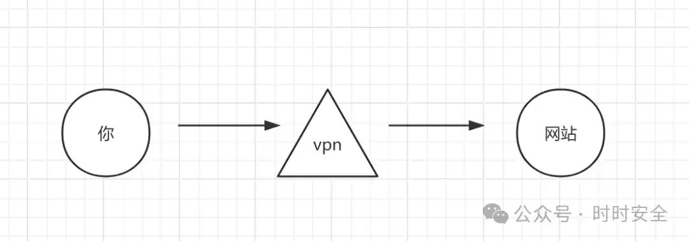
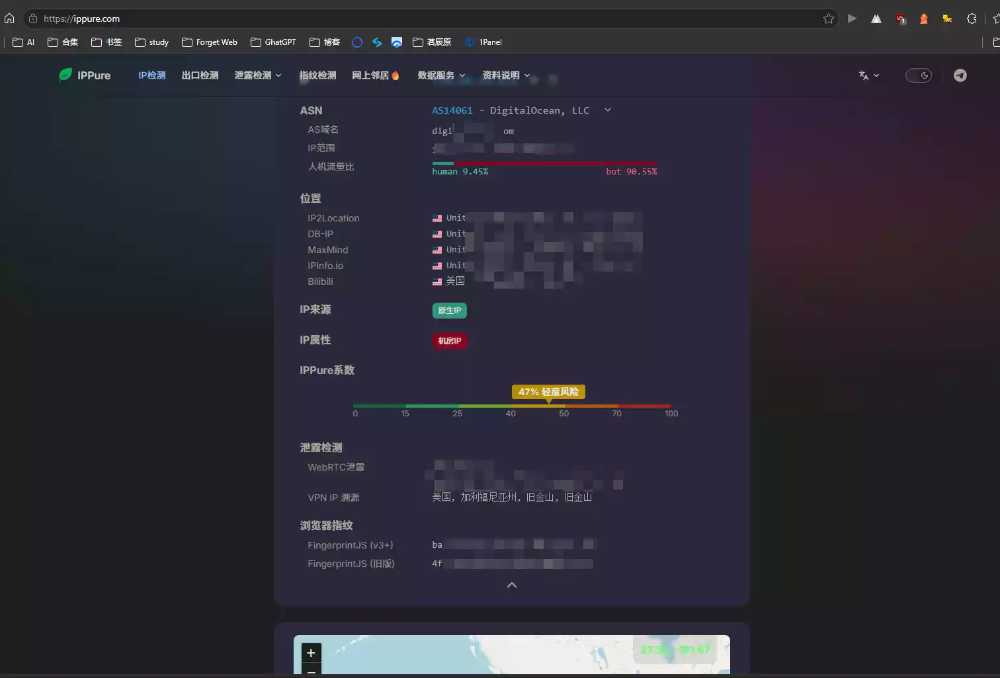
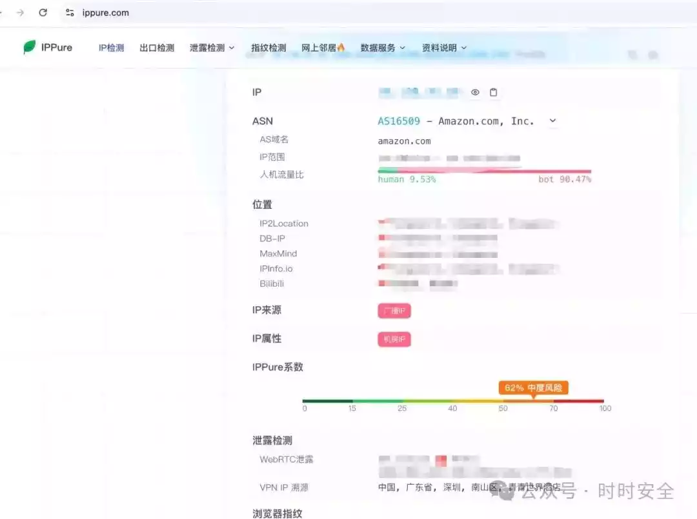
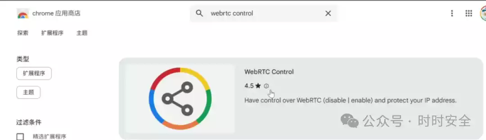
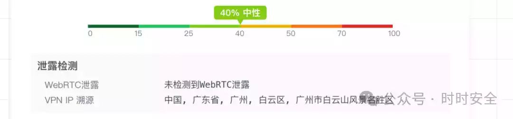
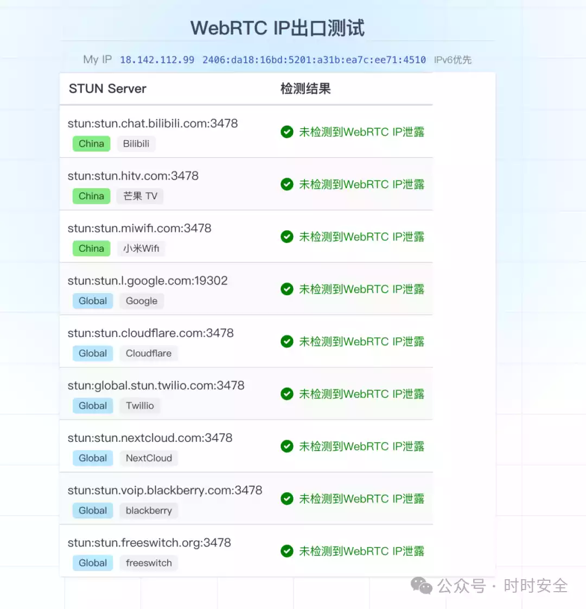
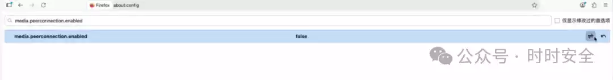

# 茗叙

首先这篇是关于网络安全方面的文章

本文章转载于微信公众号:++时时安全++{.wavy .success}

本文章也介绍了有关WebRTC 的知识,供我学习与参考技术,马上高考了,未来想走网络安全的方面,算是个积累知识经验的机会吧!加油!

# 茗述

### 什么是WebRTC

WebRTC 全称：Web Real-Time Communication
它是浏览器内置的一套实时通信技术。
很多功能都依赖它：

> - 网页视频通话
> - 语音聊天
> - 屏幕共享
> - P2P 文件传输
> - Discord 网页版
> - Google Meet
> - Zoom Web
> - Telegram Web 等
>
> Chrome、Firefox、Edge、Safari 基本都支持。

### **WebRTC 为什么会泄露 IP？**

正常情况下访问网站：

网站看到的是**VPN的IP**
但 WebRTC 为了实现低延迟 P2P 通信，会主动：

> - 收集本机网络信息
> - 获取真实公网 IP
> - 获取局域网 IP
> - 通过 STUN 服务器探测 NAT 后的真实地址
>   这个过程可能绕过 VPN。

于是就变成：“虽然你网页流量走 VPN，但我还是从 WebRTC 拿到了**你的真实 IP**。”

### 如何自检

使用网站: https://ippure.com/

以上是我自己检测的地址,目前看是正常的,说明我的VPN还是蛮纯净的,但是你们们可以看看作者发的图,会直接显示真实IP

++作者叙述++{.dot .warning}: 查看WebRTC泄露，就可能会发现是你的真实ip地址

### 如何防护

由于我的网络暂时是安全的,所以我这里就放作者的教程,我自己就不做展示

` `chrome 浏览器防护

使用 WebRTC Control 插件来进行防护

> - [WebRTC Network Limiter](https://chromewebstore.google.com/detail/webrtc-network-limiter/npeicpdbkakmehahjeeohfdhnlpdklia)
> - [WebRTC Leak Prevent](https://chromewebstore.google.com/detail/webrtc-leak-prevent/eiadekoaikejlgdbkbdfeijglgfdalml)

就会发现已经没有泄露了

` `火狐浏览器防护

在火狐浏览器中改成false就可以了

