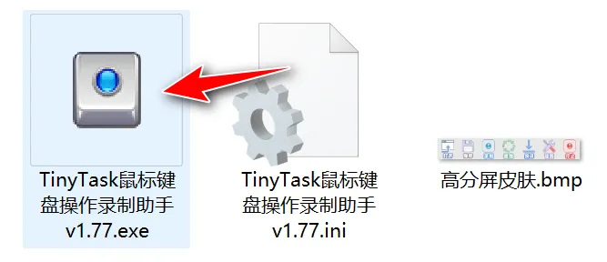
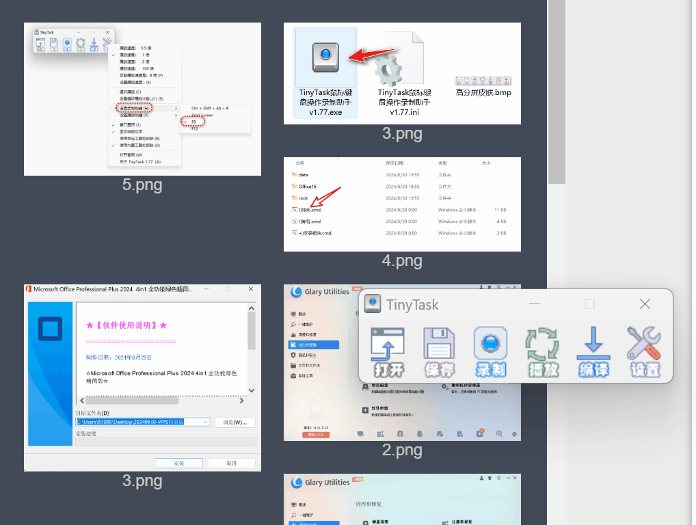
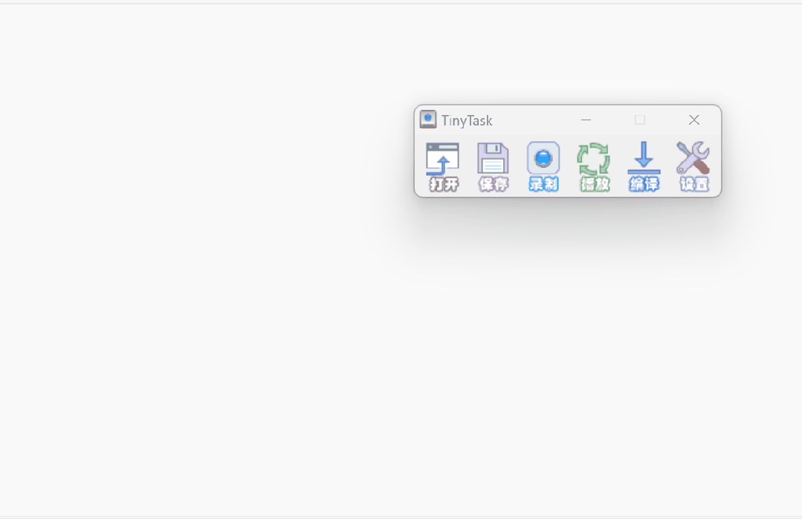
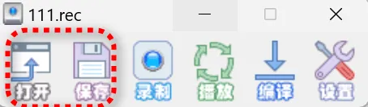
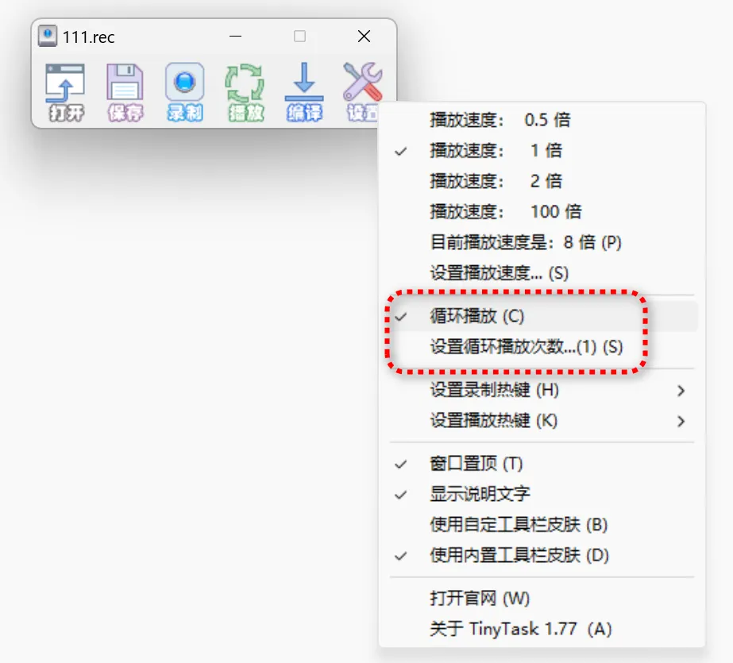
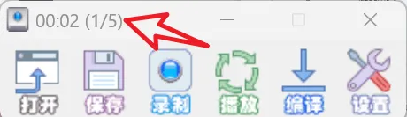

<aside>
😀 这里写文章的前言：
**TinyTask**是一款国外的软件，它是一款**鼠标键盘操作录制软件**，软件由吾爱大佬@风之暇想 在2019年汉化，距今已经有5年的时间了。
</aside>

**TinyTask介绍**

**TinyTask**是一款国外的软件，它是一款**鼠标键盘操作录制软件**，软件由吾爱大佬@风之暇想 在2019年汉化，距今已经有5年的时间了。

虽然说5年前还没有Win11，但是我在Win11下测试，其依旧可用！软件是绿色版，压缩包**只有33K**，解压后也才119K，非常非常小。

软件打开后干净简洁，只打开、保存、录制、播放、编辑、设置这几个按钮。

鼠标键盘录制工具在使用前一定要先进入到设置里面去**设置快捷方式**。

在设置热键的时候，一定**不要跟其他的热键冲突**，否则会按了就变成了其他的功能了。

比如我这里设置了“F8”，那么录制和暂停都是“F8”了。然后我们就可以愉快的使用了。

**点击下面，支持软妹：**

**录制鼠标动作：**我在一个编辑平台的图片是有限制的，好像最多上传100张，次数达到了，我就不得不删除，所以用这款软件可以录制鼠标动作，然后让其自动帮我删除。

**录制键盘动作：**除了录制鼠标动作之外，软件还可以录制键盘动作，看下面的我录制好了鼠标输入动作以后，只要点【播放】按钮即可播放刚录制的动作。

**保存动作：**如果你想要把你录制好的动作进行保存，那么点【保存】按钮，那么下次只要选择【打开】即可。

**播放次数设置：**如果你想要重复的鼠标键盘操作，可以在设置里设置【循环播放】和【设置循环播放次数】

有播放次数时，在软件的左上角会显示现在已经**重复的次数**，这样让我们更加直观了解进度。

其实鼠标录制的软件我推荐过，比如寒星鼠标点击器，但寒星只能录制鼠标动作，不能录制键盘动作，像这种既能录制鼠标，又能录制键盘的，还是挺不错的。

其他的大家自己去体验，软件就介绍到这里啦！
