# 茗叙

## 描述

哈喽啊，本博主已经很久没更新了，大家都快把我忘了吧 ，最近网站在备案所以会暂停，还有是因为我去大学报到啦！这篇文章主要想介绍一下我的学校，以及我初来乍到的真实感受。谢谢大家耐心阅读，照片后面会补上的哦～

> 这个学校是我的第三志愿，距离第一志愿只差一分。

虽然说起来有点可惜，但我并不觉得第三志愿就不好，反而它给了我很大的震撼。具体是什么震撼呢？请听我慢慢道来。

## 偶然的相遇

当时我正为选志愿焦头烂额，实在拿不定主意，随手点开抖音，第一个作品就是名为"青春新工"的视频——一个介绍学校的短片。那画面让我很震撼，感觉这学校貌似真的很不错。我赶紧仔细看了一下它的配置：

> `什么？`
>
> 宿舍四人间，全空调覆盖，校园占地三千多亩，超大图书馆有 `51万本藏书`，三层食堂，价格很低，随心菜系自选，还包含电影院、无线快充等设施……

这个条件谁看了不迷糊啊，太诱人了！我也被深深吸引了，感觉非常不错。不过我没啥填报志愿的经验，就按自己的成绩排了8个冲刺的大学，参考上一届的录取分数，最终被 `"新疆工业学院"` 录取。

## 探索之路

眼前是一扇巨大的校门，上面刻着"新疆工业学院"几个大字，门前是个小花园。我爸妈让我拍几张照片发给他们，说好久没跟我合照了，趁这个机会多拍几张（不方便露脸哈）。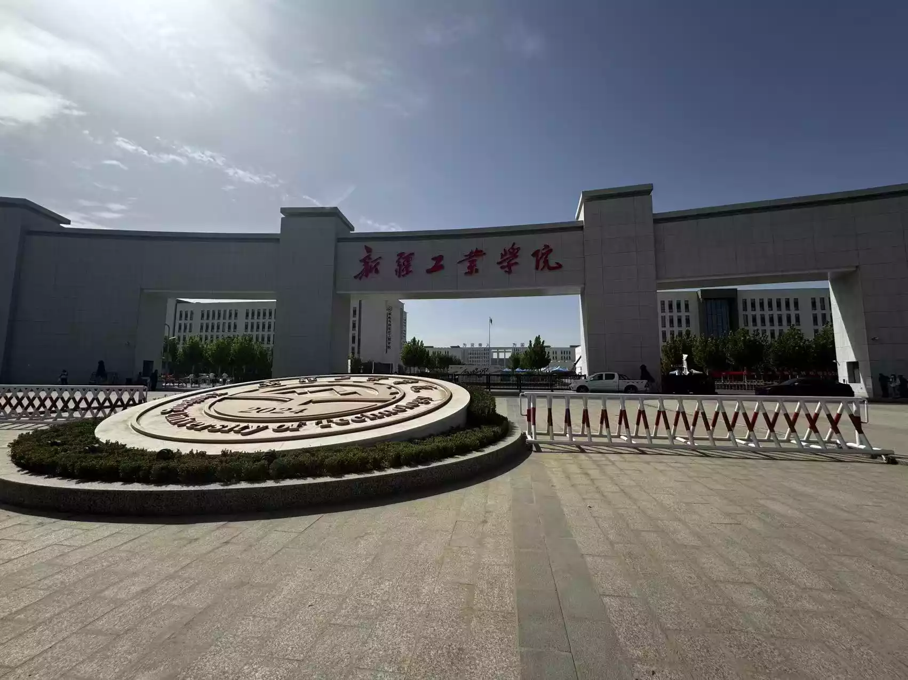

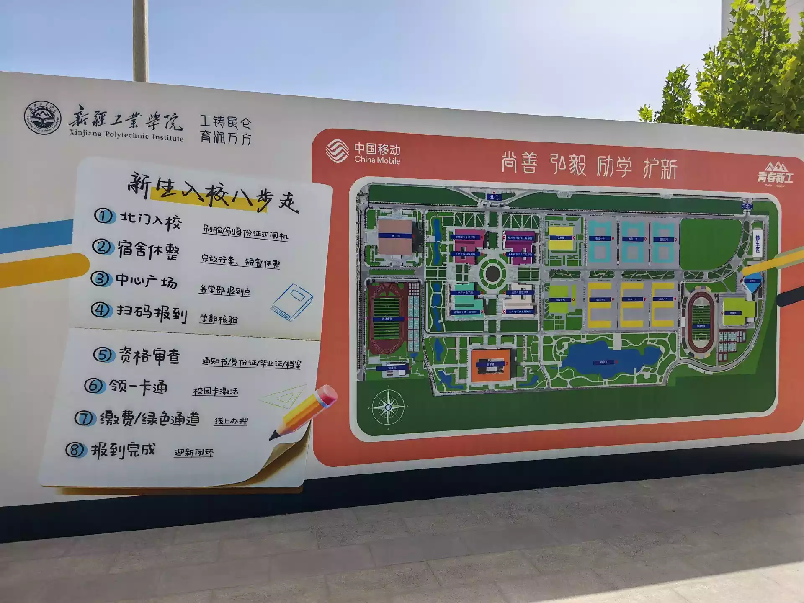

我们是30号到的学校，坐了 ` 22个小时的火车`，<ins class="dot">从乌鲁木齐一路过来，一刻没停歇，直奔大学里。我们参观了食堂、宿舍、体育馆、游泳馆，还有著名的 `"昆仑之眼"` 。</ins>逛完之后实在走不动了，就回了酒店。当时网上订酒店显示全部订满，一点空房都没有，真让人着急。好在学校发了通知，说是和酒店有合作，新生可以享受优惠价，便宜了不少钱呢。（其实有点可惜，学校还给家长安排了 `400多个免费床位`，但我当时完全不知道。）

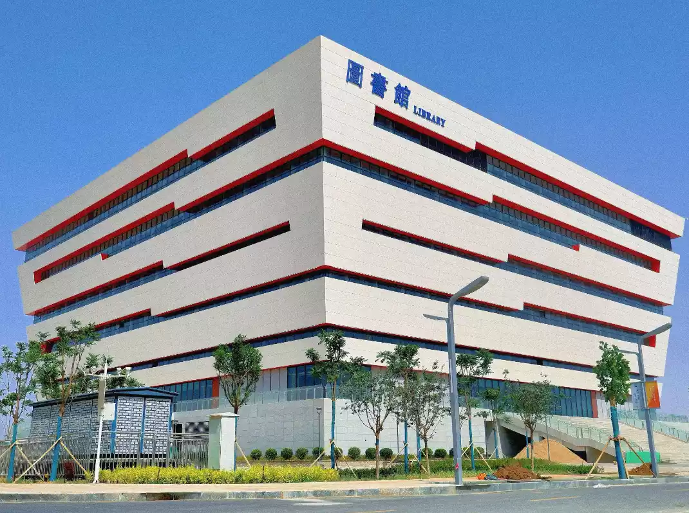

那天的风沙特别大，走在路上不张嘴都能吃到沙子。我爸妈很早就休息了，一路的奔波让他们精疲力尽。虽然他们嘴上说是顺便来旅游，其实我知道他们是舍不得我——毕竟以后离家这么远，忘带东西他们没法送来，生病了也没法照顾，凡事都得靠自己了。他们说了好多嘱咐的话，还帮我提行李、整理物品，我真的特别感动。

## 初入大门

### 报道

我在31号办理报到，被分到了 `自然资源与科技学院`。领了两张卡之后，就见到了我的导员，很年轻，也很有活力。前些天导员问我是不是要办校园贷款，还嘱咐我 `好好学习高数`。我和导员聊了不少学习上的事，他说进入大学后所有学习都得靠主动，要自己预习、自己理解，不懂的地方得主动去问。

### 宿舍

随后我来到宿舍，已经有两位室友在了。他们的家长都很亲切，室友们看起来也很友善，给人的第一印象就是好相处。宿舍里的设备基本上都是全新的，不过和田这边风沙大，到处都落了一层沙。我专门买了块抹布，把柜子和支架擦干净，全是沙子，连床板上也都是。我爸妈很勤快，抢着要帮我，可他们一路奔波已经很累了，我怎么忍心让他们再干这些我自己能搞定的事呢？宿舍每层都有 `洗衣房、淋浴间、开水房和健身房`，设备很齐全，我爸妈看了挺满意，或许这个学校确实不错。

> 我的小窝（有点不整，嘻嘻??）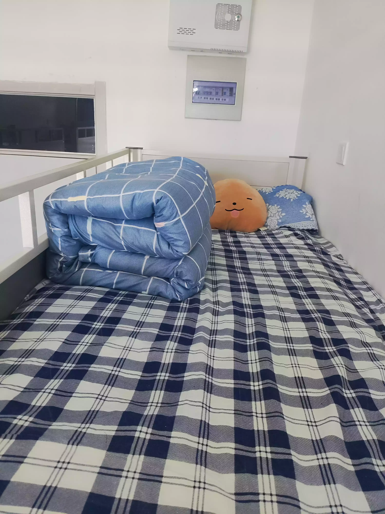

### 超市

我们一共有6栋大宿舍楼（我看到的），每栋楼下都有超市。一号楼有快递取货点，基本涵盖了所有快递公司；四号楼楼下有水果店、咖啡店和汉堡店。我在三号楼，楼下有理发店和大超市。其他楼也差不多，不用专门出校门买东西，校园里就能解决。

### 体育馆

体育馆里项目挺多，有超大的 `羽毛球馆、篮球馆、台球桌、乒乓球馆和健身房`，其他的我暂时还没发现，估计还有排球之类的。体育馆连着游泳馆，里面有个很大的游泳池，还有很多换衣间。不过我去的时候正好有人在上课，就没进去细看。

### 图书馆

一楼是个宽敞的大厅，有共享电脑可以用，还能自助借书和买书。左手边是书法室，楼上有个 `多功能阅读大屏`，触摸式的，挺不错。往中间走是藏书阁，里面有历史、地理、心理、财经等各种书籍。我特别喜欢心理学那部分，比较感兴趣。拿到想看的书可以到阅读区，每张桌子都有充电口，桌面干净，板凳整齐。我想 `这或许就是我第二个家了`，以后肯定常来！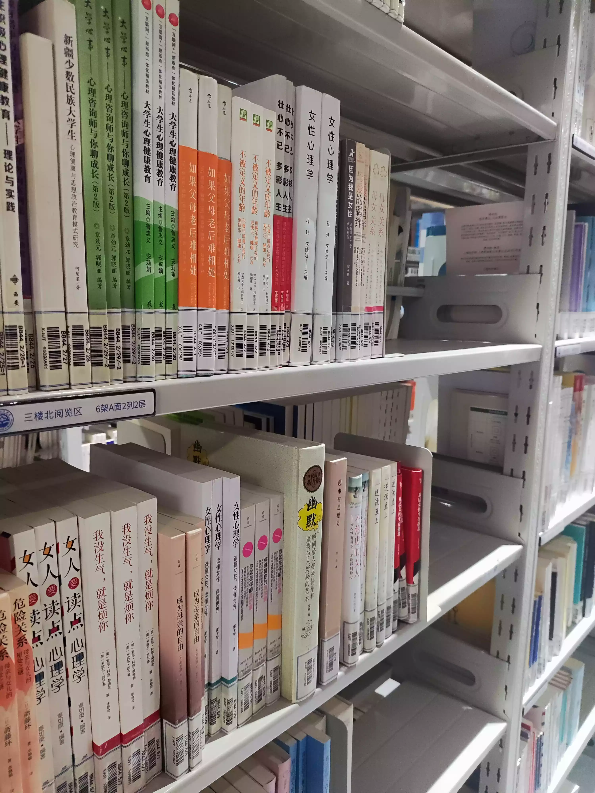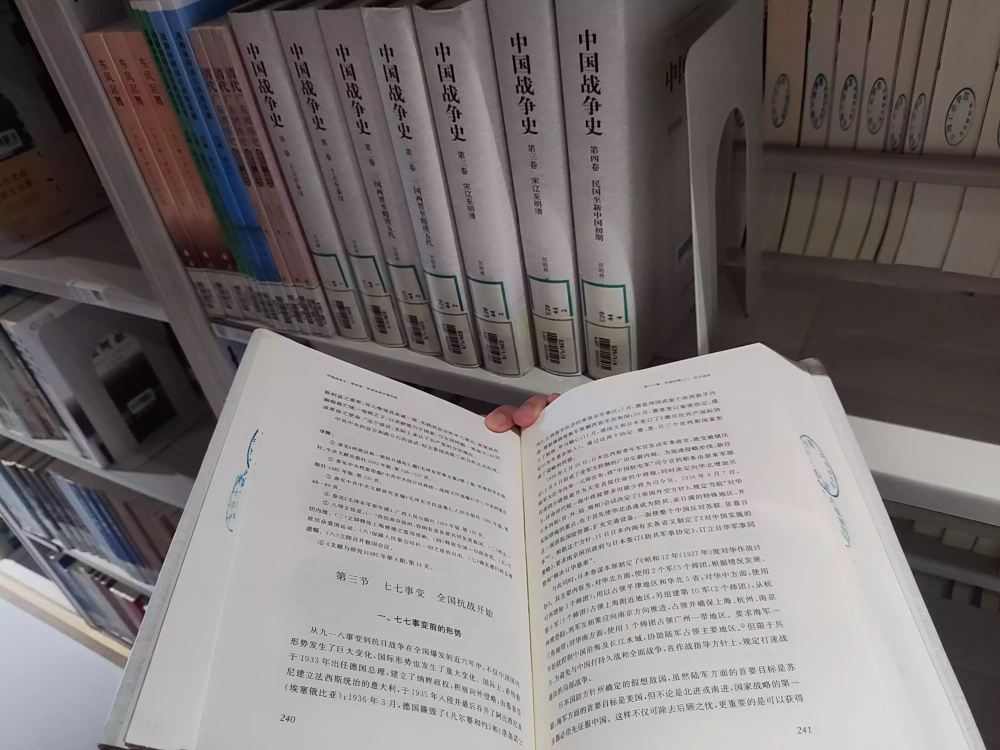

### 教学楼

我们学校有5个学院，每个学院都有独立的楼，大概率是实验室和上课用的教学楼。主楼叫 `"励学楼"` ，每层教室数量不少，都有免费热水和卫生间，打扫得非常干净。在这里学习感觉很安心，还配备了电梯，应该有6层吧，记不太清了。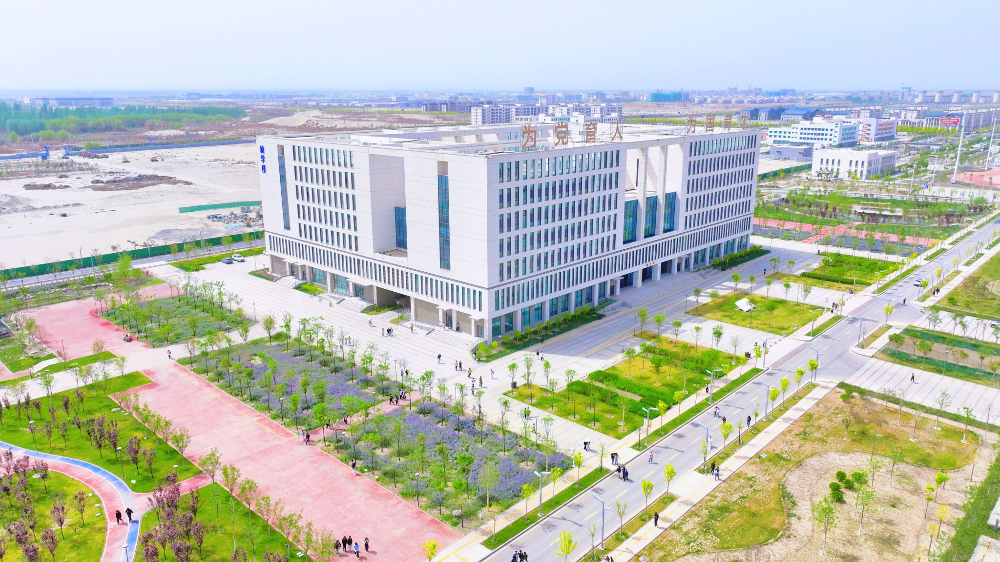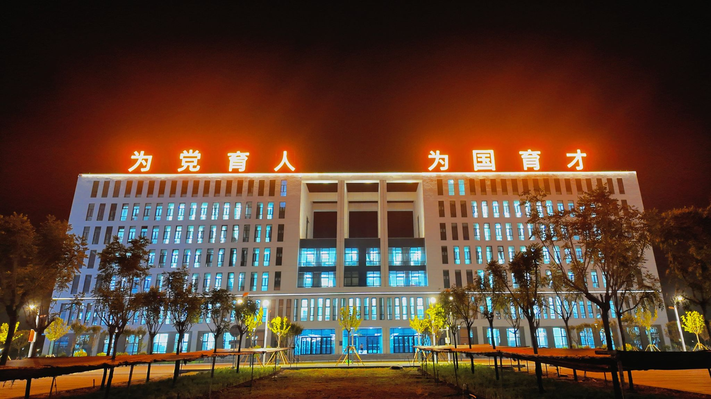

### 食堂

评判一个学校好不好，食堂的菜色和价格很关键。刚到学校时，我带爸妈吃套餐， `两荤一素十块钱，一荤一素八块`，报道时还发了张10元代金券，实际上只花了8块。就算不用代金券，这个价格也很公道了。饭菜挺可口，米饭软糯香甜，肉质新鲜，蔬菜干净，比外面饭店吃得放心，碗筷也都很干净。

> 对于吃这一块，我倒是很擅长，多的不说看图，后面会集成相册
>
> 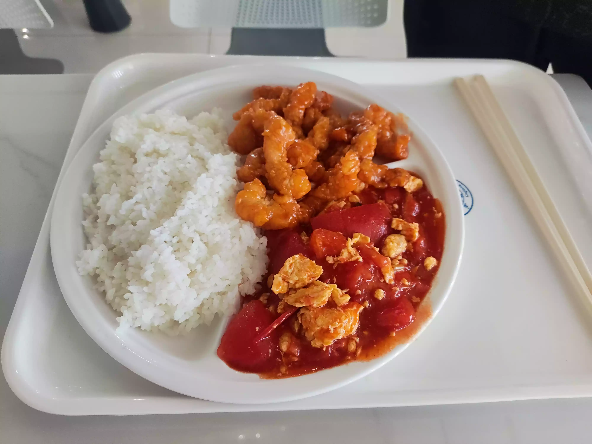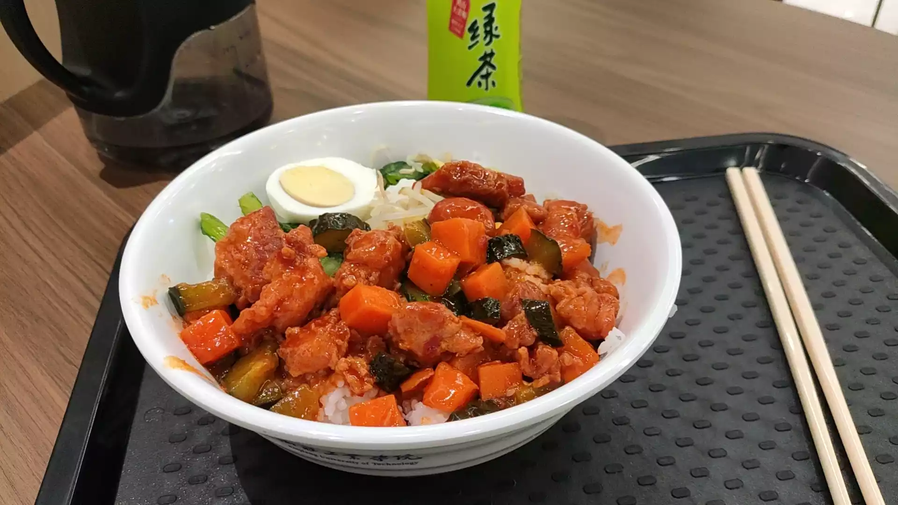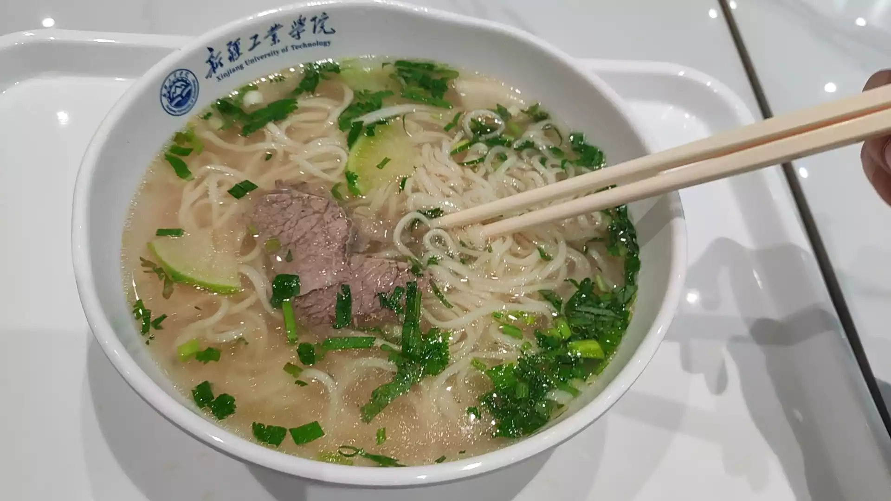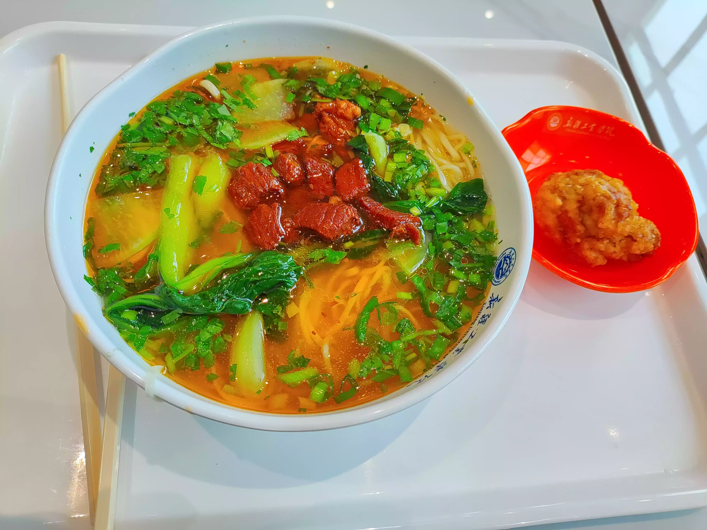

## 大学之旅

### 第一节班会

学校规定18:30到教室，我怕迟到了，18:00就从宿舍出发，18:15就到了。那时候班里还没人，班主任也没到，教室里黑乎乎的。作为 `INFJ` ，我其实有点不敢进去，但理智还是占了上风——我是来报到的嘛。于是我开了灯，坐在第三排靠门的位置。不一会儿班主任进来了，她也特别年轻，笑起来很甜，让人感觉很亲近。高中班主任那种严厉的阴影还没完全散去，看到这位老师笑得这么温柔，我觉得 `这地方我选对了`。

这次班会让我结交了一些朋友，我们互相认识名字，了解各自的家乡。本来我有点社恐，但看到同学们都很大方地分享自己的故事，我也鼓起勇气尝试了一把，只是说得不太详细，自我感觉一般——`i人的痛苦`啊！其实昨晚我就写好自我介绍稿了，一站起来全忘了。听到同学们说假期四处旅游、丰富阅历、看遍万水千山，我心里挺羡慕的。但对我而言，旅游不太现实，家里储蓄不多。所以我站起来说，其实我的假期很平淡，没什么特别的，自己做做饭，看看喜欢的动漫，满足自己的小爱好，我觉得这样也挺好。至于未来规划，我打算这学期好好学，重点攻克 `高数和英语`，下学期想去 `当兵`，两年后再回来继续上完，然后再考虑要不要转专业。毕竟我学了6年编程，高中地理知识学得不太扎实，也不太清楚这个专业前景如何，但计算机现在好像不太乐观，裁员降薪挺多的。

### 军训

军训第一天就挺惨的。出门前我在食堂接了一杯水，结果在开学第一课的大厅里坐了两个小时，只能端正坐着，集中注意力听讲，但总感觉不对劲。我心想，会不会是杯子里装的是昨天的隔夜水？强忍两小时回到宿舍，换了宿舍的饮用水，兑了热水和凉水，刚喝一口还是不对——看来不是隔夜水的问题。我又把杯子重新洗了一遍，还是不行。真正的军训第一天，我肚子疼得厉害。后来我就不敢喝学校的水了，出去买了两瓶冰水全喝完了。结果当晚直接发烧，校医室关门了，多亏舍友给了我一袋 `连花清瘟`，不然我可能真撑不过去了。

军训第二天，吸取教训买了一大瓶瓶装水，但状态依然不好，一直持续。中午点了份爱吃的鱼香肉丝，结果连三分之一都没吃完——这不对呀，按我的食量，应该比这多得多！又是拉了一整天。

直到第三天晚上，学校发了公告，提醒大家注意 `水土不服` 。我这才恍然大悟——原来从三天前喝食堂第一口水起，我就开始水土不服了。于是我赶紧去医务室拿药，但当时不在上班时间，只能等到下午去急救车那里取药。校医给了两袋 `蒙脱石散` ，吃了有点效果，但次数还是多。第二天又去医务室开了三盒药，吃完总算好了，不拉肚子了。不过那种肚子稍一着凉就疼的感觉，我现在想起来还是很难受。

军训到现在已经快到检阅环节了，后面听说要 `穿越沙漠` ，还要教我们武术之类的，期待一下～

这有我们军训的图片[^1]

[^1]: 这是导员给我发的照片

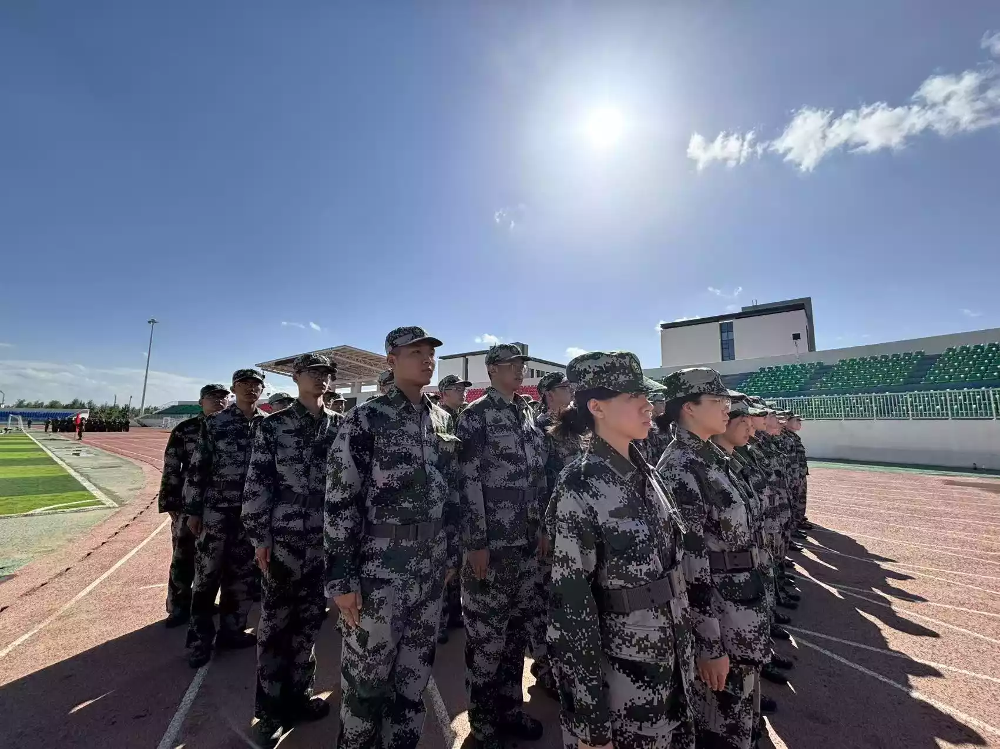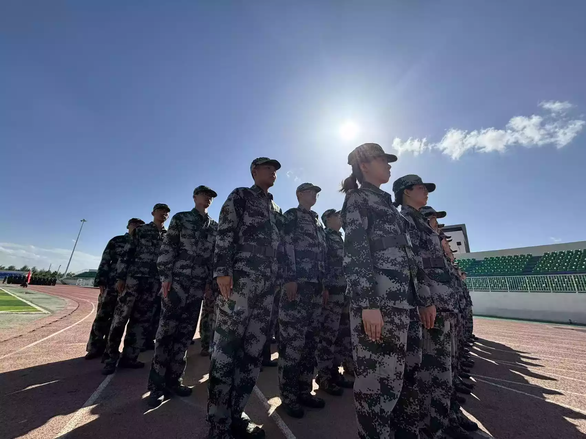

军训的第七天我们终于出发到了沙漠，主题叫做重走老兵路，前辈也是翻过重重沙漠堆成的山，走了上千公里才来到了这里，他们就是兵团，他们放下武器，拿起生产工具建设这里，开垦土地，种植粮食，等到需要他们寻找的时候再拿起武器，我们今天翻过了差不多 5 座山，走了 9 多公里，就已经如此疲惫，身上衣物上，都是沙子，回去收拾的时候，鞋子里已经堆满了沙子，很难受，那么先辈们呢？他们将这条穿越沙漠的路走成了可能，铸就了这条“希望路”，经过这次的拉练，才认识到这究竟是个怎样的力量，我们就是要学习这种精神，将不可能变成可能，坚强的意志力，吃苦耐劳的品质！

下面放置部分图，其余可以访问，链接🔗：https://mingcy.cn/galleries/junxun

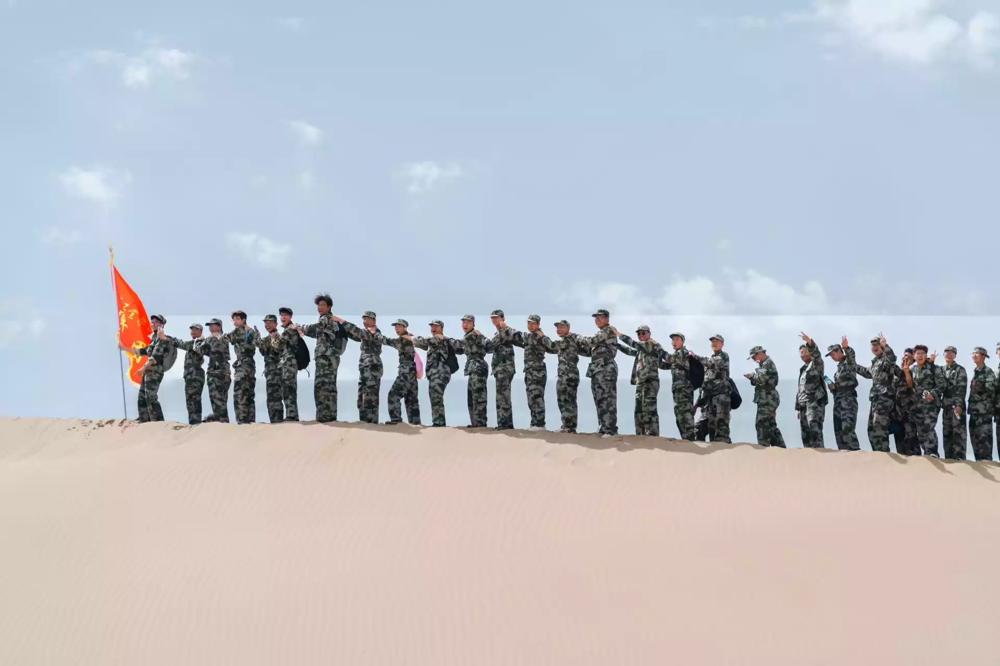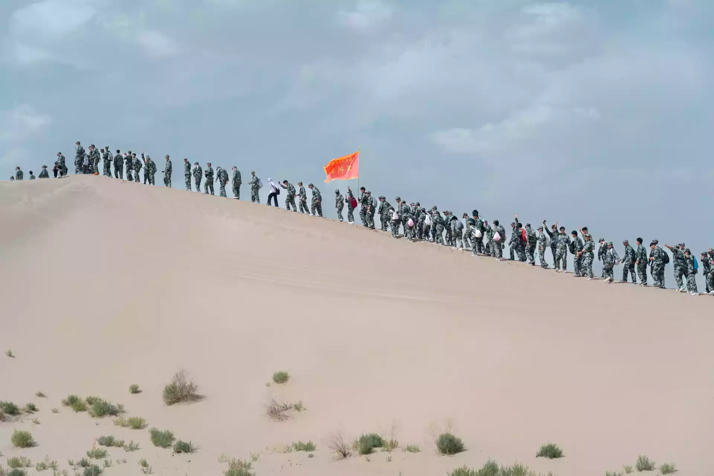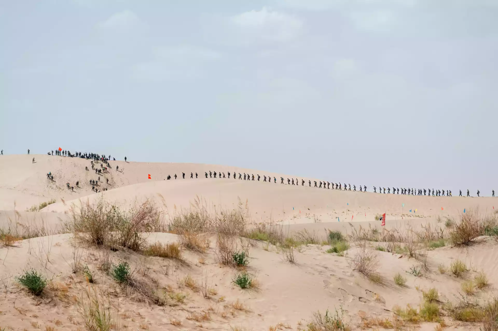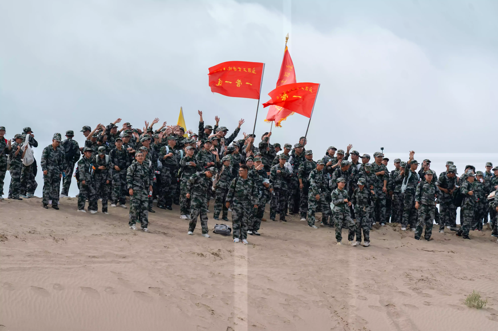

### 水果店

为什么专门提这家水果店呢？可能是我个人偏心吧。有天早上没吃早饭，有点低血糖，就去买了个苹果垫垫肚子。可能是我"好人卡"发作了，想着学校里大家都爱买零食，水果店生意估计一般，就想多多支持一下。买完苹果付了钱，我刚想说谢谢， `老板娘先对我说了"谢谢"` ，而且她真的超温柔，有点像我的某位家人，这更坚定了我要常来的想法。于是晚上我又买了一盒苹果，话说回来， `每颗苹果都又香又甜` ，特别好吃??，卖相也很好看，看来老板是个讲究人。水果店的叔叔也很温柔，我摘了三个香蕉去结账，他也没多说啥，就帮我结了。总之， `这真是一家很温暖的小店` ，以后我会多多光顾的！

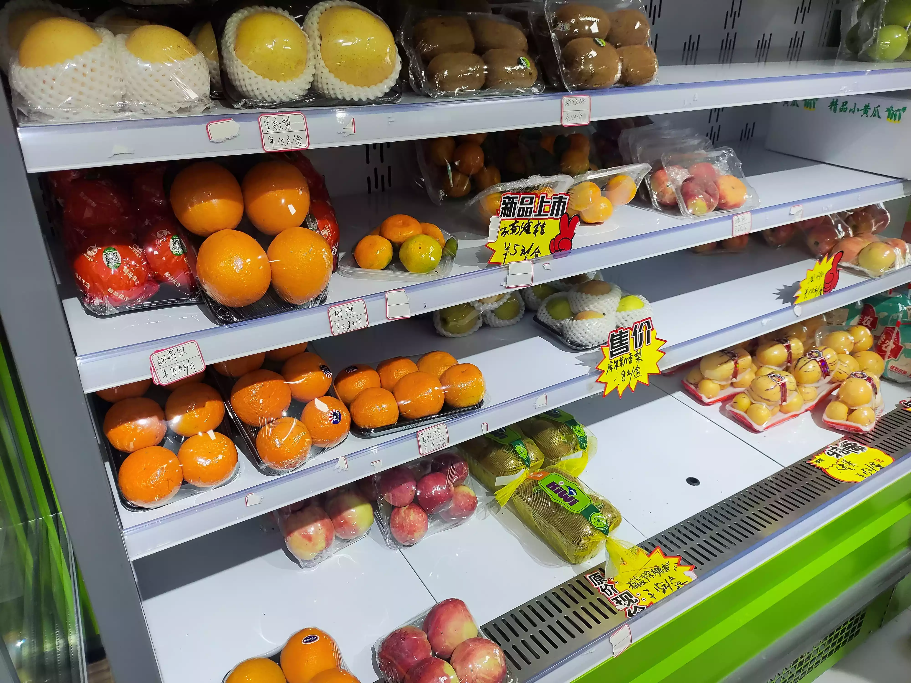

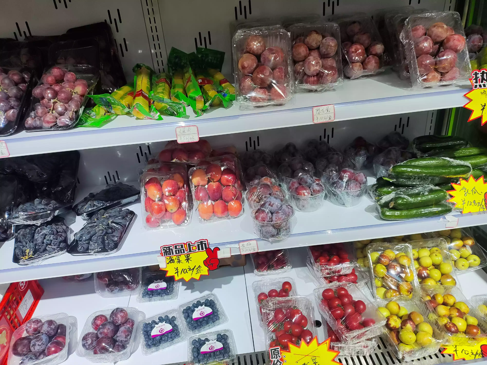

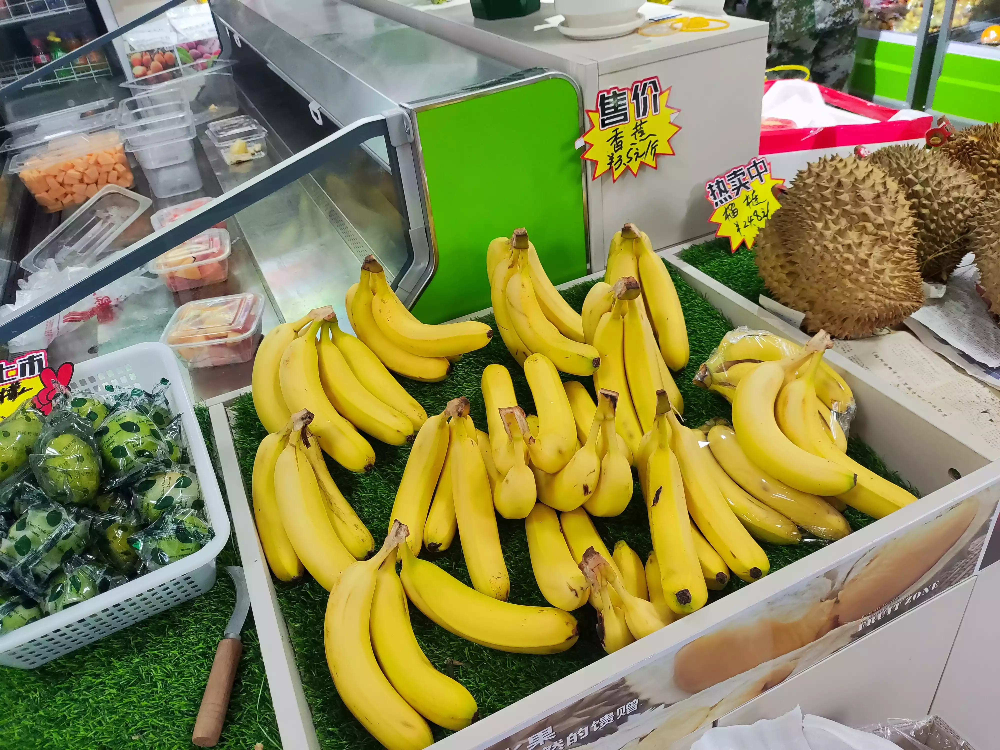

### 上课

明天的课程会竞选班委。我想当学习委员，或者心理委员。大家祝我好运吧！

> 是的，计划赶不上变化。可当我得知学习委员是一位 很优秀的大将 时，我就知道，希望已经很渺茫了。
> 于是我转向 社会实践委员——我想，至少我还有 会编程 的优势，加上 INFJ 的性格，应该能争一争。但事实并非如此。因为 说辞没有准备好，上台时我紧张极了，双腿都在抖，一看便缺少说服力。
> 最终，我以 13 : 15 的票数输给了一位同学。其实，我原本更想当 心理委员。可看到一位 挺好看的女同学 上台，我觉得自己再去已经没有必要，便把机会让给了她。谁知最后，当选的却是一位男同学。虽然我对这个心理委员的意见挺大的，但既然是投票选出来的，那我也心甘情愿。
> 从此之后，我会 单独自我研究心理方面的知识，并更新一些心理方面的博文。

文章到这里就结束了。谢谢大家的观看，这篇大学之旅已经更新完毕了，🤗大概率后面还是有介绍生活的文章，那么后面见啦！拜拜👋！
