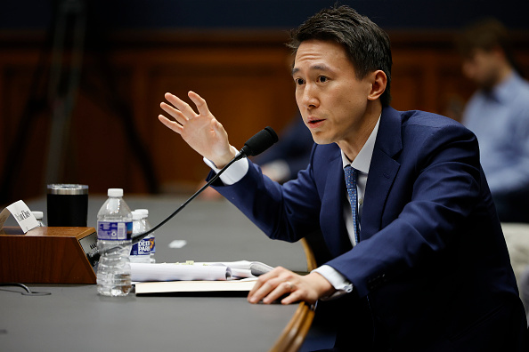

# 茗起

由于我们的心理老师要讲关于选择的课程,所以让我们自己回去搜索关于周受资的资料,那么现在他来了!

### 周受资：从新加坡少年到全球科技领袖的传奇之路

在新加坡的教育体系中，12 岁考入华侨中学意味着一只脚已踏入精英阶层。周受资正是这条赛道上的佼佼者。1983 年出生于建筑商人与会计师家庭的他，自小便展现出对数字的敏锐与超越同龄人的专注力。服兵役期间晋升空军上尉的经历，不仅锻造了他钢铁般的纪律性，更让他在日后面对美国国会听证会时，能在 5 小时高强度质询中始终保持优雅姿态。

#### 金融战场的闪电崛起

从伦敦大学学院经济学学士到哈佛商学院 MBA，周受资的学术路径似乎专为投资界量身定制。2010 年加入 DST Global 的他，仅用三年时间便主导完成对京东、小米、字节跳动等互联网巨头的早期投资。最令人惊叹的是，在字节跳动 B 轮融资举步维艰时，他力排众议注入 1000 万美元，这笔投资后来成为全球科技史上最具传奇色彩的押注之一。

在 DST 任职期间，周受资创造了 "每周见 30 家公司" 的纪录。他将每个投资标的的关键数据整理成 1500 行的 Excel 表格，这种近乎偏执的专业态度，为他赢得了 "数据捕猎者" 的称号。雷军曾在内部会议上公开表示："受资对商业细节的把控，让我想起年轻时的自己。"

#### 科技帝国的建筑师

2015 年加盟小米的周受资，用三年时间将这家初创公司送上港交所。上市路演期间，他带着团队飞遍全球 12 个城市，面对 300 多位投资人的刁钻提问，始终保持着教科书般的专业水准。招股书扉页那句 "让每个人享受科技的乐趣"，正是他对雷军 "性价比" 哲学的完美诠释。

转任国际部总裁后，他带领小米攻入 100 多个国家市场。在印度遭遇政策壁垒时，他创造性地采用 "本地制造 + 文化融合" 策略，使小米连续 27 个季度保持市场份额第一。这段经历让他深刻理解到："全球化不是征服，而是共生。"

#### TikTok 的救世主

2021 年临危受命执掌 TikTok 时，周受资面对的不仅是美国政府的禁令威胁，更是全球 15 亿用户的期待。在 2023 年国会听证会上，他用 5 小时展现了东方智慧与西方商业文明的完美融合。当议员质问 "TikTok 是否会监听用户" 时，他以 "我们的工程师团队正在开发数据隔离墙" 回应，既承认问题又给出解决方案，这种坦诚赢得了现场 17 次掌声。

面对蒙大拿州禁令，他亲自飞往当地与州长会面，随身携带的 PPT 里不仅有数据安全方案，还有该州用户创作的 500 个正能量视频。这种将冰冷数字转化为情感共鸣的能力，正是他超越普通商人的关键所在。

#### 时代的弄潮儿

在时尚杂志《Vogue》评选的 "2024 全球商业领袖着装典范" 中，周受资以 "西装革履与卫衣混搭" 的独特风格位列第三。这种打破常规的审美，恰是他商业哲学的缩影 —— 在遵守规则的同时保持创新活力。

他的 TikTok 账号 @shou.time 拥有超过 2000 万粉丝，其中既有硅谷投资人，也有普通中学生。当他与蕾哈娜共舞的视频获得 3 亿次播放时，人们突然意识到：这个掌控万亿帝国的男人，依然保持着对生活最本真的热爱。

从新加坡空军上尉到 TikTok 全球 CEO，周受资用 22 年时间完成了从军人到投资人再到科技领袖的三级跳。他的故事不仅是个人奋斗的史诗，更是一部全球化时代的商业启示录。正如他在哈佛商学院校友会上所说："真正的精英不是站在金字塔顶端的人，而是能把金字塔变成阶梯的人。" 这种格局，或许正是他留给这个时代最宝贵的财富。

### 如何成为一名投资人：专业选择与能力培养

从周受资的经历可以看出，成为成功投资人需结合学术背景、实践能力与战略眼光。以下是具体建议：

**高考专业选择**

1. **经济学 / 金融学**：如周受资本科就读的伦敦大学经济学专业，为理解宏观经济、金融市场和投资逻辑奠定基础。
2. **投资学**：该专业聚焦资产配置、风险评估与决策分析，涵盖证券投资、国际投资等领域。
3. **工商管理（MBA）**：周受资的哈佛 MBA 经历帮助他提升商业管理与战略思维，适合职业中期转型。
4. **交叉学科**：数学、统计学、计算机科学（量化分析）、法律（合规）等学科的复合背景更具竞争力。

**核心能力与知识储备**

1. **财务分析**：熟练解读财务报表（资产负债表、利润表），评估企业价值。
2. **行业研究**：掌握行业趋势、竞争格局分析方法，如周受资对互联网赛道的精准判断。
3. **风险管理**：通过定量模型与定性分析平衡风险与收益，例如 TikTok 数据安全策略。
4. **沟通谈判**：建立广泛人脉，如周受资在 DST 期间通过高频会面拓展资源。
5. **跨文化适应力**：双语能力（如周受资的中英文优势）与国际化视野，适应全球化投资环境。

**实践路径**

- **实习与项目**：参与投资银行、私募股权或企业战略部门实习，积累实操经验。
- **模拟训练**：通过投资竞赛、案例分析提升决策能力，例如模拟股票交易或企业估值。
- **持续学习**：关注政策变化（如美国对华投资限制）、技术革新（如 AI 对行业的影响），保持知识更新。
